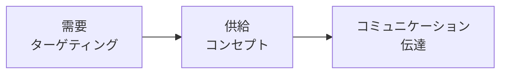
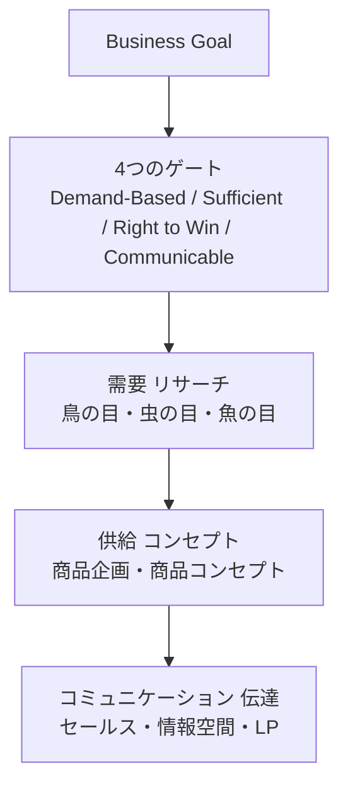

# 序章　マーケティングとは、需要と供給をつなぐことである

この本は、私（高木健作）がCMOBANKで教えているマーケティングの考え方を、AIエージェントが判断の根拠として使える形に書き起こしたものである。第1章以降では、リサーチ・需要の切り取り・商品コンセプト・LP制作といった個別のノウハウを順に扱う。だが個別のノウハウは、それ単体では機能しない。すべては一枚の全体像の中に位置を持っており、その位置を見失った瞬間に、どんな技術も「手段の目的化」へ滑り落ちる。序章の役割は、その全体像という地図を最初に頭へ入れることである。

マーケティングは、突き詰めれば[情報戦](GLOSSARY.md#情報戦)である。[商品](GLOSSARY.md#商品)（モノに意味を付加したもの）も、コミュニケーションも、取引の成立も、すべては情報のやり取りに還元される。何を相手の頭に残し、取引の瞬間にどんな情報で背中を押すか——勝敗はその一点で決まる。そして情報戦の武器は言葉である。だから言葉の精度が、そのまま思考と成果の精度を決める。「価値を上げる」のような空疎な言葉を曖昧なまま使う者は、曖昧にしか考えられない（だから本書では「価値」を[ベネフィット](GLOSSARY.md#ベネフィット)と価格に分解して扱う）。本書がすべての用語を一つひとつ定義し、用語集（[GLOSSARY](GLOSSARY.md)）を正本として「1用語＝1定義」を徹底するのは、このためである。**定義どおりに言葉を使うこと自体が、最初のマーケティング技術である。**

この前提のうえで、序章は5つを据える。(1) マーケティングをどう定義するか、(2) 何から逆算するか、(3) どの順序で考えるか、(4) 狙う需要をどう判定するか、(5) 自分がいまどこにいるかをどう確認するか。以降のすべての章は、この地図のどこかに刺さっている。

---

## 1. マーケティングとは、需要と供給をコミュニケーションでつなぐ活動である

> **要約**：マーケティングとは、需要と供給を、コミュニケーションを介してつなぐ活動である。あらゆる課題を「需要は何か・供給は何か・どうつなぐか」の3要素に分解して読む。

**原則**
- マーケティングとは、[需要](GLOSSARY.md#需要)と[供給](GLOSSARY.md#供給)を、[コミュニケーション](GLOSSARY.md#コミュニケーション)を介してつなぐ活動である。
- マーケティングの課題は、すべて「需要は何か」「供給は何か」「どのコミュニケーションでつなぐか」の3要素に分解できる。
- ここでの需要は、日常語の「商品への欲しさ」ではなく、**欲求の解決策として生まれるもの**（例：「自分に合う枕が欲しい」）を指す。需要と[欲求](GLOSSARY.md#欲求)は別物である（詳細は[第2章](02-desire-to-demand.md)）。

**根拠（なぜそうなのか）**
- [ビジネス](GLOSSARY.md#ビジネス)の本質は、需要に供給を届けて報酬をもらうこと、すなわち[取引](GLOSSARY.md#取引)を成立させることである。だから需要・供給・つなぎ方の3点を押さえれば、マーケティング活動の全体を漏れなく捉えられる。
- 言葉の定義に唯一の正解はない。私はこの定義を「真理だから」ではなく「こう定義すると現場で最も有用に使えるから」採る。考え抜くほど、この一文は思考の道具として効いてくる。

**使い方（どう適用するか）**
- どんな相談・課題も、まず「これは需要・供給・コミュニケーションのどこの話か」を特定する。
- バラバラのアイデアや施策が出てきたら、3要素のどこに位置づくかで仕分けてから議論する。
- 需要と供給が「つながっていない」箇所がボトルネックである。下流（つなぎ方）をいじる前に、需要と供給そのものが噛み合っているかを先に疑う。
- **自己判定**：分類できた状態とは、その課題を「どの需要に・どんな供給を・どう伝えてつなぐか」の一文に書き直せる状態である。一文にならなければ、まだどこかが曖昧だと判断する。

**適用条件**
- 使う場面：マーケティングに関わるすべての思考の起点。立案・添削・トラブル対応のいずれでも、最初にこの3分解を通す。
- 例外なし。この定義はすべての章の土台であり、降りる場面はない。

**誤用と注意**
- マーケティングを「アイデア出し」や「広告・販促の技術」と取り違えない。広告もLPも、つなぎ方（コミュニケーション）の一形態にすぎない。
- [セールス](GLOSSARY.md#セールス)と混同しない。セールスは「目の前の取引をYESにする行為」であり、マーケティングは「どの需要に・どんな供給を・どう伝えてつなぐか」という上流の設計全体を指す。私は、理想はセールスがいらない状態（需要に合った供給と正しいコミュニケーション）を作ることだと考えている。

**具体例**
- ファブリーズは「洗えないものでも簡単にキレイにしたい」という需要を言い当て、「ファブリーズで洗おう」という供給（付加した情報）を当ててつないだ。奇抜なアイデアではなく、需要を正確に言い当てたことが価値の源泉である。

**関連**
- 用語：[マーケティング](GLOSSARY.md#マーケティング) / [需要](GLOSSARY.md#需要) / [供給](GLOSSARY.md#供給) / [コミュニケーション](GLOSSARY.md#コミュニケーション) / [取引](GLOSSARY.md#取引)
- 章節：[第1章](01-business-demand-supply-trade.md)（ビジネス＝需要に供給を届けて取引する行為）/ [第2章](02-desire-to-demand.md)（欲求と需要の区別）

---

## 2. すべては Business Goal から逆算する

> **要約**：マーケティングは手段であって目的ではない。全体像の最上位には常にビジネスの目的（Business Goal）を置き、すべての施策・表現はそこから逆算して決める。

**原則**
- マーケティングの全体像の最上段には、常に[ビジネスゴール](GLOSSARY.md#ビジネスゴール)（Business Goal）を置く。
- すべての施策・コンセプト・表現は、このゴールから逆算して決める。ゴールから逆算して説明できない施策は、検証目的を除き、やらない。

**根拠（なぜそうなのか）**
- マーケティングは手段であって目的ではない。手段が目的化すると、ゴールに貢献しない作業に時間と予算が溶ける。
- 最上位にゴールを据えるのは、判断に迷ったときの基準を一点に固定するためである。「この施策はゴールに近づけるか」という問いが、すべての取捨選択の最終審級になる。

**使い方（どう適用するか）**
- どんな施策の相談でも、まず「これは上位のビジネス目的に貢献するか」を確認する。
- **自己判定**：各施策について「これはゴールにどう効くか」を一文で言えるかを確認する。言えなければ、その施策はゴールから逆算されていない。
- 「フレームワークを回すこと」「きれいな資料を作ること」「最新の手法を使うこと」自体が目的になっていないかを常に点検する。手段が目的化していたら、ゴールに引き戻す。
- ゴールが曖昧なまま下流の作業を始めない。何を達成すれば成功かが定義されていなければ、逆算の起点が存在しない。

**適用条件**
- 使う場面：施策の優先順位づけ、予算配分、撤退・継続の判断。「やるかどうか」を決めるすべての分岐点。
- 使わない場面：ゴールそのものが未定義のとき。その場合はまずゴールの定義に戻る（逆算の対象がないため、先に進めない）。

**誤用と注意**
- 「とりあえずやってみる」を逆算の代わりにしない。検証としての試行（仮説を立てて学ぶための試行）は良いが、ゴールと無関係な乱れ撃ちは手段の目的化である。

**具体例**
- 「フレームワークを一周する」「きれいなペルソナシートや提案資料を仕上げる」こと自体が目的になり、売上というゴールに一歩も近づかない——これが手段の目的化の典型である。作業が進んだ感覚と、ゴールへの前進は別物である。

**関連**
- 用語：[ビジネスゴール](GLOSSARY.md#ビジネスゴール) / [マーケティング](GLOSSARY.md#マーケティング)
- 章節：[第1章](01-business-demand-supply-trade.md)（ビジネスの成長手段は「製品改善」か「コミュニケーション改善」の2つしかない）/ [序章 5節](#5-常に全体像のどこにいるかを自己定位する)（自己定位の起点）/ [終章](13-epilogue.md)（手段を目的化せず、大目的から逆算する）

---

## 3. 思考は「需要 → 供給 → コミュニケーション」の順に進む

> **要約**：マーケターの3つの問い（どの需要でNo.1を取るか／どんな供給を提案するか／どう伝えるか）は並列ではなく順序を持つ。下流の質は上流でほぼ決まるため、需要→供給→コミュニケーションの順で考える。

**原則**
- マーケティングは、3つの問いに分解できる。①どの[需要](GLOSSARY.md#需要)で[No.1](GLOSSARY.md#no1)を取るか（ターゲティング）、②どんな[供給](GLOSSARY.md#供給)を提案するか（コンセプト）、③どう[コミュニケーション](GLOSSARY.md#コミュニケーション)するか。
- この3つは並列ではなく順序を持つ。**需要 → 供給 → コミュニケーション**の順に、上流から下流へ考える。

上図のとおり、思考は需要（どの需要でNo.1を取るか）から始まり、供給（どんな価値を提案するか）を経て、コミュニケーション（どこで・どう伝えるか）へと一方向に流れる。

**根拠（なぜそうなのか）**
- 下流（表現・媒体）の優劣は、上流（どの需要に、どんな供給を当てるか）でほぼ決まる。需要の解像度がコンセプトの鋭さを規定し、コンセプトの鋭さが表現の刺さりを規定する。
- 上流がずれたまま下流を磨いても、土台がずれているので挽回できない。コピーの上手さで需要の選び損ないは取り返せない。

**使い方（どう適用するか）**
- 課題が来たら、3層のどこの話かを特定する。**自己判定**：「特定できた」とは、課題を「どの需要に・どんな供給を・どう伝えるか」の一文に位置づけられた状態を指す。
- 下流（LP・コピー・広告）の不調を相談されても、まず上流（どの需要か・どんな供給か）が固まっているかを疑う。**上流が未確定のサイン**＝「狙う需要を一文で言えない」または「その需要を[4つのゲート](#4-狙う需要は4つのゲートで判定する)に通していない」。このいずれかなら、下流の作業を止めて上流に戻る。
- アイデア（供給）から入らない。施策が浮かんだら、即「それ、本当に需要があるか」と問い、①の需要に立ち返る。「良さそう」で施策を決めるブレストを、マーケティングと取り違えない。

**適用条件**
- 使う場面：立案の順序づけ、下流の不調の原因切り分け。
- 行き来の例外：上流→下流は思考の基本順序だが、確定のプロセスは直線ではない。実務では上流と下流を反復して往復し、精度を上げる（[5節](#5-常に全体像のどこにいるかを自己定位する)）。「順序」は思考の優先順位であって、一度通れば二度と戻らないという意味ではない。

**誤用と注意**
- 供給アイデアの列挙から会議を始めない。当たれば成功・外れれば失敗という再現性のない営みになる。

**具体例**
- 需要のない商品にどれだけ名コピーを当てても売れない。逆にファブリーズ（[1節](#1-マーケティングとは需要と供給をコミュニケーションでつなぐ活動である)）は、需要を正しく言い当てたうえで供給を当てたから売れた。下流（コピー）の出来は、上流（需要の選択）の正しさを前提にして初めて意味を持つ。

**関連**
- 用語：[需要](GLOSSARY.md#需要) / [供給](GLOSSARY.md#供給) / [コミュニケーション](GLOSSARY.md#コミュニケーション) / [No.1](GLOSSARY.md#no1)
- 章節：[第3章](03-three-questions.md)（マーケターの3つの問い）/ [第6章](06-blue-demand-target-demand.md)（どの需要で戦うか）

---

## 4. 狙う需要は4つのゲートで判定する

> **要約**：戦略を成立させる前に、その需要が Demand-Based（強い需要があるか）／Sufficient（ゴールを達成できる市場規模か）／Right to Win（No.1を取れるか）／Communicable（届けられるか）の4条件を満たすかを判定する。1つでも欠ければ取引は生まれない。

**原則**
- 狙う需要を決める段階で、その需要を[4つのゲート](GLOSSARY.md#4つのゲート)に一つずつ通す。各ゲートには「判定の問い」と「合格条件」がある。
  - **① Demand-Based（需要に基づくか）**：問い＝強い需要が実在するか。合格条件＝すでに金銭や手間が払われている代替行動が観測できる（既存の出費・検索・相談・自作の工夫など）。
  - **② Sufficient（規模は十分か）**：問い＝ビジネスゴールを達成できる市場規模があるか。合格条件＝〈狙う需要の人数 × [購入意欲額](GLOSSARY.md#購入意欲額)〉が、ビジネスゴールに必要な売上に届く。
  - **③ Right to Win（勝てるか）**：問い＝その需要で[No.1](GLOSSARY.md#no1)を取れるか。合格条件＝自社が最高得点になるモノサシ（[USP](GLOSSARY.md#usp)・[コアコンピタンス](GLOSSARY.md#コアコンピタンス)）を1つ言える。
  - **④ Communicable（届くか）**：問い＝見込み客とのコミュニケーションが実現可能か。合格条件＝〈人数 × 時間 × 姿勢〉で価値のある[媒体](GLOSSARY.md#媒体)を1つ以上特定できる。
- 4つのうち1つでも欠ければ、その需要は捨てるか、定義し直す。

**根拠（なぜそうなのか）**
- いくら良い供給を作っても、〈需要が弱い／市場が小さすぎる／勝てない／届かない〉のいずれかに該当すれば、取引は生まれない。4ゲートは、この4つの失敗をあらかじめ塞ぐための関門である。
- 4ゲートは、[ビジネスゴール](GLOSSARY.md#ビジネスゴール)と思考の3順序（[3節](#3-思考は需要--供給--コミュニケーションの順に進む)）を、判定可能なチェックリストに分解したものである。下表のとおり、各ゲートは全体像の各段に対応する。

| ゲート | 判定の問い | 対応する全体像の段 |
|---|---|---|
| Demand-Based | 強い需要があるか | 需要 |
| Sufficient | ゴールを達成できる市場規模か | ビジネスゴール（規模） |
| Right to Win | No.1を取れる理由があるか | 供給 |
| Communicable | 届けられるか | コミュニケーション |

上表のとおり、Demand-Based は需要そのものの強さ、Sufficient はその需要がビジネスゴールに見合う大きさを持つか、Right to Win は供給で勝てるか、Communicable はコミュニケーションで届くか、をそれぞれ問う。4ゲートは「[青い需要](GLOSSARY.md#青い需要)（競合が少ない・人数が多い・購入意欲額が高い）を狙え」という原則を、その場で判定できる関門に翻訳したものである。

**使い方（どう適用するか）**
- 狙う需要の候補を、4ゲートに順に通す。各ゲートは「判定の問い」に対し「合格条件」が観測・計算で確かめられたときだけ通過とする。1つでも通らなければ、その需要は採らない。
- 特に③ Right to Win（No.1を取れるか）を妥協しない。No.1が取れない需要は、広さを絞り直して「No.1を取れるギリギリに広い需要」へ調整する。需要は一段ずつ広げたり狭めたりして確定する。

**適用条件**
- 使う場面：[狙う需要](GLOSSARY.md#狙う需要)を確定する段階。どの需要で戦うかを決めるとき。
- 使わない場面：需要がまだ発散・洗い出しの段階にあるとき（→誤用と注意）。

**誤用と注意**
- 発散・洗い出しの段階で4ゲートを早く当てない。候補を広く出す段階で判定すると、有望な需要を早期に切り落とす。判定は「絞り込み」の局面で使う。
- 「強い需要がありそう」という期待でゲートを通さない。合格条件は観測・計算で確かめる。希望的観測での通過が、最も多い誤用である。
- 4つを独立に見ない。②（規模）と③（勝てる）はトレードオフで、広げれば②が満たされ③が割れ、狭めれば③が満たされ②が足りなくなる。両方を同時に満たす一点を探す。

**具体例（4ゲートの通し方）**
- 候補：「夜中に何度も目覚める人向けの、寝返りに合わせて高さが変わる枕」という需要。
  - ① Demand-Based：合格。すでに枕を何度も買い替え、タオルを重ねて高さを調整している人が観測できる（金銭・手間が払われている）。
  - ② Sufficient：要計算。〈中途覚醒に悩む人数 × その人たちが枕に出せる額〉がゴール売上に届くかを見積もる。届かなければ需要を広げる。
  - ③ Right to Win：合格条件を確認。「寝返りに連動して高さが変わる」が競合にない独自のモノサシなら、この需要でNo.1を主張できる。言えなければ③不合格。
  - ④ Communicable：合格。睡眠の悩みは検索やSNSで顕在化しており、届く媒体を特定できる。
  - ——もし③が言えなければ、需要を「寝返りの多い人」へ絞り直し、再度4ゲートに通す。

**関連**
- 用語：[4つのゲート](GLOSSARY.md#4つのゲート) / [青い需要](GLOSSARY.md#青い需要) / [狙う需要](GLOSSARY.md#狙う需要) / [No.1](GLOSSARY.md#no1)
- 章節：[第6章](06-blue-demand-target-demand.md)（青い需要・狙う需要）/ [第12章](12-cmo-work.md)（どの市場でNo.1を取るか）

---

## 5. 常に全体像のどこにいるかを自己定位する

> **要約**：作業中は常に〈Business Goal → 需要 → 供給 → コミュニケーション〉のどこを考えているかを自己定位し、迷ったら上位へ立ち返る。

**原則**
- 作業中は常に「いま自分は全体像のどこを考えているか」を自己定位する。
- 全体像は、最上位の[ビジネスゴール](GLOSSARY.md#ビジネスゴール)と[4つのゲート](GLOSSARY.md#4つのゲート)の下に、左から右へ〈需要（リサーチ）→ 供給（コンセプト）→ コミュニケーション（伝達）〉が流れる一枚の地図である。

上図のとおり、最上位にビジネスゴールがあり、その直下の4つのゲートを通った需要に対して、リサーチ（需要）→ コンセプト（供給）→ コミュニケーション（伝達）の3層が流れる。本書の各章は、このいずれかの段に位置している。下記の対応表が、地図と本書の索引である。

- **最上位：ビジネスゴール／4つのゲート** → 序章
- **需要（リサーチ）「誰の・どの需要か」**
  - [鳥の目・虫の目・魚の目](GLOSSARY.md#鳥の目虫の目魚の目)（市場・脳内・トレンド）→ [第4章](04-research-birds-bugs-fish-eye.md)
  - [ペルソナ脳内マップ](GLOSSARY.md#ペルソナ脳内マップ)（見込み客に憑依する）→ [第5章](05-persona-mind-map.md)
  - [青い需要](GLOSSARY.md#青い需要)・[狙う需要](GLOSSARY.md#狙う需要)（どこで戦うか）→ [第6章](06-blue-demand-target-demand.md)
- **供給（コンセプト）「誰に・どんな価値か」**
  - [商品企画マップ](GLOSSARY.md#商品企画マップ)（特徴・効果・ベネフィット・証拠）→ [第7章](07-product-planning-map.md)
  - [商品コンセプト](GLOSSARY.md#商品コンセプト)・[USP](GLOSSARY.md#usp)（製品を価値に変換する橋）→ [第8章](08-product-concept.md)
- **コミュニケーション（伝達）「どこで・どう伝えるか」**
  - [セールス](GLOSSARY.md#セールス)・[オファー](GLOSSARY.md#オファー)（取引をYESにする）→ [第9章](09-sales-and-offer.md)
  - [脳内情報空間](GLOSSARY.md#脳内情報空間)・[コンテンツ](GLOSSARY.md#コンテンツ)（頭の中を書き換える）→ [第10章](10-information-space-content.md)
  - [LP](GLOSSARY.md#lp)・[コミュニケーションファネル](GLOSSARY.md#コミュニケーションファネル)（共感→教育→約束→交渉→提示）→ [第11章](11-lp-communication-funnel.md)
- **横断・土台**：ビジネスの最小構造→[第1章](01-business-demand-supply-trade.md)／欲求から需要へ→[第2章](02-desire-to-demand.md)／3つの問い→[第3章](03-three-questions.md)／統合実践（CMOワーク）→[第12章](12-cmo-work.md)／答えを壊し続ける→[終章](13-epilogue.md)

**根拠（なぜそうなのか）**
- マーケティングのツール（リサーチマップ、ペルソナ脳内マップ、商品企画マップ、商品コンセプト、LPなど）は、バラバラに存在するのではなく、この一枚の全体像の中でそれぞれ役割と接続関係を持つ。
- 位置を見失うと、手段の目的化（[2節](#2-すべては-business-goal-から逆算する)）や、上流を飛ばして下流から作る失敗（[3節](#3-思考は需要--供給--コミュニケーションの順に進む)）が起きる。自己定位は、その2つの失敗への常時のブレーキである。

**使い方（どう適用するか）**
- 迷ったら全体像マップに戻り、3つを確認する。①いま需要・供給のどちらから考えているか、②3層のどこにいるか、③上位のビジネスゴール・4ゲートに通っているか。
- **自己判定**：この3つに即答できなければ、いま地図のどこにいるかを見失っている。即答できるまで上位へ立ち返る。
- フレームワークは暗記しない。各ツールが「全体像のどの段で・何の役割を果たすか」を掴む。
- プロセスは直線ではなく反復ループである。リサーチ・セグメント・ペルソナ・商品企画は一度で確定させず、相互に往復して精度を上げる。出力（コンセプト等）が弱ければ、往復が足りていないと判断する。

**適用条件**
- 使う場面：作業に没頭して視野が狭くなったとき、長い制作の途中、行き詰まったとき。常時のメタ確認として使う。
- 使わない場面なし。これは個別技術ではなく、すべての作業に重ねる姿勢である。

**誤用と注意**
- フレームワークを「埋めれば答えが出る穴埋め」として暗記しない。同じツール（例：PEST分析）でも、俯瞰に使えば鳥の目、流れに使えば魚の目になる。役割は全体像の中での位置で決まる。
- いまの出力を確定解と思い込まない。市場でテストされるまで、すべては[暫定解](GLOSSARY.md#暫定解)である（[終章](13-epilogue.md)）。

**具体例**
- LPのコピーに何日もかけた後で、そもそも狙う需要が4つのゲート（[4節](#4-狙う需要は4つのゲートで判定する)）を通っていなかったと気づく——これは自己定位を怠った典型である。コミュニケーション（下流）に没頭する前に、需要（上流）の確定を地図上で確認していれば防げた。

**関連**
- 用語：[ビジネスゴール](GLOSSARY.md#ビジネスゴール) / [4つのゲート](GLOSSARY.md#4つのゲート) / [暫定解](GLOSSARY.md#暫定解)
- 章節：[第4章](04-research-birds-bugs-fish-eye.md)（鳥の目・虫の目・魚の目）/ [終章](13-epilogue.md)（全体像の中で役割を掴む・答えを壊し続ける）
