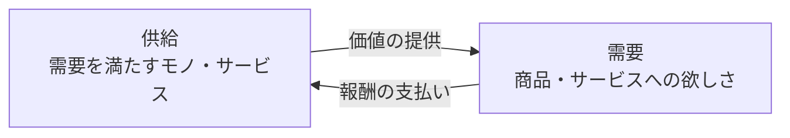
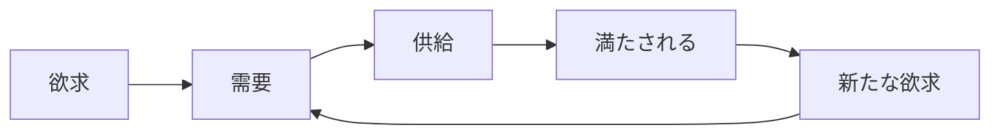

# 第1章　ビジネスとは、需要に対して供給を届け、報酬をもらうことである

序章で、マーケティングを「[需要](GLOSSARY.md#需要)と[供給](GLOSSARY.md#供給)を[コミュニケーション](GLOSSARY.md#コミュニケーション)でつなぐ活動」と定義した。本章は、その一段下にある土台——**ビジネスそのもの**——を定義する。マーケティングが乗っている地面が何でできているかを、ここで固める。

本章が据えるのは、マーケティングの思考すべてが乗るOS（基本ソフト）である。獲得するのは7つの見方だ。(1) ビジネスを「需要に供給を届けて報酬をもらうこと」と定義し直す、(2) あらゆる経済活動を需要・供給・取引の3点に分解する、(3) 良い[取引](GLOSSARY.md#取引)は双方にプラスを生む非ゼロサムだと捉える、(4) 購買は機能ではなく[感情](GLOSSARY.md#感情)で起きると前提する、(5) 需要は満たされるたびに新需要を無限に生むと見る、(6) 供給はその需要を満たすために進化すると理解する、(7) 作った供給はコミュニケーションで届けて初めて取引になると知る。以降の全章は、この7つの土台の上に立っている。

---

## 1. ビジネスとは、需要に対して供給を届け、報酬をもらうことである

> **要約**：ビジネスとは、需要に供給を届けて取引を成立させ、報酬を得る行為である。だから事業の成長手段は「製品の改善」か「コミュニケーションの改善」の2つしかない。

**原則**
- [ビジネス](GLOSSARY.md#ビジネス)とは、[需要](GLOSSARY.md#需要)に対して[供給](GLOSSARY.md#供給)を届け、報酬をもらうこと、すなわち[取引](GLOSSARY.md#取引)を成立させる行為である。
- ここでの需要とは、[欲求](GLOSSARY.md#欲求)の解決策として生まれる「具体的な商品・サービスへの欲しさ」（例：「自分に合う枕が欲しい」）であり、供給とは、その需要を満たすために差し出すモノ・サービスである。
- この定義から、ビジネスの成長手段は2つに限られる。**届ける中身（製品）を良くするか、届け方（コミュニケーション）を良くするか**である。すべての施策はこのどちらかに集約される。

**根拠（なぜそうなのか）**
- この構造は、世界の成り立ちから自然に導ける。人が集まると、生きるために役割分担が生まれ、各自が作ったものの物々交換が生まれ、交換が煩雑になるとお金での取引が生まれる。こうして「欲しい（需要）に対してモノ（供給）を作り、お金で取引する」構造が後天的に立ち上がる。
- この定義はシンプルすぎると感じるが、考え抜くほどビジネスを的確に言い表し、現場で最も使いやすい世界観になる。私はこの定義を「真理だから」ではなく「こう定義すると最も有用に使えるから」採る。
- 価値の提供の前には、必ず取引がある。取引が成立して初めて、価値と報酬が交換される。だから「良いモノを作る」だけでは足りず、「取引を成立させる」ことが決定的になる。

**使い方（どう適用するか）**
- 世の中のあらゆる経済活動を「**どんな需要に・どんな供給を・どう届けて報酬を得ているか**」で読み解く。事業や商品を見たら、まずこの3点に分解する（[2節](#2-ビジネスは需要供給取引の最小構造で考える)）。
- 成長を相談されたら、論点を「製品を良くする話か、届け方（コミュニケーション）を良くする話か」のどちらかに必ず仕分ける。第3の成長手段を探し始めたら、たいてい問題の切り分けができていない。
- **自己判定**：その事業を「誰のどんな需要に・どんな供給を届けて・何の報酬を得ているか」の一文に書けるか。書けなければ、まだビジネスを捉えきれていない。

**適用条件**
- 使う場面：あらゆる事業・商品を分析する起点。立案・添削・診断のすべてで、最初にこの定義を通す。
- 例外なし。本章以降のすべての土台であり、降りる場面はない。

**誤用と注意**
- 「良いモノを作れば売れる」と取り違えない。取引（届けて報酬をもらう）が成立しなければ、どれだけ良い製品もビジネスにはならない。
- 報酬を必ずしもお金に限定しない（信頼・データ・紹介も報酬になりうる）。ただし最終的に[ビジネスゴール](GLOSSARY.md#ビジネスゴール)へ換算できるかで評価する。

**具体例**
- 「世界がもし10人の村だったら」と考える。①生きるために役割分担（山菜採り・家づくり・服づくり）が生まれ、②各自の産物の物々交換（魚⇄道具、肉⇄家）が生まれ、③交換価値が定まると、煩雑さからお金での取引が生まれる。需要・供給・取引・お金は、後天的に立ち上がった発明である。ビジネスの最小構造は、この順で理解できる。

**関連**
- 用語：[ビジネス](GLOSSARY.md#ビジネス) / [需要](GLOSSARY.md#需要) / [供給](GLOSSARY.md#供給) / [取引](GLOSSARY.md#取引)
- 章節：[序章 1節](00-prologue.md#1-マーケティングとは需要と供給をコミュニケーションでつなぐ活動である)（マーケティング＝需要と供給をつなぐ）/ [2節](#2-ビジネスは需要供給取引の最小構造で考える)（最小構造）/ [第2章](02-desire-to-demand.md)（欲求と需要の区別）

---

## 2. ビジネスは「需要・供給・取引」の最小構造で考える

> **要約**：あらゆるビジネスは、需要・供給・取引の3点に分解できる。取引では供給→需要へ「価値の提供」が、需要→供給へ「報酬の支払い」が双方向に流れる。供給を作っただけでは未完成で、取引が成立して初めて交換が起きる。

**原則**
- ビジネスを考えるときは、必ず「[需要](GLOSSARY.md#需要)・[供給](GLOSSARY.md#供給)・[取引](GLOSSARY.md#取引)」の3点（最小構造）に分解する。
- 取引は双方向の交換である。供給側から需要側へ「**価値の提供**」が流れ、需要側から供給側へ「**報酬（お金）の支払い**」が流れる。
- 供給を作っただけでは未完成である。間の取引が成立して初めて、価値と報酬が交換される。

上図のとおり、需要と供給は取引というつなぎ目で結ばれ、価値（供給→需要）と報酬（需要→供給）が逆向きに流れる。どちらか一方の矢印だけではビジネスは閉じない。

**根拠（なぜそうなのか）**
- 需要と供給は、取引というつなぎ目がなければ永遠に出会わない。価値提供の前には必ず取引（合意）があり、取引が成立して初めて価値が動く。だから3点のうち取引を抜くと、ビジネスは説明できない。
- 3点に分解すると、どこが詰まっているかを特定できる。ビジネスの不調は、〈需要がない／供給が需要に噛み合わない／取引が成立していない〉のいずれかに必ず落ちる。

**使い方（どう適用するか）**
- 事業・施策を見たら、3つのボックスを埋める。「この事業の需要は何か」「供給は何か」「取引で何の価値と何の報酬が双方向に流れているか」。
- **不調の切り分け**：売れないとき、①需要がそもそも弱いのか、②供給が需要に噛み合っていないのか、③取引（価値の提供と報酬の支払いの交換）が成立する設計になっていないのか、を順に疑う。
- 供給を作って満足しない。「その間の取引は成立しているか（価値の提供と報酬の支払いが噛み合うか）」を必ず確認する。

**適用条件**
- 使う場面：事業分析、施策のボトルネック診断。
- セットで使う：需要と供給が「つながっていない」箇所がボトルネックである（[序章 1節](00-prologue.md#1-マーケティングとは需要と供給をコミュニケーションでつなぐ活動である)）。下流（届け方）を触る前に、この3点のどこが切れているかを先に見る。

**誤用と注意**
- 需要と[欲求](GLOSSARY.md#欲求)を混同しない。供給を当てるのは「具体的な商品・サービスへの欲しさ（需要）」であって、漠然とした欲する心（欲求）ではない（→[第2章](02-desire-to-demand.md)）。
- 価値の提供と報酬の支払いの片方だけを見ない。一方向（売り手が価値を出す）だけ見ると、買い手が報酬を払う理由（取引が成立する条件）を設計し損なう。

**具体例**
- 魚市場：供給＝魚、需要＝空腹を満たしたい人、取引＝魚（価値）と貝・お金（報酬）の交換。この3ボックスと2本の矢印に当てはめれば、屋台でもSaaSでも同じ構造で読める。

**関連**
- 用語：[需要](GLOSSARY.md#需要) / [供給](GLOSSARY.md#供給) / [取引](GLOSSARY.md#取引) / [シナジー](GLOSSARY.md#シナジー相乗効果)
- 章節：[序章 1節](00-prologue.md#1-マーケティングとは需要と供給をコミュニケーションでつなぐ活動である)（3要素への分解）/ [3節](#3-良い取引は双方にプラスを生むシナジー)（良い取引とは）/ [第2章](02-desire-to-demand.md)（欲求→需要）

---

## 3. 良い取引は、双方にプラスを生む（シナジー）

> **要約**：良い取引とは、売り手・買い手の双方に単体以上の結果（シナジー）を生む非ゼロサムの取引である。取引のたびに世界の富が増える。一方だけが得をする取引は続かない。

**原則**
- [取引](GLOSSARY.md#取引)はゼロサム（誰かが得すれば誰かが損する）ではない。良い取引とは、双方にプラスを生む取引、すなわち[シナジー（相乗効果）](GLOSSARY.md#シナジー相乗効果)を生む取引である。
- シナジーとは、ある要素が他の要素と組み合わさることで、単体で得られる以上の結果が生まれることである。
- 一方だけが得をして他方が損をする取引は、続かない。

**根拠（なぜそうなのか）**
- 50円で作ったものを100円で売り、買い手がそれに150円分の価値を感じるなら、売り手に50円、買い手に50円分、合わせて100円分の価値が新たに生まれている。良い取引のたびに、世界の富は増える。
- だから「自分だけが得する取引」を良い取引と誤認してはならない。短期的に勝っても、損をした側が離れ、取引は二度と再生産されない。良い取引だけが反復し、複利で効いていく。

**使い方（どう適用するか）**
- すべての取引（顧客・従業員・外注・仕入れ）を「双方に相乗効果が生まれるか」「お互いの強みが活きるか」で評価する。
- 取引相手の側に立ち、「相手にとってこの取引はプラスか」を必ず確認する。相手のプラスを説明できない取引は、長続きしないと判断する。
- **自己判定**：その取引で「自分が得るもの」と「相手が得るもの」を両方とも言えるか。片方しか言えなければ、ゼロサムの取引になっている疑いがある。

**適用条件**
- 使う場面：価格設計、提携・採用・外注の判断、[オファー](GLOSSARY.md#オファー)設計。
- 使わない場面：意図的な使い捨ての一回取引（ただし「反復しない」前提を理解したうえで行う）。

**誤用と注意**
- 「Win-Win」を口先で唱えない。価値が双方に生まれる構造（いくら払い、いくら分の価値を得るか）を具体で示せて初めてシナジーである。
- 安売り＝良い取引ではない。買い手が感じる価値が価格を上回るかで見る。価格を下げても価値が伝わらなければ、買い手にプラスは生まれない。

**具体例**
- 良い雇用：会社は給与以上の労働力という価値を得て、従業員は給与に加えて成長・経験という価値を得る。双方の強みが噛み合うほど、生まれるシナジーは大きい。一方が搾取される雇用は、いずれ離職という形で取引が壊れる。

**関連**
- 用語：[シナジー（相乗効果）](GLOSSARY.md#シナジー相乗効果) / [取引](GLOSSARY.md#取引)
- 章節：[2節](#2-ビジネスは需要供給取引の最小構造で考える)（取引の双方向構造）/ [第9章](09-sales-and-offer.md)（オファー：双方が得をする取引条件）

---

## 4. 購買は機能ではなく、感情（ベネフィット）で起きる

> **要約**：人が究極に求めるのは感情である。商品が買われるのは機能のためではなく、機能を通じて得られるプラスの感情＝ベネフィットのためである。感情は抽象語のまま扱わず、必ずシーンに変換する。

**原則**
- 人がこの世界で究極的に求めているのは[感情](GLOSSARY.md#感情)である。商品が買われるのは、機能やスペックのためではなく、機能を通じて得られるプラスの感情＝[ベネフィット](GLOSSARY.md#ベネフィット)のためである。
- 感情は、脳のプログラム（生き残り・子孫を残す）に対する報酬と罰であり、人を動かす最終の動機である。

**根拠（なぜそうなのか）**
- iPhoneを買う理由を掘り下げると、重さや処理速度の比較で選んでいる人はほとんどいない。「かっこいい」「失敗したくない」「新しいものを持つ優越感」といった感情で買っている。より安い代替があっても選ばれないのは、特定の感情を求めているからだ。
- 人は、買う前に「手に入った状態」を頭の中で想像した時点で、その感情を先に味わって動きはじめる（[先取り感情](GLOSSARY.md#先取り感情)）。脳はその感情を手に入れたくて行動を始める。だからベネフィットは、買った後の説明ではなく、買う前に想像させるものとして設計する。
- だから「人は感情を求めている」と世界を捉えると、なぜ人が買う／買わないかを一貫して説明できる。機能は、感情に至るための手段にすぎない。

**使い方（どう適用するか）**
- 商品を見るときは必ず「これはどんな感情（ベネフィット）を提供しているか」を問う。機能を列挙して終わらせず、その機能が呼び起こす感情まで言語化する。
- 感情が抽象語（楽・満足・優越感）で止まったら、必ず「**それはどんな[シーン](GLOSSARY.md#シーン)か**」と一段掘る。感情は直接表現できないため、必ずシーン（時間帯・場所・動作・心の声を伴う具体的な場面）に変換して扱う。
- 売り手の語りたい機能から始めない。買い手が手に入れる感情から始め、機能はその裏付けに回す。

**適用条件**
- 使う場面：商品企画・[商品コンセプト](GLOSSARY.md#商品コンセプト)・コピー・[LP](GLOSSARY.md#lp)で「何を訴求するか」を決めるとき。
- 例外：感情を抽象語のまま並べない。必ず[シーン](GLOSSARY.md#シーン)に変換する（→[第2章 5節](02-desire-to-demand.md)）。

**誤用と注意**
- 機能の優位（スペック比較）だけで勝とうとしない。機能は感情を裏付ける材料であって、購入の最終動機ではない。
- ベネフィットを「メリット」で代替しない。「メリット」は[特徴](GLOSSARY.md#特徴)・[効果](GLOSSARY.md#効果)・ベネフィットの3段を一語に潰す近似語である。手に入る感情（ベネフィット）まで必ず分けて書く（詳細は[第7章](07-product-planning-map.md)）。
- 後付けの購入理由を鵜呑みにしない。ベネフィット（買って得た感情）と本人の語る購入理由がズレて見えるのは、買った瞬間の感情と、後から語る理屈が別物だからである。掴むべきは、買う瞬間に流れていた感情のほうだ。

**具体例**
- AirPods Pro：「両耳を付けた瞬間に周囲の音が消え、自分の作業に没入できた」というシーンは、ノイズキャンセリングの性能値よりも強く、「集中できる安心」という感情を伝える。スペック表ではなく、このシーンが購入の動機を作る。

**関連**
- 用語：[感情](GLOSSARY.md#感情) / [ベネフィット](GLOSSARY.md#ベネフィット) / [シーン](GLOSSARY.md#シーン) / [先取り感情](GLOSSARY.md#先取り感情)
- 章節：[第2章 5節](02-desire-to-demand.md)（感情はシーンで捉える）/ [第7章 4節](07-product-planning-map.md)（ベネフィットの正定義）/ [第10章](10-information-space-content.md)（先取り感情がLPで効く理由）

---

## 5. 需要は、満たされるたびに新たな欲求から新需要を生む

> **要約**：需要は静止しない。一つ満たされるたびに新しい欲求が生まれ、そこから新しい需要が枝分かれする。市場は「いまある需要」の静止画ではなく、増殖し続ける動画である。

**原則**
- [需要](GLOSSARY.md#需要)は満たされると、そこから次の新たな[欲求](GLOSSARY.md#欲求)が生まれ、新たな需要が生まれ続ける。
- 際限なく生まれ続ける人間の新たな欲求が、ビジネスの源である。
- だから市場は「いまある需要」の静止画ではなく、「増殖し続ける」動画として捉える。

上図のとおり、〈欲求 → 需要 → 供給 → 満たされる → 新たな欲求〉のループが際限なく回る。充足は終点ではなく、次の需要が枝分かれする起点である。

**根拠（なぜそうなのか）**
- 「空腹を満たす何かが欲しい（欲求）」→魚・肉が供給されて満たされる→「違う魚が欲しい」「日持ちする食料が欲しい」という新たな需要が枝分かれする→さらに「もっと違う魚」「長期保存できる」…と細分化が続く。充足が、次の不満と欲求を生む。
- 人間の欲求は満たされても消えず、基準が上がって次の欲求に移る。だから需要は枯れない。枯れるのは「すでに満たされた特定の需要」だけである。

**使い方（どう適用するか）**
- 新規事業・新商品を考えるときは、「すでに満たされた需要」ではなく「**満たされた結果として生まれた、まだ尖った未充足の需要**」を探す。
- ループのどの段にチャンスがあるかを見る。ある需要が満たされた市場を見たら、「次にどんな尖った需要が枝分かれするか」を先回りして想像する。
- **自己判定**：狙っている需要は「もう満たされている需要」か、「充足の先に新しく生まれた未充足の需要」か。前者なら[赤い需要](GLOSSARY.md#赤い需要)に入りやすい（→[第6章](06-blue-demand-target-demand.md)）。

**適用条件**
- 使う場面：新規参入・新商品の需要探索、魚の目（時間軸・トレンド）での変化把握（→[第4章](04-research-birds-bugs-fish-eye.md)）。
- 使わない場面：目の前の確定した需要に供給を当てる実装段階では、増殖の想像よりも一点集中を優先する。

**誤用と注意**
- 「需要はいずれ飽和する」と静的に決めつけない。飽和するのは特定の需要であって、欲求は次の需要を生み続ける。
- 想像だけで未充足需要を断定しない。枝分かれの仮説は、リサーチ（虫の目・魚の目）で観測に当てて確かめる（→[第4章](04-research-birds-bugs-fish-eye.md)）。

**具体例**
- 食：空腹を満たす→味の多様性が欲しい→健康に良いものが欲しい→手軽さが欲しい→体験が欲しい、と段が上がるたびに新需要が生まれ、外食・中食・サプリ・体験型の食と、供給が枝分かれしてきた。市場を「動画」として見れば、次の枝が読める。

**関連**
- 用語：[需要](GLOSSARY.md#需要) / [欲求](GLOSSARY.md#欲求) / [供給](GLOSSARY.md#供給)
- 章節：[6節](#6-供給は需要を満たすために進化する需要が先供給が後)（供給の進化）/ [第2章](02-desire-to-demand.md)（欲求から需要が生まれる）/ [第6章](06-blue-demand-target-demand.md)（未充足の青い需要を狙う）

---

## 6. 供給は、需要を満たすために進化する（需要が先、供給が後）

> **要約**：供給は需要を満たすために進化する。技術・イノベーションは需要に引っ張られて発展する。だから技術起点ではなく需要起点で供給を発想する。

**原則**
- [供給](GLOSSARY.md#供給)は、新たに生まれ続ける[需要](GLOSSARY.md#需要)を満たすために進化する。**需要が先、供給（技術・イノベーション・アイデア）が後**である。
- 新たな供給はイノベーション・テクノロジー・アイデアから生まれるが、それらを発展させる源は「新たな需要」である。
- この「供給の進化」は、ビジネスの2つの成長手段（[1節](#1-ビジネスとは需要に対して供給を届け報酬をもらうことである)）のうち「**製品の改善**」にあたる。もう一方の「コミュニケーションの改善」は次節で扱う。

**根拠（なぜそうなのか）**
- 需要が次の供給を引っ張る。テクノロジーやイノベーションは「新たな需要を満たすため」に発展してきた。技術が先にあって需要を作るのではなく、需要が技術を呼び寄せる。
- だからこそマーケティングが必要になる。需要が増え供給が増えるほど、ビジネスは多角化・細分化・複雑化し、「どの需要にどの供給を当てるか」のマッチングが希少な知的労働になる。この複雑化こそがマーケティングの存在理由である。

**使い方（どう適用するか）**
- 「すごい技術があるから売れる」と考えない。常に「**この供給（技術・アイデア）は、どの新たな需要を満たすのか**」を先に問う。
- 技術・製品を起点に発想したら、必ず需要に引き戻す。「その供給が刺さる未充足の需要」を一文で言えなければ、供給から需要を後付けする「供給の罠」に陥っている。
- **自己判定**：いま手元にある供給（技術・機能）に対し、それが満たす需要を先に言えるか。言えずに機能から語り始めたら、需要起点に戻す。

**適用条件**
- 使う場面：技術シーズや既存製品から事業を起こすとき、R&D・製品改善の方向づけ。
- 使わない場面なし。供給を扱うときは常に「需要起点か」を確認する。

**誤用と注意**
- 供給の罠：「強みがあるから、そこに需要があるはずだ」と決めつけ、見込み客の未解決の需要を見落とす。強みは、需要に当たって初めて価値になる。
- 製品改善とコミュニケーション改善を取り違えない。供給（製品）をいくら磨いても、届け方（コミュニケーション）の問題は解けない。不調がどちらの成長手段の問題かを、先に切り分ける（→[7節](#7-コミュニケーションとは情報を伝達して取引を促すことである)）。

**具体例**
- スマートフォン：「いつでも情報に触れたい・人とつながりたい」という需要が先にあり、それを満たすために通信・タッチ操作・アプリ配信といった技術が結集して進化した。技術が単独で需要を生んだのではなく、需要が技術を一点に束ねた。

**関連**
- 用語：[供給](GLOSSARY.md#供給) / [需要](GLOSSARY.md#需要)
- 章節：[1節](#1-ビジネスとは需要に対して供給を届け報酬をもらうことである)（成長手段は製品改善かコミュニケーション改善）/ [5節](#5-需要は満たされるたびに新たな欲求から新需要を生む)（需要の無限再生産）/ [第7章](07-product-planning-map.md)（製品を商品に変換する）

---

## 7. コミュニケーションとは、情報を伝達して取引を促すことである

> **要約**：コミュニケーションとは、情報を伝達して取引を促すこと。良い供給も、需要を持つ人に伝わらなければ取引は成立しない。供給とコミュニケーションは必ずセットで設計する。

**原則**
- [コミュニケーション](GLOSSARY.md#コミュニケーション)とは、情報を伝達して[取引](GLOSSARY.md#取引)を促すこと、すなわち相手の頭の中を書き換えて記憶と行動を作ることである。
- [供給](GLOSSARY.md#供給)を作ったら止まらず、「それを需要を持つ人へどう伝えて取引を促すか」まで設計する。供給とコミュニケーションはセットである。
- コミュニケーションの改善は、ビジネスの2つの成長手段（[1節](#1-ビジネスとは需要に対して供給を届け報酬をもらうことである)）の片方である。製品をいじらずとも、伝え方を変えるだけで取引は増減する。

**根拠（なぜそうなのか）**
- どれだけ良い供給を作っても、需要を持つ人に伝わらなければ取引は成立しない。事業づくりは頭の中で需要と供給を考える行為だが、実務のアウトプットは、コミュニケーションにしか存在しない。
- 人数が増えるほど、供給者と需要者は直接つながれなくなる。間に「[媒体](GLOSSARY.md#媒体)（情報を届ける／介するもの）」と「コミュニケーションツール（自分の代わりに伝えるもの＝看板・HPなど）」が必要になる。

**使い方（どう適用するか）**
- コミュニケーション設計を「**何を（情報）／どのツールに載せ／どの媒体で届けるか**」の3層で考える。媒体とツールを混同せず使い分ける。
- 供給を作ったら、即「これを需要を持つ人へどう伝えて取引を促すか」へ設計を続ける。供給で手を止めない。
- 規模で手段を選ぶ。人数が小さければ直接（口コミ）、大きければ媒体・ツールを介する。

**適用条件**
- 使う場面：供給が固まった後の届け方の設計、[媒体](GLOSSARY.md#媒体)選定。
- 順序：思考は〈需要 → 供給 → コミュニケーション〉の順に進む（[序章 3節](00-prologue.md#3-思考は需要--供給--コミュニケーションの順に進む)）。コミュニケーションは最下流であり、上流（需要・供給）が固まる前に作り込まない。

**誤用と注意**
- コミュニケーションを「広告・販促の技術」に矮小化しない。接客・価格表示・パッケージまで、ユーザーと接する面はすべてコミュニケーションである。
- 「伝えた」と「伝わった」を混同しない。伝わるとは、発した言葉そのものではなく、相手の頭の中が意図どおりに書き換わることである（詳細は[第10章](10-information-space-content.md)）。
- 上流を飛ばさない。需要・供給がずれたまま伝え方だけを磨いても、取引は生まれない。コピーの上手さで、需要の選び損ないは取り返せない。

**具体例**
- 同じ魚でも、「今朝獲れたばかり」「この食べ方が一番うまい」と情報を添えて伝えると、売れ方が変わる。中身（供給）が同じでも、付加する情報（コミュニケーション）で取引の成立率は変わる。これが、製品を変えずに成長できるもう一方の手段である。

**関連**
- 用語：[コミュニケーション](GLOSSARY.md#コミュニケーション) / [媒体](GLOSSARY.md#媒体) / [取引](GLOSSARY.md#取引)
- 章節：[1節](#1-ビジネスとは需要に対して供給を届け報酬をもらうことである)（成長手段は2つ）/ [序章 1節](00-prologue.md#1-マーケティングとは需要と供給をコミュニケーションでつなぐ活動である)・[3節](00-prologue.md#3-思考は需要--供給--コミュニケーションの順に進む)（需要→供給→コミュニケーションの順序）/ [第10章](10-information-space-content.md)（脳内情報空間と「伝わる」）/ [第11章](11-lp-communication-funnel.md)（LP・媒体・コミュニケーションファネル）
