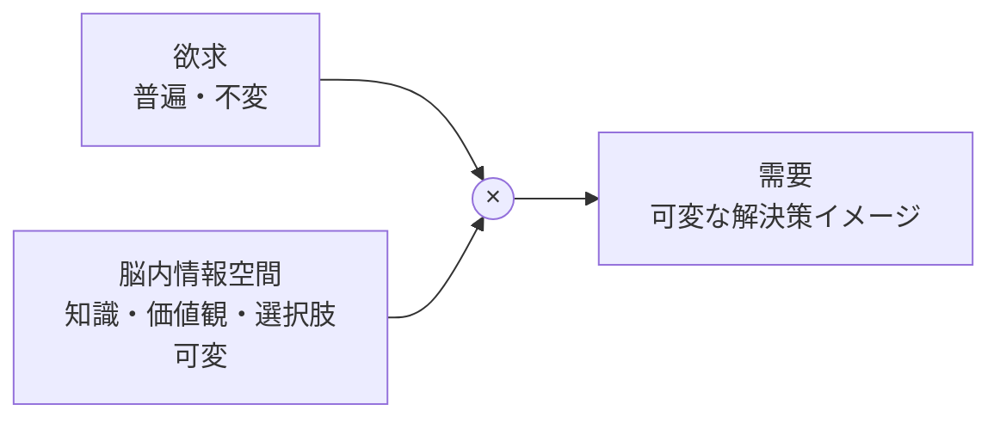
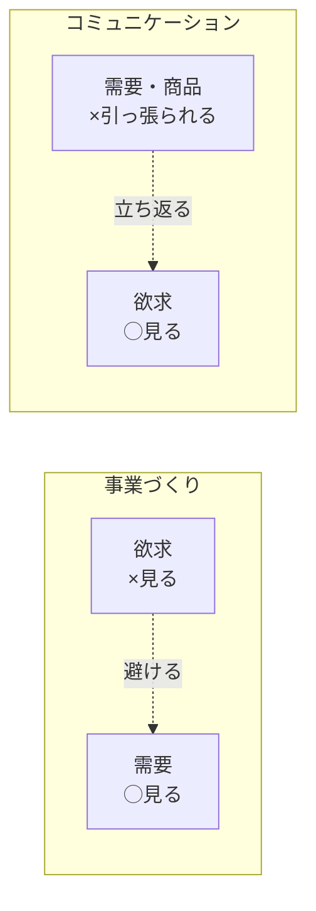

# 第2章　欲求から需要が生まれ、その需要に対して商品を入れる

第1章で、ビジネスを[需要](GLOSSARY.md#需要)・[供給](GLOSSARY.md#供給)・[取引](GLOSSARY.md#取引)の最小構造に分解した。だがそこでは、需要を「具体的な商品・サービスへの欲しさ」とだけ置き、その**中身**——需要はどこから来るのか——は開かずに残した。本章は、その箱を開ける。

需要は、天から降ってくるのではない。人の頭の中で、普遍で不変の[欲求](GLOSSARY.md#欲求)（何かを欲する心）が、その人の[脳内情報空間](GLOSSARY.md#脳内情報空間)（知識・価値観・思い浮かぶ選択肢）を通って、具体的な解決策のイメージへ変換されたものである。これが本章の生成式〈需要 ＝ 欲求 × 脳内情報空間〉であり、本章のタイトルそのもの——「**欲求から需要が生まれ、その需要に対して商品を入れる**」——が、この変換を一文にした[需要の黄金律](GLOSSARY.md#需要の黄金律)である。

この区別は、CMOBANKで最初に頭を入れ替えるべき土台である。獲得するのは7つだ。(1) 欲求は普遍で不変だと押さえる、(2) 需要は欲求の解決策として生まれる可変なものだと捉える、(3) 商品を入れる先は欲求ではなく需要だと知る（黄金律）、(4) 取引は〈欲求 → 需要 → 取引 → 感情〉の順に駆動すると見る、(5) 感情は抽象語でなく[シーン](GLOSSARY.md#シーン)で捉える、(6) 需要は〈欲求 × 脳内情報空間〉で生まれるから可変だと理解する、(7) 事業では需要を・コミュニケーションでは欲求を見るという[左右対称の罠](GLOSSARY.md#左右対称の罠)を避ける。第4章以降のリサーチ・需要の切り取り・商品コンセプトは、すべてこの7つの上に立つ。

---

## 1. 欲求とは、何かを欲する心であり、普遍で変わらない

> **要約**：欲求とは「ぐっすり寝たい」「モテたい」のような何かを欲する心であり、人類誕生からほぼ変わらない普遍的なものである。普遍ゆえに差別化を生まず、欲求を掘っても新しい事業は生まれない。

**原則**
- [欲求](GLOSSARY.md#欲求)とは、何かを欲する心（「ぐっすり寝たい」「痩せたい」「モテたい」）である。
- 欲求は、人類誕生からほぼ変わらない**普遍・不変**のものである。
- 欲求は束（たば）になっている。1つの商品には、メインの大きい欲求が1つと、サブの欲求が複数ぶら下がる。

**根拠（なぜそうなのか）**
- 欲求は、脳のプログラム（生き残る・子孫を残す）に根ざしている。だから「安心したい」「認められたい」「楽をしたい」といった欲求は、古代の人間も現代の人間も基本的に同じだ。時代や技術が変わっても、欲する心そのものは動かない。
- 普遍ということは、**全員が同じように持っている**ということである。全員が持つものは、それ自体では誰の差別化にもならない。「人は寝たい」という事実から、どんな商品を作るべきかは一つも決まらない。

**使い方（どう適用するか）**
- 欲求は、事業づくりの**直接の対象にしない**。「この欲求があるから売れるはずだ」と考え始めたら、それは危険信号である。欲求は、需要の裏にある「源」として押さえるにとどめる（商品を入れる先は需要である→[3節](#3-欲求があれば売れるではない)）。
- ただし[コミュニケーション](GLOSSARY.md#コミュニケーション)を設計するときは逆に、欲求まで立ち返る。目の前の商品スペック（需要寄り）から語り始めず、「読者はそもそもどんな欲求を満たしたいのか」へ戻る（→[7節](#7-事業では需要を見るコミュニケーションでは欲求に立ち返る)）。
- 1つの商品に欲求は束でぶら下がるので、コミュニケーションでは先に「**どの欲求を刺激するか**（狙う欲求）」を1つ決める。刺激する欲求が変われば、見せる理想も教育もコピーも丸ごと変わる。

**適用条件**
- 使う場面：欲求と[需要](GLOSSARY.md#需要)を切り分けるとき。コミュニケーションで「読者の動機」を設計するとき。
- 使わない場面：事業の切り口・狙う市場を決めるとき。そこで見るのは欲求ではなく需要である（→[3節](#3-欲求があれば売れるではない)・[第6章](06-blue-demand-target-demand.md)）。

**誤用と注意**
- 欲求を需要と混同しない。「寝たい（欲求）」と「自分に合う枕が欲しい（需要）」は別の層である。混同すると、普遍の欲求に直接商品をぶつける一般解の失敗（[3節](#3-欲求があれば売れるではない)）に陥る。
- 「新しい欲求を発見した」と思ったら、たいてい錯覚である。それは新しい欲求ではなく、既存の欲求から枝分かれした新しい**需要**であることが多い。

**具体例**
- 男性用化粧水の裏にある欲求は1つではない。「自己成長したい」「モテたい」「カッコいいライフスタイルを送りたい」といった複数の欲求が束で存在する。同じ製品でも、どの欲求を狙うかで、刺さる相手も伝えるべき内容も変わる。だからコミュニケーションでは、束の中から狙う欲求を先に1つ選ぶ。

**関連**
- 用語：[欲求](GLOSSARY.md#欲求) / [需要](GLOSSARY.md#需要) / [感情](GLOSSARY.md#感情)
- 章節：[2節](#2-需要とは欲求の解決策として生まれるものである)（需要の定義）/ [3節](#3-欲求があれば売れるではない)（商品を入れる先）/ [7節](#7-事業では需要を見るコミュニケーションでは欲求に立ち返る)（コミュニケーションでは欲求へ戻る）

---

## 2. 需要とは、欲求の解決策として生まれるものである

> **要約**：需要とは、欲求の解決策として頭に浮かぶ「具体的な欲しさ」（例：「自分に合う枕が欲しい」）である。需要は人の頭の中にあり、言葉のニュアンス一語で無限に細分化される。粗い言葉で止めず、見込み客が実際に使う言葉まで降りて表現する。

**原則**
- [需要](GLOSSARY.md#需要)とは、[欲求](GLOSSARY.md#欲求)の**解決策**として生まれるもの、すなわち「これがあれば欲求が満たせそうだ」と頭に浮かぶ具体的な欲しさである（「ぐっすり寝たい」という欲求に対する「自分に合う枕が欲しい」）。
- 需要は人の頭の中に存在し、言葉の**ニュアンス**の違いで無限に細分化される。
- 同じ欲求でも、需要が変われば、見込み客が思い浮かべる解決策（商品カテゴリ）はまったく別物になる。

**根拠（なぜそうなのか）**
- 欲求は普遍だが、その欲求を「どう解決したいか」は人によって、状況によって変わる。「痩せたい」という同じ欲求でも、「1,000円未満で痩せたい」「食欲を我慢せずに痩せたい」「半強制的に確実に痩せたい」では、頭に浮かぶ商品がサプリ・置き換え食・パーソナルジムへと丸ごと変わる。需要とは、この「どう解決したいか」のレベルの欲しさである。
- だから需要を粗い言葉（「痩せたい」「美味しい」「便利」）で捉えると、誰の頭にも具体的な解決策が結ばれない**一般解**しか作れない。ニュアンスを正確に切り取れた者だけが、その人に「これだ」と思わせる供給を当てられる。

**使い方（どう適用するか）**
- 需要を扱うときは、必ず**見込み客が頭の中で実際に使っている言葉のレベルまで降りて**表現する。「痩せたい」で止めず、「食べる量を変えずに痩せられるものが欲しい」「とにかく早く結果が出るサービスが欲しい」のように、枕詞を付けて具体化する。
- 曖昧語（美味しい・便利・健康・快適）が出たら、「それは具体的にどの状態か」と必ず一段分解する。曖昧語は需要ではなく、需要になる手前の欲求に近い。
- **自己判定**：枕詞を1つ変えたら、頭に浮かぶ解決策（商品）が変わるか。変わるなら、それは切り分けるべき別の需要である。変わらないなら、まだ需要を粗く捉えている。

**適用条件**
- 使う場面：事業の切り口を探すとき、狙う市場を言語化するとき。需要の細分化と切り取りは、リサーチ（[第4章](04-research-birds-bugs-fish-eye.md)）と狙う需要の決定（[第6章](06-blue-demand-target-demand.md)）の前提になる。
- 使わない場面：コミュニケーションの起点を作るとき。そこでは需要（具体の解決策）から一段戻り、裏の欲求から始める（→[7節](#7-事業では需要を見るコミュニケーションでは欲求に立ち返る)）。

**誤用と注意**
- 需要を一般的な「ニーズ／ウォンツ」で言い換えない。本書の需要は〈欲求 × [脳内情報空間](GLOSSARY.md#脳内情報空間)〉で生まれる可変なものであり（[6節](#6-需要は欲求--脳内情報空間で生まれゆえに可変である)）、一般語の「必要／欲しい」の二分とは別物である。
- 粗い需要のまま供給を当てない。「美味しい焼肉屋」では刺さらない。「ヘルシー志向の彼女と楽しめる、おしゃれな街のデート用の焼肉屋」まで降りて初めて、特定の人の頭の中に解決策が結ばれる。

**具体例**
- 「美味しい肉が食べたい」という頭の中の欲しさは、状況に応じて「美味しい焼肉屋ないかな」「デートでも行ける美味しい焼肉屋」「ヘルシー志向の彼女と楽しめるデート用の焼肉屋がおしゃれな街にないか」へと枝分かれする。同じ核から、文脈（デート・相手の志向・場所）で需要が分岐していく。供給を当てる先は、この枝分かれした先端の需要である。

**関連**
- 用語：[需要](GLOSSARY.md#需要) / [欲求](GLOSSARY.md#欲求) / [脳内情報空間](GLOSSARY.md#脳内情報空間)
- 章節：[1節](#1-欲求とは何かを欲する心であり普遍で変わらない)（欲求＝普遍）/ [6節](#6-需要は欲求--脳内情報空間で生まれゆえに可変である)（需要の生成式）/ [第6章](06-blue-demand-target-demand.md)（需要を一段ずつ切り取って狙う需要を決める）

---

## 3. 欲求があれば売れる、ではない

> **要約**：本書の根本原則（需要の黄金律）は「欲求があれば売れる、ではない。欲求から需要が生まれ、その需要に対して商品を入れる」である。商品を入れる先は普遍の欲求ではなく、可変の需要である。欲求に直接商品をぶつけると、一般解になって外す。

**原則**
- [需要の黄金律](GLOSSARY.md#需要の黄金律)：「**欲求があれば売れる、ではない。欲求から需要が生まれ、その需要に対して商品を入れる**」。
- [商品](GLOSSARY.md#商品)を入れる先は、普遍の[欲求](GLOSSARY.md#欲求)ではなく、可変の[需要](GLOSSARY.md#需要)である。
- 欲求と商品のあいだには、必ず「需要」という変換段がある。この段を飛ばしてはならない。

**根拠（なぜそうなのか）**
- 欲求は全員が持つ普遍のものだから、「欲求があること」は何の選別にもならない。「みんな寝たい」は真だが、そこからは何を作るべきかが一つも決まらない。決まるのは、その欲求が特定の[脳内情報空間](GLOSSARY.md#脳内情報空間)を通って「自分に合う枕が欲しい」という具体的な需要に変換されたあとである。
- 欲求に直接商品をぶつけると、全員に向けた一般解（ただの枕）になり、誰の頭にも「これだ」が起きない。需要に商品をぶつけると、その需要を持つ人にとっての最適解になり、選ばれる。差別化は欲求の層では起きず、需要の層で初めて起きる。

**使い方（どう適用するか）**
- 事業・商品を考えるときは、思考を必ず「欲求 → 需要 → 商品」の順に通す。欲求から一気に商品へ飛ばさない。
- **自己判定**：「この欲求があるから売れるはずだ」と言いかけたら、立ち止まる。それは黄金律の前半（「欲求があれば売れる」）に落ちている。「では、その欲求はどんな具体的な需要に変換されているか」を一文で言えるまで、商品の話に進まない。
- 既存商品の不調を診るときも、「狙っている先が欲求のままになっていないか（一般解になっていないか）」を疑い、刺すべき具体的な需要を1つに絞り直す。

**適用条件**
- 使う場面：新規事業・新商品の構想、既存商品の切り口の見直し。「何を作るか／どこで戦うか」を決めるすべての起点。
- 例外なし。本章以降の需要設計（[第6章](06-blue-demand-target-demand.md)）・商品コンセプト（[第8章](08-product-concept.md)）は、この黄金律の上に立つ。

**誤用と注意**
- 「大きな欲求があるから市場も大きい」と決めつけない。欲求の大きさは市場の大きさを保証しない。市場は、その欲求が変換された具体的な需要の人数と[購入意欲額](GLOSSARY.md#購入意欲額)で決まる（[第6章](06-blue-demand-target-demand.md)）。
- 黄金律を「需要に合わせて妥協する」と読み違えない。これは需要に媚びる話ではなく、商品を**当てるべき的を正しく置く**話である。的（需要）がずれていれば、どれだけ良い商品も当たらない。

**具体例**
- 「みんな寝たい→だから枕を作る」は、欲求に直接商品をぶつけた典型的な失敗である。「寝たい」は全員の普遍の欲求であり、そこからは差別化された枕は生まれない。一方、「夜中に何度も目覚めてしまう人が、自分に合う高さの枕を欲しがっている」という具体的な需要に商品を当てれば、その人にとっての最適解になる。同じ「枕」でも、的の置き方で売れ方が変わる。

**関連**
- 用語：[需要の黄金律](GLOSSARY.md#需要の黄金律) / [欲求](GLOSSARY.md#欲求) / [需要](GLOSSARY.md#需要) / [商品](GLOSSARY.md#商品)
- 章節：[1節](#1-欲求とは何かを欲する心であり普遍で変わらない)・[2節](#2-需要とは欲求の解決策として生まれるものである)（欲求と需要の区別）/ [序章 3節](00-prologue.md#3-思考は需要--供給--コミュニケーションの順に進む)（需要→供給→コミュニケーションの順序）/ [第6章](06-blue-demand-target-demand.md)（狙う需要の決定）

---

## 4. 取引は「欲求 → 需要 → 取引 → 感情」の順に駆動する

> **要約**：取引の根本フローは〈欲求 → 需要 → 取引 → 感情〉である。脳内（欲求・需要・感情）が人の行動（取引）を突き動かす。取引の後に生まれる感情が報酬・罰として学習され、次の欲求・需要へとループする。

**原則**
- [取引](GLOSSARY.md#取引)の根本フローは〈**[欲求](GLOSSARY.md#欲求) → [需要](GLOSSARY.md#需要) → 取引 → [感情](GLOSSARY.md#感情)**〉である。
- 欲求・需要・感情はすべて脳内の出来事であり、それらが人の行動（取引という外に出る一手）を突き動かす。
- 取引の後に生まれる感情は、脳への報酬（快）か罰（不快）であり、それが学習されて次の欲求・需要に反映される。

上図のとおり、欲求が需要を生み、需要が取引を促し、取引の結果として感情が生まれ、その感情が次の欲求へ還る。取引は一回で終わる直線ではなく、感情を介して回り続けるループである。

**根拠（なぜそうなのか）**
- 人は感情を直接は買えない。感情を得るために、欲求が具体的な需要へ変換され、その需要を満たす供給と取引する。つまり取引は感情を手に入れるための手段であり、フローの起点（欲求）と終点（感情）は表裏一体に近い。
- 取引後の感情がループを回す。満たされて快が得られれば「またあの感情が欲しい」と次の欲求が立ち上がり、不快なら「次はこうしたい」と需要が更新される。第1章で見た「需要は満たされるたびに新需要を生む」（[第1章 5節](01-business-demand-supply-trade.md#5-需要は満たされるたびに新たな欲求から新需要を生む)）は、このループの感情側からの言い換えである。

**使い方（どう適用するか）**
- 人の行動（買った・離脱した）を分析するときは、必ずその裏の鎖を遡る。「どんな取引が起きたか」→「その手前にどんな需要があったか」→「さらに裏にどんな欲求があったか」→「結果としてどんな感情を得ようとしていたか」。表面の行動だけを見ない。
- 設計するときは逆向きに使う。得てほしい感情を起点に、それを生む需要を定め、その需要に供給を当て、取引が成立する条件（[オファー](GLOSSARY.md#オファー)）を整える。
- **自己判定**：自分の施策について、〈欲求 → 需要 → 取引 → 感情〉の4点をそれぞれ一語で埋められるか。どこかが空欄なら、その鎖はまだ切れている。

**適用条件**
- 使う場面：購買行動の分析、見込み客の動機の言語化、[ペルソナ脳内マップ](GLOSSARY.md#ペルソナ脳内マップ)で頭の中を追うとき（[第5章](05-persona-mind-map.md)）。
- 使わない場面なし。これは人がなぜ動くかの基本モデルであり、リサーチからコピーまで通底する。

**誤用と注意**
- 取引（行動）を起点に考えない。「買わせる」から発想すると、需要・欲求・感情という裏の駆動を見落とし、煽りだけの設計に堕ちる。鎖の上流（欲求・需要）が動いていなければ、取引は起きない。
- 感情を終点として置き去りにしない。取引後の感情が満たされなければ、ループは負に回り、反復取引（リピート・紹介）が止まる。良い取引（[第1章 3節](01-business-demand-supply-trade.md#3-良い取引は双方にプラスを生むシナジー)）とは、取引後の感情まで快であるものを指す。

**関連**
- 用語：[取引](GLOSSARY.md#取引) / [欲求](GLOSSARY.md#欲求) / [需要](GLOSSARY.md#需要) / [感情](GLOSSARY.md#感情)
- 章節：[第1章 4節](01-business-demand-supply-trade.md#4-購買は機能ではなく感情ベネフィットで起きる)（購買は感情で起きる）/ [第1章 5節](01-business-demand-supply-trade.md#5-需要は満たされるたびに新たな欲求から新需要を生む)（充足が次の需要を生む）/ [5節](#5-感情は抽象語ではなくシーンで捉える)（感情の扱い方）

---

## 5. 感情は、抽象語ではなくシーンで捉える

> **要約**：感情は言葉で名指ししても伝わらない。感情は、それが動く具体的な場面＝シーン（時間帯・場所・動作・登場人物・心の声）に変換して初めて、相手の頭の中で再生される。シーンを描くと、相手は感情を先に味わい（先取り感情）、それを得たくて動き出す。

**原則**
- [感情](GLOSSARY.md#感情)は、抽象語のまま扱えない。「快適」「安心」「優越感」と名指ししても、相手の頭の中では何も再生されない。
- 感情は、それが動く具体的な[シーン](GLOSSARY.md#シーン)（時間帯・場所・動作・登場人物・五感・心の声）に変換して初めて、相手の頭の中で再生され、味わわれる。
- シーンを描くと、相手は満たされた状態の感情を行動の**前に**味わう（[先取り感情](GLOSSARY.md#先取り感情)）。脳はその感情を手に入れたくて動き出す。

**根拠（なぜそうなのか）**
- 感情は、脳のプログラムに対する報酬・罰であって、言葉そのものではない。「安心してください」と言われても安心は生まれない。安心が生まれた具体的な場面を頭の中で再生したとき、人はその場面に付随する感情を追体験する。だから感情は、器であるシーンに載せて運ぶしかない。
- 先取り感情が行動を作る。人は、手に入った状態を想像できた時点で、その感情を先に味わいはじめ、それを実際に得るために動く。これが理想の[提示](GLOSSARY.md#共感教育約束交渉提示コミュニケーション5大要素)（未来描写）が効く理由である。逆に、シーンのない抽象語は先取り感情を起こさないため、行動につながらない。

**使い方（どう適用するか）**
- 感情を伝えたいときは、必ず「**それはどんなシーンか**」を一段掘る。感情ワードが出たら、その感情が一番高ぶる瞬間（感情のピーク）を時系列から特定し、その場面を描く。
- シーンには、登場人物・動作・五感・心の声を入れ、**相手目線・自分ごと**で書く。「想像してください」と促し、相手の頭の中に場面を作らせる。
- 短期で身近なシーンを優先する。遠い最終ゴールより、「商品が届いた瞬間」「最初に使う瞬間」のほうが想像しやすく、先取り感情が強く立つ。

**適用条件**
- 使う場面：[共感](GLOSSARY.md#共感教育約束交渉提示コミュニケーション5大要素)で悩みのシーンを描くとき、提示で理想のシーンを描くとき、[ベネフィット](GLOSSARY.md#ベネフィット)を訴求するとき（[第7章](07-product-planning-map.md)・[第11章](11-lp-communication-funnel.md)）。
- 使わない場面：[特徴](GLOSSARY.md#特徴)・[効果](GLOSSARY.md#効果)・[証拠](GLOSSARY.md#証拠)を述べるとき。これらは客観的事実なので、シーンではなく事実として淡々と示す（混同するとベネフィットの訴求が弱まる）。

**誤用と注意**
- 感情を名指しするだけで終えない。「感動の体験を」「最高の安心を」は、感情ワードの羅列であってシーンではない。先取り感情は起きない。
- 送り手目線で書かない。「綺麗になって周りから褒められる未来を想像してください」は抽象で送り手目線。「歯並びが治って、一番仲の良い友達に会ったとき、その友達はまずあなたの歯をじっと見るかもしれない——口には出さなくても、心の中できっと『綺麗になったな』と思っている」のように、登場人物と具体の動作で、相手が主観的に再生できる場面にする。
- 抽象語を残したまま安心しない。書き終えたら形容詞・感情語を削ってみて、場面だけで感情が立ち上がるかを点検する。立たなければ、まだシーンになっていない。

**具体例**
- AirPods Proの「集中できる安心」という感情は、そのままでは伝わらない。「両耳を付けた瞬間に周囲の雑音がスッと消え、自分の作業だけに沈み込めた」というシーンに変換して初めて、ノイズキャンセリングという特徴が「安心」という感情として相手の頭の中で再生される。スペック表ではなく、この場面が動機を作る。

**関連**
- 用語：[シーン](GLOSSARY.md#シーン) / [感情](GLOSSARY.md#感情) / [先取り感情](GLOSSARY.md#先取り感情) / [ベネフィット](GLOSSARY.md#ベネフィット)
- 章節：[第1章 4節](01-business-demand-supply-trade.md#4-購買は機能ではなく感情ベネフィットで起きる)（購買は感情・ベネフィットで起きる）/ [4節](#4-取引は欲求--需要--取引--感情の順に駆動する)（感情はフローの終点・起点）/ [第10章](10-information-space-content.md)（先取り感情とコンテンツ）/ [第11章](11-lp-communication-funnel.md)（提示で理想のシーンを描く）

---

## 6. 需要は〈欲求 × 脳内情報空間〉で生まれ、ゆえに可変である

> **要約**：需要は〈欲求 × 脳内情報空間（知識・価値観・思い浮かぶ選択肢）〉で生まれる。欲求は不変でも、脳内情報空間が違えば浮かぶ需要は変わる。だから需要は可変であり、コミュニケーションで脳内情報空間を書き換えれば、需要そのものを作り変えられる。

**原則**
- [需要](GLOSSARY.md#需要)は、〈**[欲求](GLOSSARY.md#欲求) × ペルソナの[脳内情報空間](GLOSSARY.md#脳内情報空間)（知識・価値観・思い浮かぶ選択肢）**〉で生まれる。
- 欲求は普遍で不変だが、脳内情報空間は人によって・時代によって・教育によって変わる。掛け合わされる片方が動くため、生まれる需要は**可変**である。
- だから需要は、固定された所与ではなく、コミュニケーションで脳内情報空間に働きかければ作り出したり変えたりできる対象である。

上図のとおり、不変の欲求に、その人ごとに異なる脳内情報空間が掛け合わさって、需要が生まれる。可変なのは右の項（脳内情報空間）であり、ここが動くことで、同じ欲求から別の需要が立ち上がる。

**根拠（なぜそうなのか）**
- 同じ「痩せたい」という欲求でも、「サプリで痩せられる」という知識を持つ人には「効くサプリが欲しい」という需要が、「運動でしか痩せない」という価値観の人には「続けられるジムが欲しい」という需要が浮かぶ。浮かぶ解決策は、その人の脳内情報空間にある選択肢の在庫で決まる。だから需要は、欲求だけでは決まらず、脳内情報空間との掛け算で決まる。
- 掛け算の片方（脳内情報空間）が可変だからこそ、マーケティングが効く。新しい知識・基準を相手の頭に入れれば、これまで存在しなかった需要を生み出せる。需要は発見するだけのものではなく、[教育](GLOSSARY.md#共感教育約束交渉提示コミュニケーション5大要素)によって作り出せるものでもある。

**使い方（どう適用するか）**
- 需要を読むときは、欲求と脳内情報空間の両方を見る。「この人の欲求は何か」だけでなく、「この人の頭の中にどんな知識・価値観・選択肢があるか」を[憑依](GLOSSARY.md#憑依)して掴む（[第5章](05-persona-mind-map.md)）。同じ欲求でも、脳内情報空間が違えば狙うべき需要が変わる。
- 需要を**作る**ときは、脳内情報空間に働きかける。新しいモノサシ（評価基準）を教育で渡し、「その基準で選ぶなら、こういう解決策（需要）が要る」という状態を相手の頭の中に作る（[第10章](10-information-space-content.md)・[第11章](11-lp-communication-funnel.md)）。
- **自己判定**：狙っている需要について、「どんな欲求 × どんな脳内情報空間」の掛け算で生まれているかを言えるか。言えなければ、その需要をまだ所与として受け取っているだけで、動かす余地を見落としている。

**適用条件**
- 使う場面：需要の細分化・切り取り（[第6章](06-blue-demand-target-demand.md)）、見込み客の頭の中のリサーチ（[第4章](04-research-birds-bugs-fish-eye.md)・[第5章](05-persona-mind-map.md)）、教育で需要を作るコミュニケーション設計（[第10章](10-information-space-content.md)）。
- 使わない場面なし。需要を扱うすべての局面で、この生成式が前提になる。

**誤用と注意**
- 需要を固定された市場データとして鵜呑みにしない。いまの需要は「現在の脳内情報空間で切った断面」にすぎない。教育で脳内情報空間が変われば、市場の形そのものが変わる。
- 「需要を作る」を「ない欲求を捏造する」と取り違えない。作れるのは需要（解決策イメージ）であって、欲求は作れない。あくまで既存の欲求を、新しい脳内情報空間を通して別の需要へ変換するのである。

**具体例**
- ファブリーズは、「洗えないもの（ソファ・カーテン）は諦めるしかない」という脳内情報空間に、「布は洗わなくてもスプレーで清潔にできる」という新しい選択肢を入れた。「清潔でいたい」という不変の欲求はそのままに、脳内情報空間を書き換えることで「洗えないものを手軽にキレイにしたい」という需要を立ち上げた。需要が〈欲求 × 脳内情報空間〉で生まれ、後者を動かせば需要を作れることの実例である。

**関連**
- 用語：[需要](GLOSSARY.md#需要) / [欲求](GLOSSARY.md#欲求) / [脳内情報空間](GLOSSARY.md#脳内情報空間) / [憑依](GLOSSARY.md#憑依)
- 章節：[2節](#2-需要とは欲求の解決策として生まれるものである)（需要＝可変な解決策）/ [第4章](04-research-birds-bugs-fish-eye.md)・[第5章](05-persona-mind-map.md)（脳内情報空間を読む）/ [第10章](10-information-space-content.md)（脳内情報空間を書き換える）

---

## 7. 事業では需要を見る、コミュニケーションでは欲求に立ち返る

> **要約**：見るべき軸は工程で逆になる。事業を作るときは需要を見る（欲求を見ると一般解で外す）。コミュニケーションするときは欲求に立ち返る（目の前の商品＝需要寄りのスペックに引っ張られると外す）。この左右で軸が反転する構造が「左右対称の罠」である。

**原則**
- マーケティングの工程で、見るべき軸は左右で逆転する。これが[左右対称の罠](GLOSSARY.md#左右対称の罠)である。
  - **事業を作るとき**：[需要](GLOSSARY.md#需要)を見る。[欲求](GLOSSARY.md#欲求)を直接見ると、普遍ゆえに一般解になって外す（[3節](#3-欲求があれば売れるではない)の黄金律）。
  - **コミュニケーションするとき**：欲求に立ち返る。目の前の[商品](GLOSSARY.md#商品)（需要寄りのスペック）ばかり見ると、読者の動機を外す。
- どちらの工程にいるかを自己定位し、見る軸を意識的に切り替える。

上図のとおり、事業づくりでは欲求を避けて需要を見、コミュニケーションでは需要・商品から欲求へ立ち返る。同じ「欲求と需要」を扱いながら、工程によって見る軸が左右対称に反転する。

**根拠（なぜそうなのか）**
- この罠が生まれる原因は、「**人は見えているものを見てしまう**」という性質にある。事業づくりの段階では商品がまだ手元にないため、放っておくと抽象的な欲求（みんな寝たい）に流れ、一般解の罠に落ちる。だから意識的に具体の需要へ降りる。
- コミュニケーションの段階では、逆に手元に完成した商品があるため、放っておくと商品スペック（需要寄り）から語り始め、「読者がそもそも何を欲しているのか」を飛ばす。商品は売り手に見えているもの、欲求は読者の側にあるもの。だから意識的に欲求へ立ち返る必要がある。
- 要するに、両工程とも「放っておくと見えやすいほうに流れ、外す」。罠は対称に配置されているので、対策も対称——どちらの工程でも、流されやすい軸の**反対側**を意識的に見る——になる。

**使い方（どう適用するか）**
- 作業の前に、いま自分が「事業づくり（需要を決める）」と「コミュニケーション（伝える）」のどちらにいるかを自己定位する（[序章 5節](00-prologue.md#5-常に全体像のどこにいるかを自己定位する)）。
- 事業づくり側にいるなら、欲求語（寝たい・痩せたい・モテたい）で止まっていないかを点検し、具体の需要へ降ろす。
- コミュニケーション側にいるなら、LPやコピーの冒頭〜前半が「商品の良さ」から始まっていないかを点検する。始まっていたら、読者の欲求から始まるよう書き直す。同じ商品でも裏の欲求は束（[1節](#1-欲求とは何かを欲する心であり普遍で変わらない)）なので、先に「狙う欲求」を1つ決めてから書く。
- **自己判定**：いま見ている軸は、この工程で「流されやすいほう」か「意識的に見るべきほう」か。流されやすいほうを見ていたら、反対側へ引き戻す。

**適用条件**
- 使う場面：事業構想と制作物（LP・広告）のあいだを行き来するすべての局面。特に、商品が完成した後にコミュニケーションを設計するとき。
- 使わない場面なし。これは個別技術ではなく、全工程に重ねる軸の管理である。

**誤用と注意**
- 「需要と欲求のどちらが正しいか」という問いにしない。どちらも正しく、**工程によって見る軸が変わる**だけである。一方に固定した瞬間に、もう片方の工程で外す。
- コミュニケーションで欲求に立ち返ることを、「商品説明をしない」と取り違えない。欲求から始めて読者を引き込み、需要を作ってから商品（[約束](GLOSSARY.md#共感教育約束交渉提示コミュニケーション5大要素)＝商品説明）を出す、という順序の問題である（[第11章](11-lp-communication-funnel.md)）。

**具体例**
- 男性用化粧水のLPを、「保湿成分が〇〇配合」という商品スペック（需要寄り）から書き始めると、読者の動機に火がつかない。商品が手元にあるために、見えているスペックに引っ張られた典型である。ここで欲求に立ち返り、束の中から「モテたい」を狙う欲求に選び、その欲求が動くシーンから書き始めれば、同じ商品でも読者の側から興味の触手が伸びる。事業づくりでこの化粧水の需要（「肌で清潔感を出してモテたい男性向けの手軽なケア」）を決め、コミュニケーションでその裏の欲求（モテたい）へ戻る——軸が左右対称に反転している。

**関連**
- 用語：[左右対称の罠](GLOSSARY.md#左右対称の罠) / [欲求](GLOSSARY.md#欲求) / [需要](GLOSSARY.md#需要) / [商品](GLOSSARY.md#商品)
- 章節：[1節](#1-欲求とは何かを欲する心であり普遍で変わらない)（欲求は束・狙う欲求を1つ決める）/ [3節](#3-欲求があれば売れるではない)（事業側＝需要に商品を入れる）/ [序章 5節](00-prologue.md#5-常に全体像のどこにいるかを自己定位する)（全体像での自己定位）/ [第11章](11-lp-communication-funnel.md)（共感は欲求・教育は需要・約束は商品）
