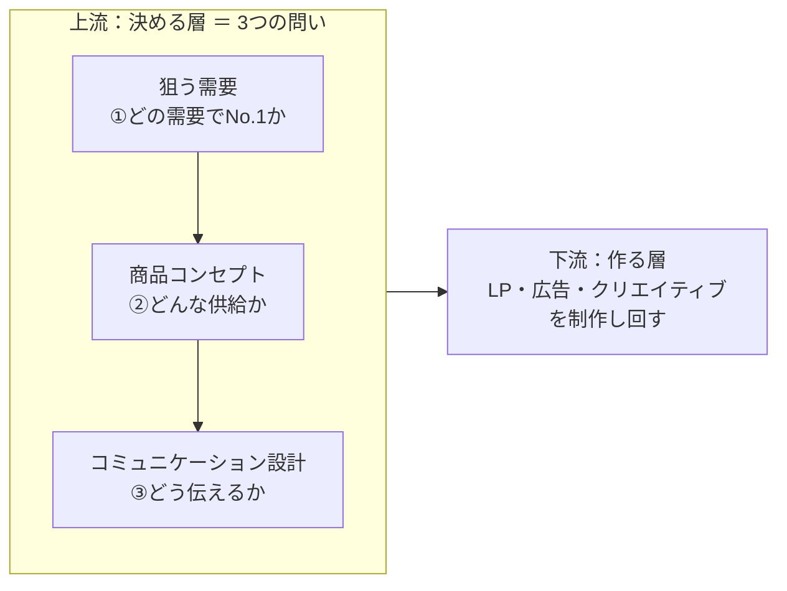

# 第3章　マーケターの3つの問い

序章で全体像という地図を頭に入れ、第1章でビジネスのOS（[需要](GLOSSARY.md#需要)・[供給](GLOSSARY.md#供給)・[取引](GLOSSARY.md#取引)の最小構造）を、第2章で欲求から需要が生まれる変換の仕組みを据えた。本章は、その地図の上で**実際に手を動かすとき、マーケターが何を・どの順番で・どこに力を入れて考えるか**を定める。これがマーケティング実務の背骨である。

マーケティングで考えるべきことは膨大に見える。だが突き詰めると、マーケターが立てるべき問いはたった3つに集約される。①どの[需要](GLOSSARY.md#需要)で[No.1](GLOSSARY.md#no1)を取るか（ターゲティング）、②どのような[供給](GLOSSARY.md#供給)を提案するか（コンセプト）、③どのように[コミュニケーション](GLOSSARY.md#コミュニケーション)するか。マーケティングが「需要と供給をつなぐ活動」（[序章 1節](00-prologue.md#1-マーケティングとは需要と供給をコミュニケーションでつなぐ活動である)）である以上、つなぐ対象（需要）・つなぐもの（供給）・つなぎ方（コミュニケーション）の3点を押さえれば、活動の全体を漏れなく捉えられるからだ。問いを3つに固定することが、思いつきのアイデア列挙に流れず、毎回同じ構造で本質から考えるための型になる。

本章で獲得するのは7つである。(1) マーケティングを「3つの問い」に分解する、(2) 第二の問い（供給提案＝コンセプト）は第一の問い（需要）に従属すると知る、(3) 第三の問い（コミュニケーション）は最下流であり上流の確定を前提にすると理解する、(4) 3つは等価ではなく、良し悪しは①の「需要の切り取りとNo.1の取り方」でほぼ決まると押さえる、(5) 市場は人ベース・媒体ベースではなく[需要ベース](GLOSSARY.md#需要ベース)で切る、(6) 3つの問いはすべて「決める」[上流](GLOSSARY.md#上流下流)に属し、制作物を「作る」下流から始めないと知る、(7) 上流を決めるプロセスは直線ではなく反復ループだと理解する。この7つが、第4章以降（リサーチ→需要→コンセプト→コミュニケーション）の目次そのものになる。

---

## 1. どの需要でNo.1を取るか

> **要約**：マーケターの第一の問いは「どの需要でNo.1を取るか」である。No.1とは、市場全体での1位ではなく、切り取った特定の需要を持つ人の頭の中で最初に思い浮かぶ存在（第一想起）になること。だからNo.1は「需要の切り取り」とセットでしか意味を持たない。

**原則**
- マーケターが最初に立てる問いは、「**どの[需要](GLOSSARY.md#需要)で[No.1](GLOSSARY.md#no1)を取るか**」（＝ターゲティング）である。
- No.1とは、市場全体での1位（市場シェア1位）ではなく、切り取った特定の需要を持つ人の頭の中で「これが一番だ」と最初に思い浮かぶ存在（第一想起）になることである。
- だからNo.1は、「何で1位か」ではなく「**どの需要で1位か**」を問う。需要の切り取りとセットでしか意味を持たない。

**根拠（なぜそうなのか）**
- どの需要で戦うかによって、競合・選ばれる基準・払われる金額・市場規模が**すべて変わる**。需要の選択が、その下流のすべて（②供給・③コミュニケーション）を規定する。だから「どこで戦うか」自体が決定的に重要になる。
- 人は、頭の中で第一想起にならない選択肢を、そもそも検討しない。広い市場で2位・3位にとどまるより、需要を切り取ってその中で1位になるほうが、取引が生まれる。No.1でない場所で戦うと、価格や物量の消耗戦に巻き込まれる。

**使い方（どう適用するか）**
- 1つの[欲求](GLOSSARY.md#欲求)から需要を多軸で細分化し（[第2章 2節](02-desire-to-demand.md#2-需要とは欲求の解決策として生まれるものである)）、各需要候補について「**ここでなら自分がNo.1を取れるか**」を問う。No.1が取れない需要は、広さを絞り直して「No.1を取れるギリギリに広い需要」へ調整する（[4つのゲート](GLOSSARY.md#4つのゲート)の Right to Win、[序章 4節](00-prologue.md#4-狙う需要は4つのゲートで判定する)）。
- **ニッチ化＝市場縮小と考えない**。切り方（軸の取り方）次第で、大きい市場でもNo.1が取れる。狭めるのは「人数」ではなく「切り口」である。
- **自己判定**：狙う需要を一文で言い、その需要の中で自分がNo.1になる理由を1つ言えるか。言えなければ、まだ需要を切り取れていない。

**適用条件**
- 使う場面：事業の切り口・狙う市場を決めるとき。3つの問いの起点であり、リサーチ（[第4章](04-research-birds-bugs-fish-eye.md)）と狙う需要の決定（[第6章](06-blue-demand-target-demand.md)）の中心テーマ。
- セットで使う：[4つのゲート](GLOSSARY.md#4つのゲート)の Right to Win（No.1を取れるか）。この問いは、そのまま③ Right to Win の判定になる。

**誤用と注意**
- 人数（市場の大きさ）だけで需要を選ばない。No.1が取れなければ規模は意味がない。市場規模（Sufficient）とNo.1（Right to Win）はトレードオフで、広げれば規模は満ちるが勝てなくなり、狭めれば勝てるが規模が足りなくなる。両方を満たす一点を探す（[序章 4節](00-prologue.md#4-狙う需要は4つのゲートで判定する)）。
- 「No.1」を市場シェア1位と取り違えない。本書のNo.1は、切り取った需要の中での第一想起を指す。

**具体例**
- 同じ「グミ状のビタミン食品」でも、それを「お菓子」の需要に当てるか「サプリメント」の需要に当てるかで、競合（菓子か健康食品か）も、選ばれる基準（美味しさ・手軽さか、効果・継続性か）も、出せる価格帯（数百円か、その数倍か）も、市場規模もまるごと変わる。製品は同じでも、どの需要で戦うかが、ビジネスの成否を分ける。
- 弁護士を「離婚専門」「相続専門」とジャンルで切るのは一般的だが、これは扱う分野（≒供給の種類）で切っているにすぎない。代わりに「相談までの早さ」という需要軸で切れば、分野を横断して「とにかく早く相談に乗ってくれる弁護士」のNo.1が取れるかもしれない。ニッチ化ではなく、切り口の発明である。

**関連**
- 用語：[No.1](GLOSSARY.md#no1) / [需要](GLOSSARY.md#需要) / [狙う需要](GLOSSARY.md#狙う需要) / [4つのゲート](GLOSSARY.md#4つのゲート)
- 章節：[序章 3節](00-prologue.md#3-思考は需要--供給--コミュニケーションの順に進む)・[4節](00-prologue.md#4-狙う需要は4つのゲートで判定する)（3つの問いと4ゲート）/ [4節](#4-マーケティングの良し悪しは需要の切り取りとno1の取り方でほぼ決まる)（ここにレバレッジが集中する）/ [5節](#5-人ベース媒体ベースではなく需要ベースで切る)（需要ベースで切る）/ [第6章](06-blue-demand-target-demand.md)（青い需要・狙う需要）

---

## 2. どのような供給を提案するか

> **要約**：第二の問いは「どんな供給を提案するか」、すなわち狙う需要に対して「誰に・どんな価値を」差し出すかという商品コンセプトを決めることである。ここで作るのは製品そのものではなく、需要に当てる価値の提案であり、第一の問い（需要）に従属する。

**原則**
- 第二の問いは、「**どのような[供給](GLOSSARY.md#供給)を提案するか**」（＝コンセプト）である。
- ここで作るのは[製品](GLOSSARY.md#製品)そのもの（機能・スペック）ではなく、狙う需要に対して「誰に・どんな価値を」差し出すかという供給の提案、すなわち[商品コンセプト](GLOSSARY.md#商品コンセプト)である。
- 供給の提案は、第一の問い（狙う需要）に**従属する**。需要が変われば、当てるべき供給も変わる。

**根拠（なぜそうなのか）**
- 供給は需要を満たすために存在し、進化する（需要が先、供給が後。[第1章 6節](01-business-demand-supply-trade.md#6-供給は需要を満たすために進化する需要が先供給が後)）。だから供給の提案は、需要が決まった後でしか正しく決まらない。需要を飛ばして供給単体の良し悪しを論じても意味がない。
- 同じ製品でも、どの需要に当てるかで価値が変わる。製品を[商品](GLOSSARY.md#商品)（買い手の需要に接続された価値）に変換するのが商品コンセプトの役割であり、これが②の答えになる。

**使い方（どう適用するか）**
- 狙う需要を固定してから、「**その需要を持つ人にとって、これ以上ない解はどんな価値か**」を問う。供給アイデアから入らない。
- 供給の良し悪しは、アイデアの奇抜さではなく「その需要にとって最高得点の解か」で測る。評価の基準は常に需要側にある。
- **自己判定**：「誰に・どんな価値を提供するか」を一文で言えるか。言えれば商品コンセプトが立っており、言えなければ②はまだ決まっていない。

**適用条件**
- 使う場面：商品企画・コンセプト設計（[第7章](07-product-planning-map.md)・[第8章](08-product-concept.md)）。①の需要が固まった後に着手する。
- 順序：思考は〈需要 → 供給 → コミュニケーション〉の順（[序章 3節](00-prologue.md#3-思考は需要--供給--コミュニケーションの順に進む)）。②は①の下流、③の上流に位置する。

**誤用と注意**
- アイデア（供給）から会議を始めない。「この施策はどうか」は②から入る典型であり、即「それ、本当に需要があるか」と①へ立ち返る。「良さそう」で施策を決めるブレストを、マーケティングと取り違えない。
- 供給を製品スペックと混同しない。提案するのは価値（商品コンセプト）であって、機能の列挙ではない（[製品](GLOSSARY.md#製品)と[商品](GLOSSARY.md#商品)は別物）。

**具体例**
- 「相談までの早さ」という需要（[1節](#1-どの需要でno1を取るか)）を狙うと決めたら、②で問うのは「その需要にとって最高の解はどんな価値か」である。たとえば「24時間以内に必ず一次回答する」「初回相談は窓口を一本化する」といった、早さという需要にまっすぐ当たる価値の提案を組む。同じ法律事務所という製品でも、当てる需要に従って提案する価値が決まる。

**関連**
- 用語：[供給](GLOSSARY.md#供給) / [商品コンセプト](GLOSSARY.md#商品コンセプト) / [製品](GLOSSARY.md#製品) / [商品](GLOSSARY.md#商品)
- 章節：[1節](#1-どの需要でno1を取るか)（供給が従属する①の需要）/ [第1章 6節](01-business-demand-supply-trade.md#6-供給は需要を満たすために進化する需要が先供給が後)（需要が先・供給が後）/ [第7章](07-product-planning-map.md)（特徴・効果・ベネフィット・証拠）/ [第8章](08-product-concept.md)（商品コンセプト）

---

## 3. どのようにコミュニケーションするか

> **要約**：第三の問いは「どうコミュニケーションするか」、決めた供給を、需要を持つ人へどの媒体で・どう伝えて取引を促すかである。これは3つの問いの最下流であり、上流（①需要・②供給）の確定を前提にする。実務はほぼ③に偏るが、勝敗を分けるのは①②である。

**原則**
- 第三の問いは、「**どのように[コミュニケーション](GLOSSARY.md#コミュニケーション)するか**」である。決めた供給を、需要を持つ人へ、どの[媒体](GLOSSARY.md#媒体)で・どう伝えて取引を促すか。
- これは3つの問いの**最下流**であり、上流（①需要・②供給）の確定を前提にする。
- 実務の現場はほぼ③に偏る。しかし、勝敗を分けるのは①②である。

**根拠（なぜそうなのか）**
- コミュニケーション（表現・媒体）の優劣は、上流でほぼ決まる（[序章 3節](00-prologue.md#3-思考は需要--供給--コミュニケーションの順に進む)）。需要の解像度がコンセプトの鋭さを規定し、コンセプトの鋭さが表現の刺さりを規定する。土台がずれたまま表現だけを磨いても挽回できない。
- 現場の業務がほぼ③（どの媒体にどんなクリエイティブを出すか）に偏るのは、③が目に見えて業務化しやすいからにすぎない。可視化されていることと、重要であることは別である。最も重要な①②ほど、解像度が低いまま放置されやすい。

**使い方（どう適用するか）**
- ③（LP・コピー・広告）の不調を相談されたら、まず①②が固まっているかを疑う。**上流が未確定のサイン**＝「狙う需要を一文で言えない」または「[4つのゲート](GLOSSARY.md#4つのゲート)に通していない」。いずれかなら、③の作業を止めて上流に戻る。
- ③は①②に従属する。「誰に（需要）・何を（供給）」が決まって初めて、「どこで・どう（コミュニケーション）」が決まる。順序を逆流させない。
- **自己判定**：いま③で悩んでいる問題は、本当に③の問題か。多くは①の需要選びのミスが、③の悩みとして表面化している。

**適用条件**
- 使う場面：コミュニケーション設計（[第9章](09-sales-and-offer.md)〜[第11章](11-lp-communication-funnel.md)）。①②の上流が確定した後に着手する。
- 例外：上流→下流は思考の基本順序だが、確定は直線ではなく往復する（[7節](#7-step25は相互に行き来して精度を高める)）。③で得た反応が、①②を更新することはある。

**誤用と注意**
- 実務時間の大半が③に吸われることを「③が重要だから」と取り違えない。可視化されているから手が動くだけであり、レバレッジは①にある（[4節](#4-マーケティングの良し悪しは需要の切り取りとno1の取り方でほぼ決まる)）。
- コミュニケーションを「広告・販促の技術」に矮小化しない。接客・価格表示・パッケージまで、ユーザーと接する面はすべて③である（[第1章 7節](01-business-demand-supply-trade.md#7-コミュニケーションとは情報を伝達して取引を促すことである)）。

**具体例**
- 需要のない商品にどれだけ名コピーを当てても売れない。逆にファブリーズは、需要（「洗えないものでも簡単にキレイにしたい」）を正しく言い当てたうえで供給を当てたから売れた（[序章 1節](00-prologue.md#1-マーケティングとは需要と供給をコミュニケーションでつなぐ活動である)）。③の出来は、①②の正しさを前提にして初めて意味を持つ。

**関連**
- 用語：[コミュニケーション](GLOSSARY.md#コミュニケーション) / [媒体](GLOSSARY.md#媒体)
- 章節：[序章 3節](00-prologue.md#3-思考は需要--供給--コミュニケーションの順に進む)（需要→供給→コミュニケーションの順序）/ [4節](#4-マーケティングの良し悪しは需要の切り取りとno1の取り方でほぼ決まる)（レバレッジは①にある）/ [第10章](10-information-space-content.md)・[第11章](11-lp-communication-funnel.md)（脳内情報空間・LP）

---

## 4. マーケティングの良し悪しは、需要の切り取りとNo.1の取り方でほぼ決まる

> **要約**：3つの問いは等価ではない。マーケティングの良し悪しは、①の「需要の切り取り」と「No.1の取り方」でほぼ決まる。②③は①の質を超えられないため、最も思考を投下すべきは①である。だが①は可視化されにくく、放置されやすい。だからこそ差がつく。

**原則**
- 3つの問いは等価ではない。マーケティングの良し悪しは、**①の「需要の切り取り」と「[No.1](GLOSSARY.md#no1)の取り方」でほぼ決まる**。
- ②（供給）も③（コミュニケーション）も、①の質を超えられない。だから最も解像度を上げ、最も思考を投下すべきは①である。

**根拠（なぜそうなのか）**
- ①が②③を規定する。下流の質は上流で決まるという原則（[序章 3節](00-prologue.md#3-思考は需要--供給--コミュニケーションの順に進む)）を、力点の配分に翻訳したのが本節である。需要の切り取りが鋭ければ、供給もコミュニケーションも自ずと鋭くなる。逆に①が鈍ければ、②③をどれだけ磨いても天井が低い。
- ①は最も重要なのに、現場では③に時間が吸われて可視化されにくく、解像度が低いまま放置されやすい（[3節](#3-どのようにコミュニケーションするか)）。**重要なのに皆が手薄な場所**だからこそ、ここに差がつく。レバレッジ（少ない労力で大きく効く点）は①に偏在している。

**使い方（どう適用するか）**
- 思考時間の配分を①に厚く寄せる。①（狙う需要とNo.1の理由）が一文で言えないまま、②③の作業に進まない。
- 添削・診断では、表現（③）の巧拙を論じる前に、まず「**どの需要で・なぜNo.1か**」を問う。ここが答えられなければ、③の議論は時期尚早と判断する。
- **自己判定**：自分のいまの作業時間は、①②③にどう配分されているか。③に偏っているなら、レバレッジの薄い場所に労力を投じている疑いがある。

**適用条件**
- 使う場面：立案の優先順位づけ、リソース配分、添削・診断の起点。
- 使わない場面なし。これは個別技術ではなく、3つの問いに重ねる力点の管理である。

**誤用と注意**
- 「3つを均等にやる」をバランスと取り違えない。労力を等分するのは、レバレッジの偏在を無視した非効率である。
- ①を「一度決めれば終わり」と固定しない。①の切れ味は、Step2〜5の反復で上がる（[7節](#7-step25は相互に行き来して精度を高める)）。一発で決めようとして浅いまま固定するのが、最も多い失敗である。

**具体例**
- 「とにかく早い弁護士」という需要軸の発見（[1節](#1-どの需要でno1を取るか)）は、②③のどんな工夫よりも大きく結果を動かす。分野で切る競合がひしめく中で、早さという軸でNo.1の位置を取れれば、その後の供給設計もコミュニケーションも乗せやすくなる。逆に、ありふれた切り口（「丁寧な弁護士」）のまま広告表現だけを磨いても、第一想起は取れない。

**関連**
- 用語：[No.1](GLOSSARY.md#no1) / [狙う需要](GLOSSARY.md#狙う需要) / [需要](GLOSSARY.md#需要)
- 章節：[1節](#1-どの需要でno1を取るか)（第一の問い）/ [序章 3節](00-prologue.md#3-思考は需要--供給--コミュニケーションの順に進む)（下流の質は上流で決まる）/ [第6章](06-blue-demand-target-demand.md)（青い需要・狙う需要）/ [第12章](12-cmo-work.md)（どの市場でNo.1を取るか）

---

## 5. 人ベース・媒体ベースではなく、需要ベースで切る

> **要約**：市場を切るとき（セグメンテーション・ターゲティング）は、人（年齢・性別・属性・趣味嗜好）や媒体ではなく、需要で切る。「20代女性」「旅行好き」で括っても、その人たちが何を欲しいかは決まらない。同じ供給に反応するのは、需要が同じ人だけである。人で切るな、需要で切れ。

**原則**
- 市場を切るとき（セグメンテーション・ターゲティング・ポジショニング）は、人ベース（年齢・性別・属性・趣味嗜好）や媒体ベースではなく、**[需要ベース](GLOSSARY.md#需要ベース)**で切る。
- 鉄則は「**人で切るな、需要で切れ**」。

**根拠（なぜそうなのか）**
- 人を括っても、その人たちが何を欲しいか（需要）は決まらない。「20代女性」「旅行好き」は、同じ商品を欲しがる集団ではない。同じ供給に反応するのは、**需要が同じ人**だけである。だから人の属性は、ターゲティングの根本軸にならない。
- どの需要で戦うかが、競合・選ばれる基準・価格・市場規模を決める（[1節](#1-どの需要でno1を取るか)）。属性はそれらを決めない。需要こそが、下流のすべてを規定する軸である。
- 人ベース・媒体ベースが無意味なわけではない。ただし出番は後段——[コミュニケーションファネル](GLOSSARY.md#コミュニケーションファネル)で「どの媒体に・誰に届けるか」を詰めるレイヤー——に限られる。上流の切り口には使わない。

**使い方（どう適用するか）**
- 軸を「需要」で取る。「仕事中に食べたいのか／家で食べたいのか」「とにかく早く結果が欲しいのか／安く済ませたいのか」のように切り、年齢などはここでは見ない。
- わかりやすい軸（お菓子／サプリ）に留めず、感情・価値観・非自明な軸（「海外っぽい／日本っぽい」など）まで想像で探す。**どんな軸を発見できるか自体に、マーケターのセンスが出る**。だから[リサーチ](GLOSSARY.md#リサーチ)を大量に行い、頭の中を想像する（[第4章](04-research-birds-bugs-fish-eye.md)・[第5章](05-persona-mind-map.md)）。
- **自己判定**：切ったセグメントが「属性の集合」（〇〇な人々）になっていないか。「**〜したい人**」という需要の文になっているか。なっていなければ、人で切っている。

**適用条件**
- 使う場面：セグメンテーション、狙う需要の決定（[第6章](06-blue-demand-target-demand.md)）。[STP](GLOSSARY.md#stp)を需要ベースで回すとき。
- 使う場面（後段）：媒体選定・配信ターゲットの設計では、人ベース・媒体ベースの属性が補助的に役立つ（[第11章](11-lp-communication-funnel.md)）。上流と下流で使い分ける。

**誤用と注意**
- デモグラやペルソナ属性を「ターゲティング」と取り違えない。本書は「人で切るな、需要で切れ」であり、属性で人を括る発想は採らない（→[使わない・言い換える語彙 A](GLOSSARY.md#a-衝突)）。
- 媒体起点で需要を後付けしない。「この媒体で流行っているから」から発想すると、需要のない場所に供給をぶつけることになる。媒体は③の話であり、①の切り口ではない。

**具体例**
- 弁護士を「離婚専門／相続専門」で切るのは、扱う分野（≒供給の種類）で括っているにすぎない。「相談までの早さ」という需要軸に切り替えると、分野を横断して「とにかく早い弁護士」というNo.1が取れる（[1節](#1-どの需要でno1を取るか)）。人や分野ではなく、頭の中の欲しさ（需要）で切ったから、新しい戦う場所が見えた。

**関連**
- 用語：[需要ベース](GLOSSARY.md#需要ベース) / [需要](GLOSSARY.md#需要) / [狙う需要](GLOSSARY.md#狙う需要) / [STP](GLOSSARY.md#stp)
- 章節：[1節](#1-どの需要でno1を取るか)（どの需要で戦うかが下流を規定する）/ [第2章 2節](02-desire-to-demand.md#2-需要とは欲求の解決策として生まれるものである)（需要は無限に細分化される）/ [第6章](06-blue-demand-target-demand.md)（人で切るな、需要で切れ）/ [使わない・言い換える語彙 A](GLOSSARY.md#a-衝突)

---

## 6. 上流は「狙う需要・商品コンセプト・コミュニケーション」を決める部分である

> **要約**：マーケティング作業には、上流（〈狙う需要・商品コンセプト・コミュニケーション設計〉を「決める」設計層）と、下流（それに基づいて制作物を「作り・回す」実行層）がある。3つの問いはすべて上流に属する。制作物を作る下流から始めない。「上流／下流」は二重に使う——3つの問いの内部の順序と、決める層／作る層の関係である。

**原則**
- マーケティング作業は、[上流](GLOSSARY.md#上流下流)（決める層）と下流（作る層）に分かれる。
  - **上流**＝3つの問いに答えて〈[狙う需要](GLOSSARY.md#狙う需要)・[商品コンセプト](GLOSSARY.md#商品コンセプト)・[コミュニケーション](GLOSSARY.md#コミュニケーション)設計〉を**決める**部分。
  - **下流**＝それに基づいて、実際の制作物（[LP](GLOSSARY.md#lp)・広告・クリエイティブ）を**作り・回す**部分。
- 3つの問いはすべて上流に属する。制作物を作る下流から始めない。
- 「上流／下流」は二重に使う。(a) 3つの問いの**内部**の順序（需要 → 供給 → コミュニケーション）と、(b) 3つの問い**全体**（決める）が、制作・実行（作る）の上流にある、という層の関係である。

上図のとおり、上流の内部では需要 → 供給 → コミュニケーションの順に決め（＝3つの問い）、その上流全体が、下流（制作・実行）の手前にある。下流に入る前に、上流の3点が決まっていなければならない。

**根拠（なぜそうなのか）**
- 下流の制作物の質は、上流で決めた中身でほぼ決まる（[4節](#4-マーケティングの良し悪しは需要の切り取りとno1の取り方でほぼ決まる)）。狙う需要・コンセプトが曖昧なまま、きれいなLPやクリエイティブを作っても、土台がずれていて挽回できない。
- 現場では「作る」が業務化されて目に見えるため、上流（決める）を飛ばして下流に直行しがちである。きれいな成果物が出ると前進した感覚を得るが、それはゴールへの前進とは別物である（手段の目的化、[序章 2節](00-prologue.md#2-すべては-business-goal-から逆算する)）。

**使い方（どう適用するか）**
- 制作（下流）に着手する前に、上流の3点が確定しているかを確認する。**確定の基準**＝(1) 狙う需要を一文で言える、(2) 商品コンセプト（誰に・どんな価値）を一文で言える、(3) どの媒体でどう伝えるかの方針が言える。
- 下流の不調は、下流をいじって直そうとせず、上流に戻って解く。
- **自己判定**：いま自分は「決めて」いるのか「作って」いるのか。作りながら決めようとしていないか。作業に没頭したら、[全体像のどこにいるか](00-prologue.md#5-常に全体像のどこにいるかを自己定位する)を確認する。

**適用条件**
- 使う場面：制作着手の可否判断、長い制作の途中での自己定位（[序章 5節](00-prologue.md#5-常に全体像のどこにいるかを自己定位する)）。
- 使わない場面なし。これは全工程に重ねるメタ確認である。

**誤用と注意**
- きれいな資料・LP・ペルソナシートを作ること自体を成果と取り違えない。作業が進んだ感覚と、ゴールへの前進は別物である（手段の目的化、[序章 2節](00-prologue.md#2-すべては-business-goal-から逆算する)）。
- 上流を「一度決めたら確定」と思わない。上流自体が反復で精度を上げる（[7節](#7-step25は相互に行き来して精度を高める)）。

**具体例**
- LPのコピーに何日もかけた後で、そもそも狙う需要が4つのゲート（[序章 4節](00-prologue.md#4-狙う需要は4つのゲートで判定する)）を通っていなかったと気づく——これは上流（決める）を飛ばして下流（作る）に没頭した典型である。制作前に上流の3点を確認していれば防げた。

**関連**
- 用語：[上流・下流](GLOSSARY.md#上流下流) / [狙う需要](GLOSSARY.md#狙う需要) / [商品コンセプト](GLOSSARY.md#商品コンセプト) / [コミュニケーション](GLOSSARY.md#コミュニケーション)
- 章節：[序章 2節](00-prologue.md#2-すべては-business-goal-から逆算する)（手段の目的化）/ [序章 5節](00-prologue.md#5-常に全体像のどこにいるかを自己定位する)（自己定位）/ [4節](#4-マーケティングの良し悪しは需要の切り取りとno1の取り方でほぼ決まる)（下流は上流で決まる）/ [7節](#7-step25は相互に行き来して精度を高める)（上流は反復で精度を上げる）

---

## 7. Step2〜5は相互に行き来して精度を高める

> **要約**：上流を決めるプロセス（Step2リサーチ／Step3セグメント／Step4ペルソナ脳内マップ／Step5商品企画マップ）は直線ではなく、相互に往復して精度を高める反復ループである。各工程は相互依存し、下流工程の気づきが上流工程を書き換える。出力（狙う需要・商品コンセプト）が弱ければ、往復が足りていない。

**原則**
- 上流（[6節](#6-上流は狙う需要商品コンセプトコミュニケーションを決める部分である)）を決めるプロセスは、直線ではなく**反復ループ**である。具体的には、Step2＝[リサーチ](GLOSSARY.md#リサーチ)（[リサーチマップ](GLOSSARY.md#リサーチマップ)）／Step3＝セグメント／Step4＝[ペルソナ脳内マップ](GLOSSARY.md#ペルソナ脳内マップ)／Step5＝[商品企画マップ](GLOSSARY.md#商品企画マップ)の4工程を、一度通って終わりにせず、**相互に行き来して精度を高める**。
- このループの出力（ゴール）が、〈[狙う需要](GLOSSARY.md#狙う需要)・[商品コンセプト](GLOSSARY.md#商品コンセプト)〉の確定である。

**根拠（なぜそうなのか）**
- 各工程は相互依存する。リサーチが浅いとセグメントが粗くなり、セグメントが粗いとペルソナが薄くなり、ペルソナが薄いと商品企画が弱くなる。逆に、後の工程（ペルソナ・商品企画）で得た気づきが、前の工程（リサーチ・セグメント）の切り口を書き換える。だから一方向に一度流すだけでは、精度は上がらない。
- 確定解は思考の中にはない。いまの出力はすべて市場でテストされるまでの[暫定解](GLOSSARY.md#暫定解)である（[終章](13-epilogue.md)）。往復して仮説を当て直すことで、初めて切れ味が出る。

**使い方（どう適用するか）**
- Step2〜5を一度で確定させない。仮リサーチ → 仮セグメント → 仮ペルソナ → 仮需要 → 再リサーチ…と、仮説を立てては当て直して回す。
- 出力（コンセプト等）が弱ければ、表現を磨く前に「**往復が足りない**」と判断し、工程に戻る。表現が出てこないのは、インプット（リサーチ）が足りないからである（[第4章](04-research-birds-bugs-fish-eye.md)）。
- **自己判定**：Step2〜5を何度往復したか。一度しか通っていないなら、精度はまだ出ていないと判断する。

**適用条件**
- 使う場面：上流の設計全体（[第4章](04-research-birds-bugs-fish-eye.md)〜[第8章](08-product-concept.md)）。狙う需要・商品コンセプトを確定するまで。
- 使わない場面：往復が収束し、最終的に市場でテストする段階。ループは検証の手前までの精度上げであり、最終の答え合わせは市場で行う（[終章](13-epilogue.md)）。

**誤用と注意**
- 順序（需要 → 供給 → コミュニケーション、[3節](#3-どのようにコミュニケーションするか)）と反復を矛盾と捉えない。順序は**思考の優先方向**、反復は**精度の上げ方**であり、両立する。「順序」は一度通れば二度と戻らないという意味ではない（[序章 3節](00-prologue.md#3-思考は需要--供給--コミュニケーションの順に進む)）。
- ループを「いつまでも回して着手しない」言い訳にしない。往復は精度を上げるためのものであり、最終的には市場でテストして検証する（[終章](13-epilogue.md)）。

**具体例**
- ペルソナ脳内マップ（Step4）で「健康になりたいが、めんどくさい」という深い頭の中が出たとする。この一語は、セグメントの軸（Step3）を「健康になりたい人」から「努力なしで健康になりたい人」へ書き換え、商品企画（Step5）の訴求も「効果の高さ」から「手軽さ・続けやすさ」へ動かす。下流の工程で得た気づきが、上流の工程を更新する——これが往復で精度が上がる仕組みである。

**関連**
- 用語：[リサーチ](GLOSSARY.md#リサーチ) / [ペルソナ脳内マップ](GLOSSARY.md#ペルソナ脳内マップ) / [商品企画マップ](GLOSSARY.md#商品企画マップ) / [暫定解](GLOSSARY.md#暫定解)
- 章節：[6節](#6-上流は狙う需要商品コンセプトコミュニケーションを決める部分である)（上流＝決める層）/ [序章 5節](00-prologue.md#5-常に全体像のどこにいるかを自己定位する)（プロセスは反復ループ）/ [第4章](04-research-birds-bugs-fish-eye.md)（リサーチ・3つの目）/ [第5章](05-persona-mind-map.md)（ペルソナ脳内マップ）/ [終章](13-epilogue.md)（暫定解・市場でテストする）
