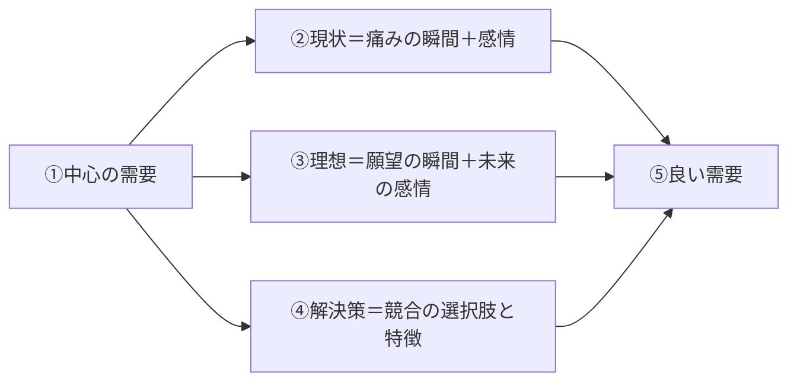

# 第5章　ペルソナ脳内マップ：人の頭の中に憑依する

第4章で、[リサーチ](GLOSSARY.md#リサーチ)を[鳥の目・虫の目・魚の目](GLOSSARY.md#鳥の目虫の目魚の目)の3視点で回し、その情報を[リサーチマップ](GLOSSARY.md#リサーチマップ)という1枚の盤面に集約することを据えた。そして虫の目の最深部（最ミクロ）が「**個別の見込み客の頭の中（脳内）**」であり、他社が浅くしか入らないこの最ミクロに誰よりも深く[憑依](GLOSSARY.md#憑依)することが、情報戦の勝負どころだと述べた（[第4章 3節](04-research-birds-bugs-fish-eye.md#3-虫の目個別の見込み客の頭の中を見る)）。本章は、その最ミクロを実際に降りていく道具＝[ペルソナ脳内マップ](GLOSSARY.md#ペルソナ脳内マップ)を開く。

位置づけを先に固定する。本章は、上流を決める反復ループのStep4＝ペルソナ脳内マップである（[第3章 7節](03-three-questions.md#7-step25は相互に行き来して精度を高める)）。市場全体・需要分布まで含むリサーチマップ（[第4章 6節](04-research-birds-bugs-fish-eye.md#6-リサーチマップマーケティング活動に必要な情報すべて)）の**虫の目枝にぶら下がる、一段ミクロの地図**に当たる。鳥の目で市場全体の当たりをつけたあと、最後に必ずこの1人の脳内まで降りる——その降り方を、再現可能な手順として書くのが本章の目的だ。

本章で獲得するのは7つである。(1) リサーチの最も深い対象は人の脳内であり、需要は最終的に1人の頭の中の感情として存在すると知る、(2) 脳内マップの質を決めるのは「憑依の深さ」だと理解する、(3) ペルソナ脳内マップ＝中心の需要・現状・理想・解決策から良い需要を掘り出す道具として使う、(4) 基本単位を「シーン・瞬間＋感情」のペアで書き、問題解決脳を切って発散する、(5) 自分がペルソナでないときは、4つの目的を持った質問でヒアリングする、(6) n=1の深い仮説を複数人で検証する、(7) 憑依の解像度こそが差別化できる深い情報を生むと締める。下表が、本章で組み立てるペルソナ脳内マップの全体像である。

| 要素 | 中心からの方向 | 書く内容 | 主な節 |
|---|---|---|---|
| ①中心の需要 | 中央 | 広く・[No.1](GLOSSARY.md#no1)を狙え・競合が多すぎないサイズの需要を1つ置く | [3節](#3-ペルソナの脳内で行われている思考を言語化する) |
| ②現状（過去〜現在） | 一方向 | 需要を感じる「瞬間＋感情」（痛み）を発散する | [3節](#3-ペルソナの脳内で行われている思考を言語化する)・[4節](#4-感情が動くシーン瞬間を言語化する) |
| ③理想（未来） | 一方向 | 需要が満たされた「瞬間＋未来の感情」（願望）を発散する | [3節](#3-ペルソナの脳内で行われている思考を言語化する)・[4節](#4-感情が動くシーン瞬間を言語化する) |
| ④解決策 | 一方向 | 既存ソリューション（競合の選択肢）と特徴を網羅する | [3節](#3-ペルソナの脳内で行われている思考を言語化する) |
| ⑤良い需要 | 収束先 | ①〜④を踏まえて掘り当てる、有望な需要の候補（→[第6章](06-blue-demand-target-demand.md)で評価） | [3節](#3-ペルソナの脳内で行われている思考を言語化する)・[7節](#7-憑依の解像度が差別化できる深い情報を生む) |

上表のとおり、ペルソナ脳内マップは1つの需要を中心に据え、現状（痛み）・理想（願望）・解決策（競合）の3方向から脳内を立体的に掘り、最後に「良い需要」へ収束させる道具である。そしてこのマップの価値は、構造の整然さではなく**憑依の解像度**で決まる——これが本章を貫く読み方である。

---

## 1. 最もミクロなのは、人の脳内である

> **要約**：リサーチの対象を高さ・深さ・時間で見たとき、最も深い（最ミクロな）対象は「人の脳内」である。需要は統計や属性の中ではなく、最終的に1人の頭の中の感情として存在する。だから鳥の目で当たりをつけたあと、最後は必ず「この需要を持つ1人の脳内では今、何が起きているか」まで降りる。ペルソナとは、そこに置く具体的な1人である。

**原則**
- リサーチの最も深い（最ミクロな）対象は、市場でも競合でもなく「**人の脳内**」である。[需要](GLOSSARY.md#需要)は、統計・属性・市場規模の中にではなく、最終的に1人の人間の頭の中の[感情](GLOSSARY.md#感情)として存在する。
- だからリサーチは、鳥の目（市場全体）で当たりをつけたあと、必ず「**この需要を持つ1人の脳内では、今、何が起きているか**」まで降りる。抽象的な顧客像で止めない。
- この1人を[ペルソナ](GLOSSARY.md#ペルソナ)と呼ぶ。ペルソナとは、ターゲットの中から抽出した、需要を持つ具体的な1人の人物像である。

**根拠（なぜそうなのか）**
- 需要は脳内の出来事である。需要は〈[欲求](GLOSSARY.md#欲求) × [脳内情報空間](GLOSSARY.md#脳内情報空間)〉で生まれる可変なものだから（[第2章 6節](02-desire-to-demand.md#6-需要は欲求--脳内情報空間で生まれゆえに可変である)）、需要の正体は外形（年齢・職業・年収）ではなく、その人の頭の中にある具体的な「欲しさ」と、それを生む感情だ。外から眺める属性は需要そのものではない。
- 浅い情報は誰でも取れるため、[情報戦](GLOSSARY.md#情報戦)で差がつかない。市場規模（鳥の目）や競合の表面（虫の目の浅部）は、調べれば誰の手にも入る。差別化できる深い需要・痛み・[ベネフィット](GLOSSARY.md#ベネフィット)は、最も深い「1人の脳内」に他社より深く入って初めて出てくる（[第4章 3節](04-research-birds-bugs-fish-eye.md#3-虫の目個別の見込み客の頭の中を見る)）。
- 深さは人数（N）と反比例しがちである。多人数を広く浅くなぞるほど、誰でも書ける一般論しか残らない。だから意図的に1人へ絞り、その1人の脳内を深く掘る（N＝1）。

**使い方（どう適用するか）**
- リサーチの締めくくりとして、必ず「この需要を持つ1人」を選び、その人の脳内を言語化する工程（ペルソナ脳内マップ、[3節](#3-ペルソナの脳内で行われている思考を言語化する)）に降りる。市場規模や競合一覧で「リサーチが終わった」と勘違いしない。
- ペルソナは、属性プロフィール（年齢・職業・家族構成）を埋めた器ではなく、「脳内（思考と感情）」を中身として描く。器だけ作って満足しない。
- **自己判定**：いま自分は、その需要を持つ「1人の頭の中」を一人称で語れるか。「30代・共働き・健康志向」のような外形しか言えないなら、まだ最ミクロに降りていない。

**適用条件**
- 使う場面：需要・痛み・ベネフィットの解像度を上げるとき。[需要ベース](GLOSSARY.md#需要ベース)の非自明な切り口を発見したいとき。
- 使わない場面：市場規模・法規制・トレンドといったマクロ／変化の情報は、鳥の目・魚の目で取る別工程である（[第4章 2節](04-research-birds-bugs-fish-eye.md#2-鳥の目市場全体市場規模stpを見る)・[4節](04-research-birds-bugs-fish-eye.md#4-魚の目時間軸トレンド変化を見る)）。脳内マップは、その当たりをつけた後の最ミクロの深掘りに使う。

**誤用と注意**
- 属性の箇条書き（デモグラフィック・プロフィール）を埋めることを「ペルソナを作った」と取り違えない。本書のペルソナは[需要](GLOSSARY.md#需要)を持つ1人の**脳内**であって、人口統計のラベルではない（[需要ベース](GLOSSARY.md#需要ベース)、人で切るな・需要で切れ）。
- 「最ミクロ＝細かい競合スペックの比較」と誤解しない。最ミクロの本丸は競合の仕様ではなく、その人の頭の中で起きている思考と感情である。

**関連**
- 用語：[ペルソナ](GLOSSARY.md#ペルソナ) / [ペルソナ脳内マップ](GLOSSARY.md#ペルソナ脳内マップ) / [需要](GLOSSARY.md#需要) / [憑依](GLOSSARY.md#憑依)
- 章節：[第4章 3節](04-research-birds-bugs-fish-eye.md#3-虫の目個別の見込み客の頭の中を見る)（虫の目の最深部＝人の頭の中）/ [第2章 6節](02-desire-to-demand.md#6-需要は欲求--脳内情報空間で生まれゆえに可変である)（需要は脳内で生まれる）/ [3節](#3-ペルソナの脳内で行われている思考を言語化する)（脳内を言語化する道具）

---

## 2. 表面的な客観的予想ではなく、日常に入り込む

> **要約**：脳内マップの質を決める最大の要素は「憑依の深さ」である。外から「こう思うだろう」と客観的に予想する（浅い・誰でも書ける）のではなく、そのペルソナの日常に入り込み「本当にそう思うのか」というレベルまで自分ごととして入る（深い・差別化できる）。出した一文ごとに「本当に自分（＝ペルソナ）はそう思うか」と検算する。

**原則**
- ペルソナ脳内マップの質を決める最大の要素は、[憑依](GLOSSARY.md#憑依)の深さである。憑依とは、マーケターの脳とペルソナの脳を完全に重ね、その人として考え感じることである。
- 浅い憑依（客観的・俯瞰的に「こう思うだろう」と外から予想する）と、深い憑依（その日常に入り込み「本当にそう思うのか」まで自分ごととして入る）は、得られる情報の次元が違う。狙うのは常に後者である。

**根拠（なぜそうなのか）**
- 浅い俯瞰的予想は、誰でも書ける。「持っていると自慢できて嬉しい」程度の予想は、その商品を売りたい人なら誰もが同じ言葉に行き着く。誰でも書ける情報からは、差別化された[供給](GLOSSARY.md#供給)は生まれない（[第4章 3節](04-research-birds-bugs-fish-eye.md#3-虫の目個別の見込み客の頭の中を見る)）。
- 深い憑依に入って初めて、本人固有の言葉が出る。「2つの円が外から眺める想像ではなく、同心円状にぴたりと重なる」状態まで入ると、本人すら言語化していなかった感情・痛みが言葉になる。これが差別化情報の正体だ。
- 売り手目線は、憑依を浅くする最大の敵である。「自分ならこう買うかな」と考え始めた瞬間、視点は買い手から売り手へ滑り、見込み客の本当の感覚が見えなくなる（売り手に回ると買い手目線を失う）。

**使い方（どう適用するか）**
- 書き始める前に、立場を「企画者（売り手）」から「ペルソナ本人（買い手）」へ意識的に切り替える。「自分がこの需要を持つ本人だったら」と立場を移す。
- 出した一文ごとに「**本当に自分（＝ペルソナ）はそう思うのか**」と検算する。誰でも書ける一般論で止まっていないかを、一文単位で疑う。
- 「自分ならこう買うかな」という言い回しが頭に浮かんだら、売り手目線に堕ちた危険信号として手を止める。あくまで「そのペルソナとして本当にそう感じるか」まで戻す。
- **自己判定**：いま書いた脳内の一文は、「その商品を売りたい誰もが思いつく言葉」か、それとも「本人の口からしか出ない固有の言葉」か。前者なら、まだ憑依が浅い。

**適用条件**
- 使う場面：ペルソナ脳内マップを書く全工程（現状・理想・解決策のすべて）。憑依は道具ではなく、マップ全体の前提となる姿勢である。
- 接続：自分がそのペルソナに憑依できないとき（属性・生活・価値観が自分と違うとき）は、想像で押し切らず、ヒアリングに切り替える（[5節](#5-質問は需要痛みベネフィット選ぶ基準を探るためにする)）。

**誤用と注意**
- 憑依を「感情移入」や「なんとなくの想像」と混同しない。憑依は、一文ごとに本人として検算する厳密な作業であって、ふわっとした共感ではない。
- 浅い予想を大量に並べて「たくさん書けた」と満足しない。量ではなく、本人固有の言葉に届いた深さが価値である。

**具体例**
- [AirPods](GLOSSARY.md#憑依) Proを実際に買った人の頭の中は、浅く想像すると「持っていると自慢できて嬉しい」で止まる——これは誰でも書ける。深く憑依すると、「ケースのカチャカチャという感触にハイテク感を覚える」「音質だけなら他社に劣るかもしれないが、付けた瞬間に環境が切り替わる体験は圧倒的で、これを選ぶ自分はセンスがいい」といった本人固有の言葉が出てくる。前者からは差別化された供給は生まれないが、後者からは「体験の切り替わり」という切り口が見える（詳細は[第4章 3節](04-research-birds-bugs-fish-eye.md#3-虫の目個別の見込み客の頭の中を見る)）。憑依の深さが、使える発見を生む。

**関連**
- 用語：[憑依](GLOSSARY.md#憑依) / [ペルソナ](GLOSSARY.md#ペルソナ) / [感情](GLOSSARY.md#感情)
- 章節：[第4章 3節](04-research-birds-bugs-fish-eye.md#3-虫の目個別の見込み客の頭の中を見る)（浅い想像と深い憑依の差）/ [第4章 1節](04-research-birds-bugs-fish-eye.md#1-リサーチには情報収集と憑依による想像が含まれる)（憑依による想像）/ [5節](#5-質問は需要痛みベネフィット選ぶ基準を探るためにする)（憑依できないときはヒアリング）

---

## 3. ペルソナの脳内で行われている思考を言語化する

> **要約**：ペルソナ脳内マップとは、ペルソナの脳内で行われている思考と感情が動く瞬間を洗い出し言語化したものである。中心に「需要」を1つ据え、現状（過去〜現在の痛み）・理想（未来の願望）・解決策（競合の選択肢）の3方向へ発散し、現実と理想のギャップに架かる「良い需要」を掘り出す。需要は現状の痛みと理想の願望のギャップを埋めたい欲求の具体形だから、両端を出さないと需要は立たない。

**原則**
- [ペルソナ脳内マップ](GLOSSARY.md#ペルソナ脳内マップ)とは、ペルソナの脳内で行われている「思考」と「感情が動く瞬間」を洗い出し言語化したものである。中心に[需要](GLOSSARY.md#需要)を据えた、放射状のマインドマップで描く。
- マップは、中心の需要から3方向へ発散し、最後に1点へ収束する。下記の構造を持つ。
  - **①中心の需要**：マップの中心に置く、当たりをつけた需要を1つ。広く・[No.1](GLOSSARY.md#no1)を狙え・競合が多すぎないサイズで置く（例「良い昼寝ができる商品が欲しい」）。
  - **②現状（過去〜現在）**：その需要を感じる「瞬間＋感情」を発散する。＝今ある痛み。
  - **③理想（未来）**：その需要が満たされた「瞬間＋未来の感情」を発散する。＝得たい願望。
  - **④解決策**：その需要でペルソナの選択肢に入りうる既存ソリューション（競合）と、その特徴を網羅する。
  - **⑤良い需要**：①〜④を踏まえて掘り当てる、有望な需要の候補。これが本マップの出口である。
- 思考の順路は、〈①中心 → ②③④（発散）→ ⑤（収束）〉である。

上図のとおり、1つの中心の需要から現状・理想・解決策の3方向へ発散し、その3つを突き合わせて「良い需要」へ収束させる。発散（②③④）と収束（⑤）は別の局面である。

**根拠（なぜそうなのか）**
- 需要とは、「現状の痛み」と「理想の姿」のあいだのギャップを埋めたいという欲求の具体形である。だから現状（過去・現在の不満）と理想（未来の願望）の両端を脳内から大量に出すと、その両者を最短で結ぶ穴＝まだ満たされていない**良い需要**が見えてくる。片端だけでは需要は立たない。
- 感情が昂ぶる瞬間には、需要・ベネフィットの核が詰まっている。脳内で感情が最も強く積み上がったシーンこそ、痛みや願望が強い＝需要としての価値が高い場所である。だから平地（どうでもいい日常）ではなく、感情の山の頂を探す。
- 解決策（競合）を棚卸しすると、「どの解決策も満たせていない隙間」が見える。その隙間が、⑤良い需要の最大のヒントになる。供給が簡単な需要はすでに満たされているから（[第3章 2節](03-three-questions.md#2-どのような供給を提案するか)）、競合の網羅は「まだ空いている場所」を逆算で炙り出す作業でもある。

**使い方（どう適用するか）**
- マップは一気に作らず、要素ごとに積み上げる。まず**①中心の需要**を短時間で当たりをつけ（広い需要を1つ置く）、次に**②現状 → ③理想 → ④解決策**をそれぞれじっくり発散し、最後に**⑤良い需要**へ収束させる。
- ①中心の需要は、鳥の目（[第4章 2節](04-research-birds-bugs-fish-eye.md#2-鳥の目市場全体市場規模stpを見る)）で市場の当たりがついているほど正確に置ける。広すぎて誰でもNo.1を狙えない需要も、細かすぎて人がいない需要も避け、「広く・No.1を狙え・競合が多すぎない」サイズに置く。
- ②③（現状・理想）の発散では、「瞬間＋感情」をセットで書き、問題解決脳を切る（具体手順は[4節](#4-感情が動くシーン瞬間を言語化する)）。④（解決策）では逆に、感情ではなく事実ベースで競合と特徴を整理する。
- ⑤良い需要は、このマップでは「候補」にとどまる。最終的な狙う需要の確定は、複数の青い需要を[4つのゲート](GLOSSARY.md#4つのゲート)で評価する収束工程（[第6章](06-blue-demand-target-demand.md)）で行う。マップは候補を生む発散の器、第6章は候補を選ぶ収束、と役割を分ける。
- **自己判定**：マップに現状（痛み）と理想（願望）の両端が埋まっているか。片方しかなければ、良い需要を架けるギャップが見えない。

**適用条件**
- 使う場面：上流の反復ループのStep4。狙う需要を確定する前の、需要候補の発散。
- 使わない場面：狙う需要そのものの最終決定（収束）。それは[第6章](06-blue-demand-target-demand.md)で[青い需要](GLOSSARY.md#青い需要)・4つのゲートを使って行う。マップ上の「良い需要」を確定解と思い込まない。

**誤用と注意**
- きれいなマインドマップを作ること自体を目的化しない。整った図を仕上げても、良い需要の発見に一歩も近づいていなければ、手段の目的化である（[序章 2節](00-prologue.md#2-すべては-business-goal-から逆算する)）。マップは思考の盤面であって提出物ではない。
- 現状・理想のどちらか片方だけで需要を立てない。痛みだけ、あるいは願望だけでは、両者を架ける「良い需要」は掘れない。
- ⑤良い需要を、マップ内で「確定」と思い込まない。それは暫定の候補であり、複数人での検証（[6節](#6-n1の仮説は複数人で検証する)）と4つのゲート（[第6章](06-blue-demand-target-demand.md)）を通って初めて狙う需要になる。

**具体例**
- 中心に「良い昼寝ができる商品が欲しい」という広い需要を置く。現状（痛み）として「午後の会議でどうしても眠くなり、こっそり目を閉じても人目が気になって休まらない瞬間」、理想（願望）として「短時間で頭がすっきり切り替わり、午後の仕事に集中できている瞬間」を発散する。解決策（競合）としてコーヒー・エナジードリンク・仮眠グッズ・昼休みの外出などを棚卸しし、特徴を整理する。これらを突き合わせると、「オフィスで30分間、人目を気にせず昼寝ができる商品が欲しい」という、具体度の高い良い需要の候補へ絞り込まれる。広い需要を瞬間と感情で掘るほど、需要は具体化していく。

**関連**
- 用語：[ペルソナ脳内マップ](GLOSSARY.md#ペルソナ脳内マップ) / [需要](GLOSSARY.md#需要) / [青い需要](GLOSSARY.md#青い需要) / [4つのゲート](GLOSSARY.md#4つのゲート)
- 章節：[4節](#4-感情が動くシーン瞬間を言語化する)（瞬間＋感情の発散）/ [第4章 6節](04-research-birds-bugs-fish-eye.md#6-リサーチマップマーケティング活動に必要な情報すべて)（上位のリサーチマップ）/ [第6章](06-blue-demand-target-demand.md)（良い需要を評価し狙う需要を確定）

---

## 4. 感情が動くシーン・瞬間を言語化する

> **要約**：脳内マップの基本単位は、抽象的な需要ではなく「シーン・瞬間＋その瞬間の感情」のペアである。瞬間だけ・感情だけのブロックは作らない。書くときは問題解決脳を切り、感情ベースで連想を発散する。感情は直接表現できないため、いつ・どこで・何をしている瞬間に・何を感じたか、まで具体化して初めて差別化できる深い情報が出る。

**原則**
- ペルソナ脳内マップの基本単位は、抽象的な需要や感情語ではなく、「**シーン・瞬間 ＋ その瞬間に脳が感じている感情**」のペアである。需要を感じる具体的な瞬間と、その瞬間の感情を必ず組にして書く。瞬間だけ・感情だけのブロックは作らない。
- 現状・理想を発散する工程では、**問題解決脳を切り、感情ベースで連想を発散**する。「どう解決するか」は一旦封印し、脳内に渦巻く生の感情の量と質を出し切る。

**根拠（なぜそうなのか）**
- 感情は直接表現できないため、具体的な[シーン](GLOSSARY.md#シーン)に落とさないと掴めない（[第2章 5節](02-desire-to-demand.md#5-感情は抽象語ではなくシーンで捉える)）。「健康になりたい」のような抽象語は誰でも書けるため、[情報戦](GLOSSARY.md#情報戦)で勝てない。「いつ・どこで・何をしている瞬間に・何を感じたか」まで鮮明にすると、非自明で深い情報＝差別化の源泉が出る。
- 問題解決脳に入ると、思考が解決策へ収束し、感情情報が痩せる。リサーチ段階で必要なのは解決策ではなく、脳内の生の感情である。解決策を考え始めると「どう作るか」に意識が移り、肝心の「本人が何を感じているか」が出てこなくなる。だから発散の段では解決を封じる。
- 感情を伴う具体的な瞬間は、後で[ベネフィット](GLOSSARY.md#ベネフィット)（手に入るポジティブな感情）や正しい痛みへ直結する。抽象語のまま置いた需要は、下流の商品コンセプトやコピーに変換できない。

**使い方（どう適用するか）**
- ブランチを伸ばすときは、常に「瞬間」と「感情」を2点セットで書く。瞬間は、店名・状況・動作・心の声まで描写できるほど良い。「あっ、となっている瞬間」を鮮明にビジュアライズする。
- 1つ目のブランチ（瞬間＋感情）から、連想する感情を次々に枝分かれさせる。マインドマップの運用は、**横方向＝感情の連想連鎖、縦方向＝別の話題**、と使い分ける。ロジック抜きで量を出す。
- 現状（②）では現在のネガティブ寄りの生感情を、理想（③）では未来のポジティブな感情を、別物として塗り分けて出し切る。両者を混ぜない。
- 解決策（④）の検討は、専用工程まで後回しにする。現状・理想を書いている最中に「これをどう解決するか」が浮かんでも、いったん脇に置く。
- **自己判定**：いま書いたブロックは「瞬間」と「感情」の両方を含んでいるか。「健康になりたい」のような抽象語だけ、あるいは「スーパーで」のような瞬間だけになっていないか。

**適用条件**
- 使う場面：現状（②）・理想（③）の発散。感情ベースで脳内を出し切る局面。
- 使わない場面：解決策（④）の整理。ここは感情ではなく、競合とその特徴を事実ベースで網羅する工程である（[3節](#3-ペルソナの脳内で行われている思考を言語化する)）。発散（感情）と棚卸し（事実）を取り違えない。

**誤用と注意**
- 抽象的な感情語（「便利になりたい」「快適がいい」）で止めない。それは誰でも書ける一般論であり、シーンへ落とさなければ需要は掴めない。
- 発散の最中に問題解決脳へ滑り込まない。「こういう商品があれば解決する」と考え始めたら、感情の発散が止まったサインである。
- 言語化の段でニュアンスを削ぎ落とさない。細かく掴んだ感情を、まとめる瞬間に雑な抽象語へ丸めると、せっかくの深さが失われる（[7節](#7-憑依の解像度が差別化できる深い情報を生む)）。

**具体例**
- 「手軽に食べられるご飯が欲しい」という抽象的な需要で止めると、それ以上の切り口は出ない。だが、コンビニ弁当をレジ前で手に取り「これ昨日も食べたな…」と気が重くなる瞬間まで具体化し、その瞬間の頭の中——「体に悪い気がするけど、自炊する気力はない」「せめて野菜が摂れるものがよかった」——を感情ごと書き出すと、本人固有の言葉が出る。ここから掘ると、本当の痛みは「料理がめんどくさい」ではなく「洗い物がめんどくさい」だった、というような非自明な発見に至ることがある。抽象語で止めず、瞬間と感情で掘るほど、深い情報が出る。

**関連**
- 用語：[シーン](GLOSSARY.md#シーン) / [感情](GLOSSARY.md#感情) / [ベネフィット](GLOSSARY.md#ベネフィット)
- 章節：[第2章 5節](02-desire-to-demand.md#5-感情は抽象語ではなくシーンで捉える)（感情はシーンで捉える）/ [3節](#3-ペルソナの脳内で行われている思考を言語化する)（瞬間＋感情を発散するマップの構造）/ [第7章 4節](07-product-planning-map.md)（瞬間の感情がベネフィットになる）

---

## 5. 質問は、需要・痛み・ベネフィット・選ぶ基準を探るためにする

> **要約**：自分がそのペルソナでないとき、自分の主観は当てにならない。想像で結論を出さず、ヒアリングを最優先する。ヒアリングの成否は質問力で決まり、すべての質問は「需要を探す／痛み・ベネフィットを理解する／選択肢を探る／選ぶ基準を探る」のいずれかの目的に紐づける。本人すら言語化していない需要は、具体的なシーンを再現させて初めて出る。

**原則**
- ターゲットが自分自身でない（属性・生活・価値観が自分と違う）とき、[憑依](GLOSSARY.md#憑依)は極めて困難になり、主観で想像するとことごとく外す。そのときの鉄則は「**自分の考えは当てにならない**」と自覚し、想像で結論を出さずヒアリングを最優先することである。
- ヒアリングの成否は質問力で決まる。良い質問とは「感情の解像度が上がる質問」であり、すべての質問は次の4つの目的のいずれかに紐づける。
  - **需要を探す**：何を欲しがっているか。
  - **痛み・ベネフィットを理解する**：何に困り、何が手に入ると嬉しいか。
  - **選択肢を探る**：どんな競合・代替を検討しているか。
  - **選ぶ基準を探る**：何を決め手に選ぶか。

**根拠（なぜそうなのか）**
- 売り手目線・自分の主観で他者の需要を想像すると外す。同一人物でも、売り手の立場では「これは絶対みんな買う」と思い、買い手の立場では「いや、そこじゃない」と細部にこだわる。だから自分がペルソナでないなら、想像ではなく本人の頭の中を直接取りにいくしかない。
- 本人すら言語化していない需要は、具体的なシーンを再現して初めて出る。「困っていることは？」と直接聞いても、本人が自覚していなければ答えは返らない。具体的な一日の行動・瞬間を克明に再現させ、感情が動いた瞬間を捉えて初めて、「言われてみれば確かに面倒だった」という潜在的な需要が掘り起こされる。
- 目的のない質問（ライフスタイル・家族構成・宗教など）は、「わかったような気になるが、あまり何も変わらない」ことが多い。属性を聞くこと自体が目的化すると、需要の手がかりに変換されない情報ばかりが溜まる。

**使い方（どう適用するか）**
- ヒアリングは「**当たりをつける → 感情が動いたシーンを深掘りする**」の順で行う。これはペルソナ脳内マップ（[3節](#3-ペルソナの脳内で行われている思考を言語化する)）を、想像ではなく本人から作る実地版である。
  1. 何にどれくらいお金を使っているか等で、頭の中の全体に当たりをつける。
  2. 興味・欲求が強い領域（お金を使いやすい領域）を特定する。
  3. その領域の具体的な一日・シーンを克明に再現させる。
  4. 感情が動いた瞬間（だるい・嫌だ・嬉しい・おっと思った）を捉える。
  5. その瞬間に何を考えていたかを聞き、需要を抽出する。
- クローズド質問（イエス／ノー）や選択式は避ける。イエス／ノーで答えられることは、ほぼ既にわかっていることであり、本当に知りたい曖昧な部分は引き出せない。具体的なシーンと、そのときの感情・思考を語らせるオープンな質問を組み立てる。
- 本人が「すごく考えて答えた」ときは、何を考えたかを追加で聞く。考えた中に大事な手がかりが含まれる。
- ヒアリングは対面が最善で、最悪でも電話で行う。ペルソナは言語化が苦手な前提に立つ。テキストや選択式は的を外し、それらしい誤答でかえって混乱を招く。
- **自己判定**：いま投げようとしている質問は、需要・痛み・ベネフィット・選ぶ基準のどれを探っているか。どれにも紐づかない質問なら、雑談化している。

**適用条件**
- 使う場面：自分がペルソナでないとき。新しい市場・自分と違う属性のターゲットを相手にするとき。
- 使わない場面の注意：自分がペルソナのときは自己憑依も使えるが、それでも「自分なら買う」が売り手目線に滑る危険は残る（[2節](#2-表面的な客観的予想ではなく日常に入り込む)）。憑依が効く場合でも、過信せず複数人で検証する（[6節](#6-n1の仮説は複数人で検証する)）。

**誤用と注意**
- SNS・表面情報からの推測で需要を確定しない。表面情報からの提案は外れる前提で扱う。
- 憑依しようとして「こういうのなら自分は買うかな」と考え始めたら、売り手目線に堕ちた危険信号である（[2節](#2-表面的な客観的予想ではなく日常に入り込む)）。
- 質問を「相手を理解した気分」になるための雑談にしない。すべての質問は4目的のいずれかに奉仕させる。

**具体例**
- 自分と生活も価値観もまったく違う相手（たとえば世代・性別・暮らし方が大きく異なる人）の需要を、表面情報やSNSから想像して提案すると、ことごとく外れる。こちらが「便利そうだ」と思って差し出すものは「全くいらない」と却下され、逆に本人が本当に欲しがっているもの（生活の小さな不便を埋める地味な品）には、何度ヒントを出されてもこちらが気づけない。これは想像の限界を示す典型である。だからこそ、想像で押し切らず、具体的なシーンを本人に語らせて感情の動いた瞬間を捉える——その質問の質が、需要を当てられるかを決める。

**関連**
- 用語：[ペルソナ](GLOSSARY.md#ペルソナ) / [憑依](GLOSSARY.md#憑依) / [シーン](GLOSSARY.md#シーン) / [需要](GLOSSARY.md#需要)
- 章節：[2節](#2-表面的な客観的予想ではなく日常に入り込む)（憑依できないときの代替がヒアリング）/ [3節](#3-ペルソナの脳内で行われている思考を言語化する)（ヒアリングで脳内マップを作る）/ [6節](#6-n1の仮説は複数人で検証する)（聞き取った仮説を複数人で検証）

---

## 6. n=1の仮説は、複数人で検証する

> **要約**：n=1で深掘りして得た洞察が、その人特有の特殊なものか一般的なものかを判断する絶対基準はない。複数人に同じ質問をぶつけて再現するか確かめるしかない。深さはN=1で取り、再現性は複数人で取る——発散（深さ）と検証（再現性）は別の工程である。

**原則**
- n=1（1人の[ペルソナ](GLOSSARY.md#ペルソナ)を深掘り）して得た洞察が、その人特有の特殊なものか、多くの人に共通する一般的なものかを判断する絶対基準はない。複数人に同じ質問をぶつけて、再現するかどうかで確かめるしかない。
- 深さは1人へ絞って取り（N=1）、再現性は複数人で取る。この2つは別の工程であり、混ぜない。

**根拠（なぜそうなのか）**
- 差別化できる深い情報は、1人へ深く憑依して初めて出る（[1節](#1-最もミクロなのは人の脳内である)）。だが「深い」ことは「代表的」であることを保証しない。深さと代表性は別の軸である。
- 極端に特殊なペルソナを選んでしまうと、その1人からどれだけ深い情報を取っても、一般の需要を外す。今掴んだ洞察が特殊か一般かは、その1人を見ているだけでは原理的に判定できない。判定は、別の人にも同じ問いをぶつける事後検証でしか得られない。
- 確定解は思考の中にはなく、いまの仮説はすべて市場でテストされるまでの[暫定解](GLOSSARY.md#暫定解)である（[終章](13-epilogue.md)）。複数人での検証は、市場テストの手前で仮説の確からしさを上げる工程である。

**使い方（どう適用するか）**
- N=1で深く憑依して仮説（需要・痛み・選ぶ基準）を得たら、別の複数人に**同じ質問**をぶつけ、同じ反応・同じ言葉が再現するかを見る。
- 深掘りの最中に「この人は特殊そうだ」と感じたら、必ずセカンドオピニオン（別の人）を取る。ペルソナを抽出する段階でも、極端に特殊な人を選ばないよう注意する。
- 検証の結果、再現するなら一般的な需要として狙う需要の候補に上げ（[第6章](06-blue-demand-target-demand.md)）、再現しないならその1人特有の特殊解として扱いを分ける。
- **自己判定**：いま狙う需要の根拠にしている深い洞察は、1人だけから出たものか、複数人で再現を確認したものか。1人だけなら、まだ特殊か一般か判定できていない。

**適用条件**
- 使う場面：n=1で得た洞察を、[狙う需要](GLOSSARY.md#狙う需要)（[第6章](06-blue-demand-target-demand.md)）や[商品コンセプト](GLOSSARY.md#商品コンセプト)（[第8章](08-product-concept.md)）へ上げる前の検証。
- 使わない場面の注意：検証を口実に、深掘りそのものを「広く浅く（N=10をなぞる）」へ戻さない。深さはあくまでN=1で取る（[第4章 3節](04-research-birds-bugs-fish-eye.md#3-虫の目個別の見込み客の頭の中を見る)）。検証は、深く取った仮説の再現性を確かめる別工程である。

**誤用と注意**
- n=1の発見を、検証せずに即一般化しない（早すぎる確信）。1人の深い言葉は強い説得力を持つため、特殊解をそのまま全体へ広げてしまいやすい。
- 逆に、検証を理由に深掘りを薄めない。「複数人に当たらないと不安だから広く浅く聞く」は、深さ（差別化情報）と再現性（一般性）の工程を取り違えた失敗である。

**関連**
- 用語：[ペルソナ](GLOSSARY.md#ペルソナ) / [狙う需要](GLOSSARY.md#狙う需要) / [暫定解](GLOSSARY.md#暫定解)
- 章節：[5節](#5-質問は需要痛みベネフィット選ぶ基準を探るためにする)（同じ質問を複数人へ）/ [第4章 3節](04-research-birds-bugs-fish-eye.md#3-虫の目個別の見込み客の頭の中を見る)（深さはN=1で取る）/ [第6章](06-blue-demand-target-demand.md)（検証した需要を狙う需要へ）

---

## 7. 憑依の解像度が、差別化できる深い情報を生む

> **要約**：ペルソナ脳内マップの価値は、構造の整然さではなく憑依の解像度で決まる。解像度が高いほど、他社が到達できない深い需要・痛み・ベネフィットが出て、それが狙う需要・商品コンセプト・コミュニケーションすべての精度を規定する。出力が一般論で止まったら、憑依が浅いと疑い、脳内マップに戻る。

**原則**
- ペルソナ脳内マップの価値は、マインドマップの整然さや見た目ではなく、[憑依](GLOSSARY.md#憑依)の解像度で決まる。解像度が高いほど、他社が到達できない深い[需要](GLOSSARY.md#需要)・痛み・[ベネフィット](GLOSSARY.md#ベネフィット)が出る。
- そこで得た深い情報が、下流すべて——どの需要で[No.1](GLOSSARY.md#no1)を取るか（[狙う需要](GLOSSARY.md#狙う需要)）、どんな[商品コンセプト](GLOSSARY.md#商品コンセプト)にするか、どう[コミュニケーション](GLOSSARY.md#コミュニケーション)するか——の精度を規定する。

**根拠（なぜそうなのか）**
- 浅い情報は誰でも書けるため、[情報戦](GLOSSARY.md#情報戦)で差がつかない。深い情報だけが、非自明な需要軸（[需要ベース](GLOSSARY.md#需要ベース)の切り口）・刺さる商品コンセプト・刺さるコピーの素材になる。差別化は、最後は脳内の解像度の差に還元される。
- 表現（アウトプット）はインプットの関数である（[第4章 7節](04-research-birds-bugs-fish-eye.md#7-表現が出ないのはインプットが足りないからである)）。脳内マップで得た深い情報は、最も濃いインプットだ。だから出力が弱いとき、原因はたいてい思考不足ではなく、憑依の浅さ＝インプットの薄さである。
- 上流のループは往復で精度を上げる（[第3章 7節](03-three-questions.md#7-step25は相互に行き来して精度を高める)）。脳内マップ（Step4）で出た深い一語が、セグメント（Step3）の軸や商品企画（Step5）の訴求を書き換える。だから解像度が高いほど、ループ全体の切れ味が増す。

**使い方（どう適用するか）**
- 出力（需要の切り口・商品コンセプト・コピー）が「その商品を売りたい誰もが思いつく一般論」で止まったら、表現を磨く前に「**憑依が浅い**」と疑い、ペルソナ脳内マップに戻る（[第4章 7節](04-research-birds-bugs-fish-eye.md#7-表現が出ないのはインプットが足りないからである)の、虫の目側からの言い換え）。
- 到達基準は「あったらいいな」ではなく、「**それ、欲しかったやつ**」である。言われた瞬間に複数のペルソナが即共鳴し、作り手の頭の中に「こう言えば絶対に欲しがる」という鮮明な像があるか。なければ、まだ憑依が足りない。
- 解像度を、ビジュアルの綺麗さと取り違えない。整ったマップではなく、本人固有の言葉が出ているかで解像度を測る。
- **自己判定**：いま手にしている需要・痛み・ベネフィットは、本人の口から出る固有の言葉まで降りているか。一般的な言葉のままなら、深さがまだ足りない。

**適用条件**
- 使う場面：上流の出力（狙う需要・商品コンセプト・コピー）が弱いと感じる全局面。詰まりの原因を切り分けるとき。
- 例外なし。出力の弱さは、まず憑依の浅さ＝深い情報の不足を疑うのが本章の既定の構えである。

**誤用と注意**
- 言語化でニュアンスを削ぎ落とさない。せっかく細かく掴んだ需要を、コンセプト化・言語化の瞬間に雑にまとめてニュアンスを殺すと、深さが失われる（[4節](#4-感情が動くシーン瞬間を言語化する)）。言葉は本質を削る前提で、慎重に言語化する。
- 解像度を上げる作業を、いつまでも着手しない言い訳にしない。深掘りは前進だが、最終的には狙う需要を確定し（[第6章](06-blue-demand-target-demand.md)）、市場でテストする（[終章](13-epilogue.md)）。

**具体例**
- 「この製品をどの需要に当てるか、良い切り口が出てこない」と詰まったとする。ここで机上でひねり続けても出ない。手薄なのはたいてい憑依の解像度で、1人の頭の中に深く入った情報が不足している。1人に深くヒアリングして固有の言葉を1つ得るだけで、それまで出なかった切り口が一気に開くことがある（[第4章 7節](04-research-birds-bugs-fish-eye.md#7-表現が出ないのはインプットが足りないからである)）。表現の不足は、思考ではなく深い情報で解く。

**関連**
- 用語：[憑依](GLOSSARY.md#憑依) / [ベネフィット](GLOSSARY.md#ベネフィット) / [狙う需要](GLOSSARY.md#狙う需要) / [商品コンセプト](GLOSSARY.md#商品コンセプト)
- 章節：[第4章 7節](04-research-birds-bugs-fish-eye.md#7-表現が出ないのはインプットが足りないからである)（表現はインプットの関数）/ [第3章 7節](03-three-questions.md#7-step25は相互に行き来して精度を高める)（深い情報がループ全体を書き換える）/ [第6章](06-blue-demand-target-demand.md)（深い情報が狙う需要を生む）/ [第8章](08-product-concept.md)（深い情報が商品コンセプトを生む）
