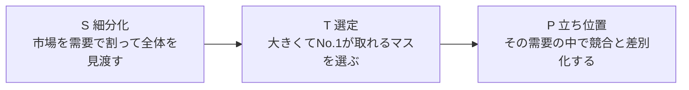

# 第6章　青い需要と狙う需要

第4章で、リサーチは取捨選択せず大量に頭へ入れて「発散」する局面だと据えた（[第4章 5節](04-research-birds-bugs-fish-eye.md#5-情報を頭に大量投入してまず発散する)）。第5章では、その虫の目の最深部である1人の[ペルソナ](GLOSSARY.md#ペルソナ)の頭の中に[憑依](GLOSSARY.md#憑依)し、需要・痛み・[ベネフィット](GLOSSARY.md#ベネフィット)を深く掘った（[第5章](05-persona-mind-map.md)）。本章は、こうして発散しきった情報を、いよいよ「**収束**」させる章である。

収束の問いは1つに定まっている。マーケターの第一の問い、**①どの[需要](GLOSSARY.md#需要)で[No.1](GLOSSARY.md#no1)を取るか（ターゲティング）**（[第3章 1節](03-three-questions.md#1-どの需要でno1を取るか)）に、ここで答えを出す。マーケティングの良し悪しは、需要の切り取りとNo.1の取り方でほぼ決まる（[第3章 4節](03-three-questions.md#4-マーケティングの良し悪しは需要の切り取りとno1の取り方でほぼ決まる)）。本章は、その「需要の切り取り」を意思決定として完了させる工程＝Step3に当たる。

ここで使う道具立ては、たった2つの言葉に集約される。**[青い需要](GLOSSARY.md#青い需要)**（マーケティング的に良い需要）と、その中から「ここで戦う」と決めた**[狙う需要](GLOSSARY.md#狙う需要)**である。本章で獲得するのは次の8つだ。(1) 青い需要の3条件（競合が少ない・人数が多い・[購入意欲額](GLOSSARY.md#購入意欲額)が高い）を知り、需要を価格軸を立てた立体でとらえる、(2) その逆＝[赤い需要](GLOSSARY.md#赤い需要)が、放っておくと皆が流れ込む引力だと理解する、(3) 青い需要とは「大きい[市場](GLOSSARY.md#市場規模)でNo.1が取れる場所」だと掴む、(4) 需要を一段ずつ広げ狭めして確定する、(5)「人で切るな、需要で切れ」という切り方の鉄則を体得する、(6)「[市民プール](GLOSSARY.md#市民プール)で泳ぐな」という凡庸ゾーンの危険信号を持つ、(7) 魚の目で未来に広がるか・赤くならないかを見る、(8) 複数の青い需要から1つを選び取って狙う需要を確定する。

下表が、本章を貫く2つの言葉の関係である。

| 言葉 | 何か | 数 | 役割 |
|---|---|---|---|
| [青い需要](GLOSSARY.md#青い需要) | 3条件を満たす「良い候補」 | 複数あり得る | 戦える場所の候補集合 |
| [狙う需要](GLOSSARY.md#狙う需要) | 候補から「ここで戦う」と決めた需要 | ただ1つ | ターゲティングの最終答え |

上表のとおり、青い需要は「条件を満たす候補（複数あってよい）」、狙う需要は「その中から覚悟を決めて選び取った決定（1つ）」である。両者を混同しないことが本章の出発点になる。そして全工程を貫く切り方の鉄則が、「人で切るな、需要で切れ」（[第3章 5節](03-three-questions.md#5-人ベース媒体ベースではなく需要ベースで切る)・本章[5節](#5-人で切るな需要で切れ)）である。

---

## 1. 青い需要＝競合が少ない・人数が多い・購入意欲額が高い

> **要約**：青い需要とは、①競合が少ない・②人数が多い・③購入意欲額が高い、の3条件を満たすマーケティング的に良い需要である。①が競争性を、②③が市場規模（＝価格 × 人数）を決める。需要は価格軸を立てた立体（円錐）でとらえ、同じ需要でも価格帯によって青か赤かが変わると考える。

**原則**
- [青い需要](GLOSSARY.md#青い需要)とは、マーケティング的に良い需要であり、次の3条件を満たすものである。**①競合が少ない・②人数が多い・③[購入意欲額](GLOSSARY.md#購入意欲額)が高い**。
- この3条件は、①が「その需要で勝てるか（競争性）」を、②③が「その需要がどれだけ大きいか（[市場規模](GLOSSARY.md#市場規模)）」を表す。要約すれば、青い需要とは「**大きい市場でNo.1が取れる場所**」である（[3節](#3-大きい市場でno1が取れるところを探す)）。
- 需要は平面（人数だけ）ではなく、縦軸に価格＝購入意欲額を立てた**立体（円錐）**でとらえる。**市場規模＝購入意欲額（価格）× お金を払う人数**である。
- 同じ需要でも、価格帯によって青にも赤にもなる。青い需要かどうかは、価格軸とセットでしか判定できない。

**根拠（なぜそうなのか）**
- 「良い需要／悪い需要」と言うだけでは曖昧で、判断がブレる。そこでブルーオーシャン／レッドオーシャンになぞらえ、需要を機械的に採点できる3条件に落とす。3条件で採点できると、感覚に頼らず「勝てる場所」を選べる。マーケティングの勝敗の大半はどの需要を選ぶかで決まるから（[第3章 4節](03-three-questions.md#4-マーケティングの良し悪しは需要の切り取りとno1の取り方でほぼ決まる)）、この採点の精度がそのまま事業の精度になる。
- なぜ価格軸（立体）が要るのか。日用品・消耗品のような低価格商品は、価格を上げるほど買う人が減るため、上に向かって細くなる円錐になる。一方で、高級品・ブランド・専門的な療法などは「価格が高いほど欲しい・安いと不安」という、上ほど太い逆円錐型の需要も存在する。平面（人数）だけで見ると、この「価格を動かすと市場の大きさも競合も変わる」という本質を取りこぼす。
- いま見えている市場規模は、「現在の供給側の平均単価で、その立体を水平に切った1枚の断面」にすぎない。価格帯を上下させれば、人数も競合も変わり、別の断面（別の市場）が現れる。だから市場規模は固定値ではなく、価格という自由度を持った立体として発想する必要がある。

**使い方（どう適用するか）**
- 候補の需要を出したら、必ず下表の3条件で「青寄りか／赤寄りか」を採点する。3つが揃うほど純度の高い青、逆ほど純度の高い赤である。

| 条件 | 青い需要 | 赤い需要 | 何を決めるか |
|---|---|---|---|
| ① 競合 | 少ない | 多い | 競争性（No.1を取れるか） |
| ② 人数 | 多い | 少ない | [市場規模](GLOSSARY.md#市場規模) |
| ③ 購入意欲額 | 高い | 低い | 市場規模（価格軸） |

  上表のとおり、①は「勝てるか」、②③は「大きいか」を測る別々の軸である。どれか1つが欠けても純粋な青ではない（[3節](#3-大きい市場でno1が取れるところを探す)で、ここに第4の軸「No.1を取れるか」を重ねる）。
- 需要を1つ書いたら、すぐ「この需要は、いくらまで払えるか（購入意欲額）」の感覚を持つ。人数だけで「大きい／小さい」を判断しない。
- 市場規模を見るときは、「これは現在の平均単価で切った断面にすぎない」と一度疑う。価格帯を上下させて、「この価格帯なら人数も競合も変わるのではないか」「上ほど欲しい逆円錐型ではないか」を立体で探索する。
- **自己判定**：いま見ている需要について、(a) 競合の多寡、(b) お金を払う人数、(c) いくらまで払うか、の3つを一言ずつ言えるか。言えない項目があれば、その需要はまだ採点できる解像度に達していない。

**適用条件**
- 使う場面：リサーチで発散しきった後、需要を選ぶ収束の局面の入口。候補となる需要を採点して仕分けるとき。
- 順序：本節で「青／赤」を採点し、[3節](#3-大きい市場でno1が取れるところを探す)で「No.1が取れるか」を重ね、[4節](#4-需要は一段ずつ広げたり狭めたりして確定する)で解像度を調整し、[8節](#8-狙う需要複数の青い需要の中からここで戦うと決めた需要)で1つに確定する。

**誤用と注意**
- 3条件を価格抜きで採点しない。同じ需要でも価格帯で青↔赤が反転するため、価格軸を欠いた採点は意味をなさない。
- 「人数が多い＝青」と早合点しない。人数が多くても競合だらけ（①が赤）なら、それは赤い需要である。3条件は必ずセットで見る。
- 市場規模を精緻に出すこと自体を目的化しない。狙いは正確な統計ではなく、需要の大きさと発生源の当たりをつけることである（[第4章 2節](04-research-birds-bugs-fish-eye.md#2-鳥の目市場全体市場規模stpを見る)）。曖昧さを残す勇気は、属人的マーケターの強みになる。

**具体例**
- 「痩せたい」という同じ欲求でも、需要のニュアンスを変えると浮かぶ商品も価格帯もまったく変わる。「1,000円未満で手軽に痩せたい」は人数こそ多いが購入意欲額が低く（③が赤）、安いサプリがひしめく（①も赤）。一方「意志が弱くても確実に痩せたい」は、購入意欲額が高く（③が青）、当時その言葉で名乗る競合が薄かった（①が青）。同じ「痩せたい」でも、ニュアンスと価格帯の取り方で青にも赤にもなる。だから粗い需要のまま採点せず、見込み客が頭の中で使う言葉のレベルまで降りてから3条件にかける。

**関連**
- 用語：[青い需要](GLOSSARY.md#青い需要) / [赤い需要](GLOSSARY.md#赤い需要) / [購入意欲額](GLOSSARY.md#購入意欲額) / [市場規模](GLOSSARY.md#市場規模)
- 章節：[2節](#2-赤い需要競合が多い人数が少ない購入意欲額が低い)（対になる赤い需要）/ [3節](#3-大きい市場でno1が取れるところを探す)（大きさ × No.1で見る）/ [第2章 6節](02-desire-to-demand.md#6-需要は欲求--脳内情報空間で生まれゆえに可変である)（需要は頭の中にあり可変）/ [第4章 2節](04-research-birds-bugs-fish-eye.md#2-鳥の目市場全体市場規模stpを見る)（市場規模は鳥の目で当たりをつける）

---

## 2. 赤い需要＝競合が多い・人数が少ない・購入意欲額が低い

> **要約**：赤い需要とは、青い需要の真逆——競合が多い・人数が少ない・購入意欲額が低い、の3条件を持つマーケティング的に悪い需要である。問題は、何もしないと思考は赤い需要に流れ込むことだ。誰でも思いつく需要は、誰もが思いつくがゆえに競合だらけになる。赤かどうかは絶対値ではなく、ニュアンスと価格帯次第で青へ反転しうる相対的な状態である。

**原則**
- [赤い需要](GLOSSARY.md#赤い需要)とは、[青い需要](GLOSSARY.md#青い需要)の真逆であり、**競合が多い・人数が少ない・[購入意欲額](GLOSSARY.md#購入意欲額)が低い**需要である（3条件の詳細は[1節](#1-青い需要競合が少ない人数が多い購入意欲額が高い)の表）。
- 重要なのは次の事実である。**何も意識しないと、思考は自然に赤い需要へ流れ込む**。青い需要は探しにいかなければ見つからないが、赤い需要は放っておいても勝手に手元に集まる。
- 赤い／青いは絶対的なラベルではなく、需要のニュアンスと価格帯によって反転しうる**相対的な状態**である。いま赤い需要も、切り口（軸）を変えれば青くなりうる。

**根拠（なぜそうなのか）**
- 誰でも思いつく需要は、誰もが思いつくがゆえに競合だらけになる（①が赤）。「この製品ならこういう人に、価格はこれぐらいだろう」という安易な発想は、皆が同じ結論に収束するため、相場どおりの価格帯（③が赤）と過密な競合（①が赤）に行き着く。これが赤い需要の引力である（その状態を[市民プール](GLOSSARY.md#市民プール)と呼ぶ、[6節](#6-市民プールで泳ぐな)）。
- 赤が相対的なのは、需要が人の頭の中にあって、ニュアンス一語で無限に細分化されるからである（[第2章 6節](02-desire-to-demand.md#6-需要は欲求--脳内情報空間で生まれゆえに可変である)）。粗い言葉でとらえた需要は競合と被って赤く見えるが、同じ需要を別のニュアンス・別の軸で言い換えると、競合の薄い空白（青）が現れることがある（軸ずらし、[5節](#5-人で切るな需要で切れ)）。価格帯を変えても同じことが起きる（[1節](#1-青い需要競合が少ない人数が多い購入意欲額が高い)）。

**使い方（どう適用するか）**
- 候補の需要が赤いと判定したら、すぐ捨てない。まず「ニュアンスを言い換えれば青くなるか」「価格帯を上下させれば青くなるか」を試す。赤は、青へ変換する前の素材でもある。
- それでも青くならない（どの切り口・価格帯でも競合過密・人数僅少・低単価）なら、その需要は手放す。赤い需要に居続けて差別化に苦しむより、別の青い需要を探すほうが速い。
- **自己判定**：いま手元にある需要は、「最初に思いついた・なんとなく良さそう」で選んでいないか。最初に手に集まる需要は、たいてい赤い。手なりで選んだ需要を疑う。

**適用条件**
- 使う場面：需要を採点し、青へ変換できるか／手放すかを判断するとき。
- 使わない場面：すでに青い需要を確保できているのに、わざわざ赤を磨き直すことに固執しない。赤の救済は手段であって目的ではない。

**誤用と注意**
- 赤い需要を「絶対に避けるべき悪」と硬直的に扱わない。赤は反転しうる相対状態であり、軸ずらし・価格変更で青へ動かせる余地を先に探す。
- 逆に、「いつか青くできるはず」と赤い需要に居座り続けない。十分に試して青くならなければ、その需要は捨てる判断が要る。

**具体例**
- 「オンラインコミュニティを作る」と考えたとき、需要を「無料か／有料・月額いくらか」という**提供形態**で切ると、似たサロンが山ほどいる相場どおりの価格帯（①競合過密・③低単価）に自分から泳ぎに行くことになる。これは典型的な赤い需要であり、「青い需要っぽさを出したいがために作った」結論ありきの選び方だ。提供形態（人・形態）で切るのをやめ、見込み客が本当に解決したい需要（痛み）で切り直すと、競合の薄い空白が見えてくる（[5節](#5-人で切るな需要で切れ)）。

**関連**
- 用語：[赤い需要](GLOSSARY.md#赤い需要) / [青い需要](GLOSSARY.md#青い需要) / [市民プール](GLOSSARY.md#市民プール)
- 章節：[1節](#1-青い需要競合が少ない人数が多い購入意欲額が高い)（対になる青い需要と3条件の表）/ [5節](#5-人で切るな需要で切れ)（軸ずらしで赤を青へ変換）/ [6節](#6-市民プールで泳ぐな)（赤い需要で戦っている状態＝市民プール）

---

## 3. 大きい市場でNo.1が取れるところを探す

> **要約**：青い需要を一言で言えば「大きい市場でNo.1が取れる場所」である。市場の大きさ（②人数 × ③購入意欲額）と、そこでNo.1を取れるか（①競合）を、必ず両方同時に見る。思考はS→T→Pの順——市場を細分化し、大きくてNo.1の取れるマスを選び、最後に立ち位置を決める。表現（ポジショニング）に先走らない。

**原則**
- [青い需要](GLOSSARY.md#青い需要)の核を一言にすると、「**大きい市場で[No.1](GLOSSARY.md#no1)が取れる場所**」である。需要を選ぶときは、(A)[市場](GLOSSARY.md#市場規模)が大きいか、(B)そこでNo.1を取れるか、の2つを**必ず両方同時に**見る。
- 3条件に「No.1を取れるか」を加えた**4軸**で評価する。①競合が少ない・②人数が多い・③購入意欲額が高い・④自分がNo.1を取れる。1つでも欠けたら、その需要はまだ青くない。
- 思考の順序は**S→T→P**である。S（Segmentation＝市場の細分化）→ T（Targeting＝参入する需要の選定）→ P（Positioning＝立ち位置の確定）。この順は不可逆で、Sを飛ばしてTやPに行けない。

**根拠（なぜそうなのか）**
- 大きさとNo.1可能性は、片方だけでは罠になる。大きい市場でもNo.1を取れなければ、巨大競合に埋もれて利益が残らない。逆にNo.1を取れても市場が小さすぎれば、勝っても食えない（[4節](#4-需要は一段ずつ広げたり狭めたりして確定する)）。両方を同時に満たす交点だけが青い。これは[4つのゲート](GLOSSARY.md#4つのゲート)の Sufficient（市場が十分大きいか＝②③）と Right to Win（No.1を取れるか＝①④）に対応する（[序章 4節](00-prologue.md#4-狙う需要は4つのゲートで判定する)）。
- なぜS→Tの順かというと、先に市場を細かく割って全体を見渡さなければ、どのマスが「大きくてNo.1を取れるか」を比較できないからだ。細分化を飛ばして1つの需要に飛びつくと、より良い空白を見ないまま手なりの赤い需要を選ぶことになる。
- なぜPを最後に回すかというと、ポジショニング（立ち位置・表現）は「選んだ需要の中で競合とどう差別化するか」の話であり、戦う需要が決まって初めて意味を持つからだ。需要を決める前に表現から考えると、土俵が定まらないまま見た目だけをいじることになる。

**使い方（どう適用するか）**
- 下図の順に思考を進める。表現（P）に先走りたくなったら、TとSが済んでいるかを確認する。

  上図のとおり、まず需要で市場を細分化し（S、[5節](#5-人で切るな需要で切れ)）、大きくてNo.1の取れる需要を選び（T＝[狙う需要](GLOSSARY.md#狙う需要)の決定、[8節](#8-狙う需要複数の青い需要の中からここで戦うと決めた需要)）、最後にその需要の中での立ち位置を決める（P＝[ポジショニング](GLOSSARY.md#ポジショニング)）。Tで選んだ1マスを拡大すると、その中に競合と自社が同居しており、Pはその中での差別化を指す。
- Tで需要を選ぶときは、口に出して2つ言えるかを確かめる。「この需要は十分大きい（人数 × 単価）」と「この需要なら自分がNo.1を取れる（競合に対して一番だと言える）」。両方言えなければ、まだTの判断材料が足りない。
- No.1が取れないと感じたら、需要を狭めて切り直す。No.1が取れないのは多くの場合、需要が広すぎて競合と被っているからである（[4節](#4-需要は一段ずつ広げたり狭めたりして確定する)・[第3章 1節](03-three-questions.md#1-どの需要でno1を取るか)）。
- **自己判定**：いま選ぼうとしている需要について、「大きさ」と「No.1可能性」を両方、具体的に説明できるか。片方しか語れなければ、その需要選びは半分しか終わっていない。

**適用条件**
- 使う場面：青／赤の採点（[1節](#1-青い需要競合が少ない人数が多い購入意欲額が高い)）を済ませ、候補の中から戦う需要を絞り込む局面。
- 使わない場面：まだリサーチが発散途中で、細分化（S）できるだけの情報が頭にないとき。その場合は[第4章](04-research-birds-bugs-fish-eye.md)に戻ってインプットを増やす。

**誤用と注意**
- 「市場が大きい」だけで選ばない。大きい市場ほど巨大競合がいてNo.1を取りにくい。大きさは必要条件であって十分条件ではない（[8節](#8-狙う需要複数の青い需要の中からここで戦うと決めた需要)：最も大きい青が常に正解とは限らない）。
- ポジショニング（P）やキャッチコピーから考え始めない。表現の先走りは、土俵（需要）が未確定のまま見た目を磨く手段の目的化である（[序章 2節](00-prologue.md#2-すべては-business-goal-から逆算する)）。
- No.1を「市場全体での1位（シェア1位）」と取り違えない。ここでのNo.1は、切り取った特定の需要の中での第一想起である（[No.1](GLOSSARY.md#no1)）。

**具体例**
- ジム市場には、かつて「筋肉をつけるジム」と「エクササイズ・筋トレができるジム」という2極（大きいが競合も強い赤寄りのマス）があった。ある後発は、その中間にあった「意志が弱くても確実に痩せられるジム」という空白を選んだ。ここは購入意欲額が高く（③青）、当時その言葉で名乗る競合が薄く（①青）、かつ「確実に痩せたい」人は十分多い（②青）——大きくてNo.1が取れる青い需要だった。市場全体で1位を狙ったのではなく、細分化した1マスでNo.1を取ったのが要点である。

**関連**
- 用語：[No.1](GLOSSARY.md#no1) / [STP](GLOSSARY.md#stp) / [市場規模](GLOSSARY.md#市場規模) / [4つのゲート](GLOSSARY.md#4つのゲート)
- 章節：[第3章 1節](03-three-questions.md#1-どの需要でno1を取るか)（No.1は需要の切り取りとセット）/ [序章 4節](00-prologue.md#4-狙う需要は4つのゲートで判定する)（Sufficient と Right to Win）/ [4節](#4-需要は一段ずつ広げたり狭めたりして確定する)（広さの調整でNo.1を成立させる）

---

## 4. 需要は一段ずつ広げたり狭めたりして確定する

> **要約**：需要は最初から正しい広さで見つからない。広すぎればNo.1を取れず、狭すぎれば人数がいなくなる。だから一段ずつ広げ狭めして、「No.1が取れて、かつ十分な人数がいる」点まで解像度を上げて確定する。需要が変われば刺さる痛みも変わるため、需要を動かすたびに痛みを定義し直す。

**原則**
- 需要は、最初から「ちょうど良い広さ」で見つかるものではない。**広すぎる需要は[No.1](GLOSSARY.md#no1)を取れず、狭すぎる需要は対象人数がいなくなる**。
- だから需要は、**一段ずつ広げたり狭めたりして**、「**No.1が取れて、かつ十分な人数がいる**」という1点まで解像度を上げて確定する。これがターゲティングの実作業である。
- 需要を動かすと、刺さる**痛み**も変わる。需要を一段動かすたびに、その需要を持つ人の痛みを定義し直す。

**根拠（なぜそうなのか）**
- 需要を広く取りすぎると、その需要を満たそうとする競合も多くなり、自分が一番だと言いきれなくなる（No.1が取れない）。逆に狭く取りすぎると、競合は消えるが、その需要を持つ人数も消える（市場が成立しない）。No.1可能性と人数はトレードオフの関係にあり、両立する帯は最初は見えていない。一段ずつ動かして探り当てるしかない。
- 需要は人の頭の中にあり、言葉のニュアンス（枕詞）一語で無限に細分化される（[第2章 6節](02-desire-to-demand.md#6-需要は欲求--脳内情報空間で生まれゆえに可変である)）。「広げる／狭める」とは、このニュアンスを足したり外したりして、解決策イメージと競合構造を動かす操作である。
- 需要が変われば痛みが変わるのは、需要ごとに「満たされていない状態」が違うからだ。同じカテゴリの商品でも、背後の需要が違えば、刺さる痛みもNo.1の取り方も別物になる。需要を動かしたまま古い痛みを使い回すと、訴求がずれる。

**使い方（どう適用するか）**
- 候補の需要に対して、次の2方向の問いを交互に当てて、最適な広さを探す。
  - **狭める問い**：いまの需要でNo.1を取れないなら、ニュアンス（枕詞）を1つ足して狭める。「誰に対してなら一番だと言いきれるか」。
  - **広げる問い**：いまの需要が狭すぎて人数が足りないなら、ニュアンスを1つ外して広げる。「人数が十分になるまで、どこまで一般化できるか」。
- 需要を一段動かすたびに、「この需要を持つ人は、いま何に困っているか（痛み）」を改めて言語化する。痛みが前の需要のまま固定されていないかを確認する。
- **自己判定**：いまの需要は、「自分がNo.1だと言いきれる」かつ「十分な人数がいる」の両方を同時に満たしているか。片方だけなら、まだ広げ狭めが足りない。

**適用条件**
- 使う場面：青い需要の候補を、戦える解像度まで確定させる局面（[3節](#3-大きい市場でno1が取れるところを探す)の後）。
- 使わない場面：そもそも候補となる需要軸が乏しいとき。広げ狭めは既にある需要の解像度調整であって、軸そのものを生む作業ではない。軸が足りなければリサーチ（[第4章](04-research-birds-bugs-fish-eye.md)）と軸ずらし（[5節](#5-人で切るな需要で切れ)）に戻る。

**誤用と注意**
- 「ニッチに狭める＝市場を小さくする」と取り違えない。狭めるのは人数を捨てるためではなく、No.1を成立させるためである。問題は広さの絶対値ではなく、切り方（[需要ベース](GLOSSARY.md#需要ベース)の軸の取り方）である（[No.1](GLOSSARY.md#no1)）。
- 需要を動かしたのに痛みを更新し忘れない。需要と痛みは連動する。古い痛みを使い回すと、せっかく良い需要を選んでも訴求が空振りする。
- 一度の試行で最適な広さに当てようとしない。広げ狭めは反復で精度を上げる作業であり、Step2〜5の往復（[第3章 7節](03-three-questions.md#7-step25は相互に行き来して精度を高める)）の一部である。

**具体例**
- 「最高のCBDが欲しい」という需要を持つ人の痛みは、「探すのが面倒だ・何が良いか分からない」である。ところが需要を「ゆっくり眠りたい」へ動かすと、痛みは「夜なかなか寝つけない・朝すっきりしない」へ丸ごと入れ替わる。同じ製品でも、当てる需要を一段動かしただけで、刺さる痛みも、競合も、No.1の取り方も別物になる。だから需要を動かすたびに痛みを定義し直す。

**関連**
- 用語：[No.1](GLOSSARY.md#no1) / [需要ベース](GLOSSARY.md#需要ベース) / [青い需要](GLOSSARY.md#青い需要)
- 章節：[3節](#3-大きい市場でno1が取れるところを探す)（大きさ × No.1の交点を探す）/ [第3章 1節](03-three-questions.md#1-どの需要でno1を取るか)（取れないなら広さを絞り直す）/ [第5章](05-persona-mind-map.md)（需要ごとの痛みを憑依で掘る）

---

## 5. 人で切るな、需要で切れ

> **要約**：市場を切る軸は、人（年齢・性別・属性・趣味嗜好）や提供形態・媒体ではなく、需要（「〜したい」という具体的な欲しさ・痛み）で取る。人で切ると皆が同じ発想に収束し、競合過密の凡庸な場所に流れ込む。需要で切ると、ペルソナの気持ちに沿った非自明な空白が見える。既存プレイヤーを需要の言葉で並べ、間の空白と別軸の空白を「軸ずらし」で探す。

**原則**
- 市場を細分化（S）する軸は、**人ではなく需要で取る**。これが本書の鉄則「**人で切るな、需要で切れ**」である（[需要ベース](GLOSSARY.md#需要ベース)、[第3章 5節](03-three-questions.md#5-人ベース媒体ベースではなく需要ベースで切る)）。
- 「人で切る」とは、年齢・性別・属性・趣味嗜好、あるいは「無料／有料」「月額いくら」といった**提供形態**や**媒体**で市場を割ることである。「需要で切る」とは、見込み客の頭の中にある「〜したい」という具体的な欲しさ・痛み・実現したい状態で割ることである。
- 需要を切り出す技法は、**軸ずらし**である。既存プレイヤーが占める需要を言葉で並べ、その**間の空白**と、まったく**別の軸の空白**を探す。

**根拠（なぜそうなのか）**
- 人・属性・提供形態で切ると、「この製品なら、こういう人に、価格はこれぐらいだろう」と皆が同じ発想に収束する。結果、全員が同じ分かりやすい場所＝競合過密の[赤い需要](GLOSSARY.md#赤い需要)（[市民プール](GLOSSARY.md#市民プール)、[6節](#6-市民プールで泳ぐな)）に流れ込む。人ベースの軸は、そもそも「同じ供給に反応する集団」を作れないため、上流の切り口にならない（[需要ベース](GLOSSARY.md#需要ベース)）。
- 需要で切ると、ペルソナの気持ちに沿った非自明な切り口が生まれる。同じ製品でも、当てる需要を変えれば、競合・選択基準・価格・市場規模がすべて変わる。だから需要で切るほど、競合の薄い空白（青）に到達しやすい。
- 軸ずらしが効くのは、需要がニュアンスで無限に細分化されるからである（[第2章 6節](02-desire-to-demand.md#6-需要は欲求--脳内情報空間で生まれゆえに可変である)）。既存プレイヤーが占めていない言い回し・別の軸（確実性・時間の自由度・気軽さなど）は、たいてい空白として残っている。

**使い方（どう適用するか）**
- まず、人で切る誘惑を止める。「30代女性向け」「月額5,000円のサロン」のような切り口が出たら、それは人・形態で切っている危険信号として、需要（痛み・実現したい状態）の言葉へ置き換える。
- 次に、軸ずらしで空白を探す。手順は、(1) 既存プレイヤーを「彼らが満たしている需要の言葉」で横に並べる、(2) その**間**に空白（中間の需要）がないか見る、(3) 既存の軸とは**別の軸**（確実性・時間・気軽さ・シーンなど）を立てて、誰も言っていない空白がないか見る、(4) 見つけた空白を、見込み客が頭の中で使う言葉でニュアンス化し、青い需要の候補として定義する。
- 同じ領域でも、枕詞（シーン・目的・価格・確実性）の組み合わせを変えて、別の需要に言い換える練習をする。「仕事中に食べたいのか／家でか」「効果重視か／手軽さ重視か」のように、軸を増やすほど切り口が増える。
- **自己判定**：いまの切り口は、人（属性）・提供形態・媒体になっていないか。それとも「〜したい・〜に困っている」という需要の言葉になっているか。前者なら、需要の言葉へ翻訳し直す。

**適用条件**
- 使う場面：市場を細分化（S）し、青い需要の候補を生み出す局面。赤い需要を青へ変換したいとき（[2節](#2-赤い需要競合が多い人数が少ない購入意欲額が低い)）。
- 例外：人・媒体の軸が一切不要なわけではない。それらは「どの媒体に・誰に届けるか」という後段の[コミュニケーションファネル](GLOSSARY.md#コミュニケーションファネル)（[第11章](11-lp-communication-funnel.md)）で使う。上流の需要選定では使わない、という使い分けである（[需要ベース](GLOSSARY.md#需要ベース)）。

**誤用と注意**
- 人で切った結果に「需要っぽい言葉」を後付けしない。「30代女性が、自分らしくいたい需要」のような切り方は、実体は人で切っており、需要で切れていない。痛み・実現したい状態という具体に降りる。
- 軸ずらしを「奇をてらった言い換え」にしない。空白は、見込み客が実際に欲しているのに誰も名乗っていない場所でなければ意味がない。誰も欲していない空白を取っても、人数（②）がいない。
- 提供形態（無料／有料・月額）で切るのを需要だと思い込まない。形態は供給側の都合であって、見込み客の欲しさ（需要）ではない（[2節](#2-赤い需要競合が多い人数が少ない購入意欲額が低い)の具体例）。

**具体例**
- 「出会い」という大きな需要は、人（年齢・性別）で切ると皆が同じ層を奪い合う赤い場所になる。だが需要（軸）で切ると、「真剣に結婚相手を探したい」「気軽に話せる相手が欲しい」「趣味の合う人と出会いたい」など別々の青い空白が現れ、各サービスが異なる需要を取っている。人で切れば1つの混雑、需要で切れば複数の空白——同じ市場が、切る軸でまったく違って見える。

**関連**
- 用語：[需要ベース](GLOSSARY.md#需要ベース) / [青い需要](GLOSSARY.md#青い需要) / [市民プール](GLOSSARY.md#市民プール)
- 章節：[第3章 5節](03-three-questions.md#5-人ベース媒体ベースではなく需要ベースで切る)（需要ベースの原則）/ [2節](#2-赤い需要競合が多い人数が少ない購入意欲額が低い)（軸ずらしで赤を青へ）/ [6節](#6-市民プールで泳ぐな)（人で切ると市民プールへ流れる）/ [第11章](11-lp-communication-funnel.md)（人・媒体の軸はファネルで使う）

---

## 6. 市民プールで泳ぐな

> **要約**：市民プールとは、需要を安易・曖昧に選んだ結果、競合がひしめき差別化できない凡庸なポジション（＝赤い需要で戦う状態）の比喩である。相場どおりの価格・提供形態、ふわっとしたポジショニング、「なんとなく良さそう」で選んだ需要は、すべて市民プールの危険信号。複数の切り口を出し切った中から、ポジショニングが明確に立つ需要を選ぶ。

**原則**
- [市民プール](GLOSSARY.md#市民プール)とは、需要を安易・曖昧に選んだ結果、競合がひしめき差別化できない凡庸なポジションの比喩である。これは[赤い需要](GLOSSARY.md#赤い需要)で戦っている状態そのものを指す。
- 鉄則は「**市民プールで泳ぐな**」。誰でも入れる混んだ場所を避け、自分が[No.1](GLOSSARY.md#no1)を取れる[青い需要](GLOSSARY.md#青い需要)を選べ、という戒めである。
- 市民プールに泳ぎ込んでいるかは、いくつかの危険信号で診断できる。

**根拠（なぜそうなのか）**
- なぜ人は市民プールに流れ込むのか。本来は情報を大量に集めて切り口を出し切るべき局面で、「アイデアありき・結論ありき」で需要を選ぶと、思考が止まり、検証ではなく追認になる。人・提供形態で安易に切る（[5節](#5-人で切るな需要で切れ)）と、皆が同じ分かりやすい場所に収束するため、競合過密で差別化できない凡庸ゾーンに行き着く。
- 「市民プール」という比喩が効くのは、それが「誰でも入れて、いつも混んでいる場所」だからだ。入りやすさ（思いつきやすさ）と、勝ちやすさ（No.1の取りやすさ）は反比例する。入りやすい需要ほど競合だらけで、勝てない。

**使い方（どう適用するか）**
- 需要を選んだら、下表の危険信号で「市民プールで泳いでいないか」を点検する。

| 危険信号 | 何を意味するか |
|---|---|
| 価格・提供形態が業界の相場どおり | 供給側の都合で切っており、差別化できていない（③が赤） |
| ポジショニングがふわっとしている | 需要が曖昧で、No.1の旗を立てられていない |
| 「なんとなく良さそう」で選んだ | 切り口を出し切らず、手なりで赤い需要を選んでいる |
| 最初に思いついた1案に飛びついた | アイデアありき・結論ありきで、検証が追認になっている |

  上表のいずれかに当たったら、市民プールの疑いがある。その場で需要を切り直す。
- 対処は1つ。**複数の切り口・セグメントを出し切った中から、ポジショニングが明確に立つ需要を選ぶ**。1案で決めず、軸ずらし（[5節](#5-人で切るな需要で切れ)）で空白を複数出してから比較する。
- **自己判定**：いまの需要は、「ここなら一番だと言いきれる旗」が立っているか。それとも「悪くはないが、なぜここなのか」をうまく説明できないか。後者なら市民プールである。

**適用条件**
- 使う場面：青い需要を選んだ後、確定（[8節](#8-狙う需要複数の青い需要の中からここで戦うと決めた需要)）の前に最終点検するとき。CMOワークなど、需要選定の質を診断するすべての局面。
- 例外なし。需要を選んだら、必ず市民プール点検を通す。

**誤用と注意**
- 「ニッチで尖っていれば市民プールではない」と早合点しない。尖っていても人数（②）がいなければ、それは青い需要ではなく、ただの過疎地である（[4節](#4-需要は一段ずつ広げたり狭めたりして確定する)）。市民プールの反対は「過疎地」ではなく「青い需要（大きくてNo.1が取れる）」である。
- 「相場どおりの価格」をすべて悪と決めつけない。相場どおりは「差別化できていない兆候」であって、それ自体が罪ではない。問題は、価格・形態に差がないのに需要でも差を作れていないことだ。

**具体例**
- 「有料オンラインコミュニティ（月額5,000円）」という案は、市民プールの典型である。需要を「無料／有料」という提供形態で切り（人・形態で切っている、[5節](#5-人で切るな需要で切れ)）、似たサロンが山ほどいる相場どおりの価格帯に自分から泳ぎに行き、「一体感」という曖昧なポジショニング（旗が立っていない）で埋没する。「青い需要っぽさを出したいがために作った」結論ありきの選び方——これが、思考停止のまま市民プールに飛び込んだ状態である。

**関連**
- 用語：[市民プール](GLOSSARY.md#市民プール) / [赤い需要](GLOSSARY.md#赤い需要) / [No.1](GLOSSARY.md#no1)
- 章節：[2節](#2-赤い需要競合が多い人数が少ない購入意欲額が低い)（市民プール＝赤い需要で戦う状態）/ [5節](#5-人で切るな需要で切れ)（人で切ると市民プールへ流れる）/ [第12章](12-cmo-work.md)（CMOワークでの需要選定の診断）

---

## 7. 魚の目で、未来に広がるか・未来も赤くならないかを見る

> **要約**：青／赤の3条件は「いま」を切り取った静止画（3次元）にすぎない。そこに時間軸を加えた4次元で需要を見る。問いは2つ——その青い需要は未来に広がるか、そしていまは青くても未来に赤くならないか。今は赤くても巨大競合が崩れて将来青くなる場所、今は小さくても伸びる場所は、先に押さえる。

**原則**
- [青い需要](GLOSSARY.md#青い需要)／[赤い需要](GLOSSARY.md#赤い需要)の3条件は、「**いま**」を切り取った静止画（価格軸を加えた3次元）にすぎない。これに**時間軸を加えた4次元**で需要を見る。これが[魚の目](GLOSSARY.md#鳥の目虫の目魚の目)（[第4章 4節](04-research-birds-bugs-fish-eye.md#4-魚の目時間軸トレンド変化を見る)）の役割である。
- 狙おうとする需要に、必ず次の2つの問いを当てる。**①この需要は未来に向かって広がるか。②いまは青くても、未来に赤くならないか。**
- 「いま」の青／赤だけで決めない。今は赤くても将来青くなる場所、今は小さくても伸びる場所は、先に押さえる判断がありうる。

**根拠（なぜそうなのか）**
- 需要は〈[欲求](GLOSSARY.md#欲求) × [脳内情報空間](GLOSSARY.md#脳内情報空間)〉で生まれる可変なものだから（[第2章 6節](02-desire-to-demand.md#6-需要は欲求--脳内情報空間で生まれゆえに可変である)）、社会の脳内情報空間が動けば、需要の青／赤も動く。静止画で捉えた青は、放っておけば競合が増えて赤くなりうるし、いまの赤も潮目が変われば青くなりうる。
- 変化があるところに新しい需要が生まれ、供給はすぐ追いつかないため、需要と供給のギャップ（＝チャンス）が生じる（[第4章 4節](04-research-birds-bugs-fish-eye.md#4-魚の目時間軸トレンド変化を見る)）。だから「これから広がる需要を先に押さえる」「巨大競合が崩れかけている赤い需要を、青くなる前に取りにいく」という時間軸の判断が、先行者の優位を生む。
- 逆に、いま青いだけで未来を見ないと、参入した瞬間に競合が殺到して赤くなる場所を掴んでしまう。長くNo.1を保つには、需要の将来の色まで読む必要がある。

**使い方（どう適用するか）**
- 候補の青い需要に、時間軸の2問を当てる。
  - **①広がるか**：この需要を持つ人は、これから増えるか減るか。トレンド・人口動態・技術革新・価値観の転換（PESTの推移）が、この需要をどちらに動かすか。
  - **②赤くならないか**：いま競合が薄いのは、参入障壁があるからか、それとも単に誰も気づいていないだけか。後者なら、気づかれた瞬間に競合が殺到して赤くなる。自社にしか守れない理由（[コアコンピタンス](GLOSSARY.md#コアコンピタンス)、[第12章](12-cmo-work.md)）があるか。
- 「今は赤いが将来青い」「今は小さいが伸びる」需要を見つけたら、青くなる前・大きくなる前に先に押さえる選択肢を検討する。
- **自己判定**：選ぼうとする需要について、「3年後、この需要は広がっているか・色は変わっているか」を一言で言えるか。言えなければ、魚の目（時間軸）の検討が抜けている。

**適用条件**
- 使う場面：青い需要を確定する前に、その将来性と持続性を点検するとき。先行投資で未来の青を押さえるか判断するとき。
- 使わない場面：いま確実に存在する需要を淡々と満たせば足りる局面では、過度な未来予測に時間を割かない。魚の目はチャンス（ギャップ）の探索と、選んだ青の持続性チェックに使う（[第4章 4節](04-research-birds-bugs-fish-eye.md#4-魚の目時間軸トレンド変化を見る)）。

**誤用と注意**
- 「変化があるから将来青い」と早合点しない。変化は需要の発生源だが、その未来の需要が3条件と[4つのゲート](GLOSSARY.md#4つのゲート)（[序章 4節](00-prologue.md#4-狙う需要は4つのゲートで判定する)）を通るかは別途判定する。
- 未来予測に賭けすぎて、いまの事業を立ち上げられないほど遠い青を選ばない。時間軸は「いまの青／赤」を補正する視点であって、現在を無視する口実ではない。
- いま青いことに安心しない。守る理由（コアコンピタンス）のない青は、いずれ赤くなる前提で、次の手を用意しておく。

**具体例**
- 「今は競合がゼロだが、トレンド的に今後この需要を持つ人が増える」と読めれば、市場が小さいうちに先に旗を立て、人数が増えたときにNo.1のまま市場ごと拡大できる。逆に「今は競合が崩れかけていて赤いが、2年後にはその競合が退場して青くなる」と読めれば、青くなる前から仕込む価値がある。固有の数値や銘柄ではなく、この「変化 → 需要の色が動く → 先に押さえる」という時間軸の読みが魚の目である。

**関連**
- 用語：[鳥の目・虫の目・魚の目](GLOSSARY.md#鳥の目虫の目魚の目) / [青い需要](GLOSSARY.md#青い需要) / [赤い需要](GLOSSARY.md#赤い需要)
- 章節：[第4章 4節](04-research-birds-bugs-fish-eye.md#4-魚の目時間軸トレンド変化を見る)（魚の目の本論）/ [第2章 6節](02-desire-to-demand.md#6-需要は欲求--脳内情報空間で生まれゆえに可変である)（需要は可変）/ [8節](#8-狙う需要複数の青い需要の中からここで戦うと決めた需要)（将来性を加味して1つを選ぶ）

---

## 8. 狙う需要＝複数の青い需要の中から「ここで戦う」と決めた需要

> **要約**：狙う需要とは、複数ある青い需要の中から「ここで戦う」と覚悟を決めた、ただ1つの需要である。これがマーケターの第一の問い（ターゲティング）の最終答えになる。最も大きい青が常に正解とは限らない——巨大競合に荒らされにくいか、自社のコアコンピタンスが最も活きるかで絞る。狙う需要が決まれば、商品コンセプトとコミュニケーションがそこから逆算で動き出す。

**原則**
- [狙う需要](GLOSSARY.md#狙う需要)とは、複数ある[青い需要](GLOSSARY.md#青い需要)の中から「**ここで戦う**」と覚悟を決めた、**ただ1つの需要**である。これがマーケターの第一の問い（①どの需要で[No.1](GLOSSARY.md#no1)を取るか＝ターゲティング）の最終答えになる。
- 青い需要が「条件を満たす候補（複数あり得る）」なのに対し、狙う需要は「その中から選び取った決定（1つ）」である。この「候補」と「決定」の差が、両者の決定的な違いである。
- **最も大きい青い需要が、常に正解とは限らない**。大きすぎる需要は他社にも見えていて、巨大競合が入ってくる恐れがある。あえて小さい青い需要や、自社の強みが最も活きる需要を選ぶ判断もありうる。

**根拠（なぜそうなのか）**
- なぜ1つに絞るのか。リソースは有限で、複数の需要に分散すると、どの需要でもNo.1を取れなくなる。1つに絞って覚悟を決めることで、そこにリソースを集中投下でき（センターピンにオーバーリソース、[第12章](12-cmo-work.md)）、No.1を取りにいける。
- なぜ最大の青が正解とは限らないのか。大きい需要は誰の目にも魅力的に映るため、巨大競合が参入してNo.1を奪いにくる。一方、自社の[コアコンピタンス](GLOSSARY.md#コアコンピタンス)（その会社でしかできない構造的な強み）が最も活きる需要なら、他社が同じ供給を作れず、長くNo.1を保てる。「大きさ」だけでなく「自社が泳ぎ切れるか（荒らされにくいか・強みが活きるか）」で選ぶ。
- なぜ「需要」を選ぶのであって「人（ターゲットの総数）」を選ぶのではないのか。CMOBANKがターゲティングする対象は、人の属性ではなく頭の中の欲しさ＝需要だからである。一般語の「ターゲット」は人の集合を指し概念が異なるため、混同を避けて「狙う需要」という独自語を立てている。

**使い方（どう適用するか）**
- 複数の青い需要を並べ、次の観点で1つに絞る。
  - **大きさとNo.1可能性**：[3節](#3-大きい市場でno1が取れるところを探す)の4軸（競合・人数・購入意欲額・No.1）。
  - **荒らされにくさ**：最大の青は巨大競合に狙われやすい。守れる理由があるか。
  - **コアコンピタンスとの相性**：自社の構造的な強みが最も活きるのはどの需要か（[第12章](12-cmo-work.md)）。
  - **将来性**：未来に広がるか・赤くならないか（[7節](#7-魚の目で未来に広がるか未来も赤くならないかを見る)）。
- 選び方の順序を飛ばさない。(1) [需要・供給を可視化](GLOSSARY.md#リサーチマップ)して並べる（発散・整理）→ (2) 青い需要を見つける（評価、[1節](#1-青い需要競合が少ない人数が多い購入意欲額が高い)）→ (3) その中から狙う需要を1つ決める（意思決定）。いきなり1つに飛びつかない。
- 狙う需要が決まったら、それを起点に[商品コンセプト](GLOSSARY.md#商品コンセプト)（[第8章](08-product-concept.md)）とコミュニケーション（[第11章](11-lp-communication-funnel.md)）を逆算で設計する。狙う需要は、上流の意思決定の「確定した起点」になる。
- **自己判定**：「なぜ、他の青い需要ではなく、この需要で戦うと決めたのか」を一文で言えるか。言えなければ、まだ覚悟（決定）に達しておらず、候補を眺めているだけである。

**適用条件**
- 使う場面：青い需要を複数確保し、Step3＝ターゲティングを完了させる局面。本章の最終工程。
- 接続：狙う需要は[4つのゲート](GLOSSARY.md#4つのゲート)（[序章 4節](00-prologue.md#4-狙う需要は4つのゲートで判定する)）を通った需要であり、確定後は[商品企画マップ](GLOSSARY.md#商品企画マップ)（[第7章](07-product-planning-map.md)）と[商品コンセプト](GLOSSARY.md#商品コンセプト)（[第8章](08-product-concept.md)）の入力になる。ただしStep2〜5は往復するため、後工程で狙う需要を修正することもある（[第3章 7節](03-three-questions.md#7-step25は相互に行き来して精度を高める)）。

**誤用と注意**
- 「ターゲット（人の総数）」と「狙う需要（頭の中の需要）」を混同しない。選ぶ対象は属性ではなく需要である。人で切る発想に戻らない（[5節](#5-人で切るな需要で切れ)）。
- 最も大きい青を反射的に選ばない。大きさは魅力だが、荒らされやすさと裏表である。自社が泳ぎ切れるかまで見て決める。
- 複数の需要を「どれも捨てがたい」と並列で抱え続けない。絞らないことは、リソースを分散させてどの需要でもNo.1を取れなくする最悪の選択である。覚悟を決めて1つにする。

**具体例**
- 複数の青い需要——「確実に痩せたい」「24時間いつでも通いたい」など——を見つけた後、自社のコアコンピタンスが「短期間で確実に結果を出させる指導力」にあるなら、最大の青ではなく「意志が弱くても確実に痩せたい」を狙う需要に選ぶ判断が合理的になる。その強みが最も活き、他社が同じ供給を作りにくいからだ。狙う需要が決まれば、商品コンセプトもコミュニケーションも、すべてその需要から逆算で立ち上がる。

**関連**
- 用語：[狙う需要](GLOSSARY.md#狙う需要) / [青い需要](GLOSSARY.md#青い需要) / [コアコンピタンス](GLOSSARY.md#コアコンピタンス) / [4つのゲート](GLOSSARY.md#4つのゲート)
- 章節：[3節](#3-大きい市場でno1が取れるところを探す)（大きさ × No.1で青を見つける）/ [7節](#7-魚の目で未来に広がるか未来も赤くならないかを見る)（将来性を加味）/ [第3章 6節](03-three-questions.md#6-上流は狙う需要商品コンセプトコミュニケーションを決める部分である)（上流は狙う需要・商品コンセプト・コミュニケーションを決める）/ [第8章](08-product-concept.md)（狙う需要と製品を結ぶ商品コンセプト）/ [第12章](12-cmo-work.md)（コアコンピタンス起点で狙う需要を選ぶ）
