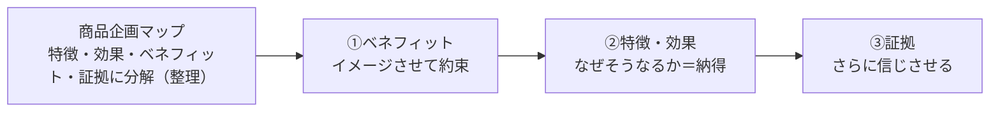

# 第7章　商品企画マップ：特徴・効果・ベネフィット・証拠に分解する

第6章で、私たちはマーケターの第一の問い「①どの[需要](GLOSSARY.md#需要)で[No.1](GLOSSARY.md#no1)を取るか（ターゲティング）」に答えを出し、複数の[青い需要](GLOSSARY.md#青い需要)の中から「ここで戦う」と覚悟を決めた[狙う需要](GLOSSARY.md#狙う需要)を1つに確定させた（[第6章 8節](06-blue-demand-target-demand.md#8-狙う需要複数の青い需要の中からここで戦うと決めた需要)）。土俵は決まった。本章は、その土俵に**手元の製品を持ち込み、価値に翻訳する**工程である。これがマーケターの第二の問い「**②どのような供給を提案するか**」（[第3章 2節](03-three-questions.md#2-どのような供給を提案するか)）に答えるStep4＝商品企画に当たる。

ここで最初に立てる大前提が、本章のタイトルの前半「**[製品](GLOSSARY.md#製品)と[商品](GLOSSARY.md#商品)は違う**」である。作り手は、つい自分が作ったモノ（製品）の優秀さを語りたくなる。だが見込み客が欲しいのは製品そのものではなく、その製品が自分の需要を満たして手に入る**価値**だ。製品を、狙う需要に当てて価値に翻訳して初めて、それは「商品」になる。

その翻訳の作業台が、本章のタイトルの後半「**[商品企画マップ](GLOSSARY.md#商品企画マップ)**」である。商品企画マップは、商品を次の4要素に分解する。

| 要素 | 定義（何か） | 客観/主観 | 読者の関心 |
|---|---|---|---|
| [特徴](GLOSSARY.md#特徴) | 商品が持つ客観的な性質（スペック・形・仕組みの違い） | 客観 | それ自体には興味がない |
| [効果](GLOSSARY.md#効果) | 特徴から起きる客観的な変化・結果 | 客観 | それ自体には興味がない |
| [ベネフィット](GLOSSARY.md#ベネフィット) | 商品を通して手に入るポジティブな感情 | 主観 | **これだけが直接欲しい** |
| [証拠](GLOSSARY.md#証拠) | ベネフィットを信じさせる材料（研究・実績・お客様の声など） | 客観 | それ自体には興味がない |

上表のとおり、4要素のうち見込み客が直接欲しいのは**ベネフィットだけ**である。残る特徴・効果・証拠は、それ自体が欲しいのではなく、すべて「そのベネフィットが本当に手に入る」と**信じさせるための材料**にすぎない。ここから本章の核心ロジックが導かれる——「**特徴があるから買うのではない。ベネフィットが信じられる・納得できるから買う**」（[6節](#6-特徴があるから買うのではない)・[7節](#7-ベネフィットが信じられる納得できるから買う)）。

本章で獲得するのは次の8つだ。(1) 製品と商品の区別、(2)〜(5) 4要素（特徴・効果・ベネフィット・証拠）それぞれの正確な定義と扱い方、(6) 特徴は買う動機ではないという原則、(7) 人はベネフィットの納得で買うという原則、(8) 伝える順序＝ベネフィット → 特徴・効果 → 証拠。本章で分解・整理した4要素は、そのまま[第8章](08-product-concept.md)の[商品コンセプト](GLOSSARY.md#商品コンセプト)（一点への絞り込み）と、[第11章](11-lp-communication-funnel.md)の「約束」（LPの商品説明パート）の入力になる。

---

## 1. 製品と商品は違う

> **要約**：製品とは、作り手の側にある機能・スペック・仕組みそのもの（まだ価値に変換されていないモノ）であり、商品とは、その製品を特定の狙う需要に当て、価値として見込み客に差し出せる形にしたものである。マーケティングは製品を作る工程は含まないが、製品を商品にする工程を含む。だから中身（製品）を変えなくても、当てる需要と見せ方を変えるだけで価値は激変する。商品企画マップは、この「製品 → 商品」の翻訳を行う作業台である。

**原則**
- [製品](GLOSSARY.md#製品)とは、作り手の側にある、機能・スペック・仕組みそのもの（まだ価値に変換されていないモノ）である。[商品](GLOSSARY.md#商品)とは、その製品を特定の[狙う需要](GLOSSARY.md#狙う需要)に当て、**価値として見込み客に差し出せる形にしたもの**である。
- マーケティングは、製品を**作る**工程は含まない。だが製品を**商品にする**工程は含む。商品企画とは、この「製品 → 商品」への翻訳作業である。
- ゆえに、**中身（製品）を変えなくても、当てる需要と見せ方を変えるだけで、価値は激変する**。逆に、優れた製品でも、需要に当てて商品にしなければ価値はゼロのままだ。
- 本章の[商品企画マップ](GLOSSARY.md#商品企画マップ)は、この翻訳の作業台である。製品を[特徴](GLOSSARY.md#特徴)・[効果](GLOSSARY.md#効果)・[ベネフィット](GLOSSARY.md#ベネフィット)・[証拠](GLOSSARY.md#証拠)に分解し、狙う需要に向けて価値へ組み直す。

**根拠（なぜそうなのか）**
- 見込み客が欲しいのは、製品（モノ）そのものではなく、その製品で自分の需要が満たされて手に入る価値である。人は機能ではなく、機能を通じて得られる感情で買う（[第1章 4節](01-business-demand-supply-trade.md#4-購買は機能ではなく感情ベネフィットで起きる)）。だから製品をそのまま差し出しても、買う理由にはならない。
- 同じ製品でも、当てる需要が変われば、競合・選ぶ基準・払う金額・[市場規模](GLOSSARY.md#市場規模)がすべて変わる（[第2章 6節](02-desire-to-demand.md#6-需要は欲求--脳内情報空間で生まれゆえに可変である)・[第6章 1節](06-blue-demand-target-demand.md#1-青い需要競合が少ない人数が多い購入意欲額が高い)）。つまり「どの需要に当てるか」という翻訳のしかたが、製品の中身と同じかそれ以上に、商品の価値を左右する。
- マーケティングが製品製造を含まないのは、原材料を加工してモノを作る工程（R&D・生産）は[供給](GLOSSARY.md#供給)側の別の活動だからだ。マーケティングの担当領域は、その製品を「誰のどの需要に・どんな価値として差し出すか」を設計する翻訳の部分にある。

**使い方（どう適用するか）**
- 製品を前にしたら、まず問いを切り替える。「この製品は何ができるか（製品視点）」ではなく、「**この製品を[狙う需要](GLOSSARY.md#狙う需要)に当てると、どんな価値（商品）になるか**（商品視点）」を問う。
- 製品の改善（中身を良くする）と、商品の改善（当てる需要・見せ方を良くする）を、別々の打ち手として区別する。売れない原因が製品の質なのか、翻訳（商品化）の失敗なのかを切り分ける。多くの場合、ボトルネックは製品ではなく翻訳の側にある。
- 商品企画マップを書くときは、必ず**狙う需要と[ペルソナ](GLOSSARY.md#ペルソナ)を中心に置く**。同じ製品でも、当てるペルソナが変われば、刺さる効果もベネフィットも変わるからだ（[第5章](05-persona-mind-map.md)）。製品名だけを中心に書くと、作り手視点の特徴列挙に戻ってしまう。
- **自己判定**：いま語っているのは「製品（モノが何か）」か、「商品（誰のどの需要に・どんな価値か）」か。前者に偏っていたら、狙う需要に引き戻して価値へ翻訳し直す。

**適用条件**
- 使う場面：狙う需要が確定し（[第6章](06-blue-demand-target-demand.md)）、そこに当てる供給を設計し始める局面。Step4＝商品企画の入口。
- 使わない場面：そもそも狙う需要が未確定のとき。当てる先が決まっていなければ翻訳できない。先に[第6章](06-blue-demand-target-demand.md)でターゲティングを終える。
- 領域外：製品そのものを作る・改良する工程（生産・R&D）は供給側の活動であり、商品企画マップの対象外である。

**誤用と注意**
- 製品の優秀さを語ることを商品企画だと思い込まない。スペックの列挙は製品視点であって、価値への翻訳ではない。
- 「良い製品さえ作れば売れる」という製品起点の思い込みを持たない。製品が同じでも、当てる需要と見せ方しだいで売れも埋もれもする。プロダクトアウトの罠である。
- 商品（価値への翻訳）と[商品コンセプト](GLOSSARY.md#商品コンセプト)（その価値を一点に絞り込んだ核）を混同しない。本章は4要素への分解までを扱い、一点への絞り込み（製品 → 商品コンセプト → 需要の橋）は[第8章](08-product-concept.md)で扱う。

**具体例**
- グミ状のサプリという同じ製品でも、「お菓子」という需要に当てれば、評価軸は美味しさ・食べやすさになり、価格は数百円の世界になる。同じものを「サプリメント」という需要に当てれば、評価軸は効果・継続性に変わり、価格帯は跳ね上がる。中身は1グラムも変えていないのに、当てる需要を変えただけで商品の価値も市場も別物になる。これが「製品は同じでも、商品は需要への翻訳で決まる」ということだ。
- 差のつきにくい製品（例：手数料で横並びになりがちな金融サービス）でも、「ポイントで買える」のような1つの特徴が特定の需要にハマれば、その特徴を核に独自の商品へ翻訳できる。製品の優劣ではなく、需要への当て方が勝敗を分けた例である。

**関連**
- 用語：[製品](GLOSSARY.md#製品) / [商品](GLOSSARY.md#商品) / [商品企画マップ](GLOSSARY.md#商品企画マップ) / [狙う需要](GLOSSARY.md#狙う需要)
- 章節：[第6章 8節](06-blue-demand-target-demand.md#8-狙う需要複数の青い需要の中からここで戦うと決めた需要)（当てる先＝狙う需要の確定）/ [第1章 4節](01-business-demand-supply-trade.md#4-購買は機能ではなく感情ベネフィットで起きる)（人は機能でなく感情で買う）/ [第2章 6節](02-desire-to-demand.md#6-需要は欲求--脳内情報空間で生まれゆえに可変である)（当てる需要で価値が変わる）/ [第8章](08-product-concept.md)（製品 → 商品コンセプト → 需要の橋）

---

## 2. 特徴＝商品が持つ客観的性質

> **要約**：特徴とは、商品が持つ客観的な性質（スペック・形・仕組みの違い）である。誰が見ても同じだと確認できる事実であり、客観的だから証明はしやすい。だが特徴それ自体は買う動機にならない。製品を分解して特徴を洗い出すのは、後でベネフィットへ翻訳し、押す特徴をUSPに絞るための材料を作る作業である。特徴を全部並べてはいけない。

**原則**
- [特徴](GLOSSARY.md#特徴)とは、[商品](GLOSSARY.md#商品)が持つ**客観的な性質**——スペック・形・仕組みの違いである。誰が見ても「確かにそうなっている」と確認できる事実を指す。
- 特徴は商品企画マップの起点（手元の製品から最初に取り出せるもの）だが、**それ自体は買う動機にならない**（[6節](#6-特徴があるから買うのではない)）。特徴は、後で[効果](GLOSSARY.md#効果)・[ベネフィット](GLOSSARY.md#ベネフィット)へ翻訳するための素材である。
- 取り出した特徴を全部並べてはいけない。最終的に押し出す特徴は、[USP](GLOSSARY.md#usp)（独自の売り）として絞り込む（[第8章](08-product-concept.md)）。

**根拠（なぜそうなのか）**
- 特徴が「客観的」だというのは、測れる・確認できる・誰が見ても同じ、という意味である。だから特徴は証明しやすく、議論のブレが少ない。商品企画を特徴から始めるのは、それが手元の製品から最も確実に取り出せる事実だからだ。
- しかし、見込み客の関心は「自分の悩みがどう解決されるか」にあり、商品の内部仕様そのものにはない。だから特徴を提示しただけでは、相手の頭の中で価値（感情）に変換されず、買う理由にならない。特徴は翻訳の出発点であって、到達点ではない。
- 特徴を絞る必要があるのは、要素を増やすほど読み手の負荷が上がり、かえって「何が良いのか」が伝わらなくなるからだ。作り手は「全部すごい」と並べたくなるが、それは作り手都合であって見込み客の心理ではない。

**使い方（どう適用するか）**
- まず、手元の製品を分解して特徴を**洗い出す**（発散）。スペック・素材・仕組み・形状・提供方法など、客観的な違いを残らず書き出す。
- 次に、各特徴を「だから何が起きるか（[効果](GLOSSARY.md#効果)）」「だからどんな感情が手に入るか（[ベネフィット](GLOSSARY.md#ベネフィット)）」へ翻訳できるかを確かめる（[3節](#3-効果特徴から起きる客観的変化)・[4節](#4-ベネフィット商品を通して手に入るポジティブな感情)）。ベネフィットに結びつかない特徴は、押す候補から外す。
- 押し出す特徴は、(1) 競合が簡単にマネできず、(2) 狙う需要（欲）を満たすことに直結する、ものに絞る。理想は[コアコンピタンス](GLOSSARY.md#コアコンピタンス)由来の特徴である（[第8章](08-product-concept.md)・[第12章](12-cmo-work.md)）。
- **「3つの特徴を横並び」を疑う**。未来を実現する機能が1つで足りるなら、その1つだけを見せる。性能・効果のカテゴリだからといって同種の要素を全部並べるのは、作り手都合である（ただし証拠は複数あって信頼を積み増す場合がある、[5節](#5-証拠ベネフィットを信じさせる材料)）。

**適用条件**
- 使う場面：商品企画マップの起点として、製品の客観的性質を棚卸しするとき。
- 使わない場面：見込み客に「何を訴求するか」を決める局面で、特徴を主役に据えてはいけない。訴求の主役は[ベネフィット](GLOSSARY.md#ベネフィット)である（[8節](#8-ベネフィット特徴効果証拠の順で伝える)）。

**誤用と注意**
- 特徴を「だから良い」と言って終わらせない。特徴は効果・ベネフィットへ翻訳して初めて意味を持つ（[6節](#6-特徴があるから買うのではない)）。
- 洗い出した特徴をそのまま全部訴求しない。情報過多で「もういい」となる（[7節](#7-ベネフィットが信じられる納得できるから買う)）。発散で全部出し、訴求では[USP](GLOSSARY.md#usp)に絞る。

**具体例**
- ワイヤレスイヤホンの「ノイズキャンセリング機能」は特徴である。これは仕組みの違いであり、誰が見ても「その機能が付いている」と確認できる。だが「ノイズキャンセリングが付いている」と言うだけでは、まだ買う理由になっていない。それが何を起こし（効果）、どんな感情をもたらすか（ベネフィット）まで翻訳して初めて、価値になる。

**関連**
- 用語：[特徴](GLOSSARY.md#特徴) / [効果](GLOSSARY.md#効果) / [USP](GLOSSARY.md#usp) / [コアコンピタンス](GLOSSARY.md#コアコンピタンス)
- 章節：[3節](#3-効果特徴から起きる客観的変化)（特徴の次＝効果）/ [6節](#6-特徴があるから買うのではない)（特徴は買う動機ではない）/ [第8章](08-product-concept.md)（押す特徴をUSPに絞る）

---

## 3. 効果＝特徴から起きる客観的変化

> **要約**：効果とは、特徴から起きる客観的な変化・結果である。特徴（性質）とベネフィット（感情）のあいだに位置する因果の中間項であり、「その特徴があると、だから何が起きるか」を表す。効果も、それ自体が欲しいのではなく、ベネフィットが手に入る理由を納得させるための材料である。特徴 → 効果 → ベネフィットという因果の鎖でつなぐ。

**原則**
- [効果](GLOSSARY.md#効果)とは、[特徴](GLOSSARY.md#特徴)から起きる**客観的な変化・結果**である。「その特徴があると、だから何が起きるか」を表す。
- 効果は、特徴（客観的な性質）と[ベネフィット](GLOSSARY.md#ベネフィット)（主観的な感情）の**あいだに位置する中間項**である。商品は〈特徴 → 効果 → ベネフィット〉という因果の鎖でつながっている。
- 効果も、それ自体が欲しいわけではない。効果は「**なぜそのベネフィットが手に入るのか**」を説明し、納得させるための材料である。

**根拠（なぜそうなのか）**
- 特徴と感情のあいだには、論理の飛躍がある。「この仕組みがある（特徴）」から「こういう気持ちになれる（ベネフィット）」へいきなり跳ぶと、相手は信じられない。その飛躍を埋める因果の橋が効果だ。「特徴があると → こういう変化が起きて（効果）→ だからこの感情が手に入る（ベネフィット）」とつなぐと、ベネフィットが論理的に裏づけられる。
- 効果が「客観的」なのは、特徴と同じく測れる・確認できるからである。だから効果はベネフィット（主観）を支える証明の役割を担える。効果は、ベネフィットを「納得」させる側の材料に属する。
- それでも効果そのものが目的にならないのは、人が最終的に求めているのが変化や結果ではなく、その先の感情（ベネフィット）だからである（[第1章 4節](01-business-demand-supply-trade.md#4-購買は機能ではなく感情ベネフィットで起きる)）。

**使い方（どう適用するか）**
- 洗い出した各特徴に対して、「**だから何が起きるか**」を一段ずつ言語化し、効果を取り出す。特徴1つに効果が複数ぶら下がることもある。
- さらにその効果から「**だからどんな感情が手に入るか**」を問い、[ベネフィット](GLOSSARY.md#ベネフィット)へ接続する（[4節](#4-ベネフィット商品を通して手に入るポジティブな感情)）。〈特徴 → 効果 → ベネフィット〉の鎖が一本につながるかを確認する。
- 商材特性によって、効果をどこまで前面に出すかは変わる。実用品・医薬品的なものは効果が選択の決め手になりやすく、健康・美容・嗜好品はベネフィット（手に入る感情）の比重が大きい（[6節](#6-特徴があるから買うのではない)）。ただし、効果を主役にする場合でも、最終的に買う理由はベネフィットにあることは変わらない。
- **自己判定**：いま挙げた効果は、ある特徴から因果でつながっているか。そして、その効果はどのベネフィットを支えているか。両端（特徴とベネフィット）に接続できない効果は、鎖から浮いている。

**適用条件**
- 使う場面：特徴をベネフィットへ翻訳する過程で、因果の中間を埋めるとき。ベネフィットの「なぜそうなるか」を用意するとき。
- 使わない場面：効果を、それ単体で訴求の主役に据えない。効果はベネフィットの裏づけとして機能する（[8節](#8-ベネフィット特徴効果証拠の順で伝える)）。

**誤用と注意**
- 効果とベネフィットを混同しない。効果は「客観的に起きる変化」、ベネフィットは「そこから手に入る主観的な感情」である。「時間が30分浮く」は効果、「浮いた時間で好きなことができて生活が楽しい」はベネフィットだ（[4節](#4-ベネフィット商品を通して手に入るポジティブな感情)）。
- 効果を羅列して満足しない。ベネフィットに紐づかない効果の列挙は、読むのが苦痛なだけで動機にならない（[6節](#6-特徴があるから買うのではない)）。

**具体例**
- ワイヤレスイヤホンの「ノイズキャンセリング機能（特徴）」からは、「装着した瞬間に周囲の音が消える（効果）」という客観的変化が起きる。この効果は、「雑音に邪魔されず集中できる安心」「自分だけの静かな空間に入れる心地よさ」というベネフィットを支える理由になる。効果（音が消える）を提示することで、ベネフィット（集中できる安心）が「確かにそうなる」と納得される。

**関連**
- 用語：[効果](GLOSSARY.md#効果) / [特徴](GLOSSARY.md#特徴) / [ベネフィット](GLOSSARY.md#ベネフィット)
- 章節：[2節](#2-特徴商品が持つ客観的性質)（効果の手前＝特徴）/ [4節](#4-ベネフィット商品を通して手に入るポジティブな感情)（効果の先＝ベネフィット）/ [8節](#8-ベネフィット特徴効果証拠の順で伝える)（効果は「なぜそうなるか」として中盤に置く）

---

## 4. ベネフィット＝商品を通して手に入るポジティブな感情

> **要約**：ベネフィットとは、商品を通して手に入るポジティブな感情である。商品企画マップの4要素のうち、見込み客が直接欲しいのはこれだけだ。ベネフィットは感情なので、抽象語のまま並べても伝わらない。必ずシーン（その感情を味わう具体的な瞬間）に変換して想像させる。シーンは複数候補から「最もその感情を欲しいと思わせるか・持ち帰れるか・狙う需要に合うか」で選ぶ。需要と直結し、実現可能性が伴う半歩先のベネフィットにする。

**原則**
- [ベネフィット](GLOSSARY.md#ベネフィット)とは、[商品](GLOSSARY.md#商品)を通して手に入る**ポジティブな感情**である。商品企画マップの4要素のうち、**見込み客が直接欲しいのはベネフィットだけ**である（[特徴](GLOSSARY.md#特徴)・[効果](GLOSSARY.md#効果)・[証拠](GLOSSARY.md#証拠)は、それを信じさせる材料）。
- ベネフィットは感情である。感情は抽象語のまま並べても相手の頭の中で再生されない。だから必ず[シーン](GLOSSARY.md#シーン)——その感情を味わう具体的な瞬間——に変換して想像させる（[第2章 5節](02-desire-to-demand.md#5-感情は抽象語ではなくシーンで捉える)）。
- ベネフィットは、狙う需要と直結し、かつ**実現可能性が伴う半歩先**でなければならない。需要から浮いた、または「そんなにうまくいくはずがない」と思われるベネフィットは、興味を引かない。

**根拠（なぜそうなのか）**
- 人が究極的に求めているのは感情である（[第1章 4節](01-business-demand-supply-trade.md#4-購買は機能ではなく感情ベネフィットで起きる)）。商品が買われるのは、機能のためではなく、機能を通じて得られるプラスの感情＝ベネフィットのためだ。だから4要素の中でベネフィットだけが、直接の購買動機になりうる。
- 感情をシーンに変換するのは、「うれしい」「快適」のような抽象語では、人によって思い浮かべる中身がバラバラで、感情が動かないからだ。時間帯・場所・動作・心の声をともなう具体的な瞬間を描くと、相手の記憶が再生され、その感情を疑似体験できる（[第2章 5節](02-desire-to-demand.md#5-感情は抽象語ではなくシーンで捉える)・[第5章 4節](05-persona-mind-map.md#4-感情が動くシーン瞬間を言語化する)）。
- 実現可能性が要るのは、客観的にうれしいはずのベネフィットでも、「自分には起きないだろう」と思われた瞬間に興味が消えるからだ。遠すぎる未来（非現実的）も、近すぎる月並みも刺さらない。狙うのは、相手が「それなら自分にも起きそう」と信じられる半歩先である（1.5メートル理論、[第10章](10-information-space-content.md)）。

**使い方（どう適用するか）**
- 効果から「だからどんな感情が手に入るか」を問い、ベネフィットを取り出す。取り出したら、それを**シーンに落とす**。「久しぶりに会った友達に痩せたねと言われ、思わず笑顔になる瞬間」のように、感情が立ち上がる具体的な場面を描く。
- シーンの候補が複数あるときは、次の基準で選ぶ。(1) **どれが最もその感情を手に入れたいと思わせるか**、(2) 誰にとっても**想像しやすく持ち帰りやすい**か、(3) **狙う需要・ペルソナに合うか**。ターゲットが違えばシーンも変える（[第5章](05-persona-mind-map.md)）。
- ベネフィットが狙う需要と直結しているかを確認する。需要から浮いたベネフィットを冒頭に置くと、(1) 遠いところから話を引き戻す必要が生じ、(2) 信じられず興味を持たれない。需要に直結し、半歩先で実現可能なベネフィットにする。
- **自己判定**：いま書いたベネフィットは、感情になっているか（効果・特徴の言い換えになっていないか）。そしてそれは、シーンとして頭の中で再生できるか。「○○できる」で止まっていたら、まだ効果であってベネフィットではない。

**適用条件**
- 使う場面：商品企画マップの中心を定め、訴求の主役（何を約束するか）を決めるとき。LPの[ファーストビュー](GLOSSARY.md#ビッグアイデアファーストビューfv)や「約束」「提示」を設計するとき（[第11章](11-lp-communication-funnel.md)）。
- 使わない場面：[事業](GLOSSARY.md#需要)側で「どの需要で戦うか」を選ぶ局面では、ベネフィット（感情）ではなく需要を見る。感情に立ち返るのはコミュニケーションの局面である（[第2章 7節](02-desire-to-demand.md#7-事業では需要を見るコミュニケーションでは欲求に立ち返る)）。

**誤用と注意**
- 効果や特徴をベネフィットと取り違えない。「時短になる」「3種の味がある」は効果・特徴であって、ベネフィットではない。ベネフィットは、そこから手に入る感情（浮いた時間で生活が楽しい、選ぶ楽しみがある）だ。「○○できる」で終わっていたら、感情までもう一段降ろす。
- ベネフィットを抽象語のまま並べない。「快適」「便利」「安心」は、シーンに変換しなければ相手の中で再生されない（[第2章 5節](02-desire-to-demand.md#5-感情は抽象語ではなくシーンで捉える)）。
- 需要と直結しないベネフィットを冒頭に置かない。客観的に魅力的でも、狙う需要から浮いていれば信じられず、興味を引かない。
- ベネフィットを言葉にしすぎてチープ化させない。言われた瞬間に感情・感覚が立ち上がる言葉や、シーンの中の感情描写で表現する。

**具体例**
- 食事のデリバリーサービスで「時間が浮く」「3種類のメニュー」と言うのは、効果と特徴である。見込み客にとって「3種類あること」自体はどうでもいい。ベネフィットは、「家から一歩も出ずに食事が済み、その分テレビを観ながらだらだら過ごせて、休日が丸ごと自分のものになる」という、浮いた時間を味わうシーンの中の感情だ。特徴・効果を、感情の立ち上がるシーンへ翻訳して初めて、ベネフィットになる。

**関連**
- 用語：[ベネフィット](GLOSSARY.md#ベネフィット) / [シーン](GLOSSARY.md#シーン) / [効果](GLOSSARY.md#効果)
- 章節：[第1章 4節](01-business-demand-supply-trade.md#4-購買は機能ではなく感情ベネフィットで起きる)（人は感情で買う）/ [第2章 5節](02-desire-to-demand.md#5-感情は抽象語ではなくシーンで捉える)（感情はシーンで捉える）/ [第5章 4節](05-persona-mind-map.md#4-感情が動くシーン瞬間を言語化する)（憑依でシーンを掘る）/ [5節](#5-証拠ベネフィットを信じさせる材料)（ベネフィットを信じさせる証拠）

---

## 5. 証拠＝ベネフィットを信じさせる材料

> **要約**：証拠とは、ベネフィットを信じさせるための材料（研究・実績・お客様の声など）である。ベネフィットは主観的な約束だから、信じられなければ価値はゼロになる。証拠の良し悪しは客観的な立派さではなく、「ペルソナが主観的に、自分も本当にそうなると思えるか」で決まる。信じさせたいベネフィットに直結する証拠を選ぶ。誰もが出す定型的な証拠は割り引かれるため、ターゲットの経験に紐づく独自な見せ方にし、複数で積み増す。

**原則**
- [証拠](GLOSSARY.md#証拠)とは、[ベネフィット](GLOSSARY.md#ベネフィット)を**信じさせるための材料**——研究・実績・お客様の声・権威・ビフォーアフターなどである。証拠は商品企画マップの必須要素であり、抜けると約束が信じられず、ベネフィットの効力がゼロになる。
- 証拠の良し悪しは、客観的な立派さではなく、「**ペルソナが主観的に、自分も本当にそうなると思えるか**」で決まる。客観的に立派でも、信じさせたいベネフィットに直結しなければ効かない。
- 信じさせたい**ベネフィットに直結する証拠**を選ぶ。証拠は、ベネフィットに対して「なぜそうなるか／本当にそうなる」を裏づける向きで設計する。

**根拠（なぜそうなのか）**
- ベネフィットは「これを使えばこんな感情が手に入る」という**主観的な約束**である。約束は、信じられて初めて買う理由になる（[7節](#7-ベネフィットが信じられる納得できるから買う)）。信じられない約束は、どれほど魅力的でも価値ゼロだ。だから証拠は、あれば良い装飾ではなく、ベネフィットを成立させる必須の対になる。
- 証拠が「客観的な立派さ」で決まらないのは、購買が論理だけでなく感情で起きるからだ。受け手が「これは自分のことだ／自分にも起きる」と主観的に思えなければ、どんなに権威ある証拠も他人事として流される。だから証拠はペルソナの脳内イメージに当てて選ぶ。
- ベネフィットとズレた証拠が効かないのは、証拠が支える対象を間違えているからだ。たとえば「リラックスできる」というベネフィットを信じさせたいのに、「賞を取った」「セレブが使っている」という証拠を出しても、それは「製品がしっかりしている」ことの証明にしかならず、リラックスという感情には直結しない。

**使い方（どう適用するか）**
- まず、信じさせたいベネフィットを1つ定める。次に、その**ベネフィットに直結する証拠**を選ぶ。証拠を選ぶ前に「この証拠は、どのベネフィットを信じさせるためか」を必ず確認する。
- 証拠の強弱を区別する。弱い証拠＝口コミ1人・単なる利用者数。強い証拠＝本当にそう思える実名・権威、ビフォーアフター、効果の機序（仕組み・データ）による裏づけ、そして複数事例。「Aさんがこうなった → Bさんもこうなった」と複数になるほど証拠性は増す。
- 誰もが出している定型的な証拠（ありきたりな「お客様の声」など）は、受け手に信頼として割り引かれる。**ペルソナの経験に紐づく独自な見せ方**にする。証拠は、売る相手（ターゲット）に当てはまるほど強い。主婦向けとビジネスマン向けでは、選ぶ人物・シーンを変える。
- お客様の声には2つの使い道がある。(1) **ベネフィットの疑似体験**を作る（楽しそうな写真でその感情を見せる）、(2) **ベネフィットが手に入る証拠**にする（多数の喜びの声で「本当だ」を作る）。目的に合わせて写真・コメントを選び分ける。
- **自己判定**：いま並べた証拠は、どのベネフィットを支えているか言えるか。そして、それはペルソナが「自分も本当にそうなる」と主観的に思える証拠か。立派なだけでベネフィットからズレた証拠は、差し替える。

**適用条件**
- 使う場面：ベネフィット（[4節](#4-ベネフィット商品を通して手に入るポジティブな感情)）を定めた後、それを信じさせる材料を組むとき。LPの「約束」パート（[第11章](11-lp-communication-funnel.md)）。
- 使わない場面：証拠だけを単体で訴求の主役にしない。証拠はベネフィットに従属する裏づけである。

**誤用と注意**
- 証拠とベネフィットのズレを放置しない。客観的に立派でも、信じさせたい感情に直結しない証拠は効かない（具体例参照）。
- 定型的な証拠で済ませない。「みんな出している証拠」は割り引かれる。ペルソナの経験に紐づく独自な見せ方にする。
- 証拠を「客観的に正しいか」だけで選ばない。判定軸は「ペルソナが主観的に、自分も本当にそうなると思えるか」である。
- 数値・実績・お客様の声を、裏取りのないまま使わない。証拠の取れたものだけを使う（claim safety）。証拠は信頼を作る要素であり、不確かな証拠は逆に信頼を損なう。

**具体例**
- 高級なバスタブで、信じさせたいベネフィットが「一日の終わりに深くリラックスできる」だとする。このとき「海外セレブで話題」「家電大賞を受賞」という証拠を出しても、それは「製品がしっかりしている」ことの証明にしかならず、リラックスという感情にはズレている。むしろ「高級ホテルやスパで採用されている」「入浴中の脳波がどう変化したか」のほうが、リラックスのベネフィットに直結する。ペルソナの脳内イメージと証拠が離れていると効かない——証拠は、信じさせたいベネフィットに当てて選ぶ。

**関連**
- 用語：[証拠](GLOSSARY.md#証拠) / [ベネフィット](GLOSSARY.md#ベネフィット) / [ペルソナ](GLOSSARY.md#ペルソナ)
- 章節：[4節](#4-ベネフィット商品を通して手に入るポジティブな感情)（証拠が支える対象＝ベネフィット）/ [7節](#7-ベネフィットが信じられる納得できるから買う)（信じられて初めて買う）/ [第5章](05-persona-mind-map.md)（ペルソナの脳内イメージに当てて証拠を選ぶ）

---

## 6. 特徴があるから買うのではない

> **要約**：人は、特徴があるから買うのではない。特徴・効果・証拠の3つは、それ自体が欲しいのではなく、すべてベネフィットを信じさせるために存在する材料である。だから特徴を「だから良い」と約束しても動機にならない。特徴は必ずベネフィットに紐づけ、ベネフィットに紐づかない特徴・効果は削る。商材特性で前面に出す要素は変わるが、最終的に買う理由がベネフィットにあることは変わらない。

**原則**
- 人は、**特徴があるから買うのではない**。[特徴](GLOSSARY.md#特徴)・[効果](GLOSSARY.md#効果)・[証拠](GLOSSARY.md#証拠)の3つは、それ自体が欲しいのではなく、すべて[ベネフィット](GLOSSARY.md#ベネフィット)を**信じさせるために存在する材料**である。
- したがって、特徴を「だから良い」と約束しても、買う動機にはならない。特徴・効果は、必ずベネフィットに**紐づけて**提示する。ベネフィットに紐づかない特徴・効果は削る。
- 商材の特性によって前面に出す要素は変わる（実用品・医薬品的なものは効果、横並びになりやすい製品は特徴で比較される、健康・美容・嗜好品はベネフィット）。だが、それでも**最終的に買う理由はベネフィットにある**ことは変わらない。

**根拠（なぜそうなのか）**
- 見込み客の関心は「自分の悩みがどう解決されるか」にあり、商品の内部仕様にはない。人は商品そのものに興味がなく、自分の需要がどう満たされるか（解決策）に興味がある。だから特徴をそのまま差し出しても、相手の頭の中で価値に変換されない。
- 特徴・効果・証拠が「材料」にとどまるのは、それらが客観的な事実であり、感情ではないからだ。人が究極的に求めているのは感情（ベネフィット）である（[第1章 4節](01-business-demand-supply-trade.md#4-購買は機能ではなく感情ベネフィットで起きる)）。客観的事実は、その感情が「本当に手に入る」と信じさせるためにのみ働く。
- 商材特性で前面に出す要素が変わっても結論が変わらないのは、効果や特徴で比較されるカテゴリでも、見込み客が最終的に欲しいのはその先の感情だからだ。効果・特徴は、ベネフィットへの近道として前に出るだけで、目的地ではない。

**使い方（どう適用するか）**
- 特徴・効果を書いたら、必ず「**だから、どんな感情（ベネフィット）が手に入るのか**」を末尾に付ける。この紐づけができない特徴・効果は、訴求から外す。
- 訴求の構成を点検し、「ベネフィットに紐づかない特徴・効果の羅列」になっていないかを確かめる。羅列は読むのが苦痛で、離脱を生む。
- 商材特性に応じて、前面に出す要素（効果中心か、特徴比較か、ベネフィット中心か）を選ぶ。ただしどの場合も、出した特徴・効果は最終的にベネフィットへ着地させる。
- **自己判定**：いまの訴求は、特徴・効果・証拠のどれかが「それ自体が価値だ」という顔で主役になっていないか。主役はベネフィットで、他の3つはその脇役（信じさせる材料）になっているか。

**適用条件**
- 使う場面：商品説明（[第11章](11-lp-communication-funnel.md)の「約束」）の中身を組むとき。何を主役にし、何を脇役にするかを決めるとき。
- 例外なし。どんな商材でも、特徴・効果・証拠はベネフィットを信じさせるための材料という位置づけは変わらない。

**誤用と注意**
- 「特徴を約束する」誤りを犯さない。「AとBが一緒になっています、だから良いです」は、特徴を約束しているだけで、ベネフィットを約束していない。
- ベネフィットに紐づかない特徴・効果を並べない。要素が多いほど良いのではない。伝えなくてよいことを伝える／順番が悪い、はどちらも悪である。
- 商材特性で「効果（または特徴）を前面に」と決めたとき、ベネフィットを省略しない。前面に出す要素が何であれ、買う理由（ベネフィット）への着地は残す。

**具体例**
- サウナ的な温浴施設で「岩盤浴とサウナが一緒になっています、だから良いです」と言っても、見込み客は動かない。これは特徴を約束しているだけだからだ。動くのは、「汗が信じられないほど出て、芯から整う——あの感覚を体験してほしい」というベネフィットを先に約束し、「岩盤浴の遠赤外線が芯から温めるから汗が出る」という特徴・効果を、その理由として後ろに置いたときである。同じ特徴でも、ベネフィットに紐づけて初めて買う動機になる。

**関連**
- 用語：[特徴](GLOSSARY.md#特徴) / [効果](GLOSSARY.md#効果) / [ベネフィット](GLOSSARY.md#ベネフィット)
- 章節：[第1章 4節](01-business-demand-supply-trade.md#4-購買は機能ではなく感情ベネフィットで起きる)（人は感情で買う）/ [7節](#7-ベネフィットが信じられる納得できるから買う)（買う理由はベネフィットの納得）/ [8節](#8-ベネフィット特徴効果証拠の順で伝える)（紐づけは順序として実装する）

---

## 7. ベネフィットが信じられる・納得できるから買う

> **要約**：人は、ベネフィットが信じられる・納得できるから買う。買うかどうかは「そのベネフィットが欲しいか」×「それが本当に自分に手に入ると信じられるか」の掛け算で決まる。欲しいだけでも、信じられるだけでも買わない。両方が揃って初めて買う。だからベネフィットを強烈に描いて欲しくさせ、特徴・効果・証拠で「確かに手に入る」と納得させる。説明は納得まで——しすぎると情報過多で離脱する。

**原則**
- 人は、[ベネフィット](GLOSSARY.md#ベネフィット)が**信じられる・納得できるから買う**。買うかどうかは、「そのベネフィットが**欲しい**か」×「それが本当に自分に**手に入ると信じられる**か」の掛け算で決まる。
- どちらか一方では買わない。欲しくても信じられなければ買わず、信じられても欲しくなければ買わない。**両方が揃って初めて**取引が成立する。
- だから商品企画マップは、欲しくさせる側（ベネフィットを強烈に描く）と、信じさせる側（[特徴](GLOSSARY.md#特徴)・[効果](GLOSSARY.md#効果)・[証拠](GLOSSARY.md#証拠)で納得させる）の両輪で組む。

**根拠（なぜそうなのか）**
- ベネフィットは「これを使えばこんな感情が手に入る」という**未来の約束**である。約束は、相手がそれを信じられて初めて行動につながる。「欲しい」は感情、「信じられる」は感情を裏づける思考——人は最後に、感情と思考の両方が揃った状態（「これは欲しい、しかも本当に手に入る、だから買うしかない」）でYESと言う。
- 信じられなければ買わないのは、購買が損失回避をともなうからだ。お金を払う以上、「期待したベネフィットが手に入らないかもしれない」という不安が伴う。証拠・効果・特徴は、この不安を消し、「自分にも確かに起きる」という確信を作る（[5節](#5-証拠ベネフィットを信じさせる材料)）。
- 説明はしすぎても逆効果になる。ベネフィットを「信じられる／納得できる」レベルまでは説明が要るが、それを超えて情報を盛ると、読み手は「もういい」となって離脱する。納得の手前で足りなければ不信、超えれば情報過多。最適な情報量には幅がある。

**使い方（どう適用するか）**
- ベネフィットを2つの軸で点検する。(1) **欲しいか**——その感情を、相手が強く手に入れたいと思うシーンになっているか（[4節](#4-ベネフィット商品を通して手に入るポジティブな感情)）。(2) **信じられるか**——その感情が本当に手に入ると、特徴・効果・証拠で裏づけられているか（[5節](#5-証拠ベネフィットを信じさせる材料)）。片方しか満たしていなければ、欠けた側を補う。
- ベネフィットは、**実現可能性が伴う半歩先**に置く（[4節](#4-ベネフィット商品を通して手に入るポジティブな感情)）。「絶対にうまくいく」と思えるくらい具体的で、かつ「自分にも起きそう」と思える距離に調整する。遠すぎる（非現実的）と信じられず、近すぎる（月並み）と欲しくならない。
- 説明の情報量を設計する。「どこまで出せばこのペルソナは納得するか」を見極め、納得の閾値まで出して、それ以上は削る。納得に必要な特徴・効果・証拠だけを残す。
- **自己判定**：いまの訴求は、「欲しい（感情）」と「信じられる（納得）」を両方作れているか。欲しいだけで根拠が薄ければ「うますぎる話」に見え、根拠だけで感情が薄ければ「正しいけど欲しくない」になる。

**適用条件**
- 使う場面：商品企画マップを訴求へ落とすとき。LPやセールスで「買う理由」を作るとき（[第9章](09-sales-and-offer.md)・[第11章](11-lp-communication-funnel.md)）。
- 接続：この「欲しい × 信じられる」の掛け算は、セールスで「完璧なオファーでも人は買わない／買う理由を作る」という論点（[第9章](09-sales-and-offer.md)）の土台になる。

**誤用と注意**
- 欲しくさせるだけで満足しない。強烈なベネフィットでも、信じられなければ「うますぎる話」として警戒される。
- 信じさせるだけで満足しない。正確な特徴・効果・証拠を並べても、欲しい感情（ベネフィット）が立ち上がっていなければ、人は動かない。
- 「説明は多いほど親切」と思い込まない。納得の閾値を超えた情報は、情報過多で離脱を生む。納得に必要な分だけ出す。

**具体例**
- ぐっすり眠れて朝すっきり目覚める、という強烈なベネフィットを描いても、「自分の不眠がそんなに簡単に解消するはずがない」と思われた瞬間に、欲しさは行動に変わらない。逆に、睡眠の仕組みや成分の働き（効果）、利用者の変化（証拠）だけを正確に並べても、「ぐっすり眠れた朝の心地よさ」という感情が立ち上がっていなければ、人は買わない。欲しい（ベネフィット）と、信じられる（特徴・効果・証拠）が揃って初めて、「これは欲しいし、本当に手に入る、だから買う」という状態になる。

**関連**
- 用語：[ベネフィット](GLOSSARY.md#ベネフィット) / [証拠](GLOSSARY.md#証拠) / [効果](GLOSSARY.md#効果)
- 章節：[6節](#6-特徴があるから買うのではない)（買う理由はベネフィット）/ [5節](#5-証拠ベネフィットを信じさせる材料)（信じさせる証拠）/ [第9章](09-sales-and-offer.md)（完璧なオファーでも人は買わない／買う理由を作る）

---

## 8. ベネフィット→特徴・効果→証拠の順で伝える

> **要約**：商品企画マップは4要素を分解して整理するものだが、伝えるときには順序がある。まず欲しいと思わせるベネフィットを先頭に置いて約束し（イメージさせる）、次になぜそうなるかを特徴・効果で納得させ、最後に証拠でさらに信じさせる。逆順（特徴から入る）は、興味のない情報の羅列になって離脱を生む。この4要素と順序が、第8章の商品コンセプト（一点絞り）と、第11章の『約束』（商品説明パート）の中身になる。

**原則**
- [商品企画マップ](GLOSSARY.md#商品企画マップ)は4要素を**分解・整理**するものだが、**伝える**ときには順序がある。順序は——**①[ベネフィット](GLOSSARY.md#ベネフィット)（イメージさせて約束）→ ②[特徴](GLOSSARY.md#特徴)・[効果](GLOSSARY.md#効果)（なぜそうなるか＝納得）→ ③[証拠](GLOSSARY.md#証拠)（さらに信じさせる）**——に固定する。
- 先頭は必ずベネフィットである。先に「欲しい」と思わせてから、その根拠（特徴・効果・証拠）を渡す。逆順（特徴から入る）にしてはいけない。
- この4要素と順序が、そのまま[第8章](08-product-concept.md)の[商品コンセプト](GLOSSARY.md#商品コンセプト)（4要素を一点に絞り込む）と、[第11章](11-lp-communication-funnel.md)の「約束」（LPの商品説明パート）の中身になる。

**根拠（なぜそうなのか）**
- 先にベネフィットを置くのは、感情が先・興味は後だからだ。人は「欲しい」という感情が立ち上がって初めて、その根拠（なぜそうなるか）に興味を持つ。欲しさが立つ前に特徴・効果を出すと、相手にとって「興味のない情報」になり、読むのが苦痛になって離脱する。
- 次に特徴・効果を置くのは、立ち上がったベネフィットを「なぜそうなるか」で**納得**させるためだ。欲しいと思った直後に「その感情はこの仕組み（特徴）でこう起きる（効果）」と説明されると、約束が論理的に裏づけられ、信じられるようになる（[7節](#7-ベネフィットが信じられる納得できるから買う)）。
- 最後に証拠を置くのは、論理の納得の上に「自分だけじゃない／本当だ」という**確信**を積むためだ。証拠は、納得をさらに主観的な信頼へ押し上げる（[5節](#5-証拠ベネフィットを信じさせる材料)）。この〈欲しい → 納得 → 確信〉の流れが、人を買う状態へ運ぶ。

**使い方（どう適用するか）**
- 整理（分解）と伝達（順序）を分けて作業する。下図のとおり、まず商品企画マップで4要素を**分解**し、次にそれをベネフィット起点の**順序**に並べ替えて伝える。

  上図のとおり、商品企画マップは4要素を網羅的に書き出す「整理」の作業台であり、伝達はそこからベネフィットを先頭に立てて順序化する。整理（全部書く）と伝達（順序立てて出す）は別の工程である。
- 商品企画マップを書くときは、製品名とペルソナ名を中心に置く（[1節](#1-製品と商品は違う)）。ペルソナによって、得られるベネフィットも効くシーンも変わるからだ。
- 伝達の段では、ベネフィットを先頭に置いてイメージさせ、特徴・効果で「なぜそうなるか」を渡し、証拠で「本当だ」を積む。情報量は納得の閾値まで（[7節](#7-ベネフィットが信じられる納得できるから買う)）。
- **自己判定**：いまの訴求は、ベネフィット（欲しい）から始まっているか。それとも成分・スペック・仕組み（特徴）から入っていないか。特徴から入っていたら、ベネフィットを先頭へ繰り上げる。

**適用条件**
- 使う場面：商品企画マップを訴求・LPへ落とすとき。LPの「約束」パートを構成するとき（[第11章](11-lp-communication-funnel.md)）。
- 接続：本節の順序は、LP全体の流れ「共感 → 教育 → 約束 → 交渉 → 提示」のうち「約束」の内部構造に当たる。教育（需要・欲求の教育）と約束（商品説明＝特徴・効果・証拠）は明確に分離する。人は商品ではなく自分の悩みの解決に興味があるため、需要ができる前に商品説明をしない（[第11章](11-lp-communication-funnel.md)）。
- 注意：LP上の物理的な並び順は、媒体・商材で前後しうる（提示＝未来描写をFV付近に置くなど）。順序は「並びの固定」ではなく「相手の脳内で踏ませる段階」として理解する。

**誤用と注意**
- 特徴・効果・証拠から書き始めない。成分・スペック・仕組みから入るのは、欲しさが立つ前に根拠を出す逆順であり、離脱を生む。
- 整理（分解）と伝達（順序）を混同しない。商品企画マップに4要素を全部書き出すこと（整理）と、それを順序立てて出すこと（伝達）は別である。整理で全部出し、伝達では順序とUSPで絞る（[第8章](08-product-concept.md)）。
- 順序を「固定の並び順」と硬直化させない。物理配置は媒体・商材で前後する。守るべきは「ベネフィットで欲しくさせてから根拠を渡す」という脳内の段階であって、レイアウト上の絶対位置ではない。

**具体例**
- 温浴施設なら、伝える順序はこうなる。①「汗が信じられないほど出て、芯から整う——その感覚を体験してほしい」（ベネフィットをイメージさせて約束）→ ②「岩盤浴の遠赤外線が体の芯から温めるから、それだけの汗が出る」（特徴・効果で、なぜそうなるかを納得させる）→ ③「岩盤浴は全国にファンが多く、体験した人が口々に『過去最高だった』と言う」（証拠でさらに信じさせる）。同じ4要素でも、ベネフィットを先頭に立てて並べ替えるだけで、「欲しい → 納得 → 確信」の流れが生まれる。逆に「岩盤浴とサウナが一緒です（特徴）」から始めると、欲しさが立たないまま情報を浴びせることになり、離脱する。

**関連**
- 用語：[商品企画マップ](GLOSSARY.md#商品企画マップ) / [ベネフィット](GLOSSARY.md#ベネフィット) / [証拠](GLOSSARY.md#証拠)
- 章節：[4節](#4-ベネフィット商品を通して手に入るポジティブな感情)（先頭のベネフィット）/ [6節](#6-特徴があるから買うのではない)・[7節](#7-ベネフィットが信じられる納得できるから買う)（順序の根拠）/ [第8章](08-product-concept.md)（4要素を一点に絞る商品コンセプト）/ [第11章](11-lp-communication-funnel.md)（「約束」パートの内部構造）
