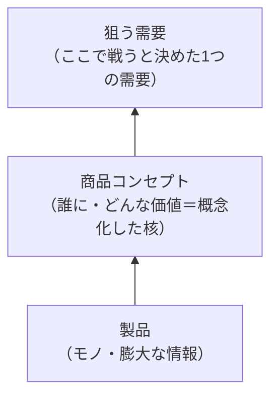
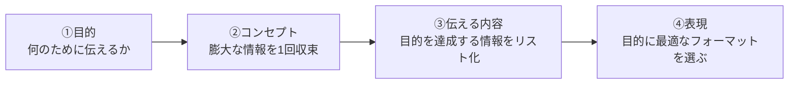

# 第8章　商品コンセプト：狙う需要と製品を結ぶ橋

第6章で、私たちはマーケターの第一の問い「①どの[需要](GLOSSARY.md#需要)で[No.1](GLOSSARY.md#no1)を取るか（ターゲティング）」に答えを出し、複数の[青い需要](GLOSSARY.md#青い需要)の中から「ここで戦う」と覚悟を決めた[狙う需要](GLOSSARY.md#狙う需要)を1つに確定させた（[第6章 8節](06-blue-demand-target-demand.md#8-狙う需要複数の青い需要の中からここで戦うと決めた需要)）。第7章では、その狙う需要に手元の[製品](GLOSSARY.md#製品)を当て、[商品企画マップ](GLOSSARY.md#商品企画マップ)で[特徴](GLOSSARY.md#特徴)・[効果](GLOSSARY.md#効果)・[ベネフィット](GLOSSARY.md#ベネフィット)・[証拠](GLOSSARY.md#証拠)の4要素に**発散**して洗い出した。

本章は、その発散しきった膨大な情報を、**「誰に・どんな価値を提供するか」という一点に絞り込んで概念化する**工程である。これがマーケターの第二の問い「**②どのような供給を提案するか**」（[第3章 2節](03-three-questions.md#2-どのような供給を提案するか)）の核に当たる——第7章が「発散（分解）」なら、本章は「収束（概念化）」だ。

その収束した核が、本章のタイトルの前半「**[商品コンセプト](GLOSSARY.md#商品コンセプト)**」である。そして本章のタイトルの後半「**狙う需要と製品を結ぶ橋**」が、商品コンセプトの正体を言い表している。手元の[製品](GLOSSARY.md#製品)（モノ）と、上流で決めた[狙う需要](GLOSSARY.md#狙う需要)（市場）は、そのままでは結びつかない。両者を「この需要に・この製品を・こういう価値の商品として差し出す」と概念化してつなぐ1本の橋——それが商品コンセプトだ。思考の流れは下から上へ、〈**製品 → 商品コンセプト → 需要**〉である。

上図のとおり、商品コンセプトは、製品の膨大な情報を概念化して1点に圧縮し、それを狙う需要へ照準を合わせて押し上げる橋である。下（製品情報）だけ詰めても、上（狙う需要）が空欄なら橋はかからない。逆に需要を決めても、製品情報の概念化を飛ばせば橋は届かない。

本章で獲得するのは次の9つだ。(1) 汎用の道具としての[コンセプト](GLOSSARY.md#コンセプト)＝「この感じ」の概念化、(2) 商品コンセプト＝「誰に・どんな価値」を一点に絞り込んだもの、(3) コンセプトは製品を価値に変換する核であること、(4) コンセプトは思考のツールで原則そのまま表に出さないという用語規律、(5) 〈製品 → 商品コンセプト → 需要〉の橋構造、(6) 良い商品コンセプトの5条件、(7) [USP](GLOSSARY.md#usp)＝独自の売りの提案、(8) [キャッチコピー](GLOSSARY.md#キャッチコピー)＝注意を引く宣伝文句、(9) アウトプットの作成順序〈目的 → コンセプト → 伝える内容 → 表現〉。本章で固めた商品コンセプトは、そのまま[第9章](09-sales-and-offer.md)のオファー設計と、[第11章](11-lp-communication-funnel.md)のLP全体（共感 → 教育 → 約束 → 交渉 → 提示）の背骨になる。

---

## 1. コンセプトとは「この感じ」を端的に表したもの

> **要約**：コンセプトとは、そのモノ・コトが「どういうものか（この感じ）」を概念化して端的に表したものである。概念化とは、バラバラの事例の共通点を抽出（抽象化）し、ある切り口で切り取って一語に名づける圧縮作業であり、どの切り口で切るか（センス）が概念の価値を決める。概念が生まれると思考が一気に進む。商品コンセプトを学ぶ前に、まず汎用の道具としてのコンセプト＝概念化を押さえる。

**原則**
- [コンセプト](GLOSSARY.md#コンセプト)とは、そのモノ・コトが「どういうものか」——性質・情報・雰囲気まで含んだ「**この感じ**」——を**[概念化](GLOSSARY.md#概念化)して端的に表したもの**である。
- 概念化とは、まだ適切な言葉のない現象について、共通点を抽出して（**抽象化**）、ある**切り口で切り取り**、一語に**名づける**圧縮作業である。
- 概念の価値は、**どの切り口で切るか（センス）**で決まる。同じ現象群でも、切り口しだいで平凡な括りにも、刺さる概念にもなる。
- 概念が生まれると、思考が一気に進む。一語に圧縮されることで、その概念を単位にして上位の思考へ進める。

**根拠（なぜそうなのか）**
- 頭の中にある「この感じ」は膨大で、言葉にならないまま扱うとブレるし、人にも伝わらない。一度概念化して端的な形に収束させると、思考の背骨ができ、後から表現に落とすときに立ち戻れる軸になる。
- 概念が思考を加速するのは、思考の単位を圧縮するからだ。「昆虫」という概念があれば、「頭部・胸部・腹部に分かれ、足が6本、羽が4枚」をいちいち言わずに一語で扱える。「ゼロ」という概念が生まれて初めて、マイナスや虚数という上位の概念が連鎖的に生まれ、数学が進んだ。概念は、複雑な情報をひとまとめにして共有可能にする。
- 切り口（センス）が価値を決めるのは、束ねる範囲と伝わり方が切り口で変わるからだ。「10代に聴いた曲で当時の顔が浮かぶ」「来たことがないのに懐かしい喫茶店」「雨の日の土の匂い」——これらは一見バラバラだが、「過ぎ去った時間や時代、ふるさとを懐かしむ気持ち」という切り口で束ねると〈ノスタルジー〉という一語になる。同じ現象でも、どこにハサミを入れるかで概念の鋭さが変わる。

**使い方（どう適用するか）**
- 散らばった観察・情報を前にしたら、「**これらの共通点は何か（抽象化）**」「**それを一語で何と名づけるか（概念化）**」を問う。名づけられた瞬間、その概念を使って一段上の思考に進める。
- 概念化するときは、切り口を**複数試す**。同じ現象群でも、切り口次第で凡庸にも非凡にもなる。「**後から皆がその言葉でその感じを共有できるか**」を良し悪しの基準にする。
- 良い概念は、ひとつの言葉に**多くの含意が紐づく**。単なる比喩（うまい言い当て）と区別する。含意が薄い言い回しは、概念としては弱い。

**適用条件**
- 使う場面：膨大で言葉にならない情報を、一度収束させて扱える形にしたいとき。商品コンセプト（[2節](#2-商品コンセプト誰にどんな価値を一点に絞り込んだもの)）を作る前提として。
- 領域：これはマーケティング以前の汎用的な思考の道具である。商品に限らず、企画・物語・組織の理念など、あらゆる「この感じ」の概念化に使える。

**誤用と注意**
- 概念化を「正しく定義する」作業と取り違えない。本質は「**どの切り口でハサミを入れるか**」の選択であって、辞書的な正確さではない。
- 言葉だけを鵜呑みにしない。概念の裏には、それを決めた人が持つ膨大な情報・ニュアンスが紐づいている。一語を見て分かった気にならず、裏の「この感じ」まで掴む（[4節](#4-コンセプトは思考のためのツールであり原則そのまま表に出さない)）。

**具体例**
- 良い物語は、惹きつける**ハイコンセプト**から生まれている。「もしも現代に恐竜が生きていたら」「もしおもちゃが、見ていないあいだに動いていたら」「脅威としてしか描かれてこなかった宇宙人が、実は友だちだったら」。これらはどれも一語で他と明確に違う。重要なのは順序で、作品（表現）が先にあって後からコンセプトが付くのではなく、**惹きつけるコンセプトが先**にあり、それを映像という表現に落としている。監督は、世の中の人の頭の中（宇宙人＝怖い）を把握し、そことのギャップを切り口にして概念を作る——これはマーケターが需要を見つける思考とまったく同じだ。

**関連**
- 用語：[コンセプト](GLOSSARY.md#コンセプト) / [概念化](GLOSSARY.md#概念化) / [商品コンセプト](GLOSSARY.md#商品コンセプト)
- 章節：[2節](#2-商品コンセプト誰にどんな価値を一点に絞り込んだもの)（コンセプトを商品に適用する）/ [4節](#4-コンセプトは思考のためのツールであり原則そのまま表に出さない)（概念の裏の膨大な情報）/ [9節](#9-目的--コンセプト--伝える内容--表現)（コンセプトが先、表現は後）

---

## 2. 商品コンセプト＝「誰に・どんな価値」を一点に絞り込んだもの

> **要約**：商品コンセプトとは、特徴・効果・ベネフィット・証拠といった膨大な商品情報を、「誰に・どんな価値を提供するか」という一点に絞り込んで概念化したものである。概念化＝発散した4要素を一つの価値に圧縮する作業であり、まず発散しきってから収束させる。全部を並列で出しても届かない。一点に絞ることでニュアンスが立ち、特定の狙う需要でNo.1を狙える。「全部入り」を良いコンセプトと取り違えない。1つの狙う需要に、1つの商品コンセプトを絞る。

**原則**
- [商品コンセプト](GLOSSARY.md#商品コンセプト)とは、「**誰に**」「**どんな価値**」を提供するかという膨大な商品情報を、**一点に絞り込んで[概念化](GLOSSARY.md#概念化)したもの**である。
- 概念化とは、[商品企画マップ](GLOSSARY.md#商品企画マップ)で発散した4要素（[特徴](GLOSSARY.md#特徴)・[効果](GLOSSARY.md#効果)・[ベネフィット](GLOSSARY.md#ベネフィット)・[証拠](GLOSSARY.md#証拠)）を、そのまま並べるのではなく、**一つの価値へ圧縮する**作業である。第7章が発散、本章が収束——まず発散しきってから収束させる。
- **1つの[狙う需要](GLOSSARY.md#狙う需要)に、1つの商品コンセプトを絞る**。複数の価値を並べた「全部入り」は、コンセプト未完成とみなす。

**根拠（なぜそうなのか）**
- 全部を並列で出しても届かないのは、情報過多で「結局どれが良いのか」が伝わらなくなるからだ（[第7章 7節](07-product-planning-map.md#7-ベネフィットが信じられる納得できるから買う)）。「誰に・どんな価値か」を一つの概念に集約して初めて、**何を情報として付加し、何を捨てるか**の判断軸が生まれる。
- 一点に絞るとニュアンスが立つ。[需要](GLOSSARY.md#需要)は枕詞ひとつで[青い需要](GLOSSARY.md#青い需要)と[赤い需要](GLOSSARY.md#赤い需要)が激変する（[第6章 4節](06-blue-demand-target-demand.md#4-需要は一段ずつ広げたり狭めたりして確定する)）。コンセプトも同じで、「絞る」ことで特定の需要に深く刺さり、そこで[No.1](GLOSSARY.md#no1)を狙える。中途半端に全方位を狙うコンセプトは、どの需要にも浅くしか当たらない。
- 1需要1コンセプトに絞るのは、情報戦としても経営判断としても、複数の需要を1つの商品で狙うデメリットが大きいからだ。需要が違えば刺さるベネフィットもシーンも変わる。需要が違うなら、コンセプトを分け、商品（名）を分ける。

**使い方（どう適用するか）**
- 商品企画マップで4要素を**発散しきった後**に、「**この製品の価値を一文に概念化すると何か**」を問う。発散の途中で収束に入らない。まず全部出す。複数の価値が残るときは、狙う需要に最も刺さる一点を選び、残りは捨てる（または[証拠](GLOSSARY.md#証拠)・補強に回す）。
- 商品を設計・添削するときは、まず「これは**誰に・どんな価値**を提供するものか」を**一文に絞れるか**を確認する。絞れない、または複数価値を並べているなら、コンセプト未確定とみなし、製品スペックの議論に進まず概念化に戻る。
- 需要を起点に逆算する。製品スペックから入って「この機能をどう売ろう」と考えるのではなく、**狙う需要を起点に「この需要に刺さる価値へ、製品情報をどう概念化するか」**と逆算する（[5節](#5-製品--商品コンセプト--需要)）。
- **自己判定**：いま手元のコンセプトは、「誰に・どんな価値」を一文で言えるか。複数の価値を「あれもこれも」と並べていないか。並べていたら、まだ収束していない。

**適用条件**
- 使う場面：狙う需要が確定し（[第6章](06-blue-demand-target-demand.md)）、商品企画マップで4要素を発散し終え（[第7章](07-product-planning-map.md)）、それを1点に収束させる局面。
- 使わない場面：狙う需要が未確定のとき。当てる先が決まっていなければ、どの価値に絞るかも決まらない。先にターゲティングを終える。また、発散が足りない（リサーチが薄い）まま収束を急がない。足りなければ[ペルソナ脳内マップ](GLOSSARY.md#ペルソナ脳内マップ)・[リサーチマップ](GLOSSARY.md#リサーチマップ)に戻る（[第4章 7節](04-research-birds-bugs-fish-eye.md#7-表現が出ないのはインプットが足りないからである)）。

**誤用と注意**
- 「全部入り」を良いコンセプトと取り違えない。要素が多いほど良いのではない。絞れていないコンセプトは、未完成である。
- 発散と収束を混同しない。商品企画マップに全部書き出すこと（発散）と、それを1点に絞ること（収束）は別の作業だ。発散 → 収束 → 発散のリズムで進める（[9節](#9-目的--コンセプト--伝える内容--表現)）。
- ベネフィット（手に入る感情）や商品コンセプトを、漠然とした「価値」「バリュー」という空疎な語のままにしない。誰に・どんな価値かを具体に概念化する。

**具体例**
- CBDを使った睡眠サポート商品を考える。需要の切り口を多数発散し（タバコの代替／ベイプ市場で効果／家でリラックス／緊張緩和／深く寝たい…）、「もっと深く寝たい」という睡眠需要を狙う需要に選ぶ。さらに商品の見せ方も多数発散する（医療用の安心感／白く爽やかな空間／深海に沈むイメージ／温泉後のうとうと…）。この大量の候補を行き来した末に、「大麻はもともとオーガニックで自然なもの」「東洋のマインドフルネス・ヨガの雰囲気」という切り口で束ね、「**未体験の睡眠深度へ**」という一点に概念化する。膨大な発散があったからこそ、鋭い1点に収束できる——複数価値を並べるのではなく、狙う需要に最も刺さる1点を切り取るのが商品コンセプトを作る作業だ。

**関連**
- 用語：[商品コンセプト](GLOSSARY.md#商品コンセプト) / [概念化](GLOSSARY.md#概念化) / [狙う需要](GLOSSARY.md#狙う需要)
- 章節：[第7章](07-product-planning-map.md)（発散＝4要素への分解）/ [第4章 7節](04-research-birds-bugs-fish-eye.md#7-表現が出ないのはインプットが足りないからである)（発散が足りないと収束も浅い）/ [6節](#6-良い商品コンセプトの5条件)（絞れたコンセプトを5条件で採点）

---

## 3. 商品コンセプトは、製品を価値に変換する核である

> **要約**：見込み客が買うのは製品（モノ）ではなく価値である。だが価値は製品から自動的には生まれず、「情報」という形で付加・発信されて初めて価値として受け取られる。商品コンセプトは、製品を包み、そこから発する情報の方向と中身を統一する司令塔＝核である。〈製品 → コンセプトで意味づけ → 情報として発信 → 価値として受信〉の4段を通す。各接点（パッケージ・LP・説明文）の情報がバラバラなら、核が曖昧なサインである。

**原則**
- 見込み客が買うのは[製品](GLOSSARY.md#製品)（モノ）そのものではなく、**価値**である。だが価値は製品から自動的には生まれない。製品に「**情報**」を付加・発信して初めて、見込み客の側で価値に変換される。
- [商品コンセプト](GLOSSARY.md#商品コンセプト)は、製品を包み、そこから発せられる**情報の方向と中身を統一する司令塔＝核**である。製品は、必ずコンセプトに包まれて初めて外へ出る。
- 製品を価値に変えるには、〈**製品 → コンセプトで意味づけ → 情報として発信 → 価値として受信**〉の4段を通す。製品スペックを直接売ろうとしない。

**根拠（なぜそうなのか）**
- 製品がそのままでは価値を持たないのは、それが作り手の側にあるモノ（機能・スペック・仕組み）にすぎないからだ（[第7章 1節](07-product-planning-map.md#1-製品と商品は違う)）。人は機能ではなく、機能を通じて得られる感情で買う（[第1章 4節](01-business-demand-supply-trade.md#4-購買は機能ではなく感情ベネフィットで起きる)）。だから製品は、価値へ翻訳する情報を付加されなければ、買う理由にならない。
- コンセプトが「核（司令塔）」である必要があるのは、商品の各接点（パッケージ・LP・説明文・広告）で発する情報がバラバラだと、見込み客の中で価値が1つに像を結ばないからだ。司令塔が一貫していれば、四方に発せられる情報がすべて同じ価値へ収束する。核が一貫しているほど、価値は強く立ち上がる。
- 情報が価値に「変換」されるのは受信側だという点が重要だ。同じ製品・同じ情報でも、受け取る[ペルソナ](GLOSSARY.md#ペルソナ)が違えば、変換される価値は変わる。だからコンセプトは、狙う需要のペルソナを中心に置いて設計する（[第7章 1節](07-product-planning-map.md#1-製品と商品は違う)）。

**使い方（どう適用するか）**
- 製品を前にしたら、「製品スペックを直接売ろうとしていないか」を自問する。〈製品 → コンセプトで意味づけ → 情報として発信 → 価値として受信〉の4段を通っているかを確認する。
- 各接点の情報を**核（コンセプト）から検算する**。「この情報は、どんな価値に変換されるか」「その価値は核のコンセプトと一致しているか」を、情報ごとに点検する。
- 商品の各接点（パッケージ・LP・説明文）で発する情報がバラバラなら、**核となるコンセプトが曖昧なサイン**と見て、概念化（[2節](#2-商品コンセプト誰にどんな価値を一点に絞り込んだもの)）に戻る。
- **自己判定**：いま各接点で発している情報は、すべて同じ核（コンセプト）から出ているか。接点ごとに別々の価値を語っていないか。

**適用条件**
- 使う場面：コンセプトを確定した後、それを各接点（パッケージ・LP・広告）の情報へ展開・検算するとき。
- 接続：この「核から情報を発する」構造は、[第11章](11-lp-communication-funnel.md)のLP（共感 → 教育 → 約束 → 交渉 → 提示）が、すべて1つのコンセプトから発していなければならない、という原則の土台になる。

**誤用と注意**
- 製品スペックを直接価値だと思い込まない。スペックは「情報」の素材にすぎず、コンセプトで意味づけして発信されて初めて価値になる。
- 接点ごとにバラバラの訴求を作らない。媒体や場面で表現は変えてよいが、**発する価値の核（コンセプト）は1つ**に統一する。

**具体例**
- 緑茶飲料で「本物の味わい」というコンセプトを核に据えたとする。この一語の裏には、京都らしさ・昔から続く製法・研究され尽くした味、といった膨大なニュアンスが込められている。この核が一貫していれば、CMの映像、ボトルの手触り、パッケージの色、コピーの言葉づかい——四方に発せられる情報がすべて「本物の味わい」という同じ価値へ収束する。逆に、CMは高級感、パッケージは安売り感、と接点ごとに核がブレれば、見込み客の中で価値は1つに像を結ばない。コンセプトは、全接点の情報を1つの価値へ束ねる司令塔である。

**関連**
- 用語：[商品コンセプト](GLOSSARY.md#商品コンセプト) / [製品](GLOSSARY.md#製品) / [商品](GLOSSARY.md#商品)
- 章節：[第7章 1節](07-product-planning-map.md#1-製品と商品は違う)（製品と商品の区別）/ [2節](#2-商品コンセプト誰にどんな価値を一点に絞り込んだもの)（核へ圧縮する）/ [第11章](11-lp-communication-funnel.md)（LP全体が1つの核から発する）

---

## 4. コンセプトは思考のためのツールであり、原則そのまま表に出さない

> **要約**：商品コンセプトは、膨大な情報を一度収束させるための思考のツール（背骨）であり、原則そのままの形では表に出さない。表に出すのは、注意を引くキャッチコピーや、提案であるUSPという「表現」である。一語に落とす目的は、自分がぶれない・表現から立ち戻れる軸を持つ・チームに共有する・情報が集まりやすくする、の4つ。コンセプトの一語の裏には膨大なニュアンスがあるため、チームには言葉だけでなく「この感じ」ごと共有する。

**原則**
- [商品コンセプト](GLOSSARY.md#商品コンセプト)は、膨大な情報を一度収束させるための**思考のツール（背骨）**であり、**原則そのままの形では表に出さない**。
- 表に出すのは、人の注意を引く[キャッチコピー](GLOSSARY.md#キャッチコピー)（[8節](#8-キャッチコピー人の注意を引くための宣伝文句)）や、取引の提案である[USP](GLOSSARY.md#usp)（[7節](#7-usp独自の売りの提案)）といった「表現」である。コンセプトは内側、表現は外側、という関係を守る。
- コンセプトを一語に落とす目的は4つ——(1) 自分自身がぶれないため、(2) 表現に落ちたとき「ちょっと違う」と立ち戻れる軸になるため、(3) チームに共有するため、(4) 背骨があると受け取る側からも情報が集まりやすくなるため。

**根拠（なぜそうなのか）**
- コンセプトを表にそのまま出さないのは、コンセプトの言葉が「思考整理用の一番分かりやすい表現」にすぎず、**媒体の前にいる見込み客の注意を引く言葉とは目的が違う**からだ。思考を収束させる言葉（内向き）と、注意を引いて取引へ運ぶ言葉（外向き）は、最適形が異なる。だからコンセプトは表現（コピー・USP）へ翻訳してから外に出す。
- 一語に落とすのが必要なのは、ひらめいた気がしても言葉にしなければ「何だっけ」と消えるからだ。言語化して初めて、ぶれない背骨になり、表現がズレたときに立ち戻れる。
- 一語の裏に膨大な情報があるからこそ、チームには言葉だけを渡してはいけない。「本物の味わい」という言葉だけ渡しても、各人が思い浮かべる「この感じ」はバラバラになる。だからペルソナの思考・なぜこの概念に至ったかを大量に対話し、「この感じ」ごと共有する。チームの脳も使うために、背骨の裏側まで渡す。

**使い方（どう適用するか）**
- コンセプトとキャッチコピーを**混同しない**。「良いコピー」を作る前に、その手前に「**絞れたコンセプトがあるか**」を必ず確認する。コピーが上滑りするのは、たいてい背後のコンセプトが絞れていないからだ。
- コンセプトは、**短いキーワード＋裏に並べる画像**の形で表記する。テキストだけでなく画像で「この感じ」のイメージを添え、ニュアンスが失われないようにする。
- チームに渡すときは、コンセプトの言葉に加えて、ペルソナの思考・狙う需要・なぜこの概念に至ったかを**対話で共有**する。言葉だけを鵜呑みにさせない。
- **自己判定**：いま外に出そうとしている言葉は、思考整理用のコンセプト（内向き）か、注意を引く・提案する表現（外向き）か。コンセプトをそのままコピーに流用していないか。

**適用条件**
- 使う場面：コンセプトを確定し、それを表現（コピー・USP・LP）へ翻訳する局面。チームへ共有する局面。
- 例外：テレビCMの冒頭の一節のように、コンセプトに近い言葉がそのまま表現としても機能する場合はある。だが原則は「コンセプトは内側、表現は外側」であり、両者の役割を意識して使い分ける。

**誤用と注意**
- コンセプトの言葉を、そのままキャッチコピーとして表に流用しない。思考整理の言葉と、注意を引く言葉は別物だ（[8節](#8-キャッチコピー人の注意を引くための宣伝文句)）。
- 一語だけをチームに渡して済ませない。裏の膨大なニュアンスを共有しなければ、各人の解釈がブレて、表現もブレる。
- 背骨（コンセプト）を、表現の都合で曲げない。表現がコンセプトとズレたら、表現を直す。コンセプトを表現に合わせて歪めるのは、背骨を捨てるに等しい。

**具体例**
- 「未体験の睡眠深度へ」という言葉は、表に出ている**キャッチコピー**であって、商品コンセプトそのものではない。その背後にある商品コンセプト（誰に・どんな価値＝例「眠りの質に深い不満を持つ層に、これまで経験したことのない深さの眠りという価値を提供する」）は、思考の内側にとどまる背骨だ。背骨を概念化し、それを「注意を引く宣伝文句」という表現へ翻訳した結果が、表に出るコピーである。コンセプトは出さず、コピーが出る——この関係を取り違えない。

**関連**
- 用語：[商品コンセプト](GLOSSARY.md#商品コンセプト) / [キャッチコピー](GLOSSARY.md#キャッチコピー) / [USP](GLOSSARY.md#usp)
- 章節：[1節](#1-コンセプトとはこの感じを端的に表したもの)（概念の裏の膨大な情報）/ [7節](#7-usp独自の売りの提案)・[8節](#8-キャッチコピー人の注意を引くための宣伝文句)（表に出る表現＝USP・コピー）/ [9節](#9-目的--コンセプト--伝える内容--表現)（コンセプトは伝える内容・表現の手前）

---

## 5. 製品 → 商品コンセプト → 需要

> **要約**：手元の製品と、上流で決めた狙う需要は、そのままでは結びつかない。両者を「どんな需要に・どんな価値の商品として差し出すか」と概念化してつなぐのが商品コンセプトの役割であり、思考の流れは下から上へ〈製品 → 商品コンセプト → 需要〉である。需要が空欄のままコンセプトを書き始めてはいけない。狙う需要を起点に、製品情報を逆算で概念化する。これが「橋を架ける」作業であり、思考の順序〈需要 → 供給 → コミュニケーション〉の中の「供給」に当たる。

**原則**
- 手元の[製品](GLOSSARY.md#製品)（モノ）と、上流で決めた[狙う需要](GLOSSARY.md#狙う需要)は、**そのままでは結びつかない**。両者を「この需要に・この製品を・こういう価値の商品として差し出す」と概念化してつなぐのが、[商品コンセプト](GLOSSARY.md#商品コンセプト)の役割である。
- 思考の流れは、下から上へ〈**製品 → 商品コンセプト → 需要**〉。製品（膨大な情報）を概念化して圧縮し、狙う需要へ照準を合わせて押し上げる。
- **需要が空欄のまま、コンセプトを書き始めてはいけない**。狙う需要を起点に、製品情報を逆算で概念化する。

**根拠（なぜそうなのか）**
- 製品と需要がそのまま結びつかないのは、製品が作り手側のモノ、需要が買い手側の解決欲求で、両者のあいだに「どう価値づけて当てるか」という設計の空白があるからだ。その空白を埋める橋がコンセプトだ。橋を架けなければ、どれだけ優れた製品でも、狙う需要には届かない。
- 思考が〈製品 → コンセプト → 需要〉と下から上へ進むのは、マーケティング全体の思考順序〈需要 → 供給 → コミュニケーション〉の「供給」の中身がこれだからだ（[序章](00-prologue.md)・[第3章](03-three-questions.md)）。上流で狙う需要を決め、その需要に向けて製品を概念化して押し上げる。コンセプト設計は、需要と製品を往復してつなぐ作業である。
- 需要が空欄ではいけないのは、当てる先が決まらなければ「どの価値に絞るか」も決まらないからだ。製品スペックから入ると、作り手都合の特徴列挙に戻り、どの需要にも当たらないコンセプトになる（[第7章 1節](07-product-planning-map.md#1-製品と商品は違う)）。

**使い方（どう適用するか）**
- コンセプトを作るときは、必ず「**どんな需要（狙う需要）に・どんな商品か**」を**ワンセット**で言語化する。需要と価値を切り離さない。
- **狙う需要を起点に逆算する**。「この機能をどう売ろう」（製品起点）ではなく、「この需要に刺さる価値へ、製品情報をどう概念化するか」（需要起点）と問う。
- 橋の両端を点検する。上（需要）が空欄なのに下（製品情報）だけ詰めていないか。逆に、需要は決めたのに製品情報の概念化を飛ばしていないか。コンセプト設計は「下の膨大情報を概念化し、上の狙う需要に照準を合わせる」往復作業だと捉える。
- **自己判定**：いま書いているコンセプトは、狙う需要と価値がワンセットになっているか。需要を抜きに、製品の良さだけを語っていないか。

**適用条件**
- 使う場面：狙う需要（[第6章](06-blue-demand-target-demand.md)）と製品情報（[第7章](07-product-planning-map.md)）の両方が揃い、両者をコンセプトで結ぶ局面。
- 使わない場面：狙う需要が未確定のとき。橋の片端（上）がなければ橋は架からない。先にターゲティングを終える。

**誤用と注意**
- 需要を空欄のままコンセプトを書き始めない。製品起点で書くと、作り手都合の特徴列挙に逆戻りする。
- 需要だけ決めて、製品情報の概念化を飛ばさない。需要を決めても、製品をどう価値づけて当てるかを設計しなければ、需要に届かない。橋は両端があって初めて架かる。
- 製品を変える話と、コンセプト（橋の架け方）を変える話を混同しない。中身（製品）を変えなくても、当てる需要と概念化を変えるだけで、商品の価値は激変する（[第7章 1節](07-product-planning-map.md#1-製品と商品は違う)）。

**具体例**
- 「自社で配達員を抱える」というデリバリーサービスの製品特徴は、それだけでは需要に結びつかない。だが「行きたい店に行けず、その店の味を家で食べたい」という狙う需要を上に置き、そこへ製品情報を逆算で概念化すると、「**配達対象に載っていない店でも、住所指定で買ってきてくれる＝行けない店がなくなる**」という1本の橋が架かる。製品（配達網）と需要（あの店の味を家で）が、コンセプトを通して初めて結びついた。需要を空欄にして「配達員がいるからすごい」と製品だけ語っても、橋は架からなかった。

**関連**
- 用語：[製品](GLOSSARY.md#製品) / [商品コンセプト](GLOSSARY.md#商品コンセプト) / [狙う需要](GLOSSARY.md#狙う需要)
- 章節：[第3章](03-three-questions.md)（需要 → 供給 → コミュニケーションの順序）/ [第6章 8節](06-blue-demand-target-demand.md#8-狙う需要複数の青い需要の中からここで戦うと決めた需要)（橋の上端＝狙う需要）/ [第7章 1節](07-product-planning-map.md#1-製品と商品は違う)（橋の下端＝製品）

---

## 6. 良い商品コンセプトの5条件

> **要約**：良い商品コンセプトは5条件を満たす——①お金を払ってでも手に入れたい②新しさや意外性が入っている③ベネフィットが入っている④そのベネフィットが信じられる（信じる理由がある）⑤シンプルである。各条件は取引成立の必要条件に対応する。①は購入意欲額、②は差別化・記憶、③は人が本当に買う感情、④は証拠による真実性、⑤は伝わるための3S（シンプル・ショート・ストレート）。コンセプト案は必ずこの5軸で自己採点し、弱い軸を特定して対応する打ち手に落とす。特に③と④はセットで扱う。

**原則**
- 良い[商品コンセプト](GLOSSARY.md#商品コンセプト)は、次の**5条件**を満たす。
  1. **お金を払ってでも手に入れたい**ものである。
  2. **新しさや意外性**が入っている。
  3. **[ベネフィット](GLOSSARY.md#ベネフィット)**（手に入る感情）が入っている。
  4. そのベネフィットが**信じられる**（信じてもらえる理由＝[証拠](GLOSSARY.md#証拠)がある）。
  5. **シンプル**である。
- コンセプト案を作ったら、必ずこの5軸で**自己採点**する。1つでも欠けたら、その軸を補強する。
- 特に**③ベネフィットと④信じられる理由はセット**で扱う。感情を提示したら、それを信じられる理由を同時に用意する。

**根拠（なぜそうなのか）**
- 5条件が並ぶのは、それぞれが**取引成立の必要条件**に対応しているからだ。順に因果を示す。
  - **①払ってでも欲しい**：取引はお金を払う価値があって初めて成立する（[購入意欲額](GLOSSARY.md#購入意欲額)）。払う価値がなければ、どれだけ良くても取引にならない。
  - **②新しさ・意外性**：競合と同じでは選ぶ理由がなく、記憶にも引っかからない。差別化と記憶のために、新しさが要る（[第6章](06-blue-demand-target-demand.md)の「青い需要」と同型の論理）。
  - **③ベネフィット**：人が本当に買うのは感情だ（[第1章 4節](01-business-demand-supply-trade.md#4-購買は機能ではなく感情ベネフィットで起きる)・[第7章 4節](07-product-planning-map.md#4-ベネフィット商品を通して手に入るポジティブな感情)）。感情が入っていないコンセプトは、買う動機を持たない。
  - **④信じられる理由**：ベネフィットは主観的な約束であり、信じられなければ価値ゼロになる（[第7章 7節](07-product-planning-map.md#7-ベネフィットが信じられる納得できるから買う)）。証拠がなければ、約束は「うますぎる話」として警戒される。
  - **⑤シンプル**：複雑なものは伝わらない。伝わるための原則が**3S（シンプル・ショート・ストレート）**である。一文に圧縮されていなければ、届く前に流される。
- ③と④がセットなのは、これが商品企画マップの「ベネフィット ← 証拠」の対応関係そのものだからだ（[第7章 5節](07-product-planning-map.md#5-証拠ベネフィットを信じさせる材料)）。欲しい（③）と信じられる（④）の掛け算で、人は買う（[第7章 7節](07-product-planning-map.md#7-ベネフィットが信じられる納得できるから買う)）。

**使い方（どう適用するか）**
- コンセプト案を、5軸で1つずつ採点する。「払ってでも欲しいか／意外性はあるか／感情（ベネフィット）が入っているか／その感情を信じる理由があるか／一文でシンプルか」。
- 弱い軸を特定し、**対応する打ち手**に落とす。下表のとおり、欠けた軸ごとに打ち手が違う。

| # | 条件 | 何を満たすか | 欠けたときの打ち手 |
|---|---|---|---|
| 1 | お金を払ってでも手に入れたい | [購入意欲額](GLOSSARY.md#購入意欲額)・払う価値があるか | 価値の絞り込み／価格と価値の見直し |
| 2 | 新しさや意外性が入っている | 競合との差別化・記憶への引っかかり | 切り口（軸）をずらす／ニュアンスを変える |
| 3 | [ベネフィット](GLOSSARY.md#ベネフィット)が入っている | 見込み客が本当に買う「感情」が含まれるか | [効果](GLOSSARY.md#効果)・[特徴](GLOSSARY.md#特徴)止まりなら感情まで掘る |
| 4 | ベネフィットは信じてもらえる | [証拠](GLOSSARY.md#証拠)＝真実性のよりどころ | 証拠を作る／信じられる形に変える |
| 5 | シンプルである | 3S（シンプル・ショート・ストレート）で伝わるか | 削る／一文に圧縮する |

  上表のとおり、5条件は採点軸であると同時に診断ツールである。どの軸が弱いかを特定し、対応する打ち手（軸をずらす／証拠を作る／削る）に落とす。
- **自己判定**：5条件のうち、最も弱い軸はどれか。それを補強したか。特に③（感情）と④（信じる理由）が両方揃っているか。

**適用条件**
- 使う場面：コンセプト案を確定する前、または添削するとき。5軸での採点が合格基準になる。
- 接続：①は[第6章](06-blue-demand-target-demand.md)の購入意欲額、③④は[第7章](07-product-planning-map.md)のベネフィット・証拠、⑤は表現の3Sと直結する。本章の5条件は、前章までの原則を「採点軸」として束ね直したものである。

**誤用と注意**
- 5条件を「あればなお良い」装飾と思わない。各条件は取引成立の**必要条件**であり、欠けると取引が成立しない。
- ③だけ満たして④を飛ばさない。欲しくさせるだけでは「うますぎる話」になる。信じる理由（証拠）を必ずセットで用意する。
- ⑤シンプルを軽視しない。複雑で正しいコンセプトより、シンプルで伝わるコンセプトが勝つ。一文に圧縮できないなら、まだ絞れていない（[2節](#2-商品コンセプト誰にどんな価値を一点に絞り込んだもの)）。

**具体例**
- 「未体験の睡眠深度へ」というコンセプト（とコピー）を5条件で採点してみる。②新しさ・意外性：「CBD」「睡眠深度」という新規の切り口が入っている。③ベネフィット：単に「よく眠れる」ではなく、「これまで味わったことのない深い眠り」という感情体験を提示している。⑤シンプル：一語に価値を凝縮している。残る①（払ってでも欲しいか）と④（信じられる理由）が弱ければ、①は価値の絞り込み、④は証拠（仕組みの説明・体験者の声）を加えて補強する。このように、5条件はコンセプトの合否を診断し、弱点ごとに打ち手を導く道具になる。

**関連**
- 用語：[商品コンセプト](GLOSSARY.md#商品コンセプト) / [ベネフィット](GLOSSARY.md#ベネフィット) / [証拠](GLOSSARY.md#証拠)
- 章節：[第1章 4節](01-business-demand-supply-trade.md#4-購買は機能ではなく感情ベネフィットで起きる)（③の根拠＝人は感情で買う）/ [第7章 5節](07-product-planning-map.md#5-証拠ベネフィットを信じさせる材料)・[第7章 7節](07-product-planning-map.md#7-ベネフィットが信じられる納得できるから買う)（③④の根拠）/ [第6章](06-blue-demand-target-demand.md)（②の根拠＝青い需要の差別化）

---

## 7. USP＝独自の売りの提案

> **要約**：USP（Unique Selling Proposition）とは、独自の売りの提案であり、商品コンセプトを取引の場面に置き換えて「一言で言うと何か」を表したものである。良いUSPは①顧客への提案（取引のオファー）であり②独自（自社の強みが活きている）であり③人を動かす力がある（ベネフィット・オファーが強い）。コンセプトをUSPの一文にしてみると、そのコンセプトがイケているかを検証でき、LP制作の土台にもなる。注意を引くだけのキャッチコピーとは役割が違う——USPは「提案」そのものである。

**原則**
- [USP](GLOSSARY.md#usp)（Unique Selling Proposition＝独自の売りの提案）とは、[商品コンセプト](GLOSSARY.md#商品コンセプト)を**取引の場面に置き換えて、「一言で言うと何か」を表したもの**である。
- 良いUSPは3つの原則を満たす——(1) 顧客への**提案**（取引をしようという[オファー](GLOSSARY.md#オファー)）であること、(2) **独自**（自社の強み・特徴が活きている）であること、(3) **人を動かす力**がある（[ベネフィット](GLOSSARY.md#ベネフィット)が入り、オファーが強い）こと。
- 実務上、良いUSPは「**独自の強み ＋ ベネフィット ＋ オファー**」を**一文**に込めたものになる。押し出す特徴は、①競合が簡単にマネできず、②欲を満たすことに直結する、ものに絞る（理想は[コアコンピタンス](GLOSSARY.md#コアコンピタンス)由来）。

**根拠（なぜそうなのか）**
- USPがコンセプトを「取引の場面に置き換えたもの」なのは、コンセプト（内向きの思考ツール）を、見込み客に「やってみたい／欲しい」と言わせる提案（外向きの表現）へ翻訳した形だからだ。コンセプトを一文のUSPにしてみると、「**これは本当に取引が成立する提案になっているか**」が見える。だからUSP化は、コンセプトの良し悪しを検証する道具になる。
- 「提案」でなければならないのは、見込み客に行動（取引）を起こさせるのが目的だからだ。ただ良さを述べるのではなく、「これをこの条件で、どうですか」と差し出す。だからUSPにはオファーの要素が入る。
- 「独自」でなければならないのは、競合と同じ提案では選ぶ理由がないからだ。自社の強み（理想はコアコンピタンス）が活きた提案だけが、他に流れない。USPが弱い商材は、(a) オファー／プラン自体を独自化するか、(b)「何があれば買うか」から逆算して名声・実績（証拠）を作りに行く（[第7章 5節](07-product-planning-map.md#5-証拠ベネフィットを信じさせる材料)）。

**使い方（どう適用するか）**
- コンセプトを確定したら、それを**USPの一文にしてみる**。「独自の強み＋ベネフィット＋オファー」が一文に収まるか、ターゲットが「それ欲しい／やってみたい」とイエスと言いたくなるかで、コンセプトの強さを検証する。
- 一文で完結させる。オファーの細かい条件まで言い切らなくても、「オファーを提案している」イメージで一文にまとめる。
- USPは、[教育](GLOSSARY.md#共感教育約束交渉提示コミュニケーション5大要素)で渡す「モノサシ（評価基準）」と直結させる。自社のUSPが最高得点になる評価基準を、見込み客に事前にインストールする（[第11章](11-lp-communication-funnel.md)）。
- **自己判定**：いまのUSPは、提案（オファー）になっているか／独自か／人を動かす（ベネフィットが立つ）か。3つのうち欠けたものを補う。

**適用条件**
- 使う場面：コンセプトを確定し、それを取引の提案へ翻訳して検証するとき。LP制作の土台を作るとき。
- 接続：USPは[第9章](09-sales-and-offer.md)のオファー（取引条件の提示）と、[第11章](11-lp-communication-funnel.md)の教育（モノサシの提供）・約束（商品説明）に直結する。

**誤用と注意**
- USPとキャッチコピーを混同しない（[8節](#8-キャッチコピー人の注意を引くための宣伝文句)）。USPは「イエスと言わせたい提案」、キャッチコピーは「注意を引くだけ」。役割が違う。
- 独自性のない強みをUSPにしない。競合もマネできる特徴を一文にしても、選ぶ理由にならない。マネできない強み（理想はコアコンピタンス）に絞る。
- ベネフィットのない「独自なだけ」のUSPにしない。独自でも、人を動かす感情（ベネフィット）が入っていなければ、欲しくならない。

**具体例**
- 宅配ピザの「**熱々でジューシーなおいしいピザを、ご自宅まで30分以内にお届けします。間に合わなければ代金はいただきません**」は、典型的なUSPだ。独自の強み（速さの保証）＋ベネフィット（待たずに熱々が食べられる安心）＋オファー（間に合わなければ無料）が、一文に収まっている。別の例として、CBD睡眠商品なら「**合法的なCBDで、まだ味わったことのない深い睡眠へ、5,000円で試してみませんか**」——独自の売り（合法CBD）＋ベネフィット（未体験の睡眠深度）＋オファー（5,000円で試す）が一文に入る。コンセプトをこの一文にしてみることで、「本当に取引が成立する提案になっているか」を検証できる。

**関連**
- 用語：[USP](GLOSSARY.md#usp) / [オファー](GLOSSARY.md#オファー) / [コアコンピタンス](GLOSSARY.md#コアコンピタンス)
- 章節：[6節](#6-良い商品コンセプトの5条件)（USP化は5条件の検証になる）/ [第9章](09-sales-and-offer.md)（USPに入るオファー）/ [第11章](11-lp-communication-funnel.md)（USPが最高得点になるモノサシを教育で渡す）

---

## 8. キャッチコピー＝人の注意を引くための宣伝文句

> **要約**：キャッチコピーとは、人の注意を引くための宣伝文句である。役割は「注意を引き、次（下）を読ませる」ことだけで、イエスと言わせる提案であるUSPとは役割が違う。表現ツールの一つであり、媒体ごとに変えるべきものだ。どんなコミュニケーションでも、最初の部分は注意を引くためにキャッチコピーの役割を担う。コンセプト（思考ツール）を表現へ翻訳した結果が、表に出るキャッチコピーである。

**原則**
- [キャッチコピー](GLOSSARY.md#キャッチコピー)とは、**人の注意を引くための宣伝文句**である。その役割は「**注意を引き、次（下）を読ませる**」ことだけだ。
- キャッチコピーは、イエスと言わせる**提案**である[USP](GLOSSARY.md#usp)とは**役割が違う**。USPは「取引しようという提案」、キャッチコピーは「注意を引くだけ」。両者を混同しない。
- キャッチコピーは**表現ツールの一つ**であり、**媒体ごとに変える**べきものだ。コンセプト（思考の内側）を表現（外側）へ翻訳した結果が、表に出るキャッチコピーである。

**根拠（なぜそうなのか）**
- 役割が「注意を引く」ことに限定されるのは、注意を引かれなければ、その先の情報（ベネフィット・証拠・提案）が一切読まれないからだ。人は、まず注意を引かれて初めて、次の一行を読む。だからキャッチコピーは、内容を伝えきる場所ではなく、**次を読ませる**場所である。
- 媒体ごとに変えるのは、注意を引く最適な言葉が、媒体・文脈・読み手の状態で変わるからだ。同じコンセプトでも、SNSの一行目と、検索広告の見出しと、店頭POPでは、注意を引く言葉が違う。だからコンセプト（背骨）は1つでも、キャッチコピー（表現）は媒体ごとに複数あってよい。
- USPと役割が違うのは、目的が違うからだ。USPの目的は「イエスと言わせる（取引へ運ぶ）」こと、キャッチコピーの目的は「注意を引く（読ませる）」こと。ただし、テレビCMの冒頭の一節のように、注意を引きつつ提案も兼ねる言葉なら、キャッチコピーでありUSPでもありうる。

**使い方（どう適用するか）**
- どんなコミュニケーションでも、**最初の部分は注意を引くキャッチコピーの役割**を担う、と意識する。LP・広告・メールの冒頭は、まず「次を読ませる」ことに最適化する。
- キャッチコピーを作る前に、**背後に絞れたコンセプトがあるか**を確認する（[4節](#4-コンセプトは思考のためのツールであり原則そのまま表に出さない)）。コンセプトが絞れていれば、それを媒体ごとの注意を引く言葉へ翻訳するだけでよい。コピーが上滑りするのは、たいてい背後のコンセプトが絞れていないからだ。
- 媒体が変わったら、キャッチコピーを作り直す。背骨（コンセプト）は変えず、表現（コピー）だけ媒体に合わせて変える。
- **自己判定**：いまのキャッチコピーは、注意を引いて「次を読ませる」ものになっているか。それとも、内容を全部詰め込もうとして、かえって読み飛ばされていないか。

**適用条件**
- 使う場面：コンセプト・USPを確定した後、それを媒体ごとの「注意を引く一行」へ翻訳するとき。LPやコンテンツの冒頭（[ファーストビュー](GLOSSARY.md#ビッグアイデアファーストビューfv)）を作るとき（[第10章](10-information-space-content.md)・[第11章](11-lp-communication-funnel.md)）。
- 接続：キャッチコピーは、[第10章](10-information-space-content.md)のコンテンツ（脳に刺激を与える情報）・ビッグアイデア（FV）と、[第11章](11-lp-communication-funnel.md)のLP冒頭に直結する。

**誤用と注意**
- キャッチコピーにすべてを詰め込まない。役割は「注意を引いて次を読ませる」ことだ。情報を盛りすぎると、かえって読まれない。
- コンセプトをそのままキャッチコピーに流用しない。思考整理用のコンセプトと、注意を引くコピーは別物だ（[4節](#4-コンセプトは思考のためのツールであり原則そのまま表に出さない)）。
- 媒体を問わず同じコピーを使い回さない。注意を引く言葉は媒体ごとに違う。背骨は1つ、表現は媒体ごとに変える。

**具体例**
- 「**注意、まだ家は売らないでください**」というコピーは、不動産売却を考えている人の手を止めさせ、「次を読まなければ」と思わせる。これは注意を引くキャッチコピーの好例だ。役割はあくまで「次を読ませる」ことであり、ここで取引を成立させるわけではない。背後には「最高値で売る方法を知らずに売ると損をする層に、その方法を提供する」というコンセプトがあり、それを「注意を引く一行」という表現へ翻訳した結果が、このコピーである。媒体がSNSや店頭に変われば、同じコンセプトから別のコピーを作る。

**関連**
- 用語：[キャッチコピー](GLOSSARY.md#キャッチコピー) / [USP](GLOSSARY.md#usp) / [コンセプト](GLOSSARY.md#コンセプト)
- 章節：[4節](#4-コンセプトは思考のためのツールであり原則そのまま表に出さない)（コンセプトは表に出さず、コピーが出る）/ [7節](#7-usp独自の売りの提案)（提案であるUSPとの役割の違い）/ [9節](#9-目的--コンセプト--伝える内容--表現)（コピーは「表現」レイヤー）

---

## 9. 目的 → コンセプト → 伝える内容 → 表現

> **要約**：あらゆるアウトプットは〈目的 → コンセプト → 伝える内容 → 表現〉の順で作る。まず「何のために伝えるか（目的）」を確定し、次に膨大な情報をコンセプトで1回収束させ、その目的を達成する「伝える内容」をリスト化し、最後に目的に最適な「表現」を選ぶ。下流（表現）から作り始めない。表現より先に伝える内容を固める——内容が良ければ素朴な表現でも売れる。コンセプトがいまいちなら、上流のマップ群に戻る。これが本章（供給設計）と第11章（コミュニケーション設計）をつなぐ作成順序である。

**原則**
- あらゆるアウトプット（LP・広告・1ブロック・1メッセージ）は、〈**目的 → [コンセプト](GLOSSARY.md#コンセプト) → 伝える内容 → 表現**〉の順で作る。
- まず「**何のために伝えるか（目的）**」を確定する。マーケティングのコミュニケーションの目的は、多くの場合「**取引を成立させること**」であり、「魅力を伝えること」とは別物である。
- 表現（どう言うか）より先に、**伝える内容（何を伝えるか）**を固める。内容がしっかりしていれば素朴な表現でも売れ、内容が薄ければどれだけ綺麗でも売れない。**下流（表現）から作り始めない**。

**根拠（なぜそうなのか）**
- 目的を先に置くのは、目的が変われば伝える内容が変わり、内容が絞られると表現が洗練されるからだ。同じ「おすすめの映画を伝える」でも、目的が「感想を伝える」なら人柄の分かる内容に、「週末に観させる」なら相手の状況（疲れ・時間・上映期限）に合わせた内容に変わる。目的を明示するだけで、伝える内容が絞られる。逆に目的を見失うと、「LPを書くためにLPを書く」状態になり、内容がぼやける。
- コンセプトが目的の次に来るのは、目的を達成するための膨大な情報を、一度収束させる必要があるからだ（[1節](#1-コンセプトとはこの感じを端的に表したもの)・[2節](#2-商品コンセプト誰にどんな価値を一点に絞り込んだもの)）。コンセプトという背骨を通してから「伝える内容」を選ぶと、内容が1つの価値へ収束する。
- 表現より内容が先なのは、表現にばかり目が行くと、内容が空のまま見た目を作ってしまうからだ。表現は手段が無限にある変数（テキスト・画像・音・映像…）で、目的と内容に従属する。同じ内容でも、目的が「覚えてもらう」なら語呂合わせ、「正確に伝える」なら既知のランドマーク、と最適な表現が変わる。だから内容と目的を固めてから、最適な表現を選ぶ。

**使い方（どう適用するか）**
- 何かを作る前に、必ず「**これは何のために作るのか（目的）**」を一文で確定する。LPなら全体の目的（取引成立）に加え、**1ブロックごとに個別の目的**を持たせる。
- 下図の順で作業する。下流（表現）から作り始めず、不調なら上流に戻る。

  上図のとおり、まず目的を確定し、コンセプトで情報を収束させ、伝える内容をリスト化し、最後に表現を選ぶ。コンセプトがいまいちなら、[商品企画マップ](GLOSSARY.md#商品企画マップ)・[ペルソナ脳内マップ](GLOSSARY.md#ペルソナ脳内マップ)・[リサーチマップ](GLOSSARY.md#リサーチマップ)という上流のマップ群に戻る（[第4章](04-research-birds-bugs-fish-eye.md)・[第5章](05-persona-mind-map.md)・[第7章](07-product-planning-map.md)）。
- 表現を選ぶときは、「この目的に対して、どの表現フォーマットが最も伝わるか」を基準にする。表現の巧拙そのものを目的化しない。
- 発散 → 収束 → 発散のリズムで進める。膨大な情報を入れて発散し、コンセプトで収束させ、表現の段でまた発散して最適形を選ぶ（[2節](#2-商品コンセプト誰にどんな価値を一点に絞り込んだもの)）。
- **自己判定**：いま作っているものは、目的から始まっているか。それとも表現（見た目・言い回し）から作り始めていないか。目的を見失っていないか。

**適用条件**
- 使う場面：コンセプトを確定した後、それを伝える内容・表現（LP・広告・コンテンツ）へ展開する局面。本章（供給設計）と[第11章](11-lp-communication-funnel.md)（コミュニケーション設計）をつなぐ作成順序。
- 領域：これは商品に限らない汎用の作成順序である。あらゆるコミュニケーションのアウトプットに適用する。

**誤用と注意**
- 下流（表現）から作り始めない。見た目や言い回しから入ると、内容が空のまま体裁だけが整う。
- 目的を見失わない。「シンプルにかっこよく」のような表現の制約を受けると、人は目的を忘れて「表現すること自体」が目的化する。毎回、目的を意識し直す。
- 「魅力を伝えること」と「取引を成立させること」を混同しない。両者は別の目的であり、優先順位も伝える内容も変わる。マーケティングの目的は、多くの場合、後者である。

**具体例**
- 同じ電話番号を伝えるのでも、目的が「電話帳に登録してもらう」なら画面に見やすく表示し、「覚えてもらう」なら語呂合わせにする。住所を伝えるのでも、「正確に分かってもらう」なら地図を見せるより「○○の裏」という既知のランドマークで言うほうが伝わる。目的が変われば、伝える内容も最適な表現も変わる——だから〈目的 → コンセプト → 伝える内容 → 表現〉の順を守り、表現から作り始めない。素朴な表現でも、目的と内容が正しければ売れる。

**関連**
- 用語：[コンセプト](GLOSSARY.md#コンセプト) / [what / how](GLOSSARY.md#what--how) / [商品コンセプト](GLOSSARY.md#商品コンセプト)
- 章節：[1節](#1-コンセプトとはこの感じを端的に表したもの)・[2節](#2-商品コンセプト誰にどんな価値を一点に絞り込んだもの)（コンセプト＝収束）/ [8節](#8-キャッチコピー人の注意を引くための宣伝文句)（コピーは表現レイヤー）/ [第11章](11-lp-communication-funnel.md)（LP全体への展開）/ [第10章](10-information-space-content.md)（whatを一文に確定し、howで演出する）
