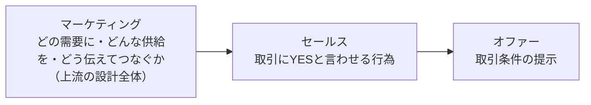

# 第9章　セールスとオファー：取引をイエスと言わせる

第7章で、私たちは手元の[製品](GLOSSARY.md#製品)を[狙う需要](GLOSSARY.md#狙う需要)に当て、[特徴](GLOSSARY.md#特徴)・[効果](GLOSSARY.md#効果)・[ベネフィット](GLOSSARY.md#ベネフィット)・[証拠](GLOSSARY.md#証拠)という価値に翻訳した（[第7章](07-product-planning-map.md)）。第8章では、その価値を「誰に・どんな価値」の一点に絞り込んだ[商品コンセプト](GLOSSARY.md#商品コンセプト)を作り、製品と需要を結ぶ橋を架けた（[第8章](08-product-concept.md)）。ここまでがマーケターの第二の問い「②どのような供給を提案するか」（[第3章 2節](03-three-questions.md#2-どのような供給を提案するか)）への答えである。

本章から、マーケターの第三の問い「**③どのようにコミュニケーションするか**」（[第3章 3節](03-three-questions.md#3-どのようにコミュニケーションするか)）に入る。そして、コミュニケーションの数ある技法のうち、本章が最初に据えるのは——**コミュニケーションの最終目的そのもの、すなわち取引を成立させる技術**である。それが本章のタイトル「**[セールス](GLOSSARY.md#セールス)と[オファー](GLOSSARY.md#オファー)**」だ。

なぜ最初に置くのか。[ビジネス](GLOSSARY.md#ビジネス)は、[需要](GLOSSARY.md#需要)に[供給](GLOSSARY.md#供給)を届けて**取引を成立させる**ことで初めて報酬が発生する（[第1章 1節](01-business-demand-supply-trade.md#1-ビジネスとは需要に対して供給を届け報酬をもらうことである)）。どれだけ精緻に[青い需要](GLOSSARY.md#青い需要)を切り取り（[第6章](06-blue-demand-target-demand.md)）、製品を価値へ翻訳し（[第7章](07-product-planning-map.md)）、コンセプトを磨いても（[第8章](08-product-concept.md)）、最後の最後に見込み客が「YES」と言わなければ、取引は成立しない。取引が成立しなければ、ここまでの上流の作業はすべて報酬ゼロに終わる。だから、コミュニケーションを「どう伝えるか」の細部に分け入る前に、まず「**何のために伝えるのか＝取引をYESにするため**」という到達点を先に押さえる。これが本章を第三の問いの入口に置く理由である。

本章を貫く構造は、**三層の入れ子**で捉える。

上図のとおり、いちばん外側に[マーケティング](GLOSSARY.md#マーケティング)（どの需要に・どんな供給を・どう伝えてつなぐかという上流の設計全体）があり、その内側に**セールス**（その設計を受けて、目の前の取引にYESと言わせる行為）があり、さらにその核に**オファー**（「こういう条件で取引しましょう」という取引条件の提示）がある。マーケティング ⊃ セールス ⊃ オファー、という包含関係である。本章は、この内側の2層（セールスとオファー）を扱う。

本章で獲得するのは次の7つだ。(1) セールスの定義（取引をYESにする行為）、(2) オファーの定義（取引条件の提示）、(3) 良いオファーの4要素〈お得感・低リスク・今やる理由・わかりやすさ〉、(4) セールスの4点セット〈ベネフィット・正しい痛み・No.1の理由・厚いオファー〉、(5) セールスの本質＝「買う理由」を作る、(6) 完璧なオファーでも人は買わないという現実、(7) その理由を説明する枠組み＝3つのNot。

本章の土台には、第7章7節「人はベネフィットが**欲しい × 信じられる**の掛け算で買う」（[第7章 7節](07-product-planning-map.md#7-ベネフィットが信じられる納得できるから買う)）がある。本章は、その「欲しい × 信じられる」が揃ってもなお残る最後の壁——**取引への心理的な壁**——をどう越えさせるかを扱う。そして本章の道具立て（特にオファーと交渉の考え方）は、[第11章](11-lp-communication-funnel.md)のLP「交渉」パートの内部構造になる。

---

## 1. セールス＝オファーに対してYESと言ってもらい、取引を成立させること

> **要約**：セールスとは、オファー（取引条件の提示）に対してYESと言ってもらい、取引を成立させることである。マーケティング（どの需要に・どんな供給を・どう伝えてつなぐかという上流の設計全体）の中で、最後に取引を成立させる部分を担う。マーケティングがどれだけ完璧でも、最後にYESがなければ取引はゼロで、報酬もゼロになる。だからセールスは「売りつけ」ではなく、相手にとって良いことに気づかせてYESと言わせる、見込み客を引き上げるリーダーシップとして取り組む。理想は需要に合った供給と正しいコミュニケーションで「セールスがいらない状態」を作ることだが、最後のYESを取る行為そのものは決してゼロにならない。

**原則**
- [セールス](GLOSSARY.md#セールス)とは、[オファー](GLOSSARY.md#オファー)に対してYESと言ってもらい、**取引を成立させること**である。[マーケティング](GLOSSARY.md#マーケティング)（どの[需要](GLOSSARY.md#需要)に・どんな[供給](GLOSSARY.md#供給)を・どう伝えてつなぐかという上流の設計全体）の中で、**最後に取引を成立させる部分**を担う。
- マーケティングとセールスは思考のベクトルが異なる。マーケティングは「需要と教育を積む」上流の活動、セールスは「目の前の取引をYESにする」下流の活動である。だが両者は対立しない。マーケティングが土台を作り、セールスがその上で取引を締める。
- セールスは「売りつけ」「お金を取ってやろう」という行為ではない。**相手にとって良いことに気づかせ、YESと言わせる**行為であり、見込み客を引き上げる**リーダーシップ**である。だからこそ、正しいマインドのもとで強烈に行ってよい。

**根拠（なぜそうなのか）**
- ビジネスは、需要に供給を届けて**取引を成立させる**ことで初めて報酬が発生する（[第1章 1節](01-business-demand-supply-trade.md#1-ビジネスとは需要に対して供給を届け報酬をもらうことである)）。取引とは、双方が条件に合意して交換が起きること（[第1章 2節](01-business-demand-supply-trade.md#2-ビジネスは需要供給取引の最小構造で考える)）。つまり「YESの獲得」は付け足しではなく、ビジネスが完結する瞬間そのものだ。だから、上流をどれだけ磨いても、YESがなければ取引はゼロ、報酬もゼロになる。
- セールスが「善」でありうるのは、前提として**狙う需要に合った供給**を用意しているからだ。相手の需要を満たす供給を、相手が気づいていない・踏み出せないだけの状態で、YESへ引き上げる——これは相手にとってプラスを生む（[第1章 3節](01-business-demand-supply-trade.md#3-良い取引は双方にプラスを生むシナジー)）。良い取引は双方にプラス（[シナジー](GLOSSARY.md#シナジー相乗効果)）を生むのだから、その成立を後押しすることは、相手の利益に資する。逆に、需要に合わない供給を押し込むのは「売りつけ」であり、それはセールス以前にマーケティングの失敗である。
- マインドセットで設計が変わるのは、出発点の問いが違うからだ。「お金を取ってやろう」から始めると、相手をだます・隠す設計になりやすい。「これをやったら相手は絶対得をする・広がるべきだ」から始めると、相手の不安を消し、踏み出しを助ける設計になる。同じ商品でも、どちらの問いから設計するかで、表現も構造も別物になる。

**使い方（どう適用するか）**
- いま自分が行っている活動が、三層のどこにいるかを自己定位する。「どの需要に・どんな供給を当てるか」を考えているならマーケティング、「この取引をどうYESにするか」を考えているならセールス、「どんな取引条件を出すか」を考えているならオファーである。段が混ざると、上流の問題をセールスで力ずくで解こうとして失敗する。
- 売れないとき、原因を「セールス（YESの取り方）」と「上流（需要・供給・コンセプト）」のどちらにあるかで切り分ける。上流がズレているなら、セールスを強化しても押し込みにしかならない。先に上流を直す。
- セールスに臨むときは、マインドを「相手を引き上げる」側に置く。「この需要を持つ相手にとって、この取引はプラスだ」と自分が確信できているかを先に確認する。確信できないなら、それはセールスの技術ではなく、狙う需要と供給のマッチング（上流）を見直す合図である。

**適用条件**
- 使う場面：見込み客に取引のYESを求める局面全般。LPの「交渉」パート（[第11章](11-lp-communication-funnel.md)）、商談のクロージング、申込導線の設計。
- 使わない場面：そもそも狙う需要に供給が合っていない局面では、セールスを強化してはいけない。それは押し込みになる。先に上流（[第6章](06-blue-demand-target-demand.md)〜[第8章](08-product-concept.md)）を直す。
- 接続：理想は、需要に合った供給と正しいコミュニケーションによって「セールスがいらない状態」に近づけることである。ただし「YESを取る」という行為そのものは決してゼロにはならない。取引の成立には、最後に必ず誰かがYESと言う瞬間が要る。

**誤用と注意**
- セールスを「売りつけ」と捉えて避けたり、逆に「だましてでも売る」技術と捉えたりしない。セールスは、相手の需要に合った供給を、相手のためにYESへ引き上げる行為である。
- 上流の失敗をセールスで取り返そうとしない。需要に合わない供給を、強いセールスで押し込むと、短期的に売れても[シナジー](GLOSSARY.md#シナジー相乗効果)が生まれず、信頼を失う。
- マーケティングとセールスを「別部門の別作業」と切り離して考えない。セールスは、マーケティングの上流設計を引き継いだ最終工程であり、上流の質がそのままYESの取りやすさになる。

**具体例**
- 矯正歯科で、見込み客が「歯並びを治したい」という需要を確かに持っているとする。このとき「いますぐ矯正を契約してください」と迫るのは、相手の踏み出しのハードルを無視した押し込みになりやすい。一方、「まずは無料相談に来てみませんか」とYESのハードルを下げて引き上げるのは、相手の需要に沿って一歩を助けるセールスである。後者は、相手にとって良いことへ向けて背中を押している。同じ「取引へ進める」でも、相手を引き上げる設計か、押し込む設計かで、YESの取りやすさも信頼も変わる。

**関連**
- 用語：[セールス](GLOSSARY.md#セールス) / [オファー](GLOSSARY.md#オファー) / [マーケティング](GLOSSARY.md#マーケティング) / [取引](GLOSSARY.md#取引)
- 章節：[第1章 1節](01-business-demand-supply-trade.md#1-ビジネスとは需要に対して供給を届け報酬をもらうことである)（取引の成立で報酬が発生）/ [第1章 3節](01-business-demand-supply-trade.md#3-良い取引は双方にプラスを生むシナジー)（良い取引は双方にプラス）/ [第3章 3節](03-three-questions.md#3-どのようにコミュニケーションするか)（第三の問い）/ [2節](#2-オファー取引条件の提示)（セールスの核＝オファー）

---

## 2. オファー＝取引条件の提示

> **要約**：オファーとは、取引条件（製品・価格・契約方法・提供方法・特典・申込手順）の提示である。「こういう条件で取引しましょう」という具体的な提示がオファーであり、セールスの核になる。オファーがなければ、相手はYESと言う対象を持てず、「で、どうすればいいの？」で取引が止まる。世の中の多くのコミュニケーションは商品の良さはアピールするのに、肝心の取引条件が曖昧で隠れている。だから「商品の良さ」と「取引（オファー）の良さ」は別物として、それぞれ育てる。オファーを出すタイミングは、相手が「欲しい」と思った後である。

**原則**
- [オファー](GLOSSARY.md#オファー)とは、**取引条件の提示**である。取引条件とは、製品・価格・契約方法・提供方法・特典・支払い方法・申込手順など、取引を成立させるために合意すべき条件のすべてを指す。「こういう条件で取引しましょう」という具体的な提示がオファーであり、[セールス](GLOSSARY.md#セールス)の核になる。
- オファーがなければ、相手はYESと言う**対象**を持てない。商品の良さをどれだけ伝えても、取引条件が示されなければ、相手は「で、結局どうすればいいの？」で止まり、取引は始まらない。
- 「商品の良さ」と「取引（オファー）の良さ」は**別物**として、それぞれ育てる。見込み客の最終判断は、商品単体ではなく「この取引（条件込み）が自分にとって良いか」で決まる。

**根拠（なぜそうなのか）**
- 取引は、双方が**条件に合意**して成立する（[第1章 2節](01-business-demand-supply-trade.md#2-ビジネスは需要供給取引の最小構造で考える)）。合意すべき条件が提示されなければ、合意のしようがない。だからオファー（条件提示）は、取引が始まるための前提である。美味しい魚を試食させて「最高ですね」で会話が終わってしまうのは、「ではこの値段でこう買えます」という条件提示＝オファーが抜けているからだ。相手は感動しても、買い方がわからず帰る。
- 多くのコミュニケーションでオファーが曖昧になるのは、作り手が「商品の良さ」を語ることに夢中になり、取引条件を後回しにするからだ。良さはアピールするのに、価格・申込方法は「お問い合わせください」に隠れている。これは、相手にYESの対象を渡していない状態であり、取引を相手任せにしている。
- 「商品の良さ」と「取引の良さ」を分けて育てるのは、人が最終的にYESを出すのが「取引」に対してだからだ。中身のわからない福袋が「お得な取引」として売れるのは、商品の良さ（中身）ではなく取引の良さ（この値段でこの量、というお得感）でYESが出ている証拠である。逆に、商品が良くても取引条件が悪ければ（高すぎる・面倒・リスクが高い）、YESは出ない。

**使い方（どう適用するか）**
- 商品の良さを伝えたら、**必ず取引条件（オファー）を明示する**。「何を・いくらで・どうやって手に入れられるか」を、相手が迷わず行動できる粒度まで具体化する。「で、どうすればいいの？」が残らない状態にする。
- 「商品の良さ」を語るバルーンと、「取引の良さ（オファー）」を語るバルーンを、別々に育てる意識を持つ。商品説明（[第7章](07-product-planning-map.md)の[ベネフィット](GLOSSARY.md#ベネフィット)・特徴・効果・証拠）で「欲しい」を作り、オファー設計（[3節](#3-良いオファーの4要素お得感低リスク今やる理由わかりやすさ)）で「この取引はお得で安全だ」を作る。
- 商品情報は、必ず**ブランド名・商品名に紐づける**。「ヒアルロン酸の研究がすごい」で終わらせず、「○○（商品名）＝その研究の結晶」と結ぶ。良さが商品名に紐づいていないと、オファーの段で「これを買おう」につながらない。
- **オファーを出すタイミングは、相手が「欲しい」と思った後**にする。魅力が伝わる前に「とにかく安い」「○○円」と価格を先出しすると、まだ欲しくない相手には鬱陶しく、スルーされる。先にベネフィットで欲しくさせ、欲しくなったところへ取引条件を差し出す（[第7章 8節](07-product-planning-map.md#8-ベネフィット特徴効果証拠の順で伝える)）。

**適用条件**
- 使う場面：取引を求めるすべての接点。LP・広告・商談・申込ページ。特にCTA（行動喚起）の直前。
- 使わない場面：相手がまだ「欲しい」と思っていない段階で、価格や申込条件を前面に出さない。順序は、欲しくさせる → オファー、である。
- 接続：オファーの「良し悪し」は[3節](#3-良いオファーの4要素お得感低リスク今やる理由わかりやすさ)の4要素で評価し、オファーをYESにする説得（交渉）は[第11章](11-lp-communication-funnel.md)の「交渉」パートで実装する。

**誤用と注意**
- オファー（取引条件）を曖昧にしたまま、商品の良さだけを語って終わらない。「お問い合わせください」に取引条件を隠すと、相手はYESの対象を持てない。
- 魅力が伝わる前に価格・オファーを先出ししない。欲しくない相手への価格提示は、鬱陶しさを生んでスルーされる。
- 「商品が良ければオファーは適当でよい」と考えない。最終判断は取引（条件込み）への評価で下る。商品の良さと取引の良さは、別々に設計する。

**具体例**
- 高機能なフライパンの良さを動画で延々と伝えても、最後に「お求めは公式サイトで」としか言わなければ、視聴者の多くは「で、いくらで、どう買うの？」のまま離脱する。一方、「本体○○円、いまなら専用フタが付いて、送料無料、ボタン一つで翌日到着」という取引条件まで具体的に提示すれば、相手はYESの対象を手にする。商品の良さ（欲しい）と取引の良さ（この条件なら買える）は別物であり、後者を明示して初めて取引が始まる。

**関連**
- 用語：[オファー](GLOSSARY.md#オファー) / [セールス](GLOSSARY.md#セールス) / [取引](GLOSSARY.md#取引)
- 章節：[第1章 2節](01-business-demand-supply-trade.md#2-ビジネスは需要供給取引の最小構造で考える)（取引＝条件の合意）/ [第7章 8節](07-product-planning-map.md#8-ベネフィット特徴効果証拠の順で伝える)（欲しくさせてから条件を出す）/ [3節](#3-良いオファーの4要素お得感低リスク今やる理由わかりやすさ)（良いオファーの4要素）/ [第11章](11-lp-communication-funnel.md)（「交渉」パート）

---

## 3. 良いオファーの4要素：お得感・低リスク・今やる理由・わかりやすさ

> **要約**：良いオファーは4つの要素で設計する。①お得感（相手が主観的にお得だと感じること。客観的な値引きそのものではなく「感」が要）、②低リスク（取引に伴う相手のリスクを減らす。究極は返金保証や無料お試しでリスクをゼロに近づけるリスクリバーサル）、③今やる理由（オファー自体に期間限定・数量限定などの制限を組み込み、今動く理由を作る）、④わかりやすさ（分かりにくいオファーは決断されない。申込手順まで明快に）。この4つでオファーを点検し、欠けた要素を補う。重要な区別として、③はオファー自体に制限を仕込むことであり、買わない未来との比較で説得するのはセールス側（5・6節）の仕事で、別物である。

**原則**
- 良い[オファー](GLOSSARY.md#オファー)は、次の4要素で設計する。
  1. **お得感**——相手が「お得だ」と主観的に感じること。
  2. **低リスク**——取引に伴う相手のリスクが少ないこと。
  3. **今やる理由**——いま取引したほうがよい理由が、オファー自体に組み込まれていること。
  4. **わかりやすさ**——取引条件と申込手順が明快で、迷わず決断できること。
- この4要素は、オファーの**評価チェックリスト**である。オファーを組んだら4要素で点検し、欠けた要素を補う。

**根拠（なぜそうなのか）**
- **①お得感**で「メリット」でも「ベネフィット」でもなく「お得"感"」という言葉を使うのは、判断が相手の**主観**で下るからだ。同じ割引でも、相手がお得だと感じなければお得ではない。逆に、最初から決まっている割引でも、見せ方しだいで毎回お得感を生める。お得感は、客観的な値引き額そのものではなく、相手の脳内に生まれる「得した」という感覚である。
- **②低リスク**が効くのは、購買が**損失回避**をともなうからだ。お金を払う以上、「期待した価値が手に入らないかもしれない」という不安がつきまとう。この不安が大きいほどYESは遠のく。だから、相手のリスクを減らし、極端には「先に価値を提供し、良かったと思ってもらってから払ってもらう」形にすると、不安が消えてYESが近づく。返金保証・無料お試しのように、買い手のリスクを売り手が引き受ける仕組みを[リスクリバーサル](GLOSSARY.md#リスクリバーサル)という。
- **③今やる理由**が要るのは、人が「良い」と納得しても「今度でいいか」で先延ばしするからだ（[7節](#7-3つのnotnot-read--not-believe--not-act)のNot Act）。期間限定・数量限定・その瞬間だけの特典のように、**オファー自体に制限**を組み込むと、「今動かないと損をする」という理由が生まれ、先延ばしが止まる。
- **④わかりやすさ**が要るのは、人は理解できないものを決断できないからだ。オファーが複雑だと、相手は「よくわからないから、やめておく」を選ぶ。条件・手順が明快なほど、決断のハードルが下がる。

**使い方（どう適用するか）**
- オファーを設計したら、4要素で点検する。「このオファーには、お得感があるか／リスクは十分小さいか／今やる理由が組み込まれているか／一目でわかるか」。欠けている要素があれば、そこを補強する。
- **お得感**は「感」を作りにいく。同じ条件でも、通常価格との対比、特典の積み増し、「今だけ」の文脈で、得した感覚を演出する。割引額を大きくするだけが手ではない。
- **低リスク**は、相手の不安を先回りして引き受ける。返金保証・初月無料・お試し版など、[リスクリバーサル](GLOSSARY.md#リスクリバーサル)を用意する。重要なのは、リスクリバーサルを「**申し込みの不安**」に紐づけることだ。「効かなければ全額返金」を「商品の良さの証明」として語ると、申し込みを悩む瞬間に思い出されない。「申し込んでも、もし合わなければ返金・解約できる」と、**判断の不安**そのものに当てる。
- **今やる理由**は、オファー自体に制限を組み込む（期間限定・数量限定・先着特典）。これは「買う未来 vs 買わない未来」を比較させて説得するセールス側の後押し（[6節](#6-完璧なオファーでも人は買わない)）とは別物である。前者はオファーの**条件設計**、後者は**説得（クロージング）**であり、両方を使う。
- **わかりやすさ**は、申込手順まで含めて点検する。「何を・いくらで・どうすれば手に入るか」を、相手が一度読んで理解できる形にする。

**適用条件**
- 使う場面：オファー（取引条件）を組むとき、既存オファーを改善するとき。
- 使わない場面：相手がまだ欲しくない段階で、お得感や限定を押し出さない（[2節](#2-オファー取引条件の提示)）。4要素は「欲しい」が立った後のオファーを強くするための道具である。
- 接続：4要素のうち①②③は、[4節](#4-セールスの4点セットベネフィット正しい痛みno1の理由厚いオファー)の「厚いオファー」の中身になる。

**誤用と注意**
- お得「感」を、客観的なお得（値引き額）と混同しない。判断は相手の主観で下る。値引きしなくても、見せ方でお得感は作れるし、値引きしてもお得感が伝わらなければ効かない。
- [リスクリバーサル](GLOSSARY.md#リスクリバーサル)を「商品の良さの証明」に紐づけない。「申し込みの不安」に紐づけて、判断の瞬間に効かせる。
- ③「今やる理由（オファーの制限）」と、セールスの後押し（買わない未来との比較）を混同しない。前者は条件設計、後者は説得。役割が違うので、別々に用意する。
- わかりにくいオファーを「丁寧だから」と放置しない。複雑さは、それ自体が決断を止める。

**具体例**
- 通信講座のオファーを4要素で組むと、こうなる。**お得感**＝「通常○○円のところ、今月の申込は教材一式が付いて実質半額」。**低リスク**＝「14日間、合わなければ全額返金。申し込んで試してから判断できます」（申し込みの不安に紐づけている）。**今やる理由**＝「先着100名様限定の価格」（オファー自体の制限）。**わかりやすさ**＝「申込はこのボタンから、メールアドレスだけで完了」。4要素が揃うと、「欲しい」が立った相手のYESが、ぐっと近づく。

**関連**
- 用語：[オファー](GLOSSARY.md#オファー) / [リスクリバーサル](GLOSSARY.md#リスクリバーサル)
- 章節：[2節](#2-オファー取引条件の提示)（オファーの定義）/ [4節](#4-セールスの4点セットベネフィット正しい痛みno1の理由厚いオファー)（厚いオファー）/ [6節](#6-完璧なオファーでも人は買わない)（オファーの制限と後押しの違い）/ [第11章](11-lp-communication-funnel.md)（「交渉」での実装）

---

## 4. セールスの4点セット：ベネフィット・正しい痛み・No.1の理由・厚いオファー

> **要約**：セールスで必ず押さえる4つの材料がある。①ベネフィット（どんなポジティブな感情を見せるか）、②正しい痛み（相手が実際に抱え、かつ自社が解決できる痛みを正確に当てる）、③No.1の理由（数ある競合の中でなぜこれが選ばれるのか）、④厚いオファー（お得感・低リスク・今やる理由を厚く積んだ取引条件）。この4つが揃うと「買う理由」が成立する。特に見落とされがちなのが②正しい痛み（痛みがズレると共感しても買われない）と③No.1の理由（競合の中で選ばれる理由を言語化しないと、欲しくても他に流れる）である。セールス文はこの4点で点検し、どれか欠けたら買う理由が崩れる。

**原則**
- [セールス](GLOSSARY.md#セールス)で必ず押さえる材料は、次の4点セットである。
  1. **[ベネフィット](GLOSSARY.md#ベネフィット)**——商品を通して手に入る、どんなポジティブな感情を見せるか。
  2. **[正しい痛み](GLOSSARY.md#正しい痛み)**——相手が実際に抱えていて、かつ自社の商品が解決できる痛みを、正確に当てる。
  3. **[No.1](GLOSSARY.md#no1)の理由**——数ある競合の中で、なぜこれが選ばれるのか（明らかに良いと言える理由）。
  4. **厚いオファー**——お得感・低リスク・今やる理由を厚く積んだ取引条件（[3節](#3-良いオファーの4要素お得感低リスク今やる理由わかりやすさ)）。
- この4点が揃って初めて、見込み客の中に「**買う理由**」（[5節](#5-セールスでは買う理由を作る)）が成立する。セールス文・LPは、この4点で点検する。どれか1つでも欠けると、買う理由が崩れる。

**根拠（なぜそうなのか）**
- **①ベネフィット**が要るのは、人が機能ではなく、機能を通じて得られる感情で買うからだ（[第1章 4節](01-business-demand-supply-trade.md#4-購買は機能ではなく感情ベネフィットで起きる)）。手に入る感情が見えなければ、「欲しい」が立たない。これは「欲しい × 信じられる」の「欲しい」側を作る（[第7章 7節](07-product-planning-map.md#7-ベネフィットが信じられる納得できるから買う)）。
- **②正しい痛み**が決定的なのは、痛みが**ズレている**と、どれだけ共感しても買う理由にならないからだ。相手が本当に抱えている痛みを外して語ると、相手は「自分のことではない」と感じて反応しない。逆に、正確に当てた瞬間、相手は「それを解決したかった」と前のめりになる。ここでの「正しい」とは、(a) 相手が実際に抱えている（実在する）こと、(b) 自社の商品が解決できること、の両方を満たす痛みを指す。
- **③No.1の理由**が要るのは、相手は同時に**競合**を見ているからだ。ベネフィットが立ち、痛みが当たっても、「それなら他社でもいいのでは」と思われれば、自社は選ばれない。「数ある選択肢の中で、なぜこれなのか」を言語化して見せて初めて、自社に絞られる。これは[第6章](06-blue-demand-target-demand.md)で取った[No.1](GLOSSARY.md#no1)のポジションを、相手にわかる言葉で提示する作業である。
- **④厚いオファー**が要るのは、欲しくて・痛みが当たって・No.1だと納得しても、取引条件が薄ければ最後のYESが出ないからだ。お得感・低リスク・今やる理由を厚く積むほど、「この取引なら、いける」が強まる。

**使い方（どう適用するか）**
- セールス文・LPを書いたら、4点で点検する。「①どんなベネフィット（感情）を見せているか／②当てている痛みは、相手が本当に抱え、自社が解決できる痛みか／③競合の中でなぜこれが選ばれる、と言えているか／④オファーは厚いか」。
- 特に**②正しい痛みと③No.1の理由**が抜けやすい。共感はできていても、痛みがわずかにズレている、あるいは「競合の中でなぜこれか」が語られていない——この2つは、書き手には気づきにくい欠落である。第三者に「この痛みは自分のことだと思うか」「他社ではなくこれを選ぶ理由が伝わるか」を確認する。
- 4点は[商品コンセプト](GLOSSARY.md#商品コンセプト)（[第8章](08-product-concept.md)）と整合させる。ベネフィット・正しい痛み・No.1の理由は、コンセプトで絞った「誰に・どんな価値」から導く。コンセプトがブレていると、4点もブレる。

**適用条件**
- 使う場面：セールス文・LP・商談トークの設計と点検。何を語り、何が欠けているかを洗い出すとき。
- 接続：4点は他章の成果物を入力にする。①ベネフィット＝[第7章](07-product-planning-map.md)、②正しい痛み＝[共感](GLOSSARY.md#共感教育約束交渉提示コミュニケーション5大要素)で扱う痛み（[第11章](11-lp-communication-funnel.md)）、③No.1の理由＝[第6章](06-blue-demand-target-demand.md)、④厚いオファー＝本章[3節](#3-良いオファーの4要素お得感低リスク今やる理由わかりやすさ)。本章は、それらを「取引を締める」観点で1セットに束ねる。

**誤用と注意**
- 共感だけで満足しない。痛みに共感を示しても、それが**正しい痛み**（実在し、自社が解決できる）からズレていれば、買う理由にならない。
- ベネフィットとNo.1の理由を混同しない。ベネフィットは「手に入る感情」、No.1の理由は「競合ではなくこれを選ぶ理由」である。前者だけでは「他社でもいい」を防げない。
- オファーを「最後の事務手続き」と軽視しない。厚いオファーは4点セットの一角であり、ここが薄いと、欲しくてもYESが出ない。

**具体例**
- 数あるCBDオイルの中の1商品をセールスするとき、痛み（疲れ・寝つきの悪さ）への共感はできていても、「**数あるCBDの中で、なぜこれなのか**＝苦味がなくて続けられる」というNo.1の理由を言えていないと、相手は「それなら別のCBDでもいい」と流れる。No.1の理由を言った瞬間、「それが欲しかった」と反応が変わる。また、別の商材では、「作業しながら目をケアできる」という実在する痛みへの正確な当て（正しい痛み）と、「合わなければ返金」という厚いオファー（低リスク）が噛み合って取引が決まった。4点のどれが欠けても、買う理由は崩れる。

**関連**
- 用語：[正しい痛み](GLOSSARY.md#正しい痛み) / [ベネフィット](GLOSSARY.md#ベネフィット) / [No.1](GLOSSARY.md#no1) / [オファー](GLOSSARY.md#オファー)
- 章節：[第6章](06-blue-demand-target-demand.md)（No.1のポジション）/ [第7章 7節](07-product-planning-map.md#7-ベネフィットが信じられる納得できるから買う)（欲しい × 信じられる）/ [3節](#3-良いオファーの4要素お得感低リスク今やる理由わかりやすさ)（厚いオファーの中身）/ [5節](#5-セールスでは買う理由を作る)（4点が買う理由を作る）

---

## 5. セールスでは「買う理由」を作る

> **要約**：セールスの本質は、見込み客に「買う理由」を作って渡すことである。人は「買おう」と無意識に決めてから、その決定を自分や周囲に正当化する理由（言い訳）を後から集める。だからセールスは、相手が使える正当化材料——論理（No.1だから・お得だから）と感情（これが欲しかった）——を用意して差し出す。マーケティングが完璧でも、取引には心理的な壁があり、人は理由がないと踏み出せない。4点セット（4節）は、この買う理由の構成材料である。決め手（なぜ欲しいか）と、買う理由（自分を納得させる言い訳）は分けて用意する。

**原則**
- [セールス](GLOSSARY.md#セールス)の本質は、見込み客に「**[買う理由](GLOSSARY.md#買う理由)**」を作って渡すことである。買う理由とは、相手が自分の購買を**正当化**するために使う、論理と感情の材料である。
- 人は「買おう」と（しばしば無意識に）決めてから、その決定を自分や周囲に**正当化する理由を後から集める**。だからセールスは、相手が使える正当化材料を、先回りして用意して差し出す行為になる。
- 買う理由は、**論理**（No.1だから・お得だから・今だけだから）と**感情**（これが欲しかった・これなら間違いない）の両方で用意する。片方だけでは踏み出せない。

**根拠（なぜそうなのか）**
- 人が理由を後付けするのは、購買が**感情で決まり、論理で正当化される**からだ。決断の瞬間（[MOA](GLOSSARY.md#moa)）は、膨大な検討が砂時計のくびれのように数個に絞られ、極めてシンプルになる（[行動の閾値](GLOSSARY.md#行動の閾値)）。その絞られた決め手の周りに、人は「だから買ってよい」という理由を集めて、自分の決定を納得させる。セールスは、この正当化材料を渡して、踏み出しを助ける。
- マーケティングが完璧でも理由が要るのは、取引に**心理的な壁**があるからだ。たとえば「50万円払えば100万円返ってくる」という、計算上は誰もが得をするはずの提案でも、人は即決しない。「法律は大丈夫か」「何か裏があるのでは」「リスクと期待値が読めない」と、踏み出す前に立ち止まる。マーケティング（需要・供給・コンセプト）がどれだけ完璧でも、最後の取引には必ずこの壁があり、それを越えさせるのがセールスとオファーの役割である。
- 論理と感情の両方が要るのは、人がその両方で自分を納得させるからだ。感情（欲しい）だけでは「うますぎる話では」と警戒され、論理（お得・No.1）だけでは「正しいけど、別に今でなくていい」となる。両方が揃って初めて、「これは欲しいし、選ぶ理由もあるし、今やる理由もある——だから買う」という正当化が完成する。

**使い方（どう適用するか）**
- セールスでは、相手が「自分に・周囲に」説明できる買う理由を用意する。「なぜこれを買ったの？」と聞かれたとき、相手がすっと答えられる材料（No.1だから・期間限定でお得だったから・ずっと欲しかったから）を、先に渡しておく。
- [4点セット](#4-セールスの4点セットベネフィット正しい痛みno1の理由厚いオファー)を「買う理由の部品」として使う。ベネフィット（欲しい）・正しい痛み（だから解決すべき）・No.1の理由（だからこれ）・厚いオファー（だから今・この条件で）——これらを組み合わせると、買う理由が立体的に組み上がる。
- **決め手**（なぜ欲しいか）と、**買う理由＝言い訳**（自分の決定を正当化する材料）を、分けて配置する。決め手は欲しさの中心、買う理由は決断を後押しする補強である。両者を混ぜると、決め手がぼやける。決断の瞬間はシンプルに保ち、その横に正当化材料を添える。
- **自己判定**：いまのセールスは、相手に「買う理由」を渡せているか。「欲しい」を作るだけで止まっていないか。欲しさが立った相手が、自分の購買を正当化できる論理と感情を、用意できているか。

**適用条件**
- 使う場面：取引のYESを取りにいくすべての局面。LPの後半（交渉〜クロージング）、商談の終盤。
- 接続：本節は[第7章 7節](07-product-planning-map.md#7-ベネフィットが信じられる納得できるから買う)「欲しい × 信じられる」の上に立つ。欲しくて・信じられても、なお踏み出すには「買う理由（正当化）」が要る、という一段上の論点である。そして「完璧なオファーでも人は買わない」（[6節](#6-完璧なオファーでも人は買わない)）へ続く。

**誤用と注意**
- 「欲しくさせれば買う」と考えない。欲しさが立っても、取引の心理的な壁を越える「買う理由」がなければ、人は踏み出さない。
- 買う理由を論理だけ・感情だけで組まない。論理だけでは「今でなくていい」、感情だけでは「うますぎる話」になる。両方を渡す。
- 決め手と買う理由（言い訳）を混ぜて、決断の瞬間に情報を盛りすぎない。決断はシンプルに、正当化材料はその補強として添える。

**具体例**
- 高級なマッサージチェアを検討している人は、心の中ではほぼ「欲しい」と決めている。だが、高額ゆえに踏み出せない。ここでセールスが渡すべきは「買う理由」だ。「毎日の疲れが取れて、家族にも勧められる（感情）」「この価格帯で唯一、整体師監修のNo.1モデル（論理＝No.1の理由）」「今月は分割手数料無料で、合わなければ返品できる（論理＝お得・低リスク）」。これらを渡されると、相手は「これだけ理由があるなら、買っていい」と自分を正当化して踏み出せる。セールスは、欲しさを作るだけでなく、最後の壁を越える理由を手渡す行為である。

**関連**
- 用語：[買う理由](GLOSSARY.md#買う理由) / [セールス](GLOSSARY.md#セールス) / [MOA](GLOSSARY.md#moa) / [行動の閾値](GLOSSARY.md#行動の閾値)
- 章節：[4節](#4-セールスの4点セットベネフィット正しい痛みno1の理由厚いオファー)（買う理由の部品）/ [第7章 7節](07-product-planning-map.md#7-ベネフィットが信じられる納得できるから買う)（欲しい × 信じられる）/ [6節](#6-完璧なオファーでも人は買わない)（理由があってもなお買わない壁）

---

## 6. 完璧なオファーでも、人は買わない

> **要約**：オファーをどれだけ完璧にしても、人はそれだけでは買わない。「500円払えば1000円返す」という誰が見ても得な取引ですら、人は「そんなうまい話があるか」「周りに何か言われないか」「めんどくさい」と、断る理由を自分で作って見送る。だから、完璧なオファーの後に、断る理由を潰し、今すぐやるべきだと背中を押すクロージング（後押し）が要る。クロージングは2つの軸で行う：①残った断る理由（怪しい・面倒・今は早い・来週でいい等）を一つずつ潰す、②今すぐ取引すべき理由を感情に訴えて押す。位置は通常オファーの後で、追伸などで最後にもう一押しする。

**原則**
- どれだけ[オファー](GLOSSARY.md#オファー)を完璧にしても、人はそれだけでは買わない。「500円払えば1000円返ってくる」のような、論理上は誰もが得をする取引でも、人は「そんなうまい話があるか」「もらったら周りに何か言われないか」「手続きがめんどくさい」と、**断る理由を自分で作って**見送る。
- だから、完璧なオファーの後には、**[クロージング](GLOSSARY.md#クロージング)**（後押し）が要る。クロージングとは、オファーを提示してもなお残る「断る理由」を潰し、「今すぐ取引すべきだ」と背中を押す、取引成立直前の後押しである。
- クロージングは2つの軸で行う。①**残った断る理由を一つずつ潰す**、②**今すぐ取引すべき理由を、感情に訴えて押す**。

**根拠（なぜそうなのか）**
- 完璧なオファーでも買わないのは、人が**踏み出さないための理由**を無意識に探すからだ。新しい行動には未知のリスクが伴うため、脳は現状維持を選びやすい。だから、お得で低リスクなオファーを前にしても、「怪しい」「副作用は」「今の自分には早い」「来週でいいか」「家族にバレないか」といった、オファーの良し悪しとは別の断る理由が次々と湧く。これらを放置すると、どれか一つが引っかかってYESが出ない。
- 断る理由を潰す必要があるのは、それが**オファーの厚さでは消えない**からだ。「めんどくさい」は値引きでは消えず、「家族にバレないか」は返金保証では消えない。オファー（取引条件）の改善とは別に、相手の頭の中に残った個別の断る理由を、一つずつ名指しで打ち消す必要がある。
- 今すぐ押す必要があるのは、人が「良い」と納得しても先延ばしするからだ（[7節](#7-3つのnotnot-read--not-believe--not-act)のNot Act）。「今やらないと（手に入らない・損をする・変われない）」という切迫を、論理だけでなく感情で伝えて初めて、先延ばしが止まる。

**使い方（どう適用するか）**
- **①断る理由を洗い出して潰す**。相手の脳内に憑依し（[憑依](GLOSSARY.md#憑依)、[第5章](05-persona-mind-map.md)）、「この取引を前にして、この人はどんな理由で断ろうとするか」を列挙する。怪しさ・面倒・タイミング・周囲の目など。そのうえで、各理由を先回りして打ち消す材料（実績・手順の簡単さ・「今だからこそ」の文脈・周囲の事例）を文中に置く。
- **②今すぐ押す**。「今行動するメリット」「今行動しないデメリット」を、感情に訴えて伝える。期間・数量の制限（[3節](#3-良いオファーの4要素お得感低リスク今やる理由わかりやすさ)の「今やる理由」）に加えて、「ここまで読んだあなたは、相当この問題に向き合っている。だからこそ今動く価値がある」のように、相手の状態に寄り添って背中を押す。
- **配置**：クロージングは通常、オファーの**後**に置く。流れは「購入導線（オファー提示）→ 後押し（クロージング）→ もう一度購入導線」。LPなら、追伸（P.S.）で「ここまで読んでくれたということは、相当興味がある証拠です。ぜひ今すぐ」と、最後にもう一押しする。
- **自己判定**：オファーを完璧にしただけで満足していないか。相手が断りうる理由を具体的に列挙し、それぞれに反論を用意したか。「今でなくていい」を崩す押しを、最後に置いたか。

**適用条件**
- 使う場面：オファーを提示した後、取引を締めにいく局面。LPの最終ブロック、商談のクロージング、申込直前。
- 使わない場面：まだ欲しさ（[ベネフィット](GLOSSARY.md#ベネフィット)）も信頼も立っていない段階で、クロージングだけ強めない。後押しは、欲しい・信じられる・オファーが揃った上での最後の一段である。土台がないのに押すと、押し売りになる。
- 接続：クロージングは[7節](#7-3つのnotnot-read--not-believe--not-act)の3つのNotのうち、Not Act（行動しない）を崩す行為に当たる。

**誤用と注意**
- オファーの完璧さに過信しない。論理上どれだけ得な取引でも、断る理由は別に湧く。オファーの改善とクロージング（断る理由潰し＋後押し）は、別の作業である。
- 断る理由を「潰す」のを、相手を言い負かすことと取り違えない。相手の不安に寄り添い、安心材料を渡して取り除く。
- 後押しを、欲しさや信頼が立つ前に行わない。土台のない後押しは押し売りになり、信頼を損なう。

**具体例**
- オンライン講座が「初月無料・いつでも解約可・満足度No.1」という完璧に近いオファーを出しても、見込み客は「無料なのは裏があるのでは」「どうせ続かない」「来月でいいか」と断る理由を作る。ここでクロージングが効く。「無料期間中の解約は1クリック、違約金は一切ありません（怪しさを潰す）」「続かない人ほど、まず無料の今だけでも試す価値があります（面倒・自信のなさを潰す）」「この価格は今月まで。来月から始める人は、丸ごと一ヶ月分の成長を逃します（先延ばしを潰す）」。最後に追伸で「ここまで読んだあなたは、本気で変わりたいはず。その気持ちが熱いうちに、今日始めてください」と感情で押す。完璧なオファーに、断る理由潰しと後押しを重ねて、初めてYESが出る。

**関連**
- 用語：[クロージング](GLOSSARY.md#クロージング) / [オファー](GLOSSARY.md#オファー) / [3つのNot](GLOSSARY.md#3つのnot)
- 章節：[3節](#3-良いオファーの4要素お得感低リスク今やる理由わかりやすさ)（オファーの「今やる理由」との違い）/ [5節](#5-セールスでは買う理由を作る)（買う理由を渡す）/ [7節](#7-3つのnotnot-read--not-believe--not-act)（Not Actを崩す）

---

## 7. 3つのNot：Not Read / Not Believe / Not Act

> **要約**：人は広告・コミュニケーションに対して、3つの基本姿勢でハードルを作る。Not Read（読まない）・Not Believe（信じない）・Not Act（行動しない）である。完璧なオファーを用意しても人が買わない理由は、この3つの関門に集約される。だから設計では、各Notを一つずつ崩す。Not Readは、キャッチコピー・ビッグアイデアで「その先を知りたい」と思わせて読ませる。Not Believeは、具体性のある証拠（固有名詞・数字・体験談）で信じさせる。Not Actは、今やる理由（期間・数量限定）とわかりやすい購入動線、そしてクロージングで行動させる。この3段（読ませる→信じさせる→行動させる）が、コミュニケーション設計の背骨になる。

**原則**
- 人は、広告・コミュニケーションに対して、3つの基本姿勢でハードルを作る。これを[3つのNot](GLOSSARY.md#3つのnot)という。
  1. **Not Read（読まない）**——そもそも読まない・見ない。
  2. **Not Believe（信じない）**——読んでも、書いてあることを信じない。
  3. **Not Act（行動しない）**——信じても、今は行動しない。
- 完璧な[オファー](GLOSSARY.md#オファー)を用意しても人が買わない理由は、この3つの関門に集約される。だから設計では、**各Notを一つずつ崩す**。読ませる → 信じさせる → 行動させる、の3段で組む。

**根拠（なぜそうなのか）**
- **Not Read**が生じるのは、人が情報の洪水の中で、見るものを瞬時に取捨選択するからだ。興味・関心のないものは、即スルー・即離脱する。送り手がどれだけ語っても、9割以上の相手は読まない。読まれなければ、どんなオファーも存在しないのと同じである。
- **Not Believe**が生じるのは、人が書いてあることを100%は信じないからだ。信じる／信じないは、(a) 過去の経験・体験との照合と、(b) ほんの些細な違和感（挙動不審・後付け感・トーンのズレ）で決まる。具体性（固有名詞・数字・体験談）があると信じやすく、ふわっとしていると疑われる。信じられなければ、欲しくても踏み出せない。
- **Not Act**が生じるのは、人が「良い」と納得しても「今度でいいか」と先延ばしするからだ（[5節](#5-セールスでは買う理由を作る)・[6節](#6-完璧なオファーでも人は買わない)）。そして、納得して行動する気になっても、購入動線が複雑だと、その手間で離脱する。最後の一歩のハードルが、ここまで積み上げたものをすべて無にする。

**使い方（どう適用するか）**
- **Not Readを崩す＝読ませる**。[キャッチコピー](GLOSSARY.md#キャッチコピー)や[ビッグアイデア](GLOSSARY.md#ビッグアイデアファーストビューfv)（[第10章](10-information-space-content.md)）で、「その先を知りたい」という好奇心を起こす。このとき、**何を伝えるか（[what](GLOSSARY.md#what--how)）と、どう表現するか（[how](GLOSSARY.md#what--how)）を分ける**。伝える中身（what）が整理されていないと、表現（how）がブレる。
- **Not Believeを崩す＝信じさせる**。[証拠](GLOSSARY.md#証拠)（[第7章 5節](07-product-planning-map.md#5-証拠ベネフィットを信じさせる材料)）を、具体性をもって示す。固有名詞・数字・実際の体験談で、「本当だ」を作る。なお、一度失った信頼（偽装・誇大の露呈など）を取り戻すのは非常に困難なので、証拠は裏取りの取れたものだけを使う（claim safety）。
- **Not Actを崩す＝行動させる**。①「今行動するメリット／今行動しないデメリット」を明確にする（[3節](#3-良いオファーの4要素お得感低リスク今やる理由わかりやすさ)の「今やる理由」、[6節](#6-完璧なオファーでも人は買わない)のクロージング）。②**購入動線をわかりやすくする**。「で、何をすればいいの？」が一目でわかり、入力やクリックのハードルが極小である状態にする。
- **自己判定**：設計が3つのNotすべてに答えているか。「読ませる入口（Not Read）／信じさせる証拠（Not Believe）／行動させる動線と後押し（Not Act）」のどれかが抜けていないか。一つでも抜けると、そこで取りこぼす。

**適用条件**
- 使う場面：あらゆるコミュニケーション設計の点検枠組み。LP・広告・メールの全体構造を、3関門で監査するとき。
- 接続：3つのNotは、本章のセールス・オファーが「なぜ完璧でも買われないか」を説明する枠組みであり、同時に[第10章](10-information-space-content.md)（脳内情報空間・コンテンツ）・[第11章](11-lp-communication-funnel.md)（LP）でのコミュニケーション設計の背骨になる。読ませる→信じさせる→行動させるの3段は、共感・教育・約束・交渉・提示の5大要素（[第11章](11-lp-communication-funnel.md)）と重ねて使う。

**誤用と注意**
- 3つを「順番に1回ずつ」と硬直化させない。Not Believe（信じない）は全編にわたって発生し続けるし、Not Act（行動しない）は最後だけでなく、軽いYESを求める各所で起きる。3つは「常に意識する関門」であって、固定の3ステップではない。
- どれか1つだけ強くして満足しない。読ませる工夫（強い見出し）だけ凝っても、信じさせる証拠や行動させる動線が弱ければ、取りこぼす。3関門は掛け算で効く。
- Not Readを「強い言葉・煽り」で越えようとしない。興味は言葉の強さではなく、内容（その先を知りたいと思える情報の隙間）で生まれる。煽りで釣ると、Not Believeで弾かれる。

**具体例**
- ダイエットサプリのLPで、3つのNotを崩す設計はこうなる。**Not Read**：「『また太った』と鏡の前でため息をついた、あの朝」——具体的な感情シーンの見出しで、自分ごととして読ませる。**Not Believe**：「管理栄養士○○監修、利用者1万人の○%が3ヶ月で実感（数字・固有名詞・体験談）」で、信じさせる。**Not Act**：「今月の申込は初回半額＋返金保証（今やる理由・低リスク）」「申込はこのボタンから、30秒で完了（わかりやすい動線）」で、行動させる。3関門のどれが抜けても——読まれず、信じられず、あるいは最後の動線で離脱して——取引は成立しない。

**関連**
- 用語：[3つのNot](GLOSSARY.md#3つのnot) / [キャッチコピー](GLOSSARY.md#キャッチコピー) / [ビッグアイデア／FV](GLOSSARY.md#ビッグアイデアファーストビューfv) / [証拠](GLOSSARY.md#証拠) / [what / how](GLOSSARY.md#what--how)
- 章節：[6節](#6-完璧なオファーでも人は買わない)（Not Actとクロージング）/ [第7章 5節](07-product-planning-map.md#5-証拠ベネフィットを信じさせる材料)（Not Believeを崩す証拠）/ [第10章](10-information-space-content.md)（読ませる入口＝ビッグアイデア）/ [第11章](11-lp-communication-funnel.md)（5大要素との重ね合わせ）
