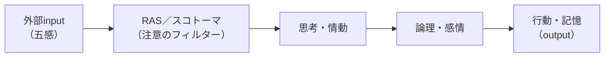

# 第10章　脳内情報空間とコンテンツ

第9章で、私たちはコミュニケーションの**最終目的**——取引そのものを成立させる技術＝[セールス](GLOSSARY.md#セールス)と[オファー](GLOSSARY.md#オファー)——を押さえた（[第9章](09-sales-and-offer.md)）。完璧なオファーでも人は買わず、そこには[3つのNot](GLOSSARY.md#3つのnot)（読まない・信じない・行動しない）という関門がある、というところまで見た（[第9章 7節](09-sales-and-offer.md#7-3つのnotnot-read--not-believe--not-act)）。

では、その関門を越えてYESを取りにいくコミュニケーションは、いったい**何を操作しているのか**。読ませる・信じさせる・行動させるとは、相手の**どこ**に働きかけることなのか。本章は、その問いに答える——マーケターの第三の問い「**③どのように[コミュニケーション](GLOSSARY.md#コミュニケーション)するか**」（[第3章 3節](03-three-questions.md#3-どのようにコミュニケーションするか)）の**エンジン部**である。

答えは、本章を通じてただ一つに収束する。**マーケターが書き換えられるのは、物理的な事実ではなく、相手の頭の中に広がる世界＝[脳内情報空間](GLOSSARY.md#脳内情報空間)だけだ**、という事実だ。コミュニケーションとは、相手の脳内情報空間を書き換えて記憶と行動を作ることである（[第1章 7節](01-business-demand-supply-trade.md#7-コミュニケーションとは情報を伝達して取引を促すことである)）。本章は、この「書き換える対象」と「書き換えに効く情報の正体」を、脳の認知メカニズムまで降りて精密化する。

本章を貫く認知の処理ラインは、次のとおりである。

上図のとおり、外から入った情報は、まず[RAS](GLOSSARY.md#ras)（重要なものだけ通す注意のフィルター）と[スコトーマ](GLOSSARY.md#スコトーマ)（心理的盲点）を通り、過去の記憶と照合されて[思考・情動](GLOSSARY.md#思考情動)になり、それが概念化されて[論理・感情](GLOSSARY.md#論理感情)になり、最後に行動と記憶になる。コミュニケーションの各ブロックは、必ずこの処理ラインのどこかに作用している。マーケターの仕事は、この処理ラインを意図どおりに走らせ、相手の脳内情報空間を「取引する状態」へ書き換えることである。

本章は4ブロックで進む。

- **(A) 操作対象**：[脳内情報空間](GLOSSARY.md#脳内情報空間)とは何か（1節）／成功条件＝[伝わる](GLOSSARY.md#伝わる)（2節）。
- **(B) 設計原理**：[ゴールの脳内情報空間から逆算する](#3-ゴールの脳内情報空間から逆算する)（3節）／そのゴールの具体＝[MOA](GLOSSARY.md#moa)（4節）。
- **(C) 効く情報**：[コンテンツ](GLOSSARY.md#コンテンツ)＝脳に刺激を与える情報（5節）／刺激は[脳内情報空間の外側](#6-脳内情報空間の外側を狙う)との接続で生まれる（6節）／最適距離＝[1.5メートル理論](GLOSSARY.md#15メートル理論)（7節）。
- **(D) 制作の規律**：[what／howを分ける](#8-whatを一文に確定しhowで演出する)（8節）／本編の入口＝[ビッグアイデア／FV](GLOSSARY.md#ビッグアイデアファーストビューfv)（9節）。

本章で獲得する理論は、そのまま[第11章](11-lp-communication-funnel.md)のLP（[共感→教育→約束→交渉→提示](GLOSSARY.md#共感教育約束交渉提示コミュニケーション5大要素)）とコミュニケーション設計全体が**実装する土台**になる。第11章が「どう組むか（構造）」なら、本章は「なぜそれが効くか（原理）」である。

---

## 1. 脳内情報空間＝頭の中に広がっている世界

> **要約**：脳内情報空間とは、頭の中に広がっている世界（言葉・イメージのネットワーク）であり、マーケティングが操作する唯一の対象である。物理空間とは別レイヤーであり、マーケターが書き換えられるのは物理的事実ではなく、相手の脳内情報空間だけだ。その物理的基盤がシナプス構造であり、人によって広がり方（価値観・関与度・思考のクセ）が異なる。だから同じ言葉でも、受け手のシナプス構造によって意味が正にも負にも分岐する。万人向けの言葉は誰にも刺さらない。コミュニケーションを設計するときは、必ず「ターゲットの脳内情報空間は今どうなっているか」を前提に置く。

**原則**
- [脳内情報空間](GLOSSARY.md#脳内情報空間)とは、**頭の中に広がっている世界**——言葉・イメージのネットワーク——であり、マーケティングが操作する対象である。
- 物理空間と脳内情報空間は**別のレイヤー**である。マーケターが書き換えられるのは、物理的な事実ではなく、**相手の脳内情報空間だけ**だ。
- 脳内情報空間の物理的な基盤が[シナプス構造](GLOSSARY.md#シナプス構造)である。シナプス＝ディスプレイ（物理）、脳内情報空間＝そこに映る映像（意味）という関係にある。シナプス構造は人によって広がり方（価値観・関与度・思考のクセ）が異なるため、**同じ言葉でも、受け手によって意味が正にも負にも分岐する**。

**根拠（なぜそうなのか）**
- 人が反応するのは物理的事実そのものではなく、脳が変換した脳内情報空間だからだ。目に見える色も形も、脳が外部入力を変換して作り出した産物である。人は、その変換された世界（脳内情報空間）に基づいて判断し、行動する。だから、相手を動かしたければ、物理空間ではなく、相手の脳内に広がる世界のほうを書き換えるしかない。
- 同じ言葉が分岐するのは、意味が言葉そのものに宿るのではなく、受け手のシナプス構造の上で生成されるからだ。「結婚」という一語は、ある人の脳内では「大事な話・幸せ」へ広がり、別の人の脳内では「面倒・嫌なもの」へ広がる。言葉は同じでも、着地する脳内情報空間が違えば、生まれる意味は別物になる。
- だから**万人向けの言葉は、誰にも刺さらない**。あらゆるシナプス構造に同時に最適化された言葉は存在しない。特定の脳内情報空間を狙って初めて、その人の中で意図どおりの意味が立ち上がる。

**使い方（どう適用するか）**
- 何かを伝える前に、必ず「**相手（ターゲット）の脳内情報空間は、今どうなっているか**」を想像する。何を既に知っていて、どんな価値観で、その言葉がどう広がるか。これがコミュニケーション設計のすべての出発点である。
- コピーを書くときは、「この言葉は、相手の脳内でどんな意味に広がるか」を一語ずつ問う。送り手の脳内では好意的に広がる言葉が、相手の脳内では警戒や嫌悪に広がることがある。
- 狙う相手の[シナプス構造](GLOSSARY.md#シナプス構造)（価値観・関与度）を前提に、言葉を選ぶ。万人に向けてぼかすのではなく、特定の脳内情報空間に照準する。誰に向けるかは、[ペルソナ](GLOSSARY.md#ペルソナ)（[第5章](05-persona-mind-map.md)）で具体化する。

**適用条件**
- 使う場面：あらゆるコミュニケーション設計の最上流の前提。コピー・LP・広告・接客・パッケージなど、人と接するすべての面。
- 使わない場面：物理的な事実そのものを良くする工程（＝プロダクト改善）は、本章の対象ではない。ビジネスのグロース手段は「プロダクト改善」か「コミュニケーション改善」の2つだが（[第1章](01-business-demand-supply-trade.md)）、本章が扱うのは後者、すなわち脳内情報空間の書き換えである。
- 接続：脳内情報空間を「取引する状態」へ書き換えられたかどうかの成功条件が、次節の[伝わる](#2-伝わる相手の脳内情報空間が意図どおり書き換わること)である。

**誤用と注意**
- **自分（送り手）の脳内情報空間を、相手のそれと混同しない**。送り手にとって自明な言葉・文脈が、相手の脳内では存在しないことが多い。本章で扱う失敗の根はほぼすべて、この「送り手視点」にある。
- 言葉を「届けた」ことを「伝わった」ことと取り違えない。届くのは言葉（物理）であり、意味（脳内情報空間）は相手の脳が生成する（[2節](#2-伝わる相手の脳内情報空間が意図どおり書き換わること)）。
- 「万人にウケる言葉」を探さない。広く薄くぼかした言葉は、どの脳内情報空間でも弱くしか広がらない。

**具体例**
- 「結婚」という一語を、独身で結婚に憧れる人の脳内に置くと「幸せ・あたたかい家庭・大事な話」へ広がる。同じ語を、結婚に疲れた人の脳内に置くと「束縛・面倒・できれば避けたいもの」へ広がる。コピーで「結婚」と書いた瞬間、送り手の意図とは無関係に、受け手のシナプス構造が意味を決める。だからこそ、誰の脳内情報空間に向けて書くのかを先に決めなければならない。

**関連**
- 用語：[脳内情報空間](GLOSSARY.md#脳内情報空間) / [シナプス構造](GLOSSARY.md#シナプス構造) / [コミュニケーション](GLOSSARY.md#コミュニケーション)
- 章節：[第1章 7節](01-business-demand-supply-trade.md#7-コミュニケーションとは情報を伝達して取引を促すことである)（コミュニケーション＝脳内情報空間の書き換え）/ [第5章](05-persona-mind-map.md)（脳内情報空間を具体化するペルソナ）/ [2節](#2-伝わる相手の脳内情報空間が意図どおり書き換わること)（書き換えの成功条件＝伝わる）

---

## 2. 伝わる＝相手の脳内情報空間が意図どおり書き換わること

> **要約**：「伝わる」とは、伝えた言葉そのものではなく、相手の脳内情報空間が意図どおり書き換わることである。送り手が言葉を発する「伝える」とは別物だ。鉄則は、人は言われたことをそのまま信じず、言われたことを“もとに”自分の脳で考えてどう思うかがすべて、ということ。だから「あなたは○○です」という直球は処理されない。相手が“自分で”その結論にたどり着く情報を与える。人は自分で結論づけたことを最も強く信じる。参考事例を真似るときも、表層の言葉ではなく「その情報で相手の脳内情報空間がどう変わるか」まで抽象化して写す。

**原則**
- [伝わる](GLOSSARY.md#伝わる)とは、**伝えた言葉そのものではなく、相手の[脳内情報空間](GLOSSARY.md#脳内情報空間)が意図どおり書き換わること**である。送り手が言葉を発する行為「伝える」とは、はっきり区別する。
- 鉄則：**人は、言われたことをそのまま信じない。言われたことを“もとに”、相手の脳が考えて、どう思うか——これがすべてである**。
- だから、**直球（「あなたは○○です」）は処理されない**。相手が**自分で**その結論にたどり着く情報を与える。人は、人に言われたことよりも、自分で結論づけたことを強く信じる。

**根拠（なぜそうなのか）**
- 意味は言葉に宿らず、受け手の脳が生成するからだ（[1節](#1-脳内情報空間頭の中に広がっている世界)）。人間は99%が無意識で、判断は過去の記憶との照合によって走る。送り手の言葉は「刺激」にすぎず、その刺激を受けて相手の脳がどんな意味・[論理・感情](GLOSSARY.md#論理感情)を作るかが、結果のすべてである。ゆえに「伝えた＝伝わった」は成立しない。
- 直球が効かないのは、人が断定を額面どおりに受け取らないからだ。「あなたは○○です」と言われると、脳は「本当か？」「広告だろう」と身構え、過去の記憶（常套句・売り込み）と照合して**割り引く**。むしろ反発を生むことすらある。
- 自分で結論づけたことを強く信じるのは、**自己説得**が他者説得より深く脳内情報空間を書き換えるからだ。情報の「隙間」や問いを与えられ、自分の脳でその隙間を埋めて結論に達したとき、人はその結論を「自分の考え」として受け入れる。だから、結論そのものを渡すのではなく、相手が自分で結論に達する材料を渡す。

**使い方（どう適用するか）**
- 書いた各行を、「これは相手の脳内情報空間を、どう書き換えるか」で評価する。きれいな文かどうかではなく、相手の脳内で意図どおりの意味・感情が立ち上がるかで判断する。
- 直球をやめ、**相手が自分で結論を出す情報**に置き換える。「あなたは優秀な10%です」ではなく「上位10%だけがやっていることがあります。あなたは入っていますか？」のように、問いと情報の隙間で、相手自身に結論づけさせる。
- 展開の速度を相手の処理に合わせる。速すぎる展開は、相手が脳内で意味を生成し終える前に次へ進んでしまい、**読んでいないのと同じ**になる。一段ずつ、相手が自分で結論づける時間を残す。
- 参考になるLP・コピーを真似るときは、**表層の言葉を写さない**。「その情報で相手の脳内情報空間がどう変わり、最終的にどんな論理・感情になるか」まで抽象化し、別の情報で同じ脳内情報空間を作る。これが[コピーキャット](GLOSSARY.md#コピーキャット)（[第11章](11-lp-communication-funnel.md)）の正しいやり方である。表層を写すと別物になる。

**適用条件**
- 使う場面：すべてのコピー・コンテンツの作成とレビュー。一文ごとの自己点検基準として使う。
- 接続：何が相手の脳内情報空間を書き換える「効く情報」になるのかは、[5節](#5-コンテンツ脳に刺激を与える情報)以降（コンテンツ・外側・1.5メートル）で扱う。本節は「伝わるとは何か（定義と成功条件）」、5節以降は「では何が伝わるか（効く情報の正体）」である。

**誤用と注意**
- **伝えたいことを、そのままの形で伝えない**。直球は処理されず割り引かれる。相手が自分で結論を出す情報の形にする。
- 抽象的な断定で済ませない。「快適になります」のような言葉は、相手の脳内に像を結ばず、書き換えが起きない。目に見える場面に置き換え、感情を一言添える（[8節](#8-whatを一文に確定しhowで演出する)・[第11章](11-lp-communication-funnel.md)）。
- 速い展開で「言った」気にならない。処理が追いつかなければ、伝えていないのと同じである。

**具体例**
- ダイエット商材で「この方法はすごく効果があります」と直球で書いても、相手の脳は「広告だ」と割り引いて終わる（書き換えゼロ）。一方、「ジムで隣の細い子のほうが必死に走っているのを見て、なぜか自分が恥ずかしくなった——そんな経験はありませんか？」と書くと、相手は自分の記憶を再生し、「たしかに自分もそうだ」と**自分で**結論づける。同じ「あなたに刺さる商品です」という意図でも、後者だけが相手の脳内情報空間を書き換えている。

**関連**
- 用語：[伝わる](GLOSSARY.md#伝わる) / [脳内情報空間](GLOSSARY.md#脳内情報空間) / [論理・感情](GLOSSARY.md#論理感情) / [コピーキャット](GLOSSARY.md#コピーキャット)
- 章節：[1節](#1-脳内情報空間頭の中に広がっている世界)（操作対象の定義）/ [第9章 7節](09-sales-and-offer.md#7-3つのnotnot-read--not-believe--not-act)（Not Believe＝信じない）/ [5節](#5-コンテンツ脳に刺激を与える情報)（効く情報＝コンテンツ）/ [第11章](11-lp-communication-funnel.md)（コピーキャットの実装）

---

## 3. ゴールの脳内情報空間から逆算する

> **要約**：コミュニケーション設計は、結末（ゴールの脳内情報空間）から手前へ逆算して組む。順番に積み上げてはいけない。手順は——①ゴールの脳内情報空間を定義する（読後、相手をどんな状態にすれば取引するか）→②そのために必要な論理・感情を定義する→③その状態を作るために投入すべき情報（コピー・証拠・ビジュアル）を決める。同じ商品でも、ゴールの脳内情報空間が違えば、伝えるべき情報が丸ごと変わる。だから先にゴールを1つに決める。「載せたい情報」を先に並べてはいけない。必ずゴール→逆算で決める。

**原則**
- コミュニケーション設計は、**結末（ゴールの[脳内情報空間](GLOSSARY.md#脳内情報空間)）から手前へ逆算**して組む。手前から順番に積み上げてはいけない。
- 手順は3段の逆算である。
  1. **ゴールの脳内情報空間を定義する**——「読後、相手をどんな脳内情報空間にすれば“取引する”か」を1つに決める。
  2. **そのための[論理・感情](GLOSSARY.md#論理感情)を定義する**——そのゴール状態にいる相手は、どんな論理（「これは○○だ」）と感情を持っているか。
  3. **投入すべき情報を決める**——その論理・感情を作るために、どんなコピー・[証拠](GLOSSARY.md#証拠)・ビジュアルを入れるか。
- **先に「載せたい情報」を並べてはいけない**。必ずゴール→逆算で決める。

**根拠（なぜそうなのか）**
- 同じ商品でも、**ゴールの脳内情報空間が違えば、伝えるべき情報が丸ごと変わる**からだ。同じ男性化粧水でも、ゴールを「この人はいい男だな」に置くのと「この人はモテそうだな」に置くのとでは、見せるべきシーン・証拠・言葉が別物になる。ゴールを先に1つに固定しないと、投入する情報の基準が定まらない。
- 積み上げ式が失敗するのは、手前から組むと**送り手が「言いたい情報」を並べてしまう**からだ。人は見えているもの（手元の商品・スペック）に引っ張られる。ゴールから逆算しない限り、情報は商品都合で増殖し、相手の脳内情報空間を狙った状態へ収束させられない。
- 逆算が効くのは、ゴールという1点があると、すべての情報を「この1行はゴールに近づけているか」で取捨できるからだ。ゴールがあれば、必要な情報と不要な情報が明確に分かれる。ゴールがなければ、すべての情報が「あったほうがよさそう」に見えてしまう。

**使い方（どう適用するか）**
- 設計の最初に、**ゴールの脳内情報空間を一文で確定する**。「読み終えたとき、相手の頭の中が〈○○〉という状態になっていれば、取引する」。この○○を1つに絞る。複数あるなら、最も取引に効く1つを選ぶ。
- ゴールから逆算して、必要な論理・感情→投入情報の順に降ろす。ゴール状態の相手が抱く論理・感情を言語化し、それを作る情報だけを選ぶ。
- 各セクション・各行を「ゴールに近づけているか」で点検する。近づけていない情報は、たとえ正しくても、たとえ商品の魅力でも、削る。「すべての情報に“なぜ載せたか”を100%言える状態」を目指す。
- ゴールの最も具体的な形＝**買う瞬間の脳内情報空間（[MOA](GLOSSARY.md#moa)）**を、次節（[4節](#4-moa行動を起こす瞬間の脳内情報空間)）で固定する。実務では「ゴールの脳内情報空間＝MOA」を先に決め、そこから逆算する。

**適用条件**
- 使う場面：LP・広告・メール・セールストークなど、取引や行動を目的とするあらゆるコミュニケーション設計の起点。
- 使わない場面：ゴールが定まらないうちに、コピーやビジュアル（[how](GLOSSARY.md#what--how)）に着手しない。ゴール→逆算で[what](GLOSSARY.md#what--how)が決まってから演出に進む（[8節](#8-whatを一文に確定しhowで演出する)）。
- 接続：ゴールを「行動を起こす瞬間」に具体化したものが[MOA](#4-moa行動を起こす瞬間の脳内情報空間)（4節）。逆算で決まった[what](GLOSSARY.md#what--how)を一文にするのが8節。

**誤用と注意**
- **「載せたい情報」から設計を始めない**。手元の商品情報・スペックから組むと、商品都合の情報の羅列になり、ゴールへ収束しない。
- ゴールを複数持たない。ゴールが2つ3つあると、投入情報が割れ、どれも中途半端になる。先に1つへ絞る。
- 「とりあえず良さそうな情報」を足さない。ゴールに近づけない情報は、ノイズとして他の情報の効きを薄める。

**具体例**
- 同じ男性化粧水のLPでも、ゴールの脳内情報空間を「この人はいい男だな（清潔感・自己管理）」に置くなら、見せるのは「朝の身支度を整えるシーン」「肌が整って清潔感が出た証拠」になる。ゴールを「この人はモテそうだな」に置くなら、見せるのは「異性からの反応が変わるシーン」になる。商品は同じでも、ゴールが違えば投入情報は丸ごと入れ替わる。だから、コピーを1行書く前に、どちらのゴールを取るかを決めなければならない。

**関連**
- 用語：[脳内情報空間](GLOSSARY.md#脳内情報空間) / [MOA](GLOSSARY.md#moa) / [論理・感情](GLOSSARY.md#論理感情) / [what / how](GLOSSARY.md#what--how)
- 章節：[2節](#2-伝わる相手の脳内情報空間が意図どおり書き換わること)（書き換えの成功条件）/ [4節](#4-moa行動を起こす瞬間の脳内情報空間)（ゴールの具体＝買う瞬間）/ [8節](#8-whatを一文に確定しhowで演出する)（逆算で決めたwhatを一文にする）/ [第11章](11-lp-communication-funnel.md)（5大要素での実装）

---

## 4. MOA＝行動を起こす瞬間の脳内情報空間

> **要約**：MOA（Moment of Action）とは、行動を起こす瞬間の脳内情報空間、すなわち「今だ、これだ」と思う瞬間に脳内を流れている状態である。見る前の素の状態＝MOLと対をなす。コミュニケーションは、相手の脳内情報空間をMOLからMOAへ移行させる装置だ。行動は、論理メーターと感情メーターがともに行動の閾値を超えた瞬間に起きる。決断の瞬間は極めてシンプル（決め手1〜2個）になる——膨大な検討が砂時計のくびれのように絞られる。だから設計では先にMOAを固定し、そこから逆算する。CTA直前に要素を盛りすぎない。人は買うと決めてから理由（言い訳）を集めるので、最後のひと押しは正当化材料を渡す役割である。

**原則**
- [MOA](GLOSSARY.md#moa)とは、**行動を起こす瞬間の[脳内情報空間](GLOSSARY.md#脳内情報空間)**、すなわち「今だ、これだ」と思う瞬間に脳内を流れている状態である。クリエイティブを見る前の素の状態が[MOL](GLOSSARY.md#mol)であり、両者は対をなす。コミュニケーションは、相手の脳内情報空間を**MOL → MOA**へ移行させる装置だ。
- 行動が起きるのは、脳内の**論理メーターと感情メーターが、ともに[行動の閾値](GLOSSARY.md#行動の閾値)を超えた瞬間**である。
- **決断の瞬間は、極めてシンプルになる**。検討中は複雑に考えるが、行動の瞬間（MOA）に脳内を流れている決め手は、砂時計のくびれのように1〜2個へ絞られる。
- 人は「買おう」と決めてから、その決定を正当化する**理由（言い訳）を後から集める**。だから最後のひと押しは「買う正当化材料を渡す」役割である（[第9章 5節](09-sales-and-offer.md#5-セールスでは買う理由を作る)）。

**根拠（なぜそうなのか）**
- 行動が両メーターの閾値超えで起きるのは、人が論理だけでも感情だけでも踏み出さないからだ。論理（お得・No.1）だけでは「正しいけど今でなくていい」となり、感情（欲しい）だけでは「うますぎる話では」と警戒される。両方が閾値を超えて初めて行動が起きる。しかも閾値超えは要素の**総和**ではなく**分布**で決まる——需要マッチ・欲しさのフィット・決め手・お得感×リスクのなさ、という別機能の要素が揃う必要がある。
- 決断がシンプルになるのは、**ヒューリスティックな意思決定**だからだ。人は最終局面で、膨大な検討材料を「安いから」「1位だから」のような1〜2個へ絞り込んで決める。だからCTA（行動喚起）の直前に要素を盛りすぎると、絞り込みを妨げ、かえって決断を鈍らせる。
- 人が理由を後付けするのは、購買が感情で決まり論理で正当化されるからだ。決め手（なぜ欲しいか）と、買う理由（自分や周囲に説明する言い訳）は別物であり、決め手はシンプルに保ち、正当化材料はその横に添える（[第9章 5節](09-sales-and-offer.md#5-セールスでは買う理由を作る)）。

**使い方（どう適用するか）**
- 設計の前に、**MOAを固定する**。「この人が“今だ、これだ”と思って行動する瞬間、脳内に何が流れているか」を一文で書く。決め手1〜2個、あるいは最後に解消すべきボトルネック（不安）を特定する。
- MOAは[憑依](GLOSSARY.md#憑依)（[第5章](05-persona-mind-map.md)）して掴む。インタビューでは「なぜ買ったのか」（後付けバイアスが乗る）を避け、「**最後の決め手は何でしたか**」「**買った（探した）とき、どんな感じでしたか**」と、瞬間に戻して生の言葉を取る。
- MOAを[ゴールの脳内情報空間](#3-ゴールの脳内情報空間から逆算する)として、そこから逆算する（[3節](#3-ゴールの脳内情報空間から逆算する)）。MOL（素の状態）からMOAまで、どんな論理・感情を順に積めば閾値を超えるかを設計する。
- **CTA直前は要素を絞る**。決め手と正当化材料に絞り、情報を盛りすぎない。相手の論理寄り／感情寄りを見極め、押し方を変える（論理の補強か、感情のブーストか）。

**適用条件**
- 使う場面：取引・行動を求めるすべての設計。特にLP全体のゴール設定と、CTA直前のブロック設計。
- 使わない場面：MOAが定まらないうちに本文やオファーを書き始めない。MOAは設計の起点であり、ここから逆算する。
- 接続：MOAは[3節](#3-ゴールの脳内情報空間から逆算する)のゴールの具体形。決め手と買う理由の分離は[第9章 5節](09-sales-and-offer.md#5-セールスでは買う理由を作る)、最後の後押しは[第9章 6節](09-sales-and-offer.md#6-完璧なオファーでも人は買わない)（クロージング）で扱う。

**誤用と注意**
- **CTA直前に情報を盛りすぎない**。決断はシンプルになる。決め手以外を足すと、絞り込みを妨げて決断を鈍らせる。
- 後付け質問でMOAを取らない。「なぜ買ったのですか？」には正当化バイアスが乗る。「最後の決め手」「買った瞬間の感じ」で瞬間に戻す。
- 行動の閾値を「要素の総和」と勘違いしない。多く積めば超えるのではなく、別機能の要素（需要マッチ・欲しさ・決め手・お得感×低リスク）が**分布として**揃って超える。

**具体例**
- 高額のPS5を通販で買う瞬間、相手の脳内（MOA）に流れているのは、商品スペックの比較ではない。「在庫があるうちに今だ」という決め手と、「本当に届くのか／詐欺じゃないか」という最後のボトルネック（不安）である。ここで設計すべきは、スペックの追加説明ではなく、「正規・即日発送・到着実績」という不安解消の一点と、「在庫わずか」という今やる理由だ。MOAを憑依で掴めば、CTA直前に置くべき1〜2個が見える。スペックを盛り足すのは、むしろ逆効果になる。

**関連**
- 用語：[MOA](GLOSSARY.md#moa) / [MOL](GLOSSARY.md#mol) / [行動の閾値](GLOSSARY.md#行動の閾値) / [憑依](GLOSSARY.md#憑依)
- 章節：[3節](#3-ゴールの脳内情報空間から逆算する)（MOAから逆算する）/ [第5章](05-persona-mind-map.md)（憑依でMOAを掴む）/ [第9章 5節](09-sales-and-offer.md#5-セールスでは買う理由を作る)（決め手と買う理由の分離）/ [第9章 6節](09-sales-and-offer.md#6-完璧なオファーでも人は買わない)（最後の後押し）

---

## 5. コンテンツ＝脳に刺激を与える情報

> **要約**：コンテンツとは、脳に刺激を与える情報である。客観的に「これはコンテンツ」というものは存在せず、受け手の脳に刺激が走ればコンテンツ、走らなければただの情報——コンテンツは情報の属性ではなく、受け手の主観で決まる関係である。情報が爆発した現代、人は刺激を感じる情報（＝主観的に興味のある情報）しか消化しない。だから、マーケティングで発信する情報は、すべてコンテンツとして設計しなければ機能しない。発信前に「これは相手の脳に刺激を与えるか（相手が主観的に興味を持つか）」を必ず問い、相手が興味を持たないことは、たとえ正しくても言わない。

**原則**
- [コンテンツ](GLOSSARY.md#コンテンツ)とは、**その人の脳に刺激を与える情報**である。客観的に「これはコンテンツ」というものは存在しない。受け手の脳に刺激が走ればコンテンツ、走らなければただの情報——コンテンツは情報の**属性ではなく、受け手の主観で決まる関係**である。
- 情報が爆発した現代では、人は**刺激を感じる情報（＝主観的に興味のある情報）しか消化しない**。
- だから、マーケティングで発信する情報は、**すべてコンテンツとして設計**しなければ機能しない。相手が興味を持たないことは、たとえ正しくても言わない。

**根拠（なぜそうなのか）**
- 情報が爆発的に増え、人は情報の取捨選択が極めてうまくなったからだ。昔は新聞を上から順に読んだが、今は興味のあるものしか見ない。**客観的に正しく有益な情報でも、相手の脳が刺激されなければ、存在しないのと同じ**である。読まれない情報は、どんなに正確でも[脳内情報空間](GLOSSARY.md#脳内情報空間)を1ミリも書き換えない。
- コンテンツが主観で決まるのは、刺激が情報そのものではなく、情報と受け手の脳内情報空間との**関係**で生まれるからだ（その仕組みは[6節](#6-脳内情報空間の外側を狙う)で詳述する）。同じ情報が、ある人には強い刺激（コンテンツ）になり、別の人にはただの情報になる。だから「客観的に良いコンテンツ」を作ろうとしても空回りする。常に「誰の脳にとって刺激か」で考える。
- これは過去のマーケティングになかった大きな変化である。情報が希少だった時代は、出せば読まれた。情報が過多になった今は、出しても読まれない。「読まれる前提」を捨て、「刺激を与えなければ読まれない前提」に立ち直す必要がある。

**使い方（どう適用するか）**
- 何かを発信する前に、必ず「**これは相手の脳に刺激を与えるか（相手が主観的に興味を持つか）**」を問う。答えがNoなら、正しくても出さない。
- LP・コピー・投稿・セールストーク——人に向けるすべての情報を、「情報」ではなく「コンテンツ」として設計する。送り手が語りたいことではなく、相手が興味を持つことを基準にする。
- 「相手が興味を持たないが、こちらは伝えたいこと」が出てきたら、それをそのまま並べるのではなく、相手の脳に刺激が走る形（外側との接続、[6節](#6-脳内情報空間の外側を狙う)）に作り変えられないかを考える。作り変えられないなら、削る。
- コンテンツを消費するときは、同時に「**なぜこれは自分の脳に刺激を与えたのか**」を分解・言語化する。脳内情報空間モデルと[1.5メートル理論](#7-15メートル理論近すぎても遠すぎてもダメ)（[7節](#7-15メートル理論近すぎても遠すぎてもダメ)）で構造を取り出し、自分のロジックとして体系化する。これが再現性の源になる。

**適用条件**
- 使う場面：発信するすべての情報の設計・点検。「これはコンテンツになっているか」を全発信の前提条件にする。
- 接続：コンテンツ＝脳に刺激を与える情報、と定義したが、「**ではどうすれば刺激が生まれるのか**」の原理が次節（[6節](#6-脳内情報空間の外側を狙う)）であり、その最適距離が[7節](#7-15メートル理論近すぎても遠すぎてもダメ)である。本節は定義、6・7節は機構である。

**誤用と注意**
- 「正しい・有益」で満足しない。正しくても刺激がなければ消化されない。正しさは必要条件であって十分条件ではない。
- 送り手が語りたいことを並べない。商品説明をしすぎて相手の興味を置き去りにするのは、最も多い失敗である（[第11章](11-lp-communication-funnel.md)の失敗パターン③）。興味（「知りたい・なぜ？」）が生まれてから情報を出す。
- 「客観的に良いコンテンツ」を目指さない。コンテンツは受け手の主観で決まる。常に「誰の脳にとって刺激か」を具体化する。

**具体例**
- ある分野の専門家が、正確で網羅的な解説記事を書いても、読者の多くが「自分には関係ない・知っている」と感じれば、その記事はコンテンツになっていない（脳に刺激が走っていない）。一方、同じ知識を「あなたが昨日やったあの行動、実は逆効果だったかもしれません」という形で、読者がすでに持つ行動（内側）の意外な裏側（外側）に接続して出すと、刺激が走り、コンテンツになる。情報の中身は同じでも、相手の脳に刺激を与える形にして初めて、消化され、脳内情報空間を書き換える。

**関連**
- 用語：[コンテンツ](GLOSSARY.md#コンテンツ) / [脳内情報空間](GLOSSARY.md#脳内情報空間) / [1.5メートル理論](GLOSSARY.md#15メートル理論)
- 章節：[6節](#6-脳内情報空間の外側を狙う)（刺激が生まれる原理）/ [7節](#7-15メートル理論近すぎても遠すぎてもダメ)（刺激の最適距離）/ [第9章 7節](09-sales-and-offer.md#7-3つのnotnot-read--not-believe--not-act)（Not Read＝読まれない）/ [第11章](11-lp-communication-funnel.md)（商品説明しすぎの失敗）

---

## 6. 脳内情報空間の外側を狙う

> **要約**：脳に刺激（コンテンツ）が生まれるのは、相手の脳内情報空間の「外側」の情報が、既存の情報と紐づいた瞬間である。内側（既知）の情報は、すでに繋がっているため新しい接続が起きず「知ってる・ふーん」で刺激ゼロ。外側の情報が入り、既存知識と繋がった瞬間に、新しいシナプス接続が起き、脳内物質＝感情（刺激）が放出される。さらに、繋がり方が意外なほど感情は強くなる。共通認識として強い既存イメージを持つ題材を選び、その意外な外側を突くと、接続の落差＝感情が最大化する。だからコンテンツは、相手の脳内情報空間（既知）を想像し、その外側を、既存知識と繋がるように提示して作る。

**原則**
- 脳に刺激（[コンテンツ](GLOSSARY.md#コンテンツ)）が生まれるのは、相手の[脳内情報空間](GLOSSARY.md#脳内情報空間)の**「外側」の情報が、既存の情報と紐づいた瞬間**である。
- **内側（既知）の情報は、刺激を生まない**。すでに繋がっているため新しい接続が起きず、「知ってる・ふーん」で終わる。**外側の情報**が入り、既存知識と繋がった瞬間に、新しいシナプス接続が起き、脳内物質＝感情（刺激）が放出される。
- **繋がり方が意外なほど、感情は強くなる**。順当に繋がれば「あぁそこか」と弱く、意外なところで繋がると「パカーン」と強い感情が出る。

**根拠（なぜそうなのか）**
- すべての感情は、入ってきた情報が脳内情報空間とくっついた結果の反応だからだ。くっつく相手とくっつき方で、どんな感情がどれだけ起きるかが決まる。内側の情報はすでに繋がっているので、新しい接続が起きず、感情（刺激）が出ない。だから既知のなぞりは、何度繰り返してもコンテンツにならない。
- 人が外側を求めるのは、注意のフィルター[RAS](GLOSSARY.md#ras)が外へ伸びた「情報の触手」が、**自分の脳内情報空間のちょっと外（一歩先）**に最も強く反応するからだ。「こういう情報があったらいいな」と触手を伸ばしているところへ、ちょうど外側の情報が来ると、強く反応する。
- 意外な繋がりほど感情が強いのは、既存イメージとの**落差**が大きいほど、接続時に放出される感情が大きいからだ。共通認識として強いイメージ（例：「イチロー＝人格者・誠実」）を持つ題材は、その外側（例：スキャンダル）を突いたときのギャップが大きく、感情が最大化する。逆に、相手の脳内情報空間に存在しない題材（無名の人物）は、繋がる先がなく、刺激ゼロになる。

**使い方（どう適用するか）**
- コンテンツを作る前に、まず**相手の脳内情報空間（何を既に知っているか）を想像する**。その内側をなぞるだけの発信はコンテンツにならない、と判断して捨てる。
- 相手の既知の**外側**にある情報を持ち込み、相手の既存知識と**繋がるように**提示する。「離れているが、言われたらスッとくっつく」一点を狙う（最適距離は[7節](#7-15メートル理論近すぎても遠すぎてもダメ)）。
- 題材は、(1) 相手が**共通認識を持つ**（皆の脳内情報空間にある）こと、(2) その既存イメージの**意外な外側を突ける**こと、の2点を満たすものを選ぶ。共通認識を作りやすい素材（広く知られた事物・体験）は、相手の脳内情報空間を把握しやすく、使いやすい。
- 興味を**引っ張る**設計を使う。見出しを疑問文にして好奇心を起こし（「○○は、実はどうなっていると思いますか？」）、答えをすぐに言わず後ろに置くと、相手は手前の文章を読んでしまう。「この発信者は新しい情報をくれる」と一度学習させれば、相手は触手を伸ばし続ける。
- 相手の脳内情報空間は**人・年齢・関与度で異なる**ことを前提にする。新しい情報を広く求める層（イノベーター）もいれば、安定して新規を求めない層もいる。ターゲットがどれだけの脳内情報空間を持つかを想像して、外側の置き場所を変える。

**適用条件**
- 使う場面：見出し・フック・[教育](GLOSSARY.md#共感教育約束交渉提示コミュニケーション5大要素)・コンテンツ全般の設計。とりわけ「読ませる入口」（[ビッグアイデア／FV](#9-ビッグアイデアfv)、9節）と需要教育（[第11章](11-lp-communication-funnel.md)）。
- 使わない場面：相手の脳内情報空間に存在しない（共通認識のない）題材を、説明なしにいきなり持ち出さない。繋がる先がなく、刺激ゼロになる。先に橋（既知への接続）を架ける。
- 接続：「外側」のうち、刺激が最大になる距離が[1.5メートル理論](#7-15メートル理論近すぎても遠すぎてもダメ)（7節）。本節は「外側を狙う（方向）」、7節は「どれくらい外側か（距離）」である。

**誤用と注意**
- **既知のなぞりをコンテンツと思わない**。相手がすでに知っていることを丁寧に説明しても、新しい接続が起きず刺激ゼロである。
- 遠すぎる情報を出さない。相手の既存知識と繋がる先がないと、脳内で宙に浮いて捨てられる（[7節](#7-15メートル理論近すぎても遠すぎてもダメ)）。
- 「自分（送り手）にとっての外側」を「相手にとっての外側」と混同しない。外側かどうかは、相手の脳内情報空間を基準に判定する。
- 強い言葉・煽りで興味を引こうとしない。興味は言葉の強さではなく、外側との接続が生む**情報の隙間**から生まれる。煽りで釣ると、中身がなく接続が起きず、[Not Believe](GLOSSARY.md#3つのnot)で弾かれる。

**具体例**
- 「福岡出身の自分が勧める美味しいラーメン」より、「**一蘭より美味しいラーメン**」のほうが、欲しさが増す。多くの人の脳内情報空間で「一蘭＝美味しいラーメンの上位」という強い内側イメージがあり、その「さらに外側（一蘭を超える）」を触手が求めるからだ。さらに「**実は上海にある**」と意外な繋がり方をすると、感情が増幅する。題材（一蘭）が共通認識を持ち、その既存イメージの外側を意外に突いている——これが刺激の最大化である。逆に、誰も知らない店名を出しても、繋がる先がなく刺激は生まれない。

**関連**
- 用語：[コンテンツ](GLOSSARY.md#コンテンツ) / [脳内情報空間](GLOSSARY.md#脳内情報空間) / [RAS](GLOSSARY.md#ras)（情報の触手） / [1.5メートル理論](GLOSSARY.md#15メートル理論)
- 章節：[5節](#5-コンテンツ脳に刺激を与える情報)（コンテンツの定義）/ [7節](#7-15メートル理論近すぎても遠すぎてもダメ)（外側の最適距離）/ [9節](#9-ビッグアイデアfv)（触手を捕まえる入口）/ [第4章 1節](04-research-birds-bugs-fish-eye.md#1-リサーチには情報収集と憑依による想像が含まれる)（スコトーマ＝見えない領域）

---

## 7. 1.5メートル理論：近すぎても遠すぎてもダメ

> **要約**：1.5メートル理論とは、刺激（コンテンツ）が最も強くなるのは、相手の脳内情報空間から「近すぎず遠すぎない（約1.5メートル）」外側だ、という原則である。内側すぎ（0メートル＝既知）は「知ってる」で刺激ゼロ、遠すぎ（繋がる先がない）も捨てられて刺激ゼロ。「離れているが、言われたらスッと繋がる」距離が最大の刺激を生む。刺激は距離に対して、1.5メートル地点をピークとする山型になる。提案やベネフィットも、「客観的に嬉しいか」だけでなく「相手が信じられるか（実現可能性）」で判定し、半歩先を狙う。需要教育は、遠い結論をいきなり置かず、情報を少しずつずらして相手を1.5メートル圏へ連れてくる作業である。

**原則**
- [1.5メートル理論](GLOSSARY.md#15メートル理論)とは、刺激（[コンテンツ](GLOSSARY.md#コンテンツ)）が最も強くなるのは、相手の[脳内情報空間](GLOSSARY.md#脳内情報空間)から**「近すぎず遠すぎない（約1.5メートル）」外側**だ、という原則である。
- **内側すぎ（0メートル＝既知）も、遠すぎ（繋がる先がない）も、刺激はゼロになる**。「離れているが、言われたらスッと繋がる」距離が、最大の刺激を生む。刺激は距離に対して、**1.5メートル地点をピークとする山型**を描く。
- 提案や[ベネフィット](GLOSSARY.md#ベネフィット)も同じだ。「客観的に嬉しいか」だけでなく「**相手が信じられるか（実現可能性）**」で判定し、**半歩先**を狙う。

**根拠（なぜそうなのか）**
- 接続が「既存情報との紐づき」で起きるからだ（[6節](#6-脳内情報空間の外側を狙う)）。遠すぎる情報は、紐づく先がなく、脳内で宙に浮いて捨てられる（刺激ゼロ）。近すぎる情報は、すでに紐づいているので新しい接続が起きない（刺激ゼロ）。両者の中間＝「あるはずなのに、まだ繋がっていなかった一点」を突くと、繋がった瞬間に大きな感情が放出される。
- 提案を「信じられるか」で判定すべきなのは、客観的に魅力的でも、相手が**実現可能だと信じられない**提案は、脳内情報空間にくっつかず、夢物語として捨てられるからだ。遠すぎる提案（非現実的）は信じられず、近すぎる提案（既知・月並み）は触手が伸びない。だから「半歩先」——信じられる範囲で、かつ既知ではない一点——を狙う。
- これは[教育](GLOSSARY.md#共感教育約束交渉提示コミュニケーション5大要素)で脳内情報空間を一段ずつ進める原理と同じだ。いきなり遠い結論を置くと離脱する。今の理解から一歩だけ先へ、段階的に繋いでいく。

**使い方（どう適用するか）**
- 自作のコンテンツ・コピー・提案が、相手にとって**0メートル（知ってる）か、1.5メートル（最高）か、遠すぎ（意味不明）か**を位置づける。
- **0メートル寄りなら、もっと意外な外側へずらす**。既知のなぞりになっていないかを疑い、相手がまだ繋げていない一点を探す。
- **遠すぎるなら、相手の既存知識と繋がる橋を足して、手前へ引く**。間に「相手がすでに知っていること」を一段挟み、そこから一歩先へ繋ぐ。
- **需要教育は、遠い結論をいきなり置かず、情報を少しずつずらして相手を1.5メートル圏へ連れてくる**。例：温度・湿度（誰もが知る＝内側）→ 芯から温めることが大事（一歩先）→ そのために遠赤外線が要る（さらに一歩先、ここで腑に落ちる）→「だからこの商品だ」と提示する。一段飛ばすと離脱する。
- 提案・ベネフィットは「相手が信じられるか」で半歩先に調整する。客観的な魅力だけで遠い未来を描かず、相手が「自分にも起こりそう」と信じられる距離に置く。

**適用条件**
- 使う場面：[教育](GLOSSARY.md#共感教育約束交渉提示コミュニケーション5大要素)・[ビッグアイデア／FV](#9-ビッグアイデアfv)・提案・コピー全般。情報の置き場所（距離）を決めるとき。
- 使わない場面：相手の脳内情報空間を想像せずに距離を語らない。1.5メートルは相手基準であり、相手の既知が分からなければ距離は測れない（[第5章](05-persona-mind-map.md)の憑依が前提）。
- 接続：本節は[6節](#6-脳内情報空間の外側を狙う)「外側を狙う」の距離パラメータである。6節（方向）と7節（距離）を合わせて、刺激の置き場所が決まる。

**誤用と注意**
- **いきなり遠い結論を置かない**。専門用語や飛躍した主張をいきなり出すと、繋がる先がなく捨てられる。一段ずつずらす。
- **既知のなぞりをコンテンツと思わない**（0メートル）。相手がすでに知っていることは、刺激を生まない。
- 客観的な魅力だけで提案しない。「信じられるか（実現可能性）」を欠くと、遠すぎる夢物語として捨てられる。半歩先に置く。

**具体例**
- ドワンゴの川上会長は、面白いものを「**分かりそうで、分からないもの**」と言った。これは1.5メートル理論の言い換えである。完全に分かる（0メートル＝既知）ものは退屈で、まったく分からない（遠すぎ）ものは意味不明で捨てられる。「分かりそうで分からない」＝縁のすぐ外＝繋がった瞬間にスッとする距離が、最も強い刺激を生む。サウナの需要教育で「整いたい→芯から温まるのが大事→ドライサウナは表面だけ→芯まで温めるなら遠赤外線→だから岩盤浴」と一段ずつ繋ぐのも、相手を1.5メートル圏に連れてくる同じ操作である。

**関連**
- 用語：[1.5メートル理論](GLOSSARY.md#15メートル理論) / [脳内情報空間](GLOSSARY.md#脳内情報空間) / [コンテンツ](GLOSSARY.md#コンテンツ) / [ベネフィット](GLOSSARY.md#ベネフィット)
- 章節：[6節](#6-脳内情報空間の外側を狙う)（外側を狙う／距離の方向）/ [9節](#9-ビッグアイデアfv)（触手を捕まえる入口）/ [第5章](05-persona-mind-map.md)（相手の既知を掴む憑依）/ [第11章](11-lp-communication-funnel.md)（教育で一段ずつ進める）

---

## 8. whatを一文に確定し、howで演出する

> **要約**：すべての表現は2層に分解できる。what＝何を伝えるか（情報の内容）、how＝どう伝えるか（演出・コピー・ビジュアル）。この2つを同時に考えると良い案が出ないため、必ず分ける。順序は〈リサーチ→MOA確定→コミュニケーションストーリー→whatを一文に確定→howで演出〉。whatがシンプルな一文に決まるまで、howへ進んではいけない。whatを一文に固定すると、howは「その一文をどう刺激的に届けるか」の一点に集中でき、案が多産で再現可能になる。表現をセンスの一発勝負にしないための規律である。

**原則**
- すべての表現物は2層に分解できる。**[what](GLOSSARY.md#what--how)＝何を伝えるか（情報の内容）**と、**[how](GLOSSARY.md#what--how)＝どう伝えるか（演出・コピー・ビジュアル）**である。
- この2つを**同時に考えると良い案が出ない**ため、必ず分ける。
- 順序は〈**リサーチ → [MOA](GLOSSARY.md#moa)確定 → コミュニケーションストーリー → whatを一文に確定 → howで演出**〉。**whatがシンプルな一文に決まるまで、howへ進んではいけない**。

**根拠（なぜそうなのか）**
- 同時に考えると両方が中途半端になるからだ。内容（what）を詰めながら言い回し（how）に気を取られると、言い回しに引っ張られて内容が歪み、内容が固まらないまま演出だけが空回りする。脳は2種類の異なる作業を同時に最適化できない。
- whatを一文に固定すると、howが一点に集中できるからだ。「何を伝えるか」が「○○は△△で、この商品は□□だ」という一文に確定していれば、howは「その一文を、どう刺激的に・[1.5メートル](#7-15メートル理論近すぎても遠すぎてもダメ)の距離で届けるか」だけを考えればよい。狙いが定まるから、コピー案・ビジュアル案が多産になる。
- これにより**再現性**が出る。whatとhowを分ける規律があれば、表現は「センスの一発勝負」ではなくなる。誰がやっても、whatを固めてからhowを複数案ぶつける手順で、一定の質に到達できる。

**使い方（どう適用するか）**
- 書く前に、**whatを一文に確定する**。「毛穴汚れはタンパク質が大事で、この商品はタンパク質まで落とす」のように、伝える中身を**シンプルな一文**にまとめる。一文にまとまらないなら、それはまだ設計（[MOA](#4-moa行動を起こす瞬間の脳内情報空間)・コミュニケーションストーリー）が固まっていない合図である。先に上流へ戻る。
- whatが一文に決まってから、**howを複数案出す**。同じwhatを、どんなコピー・見出し・ビジュアルで届けるかを、いくつも試す。howの段では中身を疑わず、届け方だけに集中する。
- whatは[ゴールの脳内情報空間からの逆算](#3-ゴールの脳内情報空間から逆算する)（[3節](#3-ゴールの脳内情報空間から逆算する)）で決まる。ゴール→必要な論理・感情→投入情報、と降ろした結果が、各ブロックのwhat（一文）になる。
- 自己点検：「いま自分は、whatを固めずにhow（言い回し）をひねっていないか」。キャッチコピーから先に考え始めていたら、危険信号である。whatの一文に戻る。

**適用条件**
- 使う場面：コピー・ビジュアル・LP各セクションの制作工程全般。
- 使わない場面：whatが一文にならないうちに、howに着手しない。演出で飾っても、中身が定まっていなければ伝わらない。
- 接続：whatは[3節](#3-ゴールの脳内情報空間から逆算する)の逆算で決まり、howは[6節](#6-脳内情報空間の外側を狙う)・[7節](#7-15メートル理論近すぎても遠すぎてもダメ)（外側・1.5メートル）の原理で「刺激的に届ける」。本節は両者をつなぐ制作の規律である。[ワイヤーフレーム](GLOSSARY.md#ワイヤーフレーム)（[第11章](11-lp-communication-funnel.md)）は、howの前にwhatの構造を白黒で確定する工程に当たる。

**誤用と注意**
- **キャッチコピーから先に考え始めない**（how先行）。言い回しのひねりから入ると、whatが曖昧なまま演出だけが上滑りする。
- whatが曖昧なままhowで飾らない。装飾は、定まったwhatを増幅するためのものであり、空のwhatを埋める代わりにはならない。
- whatを「長い説明文」のままにしない。一文に圧縮できるまで、設計が固まっていないと判断する。

**具体例**
- 毛穴ケア化粧品のLPで、いきなり「毛穴の悩み、もう卒業しませんか？」というキャッチコピー（how）をひねり始めると、何を信じさせたいのか（what）が定まらず、案が散らかる。先にwhatを一文に固定する——「**毛穴汚れの正体はタンパク質で、この商品はタンパク質まで落とす**」。これが決まれば、howは「そのタンパク質という外側の情報を、どう驚きをもって届けるか」の一点に集中できる。「あなたが落としていたのは“皮脂”。でも毛穴に残る本当の汚れは——」のように、複数のコピー案を、同じwhatの上で多産できる。

**関連**
- 用語：[what / how](GLOSSARY.md#what--how) / [MOA](GLOSSARY.md#moa) / [ワイヤーフレーム](GLOSSARY.md#ワイヤーフレーム)
- 章節：[3節](#3-ゴールの脳内情報空間から逆算する)（whatを決める逆算）/ [4節](#4-moa行動を起こす瞬間の脳内情報空間)（MOA確定が上流）/ [6節](#6-脳内情報空間の外側を狙う)・[7節](#7-15メートル理論近すぎても遠すぎてもダメ)（howで刺激的に届ける原理）/ [第11章](11-lp-communication-funnel.md)（ワイヤーフレームでの構造確定）

---

## 9. ビッグアイデア＝FV

> **要約**：ビッグアイデア（＝ファーストビュー、FV）とは、本編（共感→教育→約束→交渉→提示の5大要素）に入る手前で、読者の「情報の触手」を捕まえる入口である。4つの役割を持つ——①フィルター（適合する読者だけ通す）、②フック（触手を引っ掛ける）、③第一印象（全体の色メガネを決める）、④滑り台効果の起点（一気に読み進めさせる傾斜の始点）。発想法は「供給（商品・自社都合）を一度忘れ、ペルソナが絶対に興味を持つ入口だけを考える」こと。論理（「○○に悩む方へ」）ではなく、具体的な感情シーンから始める。良し悪しは「①得られる感情が予測できる×②具体との掛け合わせで情報の隙間（ギャップ）を作る」で評価する。

**原則**
- [ビッグアイデア／FV](GLOSSARY.md#ビッグアイデアファーストビューfv)とは、本編（[共感→教育→約束→交渉→提示](GLOSSARY.md#共感教育約束交渉提示コミュニケーション5大要素)の5大要素、[第11章](11-lp-communication-funnel.md)）に入る手前で、読者の「**情報の触手**」（[RAS](GLOSSARY.md#ras)が外へ伸びた注意）を捕まえる**入口**である。
- ビッグアイデアは4つの役割を持つ。
  1. **フィルター**——適合する読者だけを通す漏斗。
  2. **フック**——情報の触手を引っ掛ける釣り針。
  3. **第一印象**——全体の認知の色（色メガネ）を決める。
  4. **[滑り台効果](GLOSSARY.md#滑り台効果)の起点**——一気に読み進めさせる傾斜の始点。
- 発想法は、**供給（商品・自社都合）を一度忘れ、ペルソナが絶対に興味を持つ入口だけを考える**こと。論理（「○○に悩む方へ」）ではなく、**具体的な感情[シーン](GLOSSARY.md#シーン)から始める**。

**根拠（なぜそうなのか）**
- 入口が要るのは、読者が情報の洪水の中で、触手（[一歩先の情報](#6-脳内情報空間の外側を狙う)）に最も強く反応するからだ。FVで触手を掴めなければ、どれほど本編が優れていても読まれない（[Not Read](GLOSSARY.md#3つのnot)、[第9章 7節](09-sales-and-offer.md#7-3つのnotnot-read--not-believe--not-act)）。ビッグアイデアは、Not Readを崩す最初の関門である。
- 感情シーンから始めるのは、**興味の発生順序が「当事者意識 → 感情 → 興味」だから**だ。感情が先で、興味は後に来る。論理（「○○に悩む方へ」）は頭を使わせるだけで感情が動かず、触手が伸びない。具体的な感情シーン（例：白髪を指摘されてショックを受けている場面）は、読者の当事者意識を起こし、感情を動かし、その結果として興味を生む。
- 供給を一度忘れるのは、商品・自社都合から始めると、読者の触手が伸びていない場所に入口を作ってしまうからだ。**興味を引かない正攻法より、商品と直接関係なくても引きの強い入口のほうがマシ**である（ただし、後段で本編に繋がり、[Not Believe](GLOSSARY.md#3つのnot)で弾かれない範囲で）。
- 良し悪しは「①**得られる感情が予測できる** × ②**具体との掛け合わせで情報の隙間（ギャップ）を作る**」で決まる。得られる感情が予測でき、かつ埋めたい隙間があると、「見たい」が起きる。

**使い方（どう適用するか）**
- FVは、**供給を一旦外して**設計する。「この商品をどう見せるか」ではなく「このペルソナが、絶対に興味を持つ入口は何か」だけを考える。
- **具体的な感情シーンから始める**。論理的な呼びかけ（「○○でお悩みの方へ」）ではなく、読者が自分の記憶を再生し、感情が動く具体的な場面を描く。
- [6節](#6-脳内情報空間の外側を狙う)・[7節](#7-15メートル理論近すぎても遠すぎてもダメ)の原理を使い、読者の脳内情報空間の**外側（1.5メートル）**を突く。既知のなぞり（0メートル）でも、遠すぎる飛躍でもない一点で、情報の隙間を作る。
- 4つの役割で点検する。「①狙ったペルソナだけを通すフィルターになっているか／②触手を引っ掛けるフックがあるか／③この第一印象で全体が正しく色づくか／④ここから一気に読み進めたくなる傾斜（滑り台の起点）になっているか」。
- 自己点検：whatを一文に固めてから、FVのhowを作る（[8節](#8-whatを一文に確定しhowで演出する)）。FVは最も「強い言葉でひねりたくなる」場所だが、中身（外側との接続）がなければ煽りで終わる。

**適用条件**
- 使う場面：LP・広告・動画・記事など、あらゆるコミュニケーションツールの冒頭。本編（5大要素）の手前。
- 使わない場面：本編と無関係なまま引きだけを強くして、後段で[Not Believe](GLOSSARY.md#3つのnot)（信じない）に弾かれる入口にしない。引きは強く、しかし本編へ繋がり、信頼を壊さない範囲で。
- 接続：ビッグアイデアは[第9章 7節](09-sales-and-offer.md#7-3つのnotnot-read--not-believe--not-act)の3つのNotのうち**Not Read（読まない）を崩す**入口であり、[第11章](11-lp-communication-funnel.md)の5大要素（共感→教育→約束→交渉→提示）の手前に置かれる。本章（脳内情報空間・コンテンツ）の理論が、ここで「読ませる入口」として結実する。

**誤用と注意**
- **商品都合（供給）から始めない**。読者の触手が伸びていない場所に入口を作っても、捕まらない。供給を一度忘れる。
- **論理的な呼びかけで始めない**。「○○に悩む方へ」は頭を使わせるだけで、感情が動かず触手が伸びない。具体的な感情シーンから始める。
- **強い言葉・煽りで引こうとしない**。興味は言葉の強さではなく、外側との接続が生む情報の隙間から生まれる。中身がなければ脳内情報空間は動かず、煽りはNot Believeで弾かれる。書き終えたら形容詞を削っても引きが残るかを試す。

**具体例**
- 白髪用トリートメントのFVを、供給（商品の成分・効果）から始めると、「○○配合で白髪をケア」という、触手の伸びていない論理的な入口になる。一方、供給を一度忘れ、ペルソナの感情シーンから始めると、「**美容院で『あ、白髪、染めますか？』と当たり前のように聞かれて、固まった**」という入口になる。これは読者の当事者意識を起こし（自分の記憶が再生される）、感情を動かし（あの気まずさ）、その結果「この先に何かあるのか」という興味（情報の隙間）を生む。商品の話は一切していないのに、触手を捕まえている。これがビッグアイデア＝FVである。

**関連**
- 用語：[ビッグアイデア／FV](GLOSSARY.md#ビッグアイデアファーストビューfv) / [RAS](GLOSSARY.md#ras)（情報の触手） / [滑り台効果](GLOSSARY.md#滑り台効果) / [3つのNot](GLOSSARY.md#3つのnot)
- 章節：[6節](#6-脳内情報空間の外側を狙う)・[7節](#7-15メートル理論近すぎても遠すぎてもダメ)（触手が反応する外側・1.5メートル）/ [8節](#8-whatを一文に確定しhowで演出する)（whatを固めてからFVのhowを作る）/ [第9章 7節](09-sales-and-offer.md#7-3つのnotnot-read--not-believe--not-act)（Not Readを崩す）/ [第11章](11-lp-communication-funnel.md)（5大要素の手前に置く）
