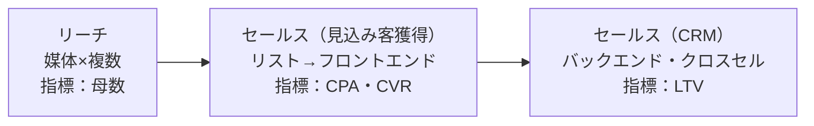

# 第11章　LPとコミュニケーションファネル

第10章で、私たちはコミュニケーションの**原理**——マーケターが書き換えられるのは相手の[脳内情報空間](GLOSSARY.md#脳内情報空間)だけであり（[第10章 1節](10-information-space-content.md#1-脳内情報空間頭の中に広がっている世界)）、その書き換えは[ゴール（＝MOA）から逆算](10-information-space-content.md#3-ゴールの脳内情報空間から逆算する)して設計し、[コンテンツ](GLOSSARY.md#コンテンツ)（脳に刺激を与える情報）を相手の脳内情報空間の[外側（1.5メートル）](10-information-space-content.md#7-15メートル理論近すぎても遠すぎてもダメ)に置き、[what（一文）を固めてからhowで演出する](10-information-space-content.md#8-whatを一文に確定しhowで演出する)——という一連の理論を獲得した。

本章は、その原理を**実際の制作物に組み上げる「実装」の章**である。第10章が「なぜ効くか（原理）」なら、本章は「どう組むか（構造）」である。扱うのは、最も設計しやすく検証しやすいコミュニケーション面＝[LP](GLOSSARY.md#lp)を中心に、(1) LPという1接点の設計、(2) その外側にある全体動線（[コミュニケーションファネル](GLOSSARY.md#コミュニケーションファネル)と[媒体](GLOSSARY.md#媒体)）、(3) 制作の規律（[ワイヤーフレーム](GLOSSARY.md#ワイヤーフレーム)・[コピーキャット](GLOSSARY.md#コピーキャット)）の3層である。これはマーケターの第三の問い「**③どのように[コミュニケーション](GLOSSARY.md#コミュニケーション)するか**」（[第3章 3節](03-three-questions.md#3-どのようにコミュニケーションするか)）の、最終的な出力工程にあたる。

本章を貫く一文は、これである。**LPとは、読者の脳内情報空間を、買う瞬間（[MOA](GLOSSARY.md#moa)）に必要な状態へ書き換えるための、逆算設計された情報の連なりである**。商品を説明する場所ではない。各行は常に「この1行は取引（MOA）に近づけているか」だけで評価される。

LP本体の骨格は、読者の脳内情報空間を5段階で移行させる**コミュニケーション5大要素**である。その手前に、読ませるための入口＝[ビッグアイデア／FV](GLOSSARY.md#ビッグアイデアファーストビューfv)（[第10章 9節](10-information-space-content.md#9-ビッグアイデアfv)）が置かれる。

上図のとおり、LPはFVで読者の[情報の触手](GLOSSARY.md#ras)を捕まえ、そこから**共感→教育→約束→交渉→提示**の順に、読者の脳内情報空間を一段ずつ移行させ、最終的に[MOA](GLOSSARY.md#moa)（行動を起こす瞬間の脳内情報空間）へ到達させる。各要素は、欲求・需要・商品・オファー・理想という**脳の別レイヤー**を順に撃つ。

本章は4ブロックで進む。

- **(A) LPとは何か**：取引を成立させる設計物である（1節）／MOAへ逆算した情報の連なりである（2節）。
- **(B) LP本体＝5大要素**：[共感→教育→約束→交渉→提示の順](#3-共感教育約束交渉提示の順に脳内情報空間を移行させる)（3節）／[各要素が撃つ脳レイヤー](#4-共感欲求教育需要約束商品交渉オファー提示理想)（4節）／[教育と約束の分離](#5-教育は需要欲求の教育約束は商品説明である)（5節）。
- **(C) LPの外側＝ファネルと媒体**：[コミュニケーションファネル3段](#6-コミュニケーションファネルはリーチ見込み客獲得crmの3段である)（6節）／[媒体は人が作った装置](#7-媒体はすべて人によって作られたものである)（7節）／[画面の向こうに人がいる](#8-画面の向こう側に人がいる)（8節）／[人数×時間×姿勢](#9-媒体の価値は人数時間姿勢で見る)（9節）。
- **(D) 制作の規律**：[白黒のワイヤーフレーム](#10-ワイヤーフレームは白黒で作る)（10節）／[コピーキャットで構造抽出](#11-コピーキャットで構造を抽出する)（11節）。

本章を終えると、[第12章](12-cmo-work.md)のCMOワーク（どの需要でNo.1を取り、そこへどう至るか）を実行するための、コミュニケーション実装の全部品が揃う。

---

## 1. LPは商品を説明する場所ではなく、取引を成立させるコミュニケーション設計物である

> **要約**：LP（ランディングページ）は、商品を説明する場所ではなく、取引を成立させるためのコミュニケーション設計物である。コミュニケーションとは脳内情報空間を書き換えて取引を促すことであり、LPはその一形態にすぎない。だからLPの良し悪しは、情報の網羅性・正確さ・デザインの美しさではなく、「読者を取引（買う瞬間＝MOA）へどれだけ近づけたか」だけで決まる。各行・各セクションは、すべて「この1行は取引に近づけているか」で評価する。LP制作時は手元に商品があるため、放っておくと商品スペックの説明（需要寄り）に引っ張られる——これが左右対称の罠である。意識的に欲求へ立ち返り、説明ではなく取引を設計する。

**原則**
- [LP](GLOSSARY.md#lp)とは、**商品を説明する場所ではなく、取引を成立させるための[コミュニケーション](GLOSSARY.md#コミュニケーション)設計物**である。
- コミュニケーションとは、相手の[脳内情報空間](GLOSSARY.md#脳内情報空間)を書き換えて[取引](GLOSSARY.md#取引)を促すことである（[第1章 7節](01-business-demand-supply-trade.md#7-コミュニケーションとは情報を伝達して取引を促すことである)）。ユーザーと接する面はすべてコミュニケーションであり、LPはその一形態にすぎない。最も設計しやすく、検証しやすい面である。
- だからLPの良し悪しは、情報の網羅性・正確さ・デザインの美しさではなく、**「読者を取引（買う瞬間＝[MOA](GLOSSARY.md#moa)）へどれだけ近づけたか」だけ**で決まる。

**根拠（なぜそうなのか）**
- ビジネスとは需要に供給を届けて[取引](GLOSSARY.md#取引)を成立させる行為であり（[第1章](01-business-demand-supply-trade.md)）、LPはその取引を成立させるために置かれる。取引に貢献しない情報は、どれほど正確でも、どれほど商品の魅力でも、LP上では役割を持たない。LPは図鑑でもカタログでもなく、取引のための装置だからだ。
- 「説明」に流れてしまうのは、**人は見えているものを見てしまう**からだ。LP制作時、マーケターの手元には商品がある。放っておくと、視線は商品のスペック・仕様（[需要](GLOSSARY.md#需要)寄り・供給側）に吸い寄せられ、「この商品はこんなに良い」と説明を始めてしまう。これが事業づくりとコミュニケーションで見る軸が逆になる[左右対称の罠](GLOSSARY.md#左右対称の罠)（[第2章](02-desire-to-demand.md)）のコミュニケーション側の現れである。事業を作るときは需要を見るべきだが、コミュニケーションするときは需要（商品の良さ）に張り付かず、[欲求](GLOSSARY.md#欲求)に立ち返らなければならない。
- 商品説明が取引に直結しないのは、人が[商品](GLOSSARY.md#商品)そのものに興味がないからだ。人が興味を持つのは、自分の悩み・欲求がどう解決されるかであって、商品の仕組みではない。説明を厚くするほど、読者の興味（[コンテンツ](GLOSSARY.md#コンテンツ)性）は薄れ、取引から遠ざかる。

**使い方（どう適用するか）**
- LPの各セクション・各行を、**「これは取引（MOA）に近づけているか」**で点検する。近づけていない情報は、正しくても・魅力的でも削る（[第10章 3節](10-information-space-content.md#3-ゴールの脳内情報空間から逆算する)の「すべての情報に“なぜ載せたか”を100%言える状態」）。
- 商品を説明したくなったら、いったん手を止め、**欲求へ立ち返る**。「この商品はどんな欲求を解決するのか」「読者は何を手に入れたくて、ここに来たのか」を先に問い、説明ではなく取引を設計する。
- LPを「読み物」「会社案内」として作らない。冒頭から、読者を取引へ動かす1本の動線として組む。情報を並べるのではなく、脳内情報空間を順に書き換える設計として組み立てる（[2節](#2-lpは読者の脳内情報空間をmoaに必要な状態へ書き換える情報の連なりである)）。

**適用条件**
- 使う場面：取引・行動の成立を目的とする、あらゆるコミュニケーションツール（LP・広告・セールスレター・DM・セールストーク・パッケージ）の設計と点検。
- 使わない場面：物理的な事実そのものを良くする工程（＝プロダクト改善）は本章の対象ではない。ビジネスのグロース手段は「プロダクト改善」か「コミュニケーション改善」の2つだが（[第1章](01-business-demand-supply-trade.md)）、LPが担うのは後者である。
- 接続：「取引を成立させる」をさらに精密化すると、「読者の脳内情報空間を[MOA](GLOSSARY.md#moa)へ書き換える」になる。それが[2節](#2-lpは読者の脳内情報空間をmoaに必要な状態へ書き換える情報の連なりである)である。

**誤用と注意**
- **LPを商品説明の場と取り違えない**。スペック・成分・機能の網羅は、それ自体では取引を生まない。説明は、[ベネフィット](GLOSSARY.md#ベネフィット)を信じさせるために必要な分だけ使う（[5節](#5-教育は需要欲求の教育約束は商品説明である)）。
- **網羅性・正確さで満足しない**。正しさは必要条件であって十分条件ではない。読まれ・信じられ・行動されて初めて取引になる（[3つのNot](GLOSSARY.md#3つのnot)、[第9章 7節](09-sales-and-offer.md#7-3つのnotnot-read--not-believe--not-act)）。
- **デザインの美しさをゴールにしない**。見た目は取引のための手段であり、目的ではない。むしろ装飾は判断を曇らせる（[10節](#10-ワイヤーフレームは白黒で作る)）。

**具体例**
- 同じ男性化粧水のLPでも、「この商品は○○成分を配合し、保湿力が高く、無香料で……」と特徴を並べたものは、商品説明であって取引設計ではない。読者の脳内情報空間はほとんど動かない。一方、「鏡を見るたび、肌の乾いた感じが気になる」という欲求から入り、「だからこういう肌になりたいはずだ」という理想へ動かし、その理想を叶える手段として商品を差し出すLPは、各行が取引へ向かって読者を動かしている。商品は同じでも、前者は説明、後者は取引設計である。

**関連**
- 用語：[LP](GLOSSARY.md#lp) / [コミュニケーション](GLOSSARY.md#コミュニケーション) / [取引](GLOSSARY.md#取引) / [左右対称の罠](GLOSSARY.md#左右対称の罠)
- 章節：[第1章 7節](01-business-demand-supply-trade.md#7-コミュニケーションとは情報を伝達して取引を促すことである)（コミュニケーション＝脳内情報空間の書き換え）/ [第2章](02-desire-to-demand.md)（欲求と需要・左右対称の罠）/ [2節](#2-lpは読者の脳内情報空間をmoaに必要な状態へ書き換える情報の連なりである)（取引＝MOAへの書き換え）

---

## 2. LPは、読者の脳内情報空間をMOAに必要な状態へ書き換える情報の連なりである

> **要約**：LPの正体は、読者の脳内情報空間を、見る前の素の状態（MOL）から、買う瞬間の状態（MOA）へ移行させる、逆算設計された情報の連なりである。行動は、論理メーターと感情メーターがともに行動の閾値を超えた瞬間に起きる。だからLPは、その閾値を超えさせる装置として設計する。組み方は逆算——①ゴール＝MOA（買う瞬間に脳内を流れている決め手1〜2個と、最後に解消すべきボトルネック）を一文で固定する→②そのMOAにいる読者が持つ論理・感情を定義する→③その論理・感情を作るために投入すべき情報（コピー・証拠・ビジュアル）を決める。先に「載せたい情報」を並べてはいけない。情報は必ずMOAから逆算して選ぶ。これは第10章の逆算設計とMOAを、LPという具体物に実装したものである。

**原則**
- [LP](GLOSSARY.md#lp)とは、読者の[脳内情報空間](GLOSSARY.md#脳内情報空間)を、見る前の素の状態（[MOL](GLOSSARY.md#mol)）から、買う瞬間の状態（[MOA](GLOSSARY.md#moa)）へ移行させる、**逆算設計された情報の連なり**である。
- 行動は、脳内の**論理メーターと感情メーターが、ともに[行動の閾値](GLOSSARY.md#行動の閾値)を超えた瞬間**に起きる（[第10章 4節](10-information-space-content.md#4-moa行動を起こす瞬間の脳内情報空間)）。LPは、この両メーターを閾値超えまで引き上げる装置である。
- 組み方は**逆算**である。①ゴール＝MOAを一文で固定する → ②そのMOAにいる読者が持つ[論理・感情](GLOSSARY.md#論理感情)を定義する → ③その論理・感情を作るために投入すべき情報を決める。**先に「載せたい情報」を並べてはいけない**。

**根拠（なぜそうなのか）**
- 行動がMOAという一点で起きるからだ。検討中の読者は複雑に考えるが、行動の瞬間に脳内を流れる決め手は、砂時計のくびれのように1〜2個へ絞られる（ヒューリスティックな意思決定、[第10章 4節](10-information-space-content.md#4-moa行動を起こす瞬間の脳内情報空間)）。この一点（MOA）を先に定義しなければ、何を投入すれば閾値を超えるのかが定まらない。
- 逆算でしか正しい情報を選べないのは、**同じ商品でもゴール（MOAの脳内情報空間）が違えば、伝えるべき情報が丸ごと変わる**からだ（[第10章 3節](10-information-space-content.md#3-ゴールの脳内情報空間から逆算する)）。ゴールを先に1つに固定しないと、投入情報の取捨基準が立たず、商品都合の情報が増殖する。
- 「載せたい情報」から組むと失敗するのは、手前から積み上げると送り手が言いたいこと（商品スペック）を並べてしまうからだ（[1節](#1-lpは商品を説明する場所ではなく取引を成立させるコミュニケーション設計物である)）。MOAから逆算して初めて、各行を「この1行はMOAに近づけているか」で取捨できる。

**使い方（どう適用するか）**
- まず**MOAを一文で固定する**。「この読者が“今だ、これだ”と思って申し込む瞬間、脳内に何が流れているか」を書く。決め手1〜2個、または最後に解消すべきボトルネック（不安）を特定する。MOAは[憑依](GLOSSARY.md#憑依)（[第5章](05-persona-mind-map.md)）で掴み、「最後の決め手は何でしたか」「買ったとき、どんな感じでしたか」と瞬間に戻す質問で生の言葉を取る（[第10章 4節](10-information-space-content.md#4-moa行動を起こす瞬間の脳内情報空間)）。
- MOAから逆算して、**必要な論理・感情 → 投入情報**の順に降ろす。MOL（素の状態）からMOAまで、どんな論理・感情を順に積めば両メーターが閾値を超えるかを設計する。この「順に積む」具体形が、5大要素（[3節](#3-共感教育約束交渉提示の順に脳内情報空間を移行させる)）である。
- 各行・各セクションを「MOAに近づけているか」で点検し、近づけない情報は削る。乱れ撃ちで何かが当たればよい、という作り方をしない。

**適用条件**
- 使う場面：LP・広告・メール・セールストークなど、取引や行動を目的とするすべてのコミュニケーション設計の起点。
- 使わない場面：MOAが一文に定まらないうちに、本文やコピー（[how](GLOSSARY.md#what--how)）を書き始めない。MOAは設計の出発点であり、ここから逆算する。
- 接続：本節は[第10章 3節](10-information-space-content.md#3-ゴールの脳内情報空間から逆算する)（ゴールから逆算）と[第10章 4節](10-information-space-content.md#4-moa行動を起こす瞬間の脳内情報空間)（MOA）を、LPという具体物へ実装したものである。逆算で決まった「積む順番」を5段階に展開したものが、次節以降の5大要素である。

**誤用と注意**
- **「載せたい情報」から設計を始めない**。手元の商品情報から組むと、MOAへ収束しない情報の羅列になる。
- ゴール（MOA）を複数持たない。決め手が3つも4つもあると、投入情報が割れ、閾値を超えきらない。最も効く1〜2個へ絞る。
- LPを「情報の集合」と考えない。LPは情報の連なり（順序を持った1本の動線）であり、順序が変われば書き換えの結果も変わる。

**具体例**
- 高額の家電を通販で買う瞬間のMOAが「型落ちで十分なのに最新がこの価格なら買い時だ＋本当に正規品が届くのか」だと特定できたとする。すると逆算で、LPに必要なのは「最新と型落ちの差は実生活ではこれだけ」という論理（決め手の補強）と、「正規・到着実績」という不安解消（ボトルネックの除去）だと決まる。逆に、MOAを定義せずに「この家電の全機能」を説明し始めると、決め手にもボトルネック解消にもならない情報でページが埋まり、読者は閾値を超えないまま離脱する。MOAを先に固定するから、載せる情報と載せない情報が分かれる。

**関連**
- 用語：[LP](GLOSSARY.md#lp) / [MOA](GLOSSARY.md#moa) / [MOL](GLOSSARY.md#mol) / [行動の閾値](GLOSSARY.md#行動の閾値)
- 章節：[第10章 3節](10-information-space-content.md#3-ゴールの脳内情報空間から逆算する)（ゴールから逆算）/ [第10章 4節](10-information-space-content.md#4-moa行動を起こす瞬間の脳内情報空間)（MOA）/ [1節](#1-lpは商品を説明する場所ではなく取引を成立させるコミュニケーション設計物である)（取引を成立させる設計物）/ [3節](#3-共感教育約束交渉提示の順に脳内情報空間を移行させる)（積む順番＝5大要素）

---

## 3. 共感・教育・約束・交渉・提示の順に脳内情報空間を移行させる

> **要約**：LP本体の骨格は、読者の脳内情報空間を共感→教育→約束→交渉→提示の順に移行させるコミュニケーション5大要素である。共感で痛み・欲を再生して信頼を作り、教育で「○○で選べばいい」というモノサシを渡し、約束でベネフィットを特徴・効果・証拠とともに約束し、交渉でオファーをYESにし、提示で理想のシーンを描いて感情を先取りさせる。この順序が意味を持つのは、MOAへ至るには段階を一段ずつ積む必要があるからだ（一段飛ばすと1.5メートル理論で離脱する）。本編の手前には、読ませるための入口＝ビッグアイデア／FVが置かれる。ただしこれは物理的な並び順の固定ではなく、「読者の脳内で踏ませる5つの段階」である。媒体・商材によって各要素の厚みや物理配置は前後する。

**原則**
- [LP](GLOSSARY.md#lp)本体の骨格は、読者の[脳内情報空間](GLOSSARY.md#脳内情報空間)を順に移行させる**[共感・教育・約束・交渉・提示](GLOSSARY.md#共感教育約束交渉提示コミュニケーション5大要素)**（コミュニケーション5大要素）である。各要素の役割は一言で次のとおり。
  1. **共感**——痛み・欲を再生させ「この人はわかっている」という信頼を作り、欲を顕在化する。
  2. **教育**——「○○で選べばいい」という[モノサシ（評価基準）](#5-教育は需要欲求の教育約束は商品説明である)を渡す。
  3. **約束**——[ベネフィット](GLOSSARY.md#ベネフィット)を、[特徴](GLOSSARY.md#特徴)・[効果](GLOSSARY.md#効果)・[証拠](GLOSSARY.md#証拠)とともに約束する（＝商品説明）。
  4. **交渉**——[オファー](GLOSSARY.md#オファー)をYESにする条件設計と感情の後押し。
  5. **提示**——理想の[シーン](GLOSSARY.md#シーン)を自分ごとで想像させ、感情を[先取り](GLOSSARY.md#先取り感情)させる。
- 本編（5大要素）の**手前に、読ませるための入口＝[ビッグアイデア／FV](GLOSSARY.md#ビッグアイデアファーストビューfv)**を置く（[第10章 9節](10-information-space-content.md#9-ビッグアイデアfv)）。FVで[情報の触手](GLOSSARY.md#ras)を捕まえてから、本編へ滑り込ませる。
- これは**物理的な並び順の固定ではなく、「読者の脳内で踏ませる5つの段階」**である。媒体・商材によって、各要素の厚みや物理的な配置は前後する。

**根拠（なぜそうなのか）**
- 5段階が要るのは、MOAへ至る道に**順番があるから**だ。人はいきなり「買う」状態にはならない。まず自分の欲求が顕在化し（共感）、次に何で選べばよいかの基準を得て（教育）、その基準で商品に納得し（約束）、取引条件にYESを出し（交渉）、最後に手に入る理想を思い描いて（提示）行動する。この順を踏まないと、論理メーターと感情メーターは閾値まで上がらない。
- 一段飛ばすと離脱するのは、[1.5メートル理論](GLOSSARY.md#15メートル理論)（[第10章 7節](10-information-space-content.md#7-15メートル理論近すぎても遠すぎてもダメ)）の通り、今の脳内情報空間から遠すぎる情報は繋がる先がなく捨てられるからだ。共感を飛ばして教育に入れば「自分ごと」にならず、教育を飛ばして約束（商品説明）に入れば「売り込み」と取られる。段階は脳内情報空間を一歩ずつ進めるためにある。
- 手前にFVが要るのは、本編がどれほど優れていても、入口で[情報の触手](GLOSSARY.md#ras)を捕まえなければ読まれない（[Not Read](GLOSSARY.md#3つのnot)、[第9章 7節](09-sales-and-offer.md#7-3つのnotnot-read--not-believe--not-act)）からだ。FVは読者の感情を点火し、[滑り台効果](GLOSSARY.md#滑り台効果)（次へ次へ読み進む状態）の起点になる。
- 並び順が固定でないのは、5大要素が「物理的なセクションの並び」ではなく「脳内で起こす状態変化」だからだ。たとえば[提示](#4-共感欲求教育需要約束商品交渉オファー提示理想)（未来描写）はFV付近や約束の直後にも置かれる。低関与の流入（動画広告など）は、冒頭で相手の求めるものを面白く出してから共感・教育へ入る、といった媒体補正が要る。

**使い方（どう適用するか）**
- LPの設計図（コミュニケーションストーリー）を、**5大要素のラベルで組む**。MOA（[2節](#2-lpは読者の脳内情報空間をmoaに必要な状態へ書き換える情報の連なりである)）から逆算し、共感→教育→約束→交渉→提示の各段で「どんな論理・感情を作るか」を定義してから、投入情報を決める。
- 最初に**FVで触手を捕まえる**。供給（商品都合）を一度忘れ、ペルソナが絶対に興味を持つ入口を、具体的な感情シーンから作る（[第10章 9節](10-information-space-content.md#9-ビッグアイデアfv)）。FVが弱ければ、本編は読まれない前提で点検する。
- 各要素の**厚みを媒体・商材で可変にする**。高単価・検討が長い商材は教育と交渉を厚く、低関与の流入は冒頭の引きとテンポを優先する。順序（脳内で踏ませる段階）は保ちつつ、物理配置と分量を調整する。
- 設計時は、5要素を「並べる」のではなく「**読者の脳内をこの順に書き換える**」と捉える。各セクションの直後に「いま読者の脳内情報空間はどう変わったか」を自問する。

**適用条件**
- 使う場面：LP・セールスレター・縦長の広告・セールス動画など、読者を取引へ動かすコミュニケーションツールの全体構成設計。
- 使わない場面：5要素を「必ずこの物理順に並べる固定テンプレート」として機械適用しない。脳内で踏ませる段階として理解し、媒体・商材で配置と厚みを変える。
- 接続：各要素が脳のどのレイヤーを撃つかは[4節](#4-共感欲求教育需要約束商品交渉オファー提示理想)、教育と約束の厳密な分離は[5節](#5-教育は需要欲求の教育約束は商品説明である)で扱う。各要素の具体的な書き方（Do/Don't）は、本書のLP制作リファレンス（理論パートPart 5）に対応する。

**誤用と注意**
- **共感を「情緒的な雰囲気づくり」と取り違えない**。本書の共感は[欲求](GLOSSARY.md#欲求)を撃つ構造ステージであり、「共感を生む」という曖昧な情緒語ではない。痛み・欲を具体的な[シーン](GLOSSARY.md#シーン)で再生させ、信頼と欲の顕在化という機能を果たす。
- 段階を飛ばさない。共感なしの教育、教育なしの約束（商品説明）は、繋がる先がなく離脱を生む。
- FVを本編と切り離して「引きだけ」を強くしない。引きは強く、しかし本編へ繋がり、[Not Believe](GLOSSARY.md#3つのnot)で弾かれない範囲で作る（[第10章 9節](10-information-space-content.md#9-ビッグアイデアfv)）。

**具体例**
- サプリのLPで、いきなり「この成分が効きます」（約束＝商品説明）から始めると、読者は自分の悩みが顕在化しておらず、選ぶ基準も持っていないため、「売り込みだ」と弾く。正しくは——FVで「夕方になると、もう何もしたくないほど体が重い」という具体シーンで触手を捕まえ（入口）、共感で「あの気だるさ」を再生して信頼を作り、教育で「実はその疲れは○○の不足で、そこで選ぶといい」という基準を渡し、そこで初めて約束で「この商品は○○を満たす」と差し出す。同じ商品でも、5段階を順に踏ませた後者だけが、読者をMOAへ近づける。

**関連**
- 用語：[共感・教育・約束・交渉・提示](GLOSSARY.md#共感教育約束交渉提示コミュニケーション5大要素) / [ビッグアイデア／FV](GLOSSARY.md#ビッグアイデアファーストビューfv) / [滑り台効果](GLOSSARY.md#滑り台効果)
- 章節：[第10章 9節](10-information-space-content.md#9-ビッグアイデアfv)（入口＝FV）/ [第10章 7節](10-information-space-content.md#7-15メートル理論近すぎても遠すぎてもダメ)（一段ずつ進める）/ [4節](#4-共感欲求教育需要約束商品交渉オファー提示理想)（各要素が撃つレイヤー）/ [5節](#5-教育は需要欲求の教育約束は商品説明である)（教育と約束の分離）

---

## 4. 共感＝欲求、教育＝需要、約束＝商品、交渉＝オファー、提示＝理想

> **要約**：5大要素は、それぞれ読者の脳の別レイヤーを撃つ。共感＝欲求、教育＝需要、約束＝商品、交渉＝オファー、提示＝理想（ベネフィット）。この対応を持つと、各セクションが「いま脳のどこを撃っているか」を一意に定位でき、撃つべきレイヤーと中身がズレているセクション（例：教育の場所で商品説明をしている）を発見できる。各レイヤーは、行動の閾値を超えるための別機能の部品である——欲求の顕在化（共感）、需要のモノサシ化（教育）、商品への納得（約束）、取引のYES（交渉）、理想の先取り（提示）。総和ではなく、別機能の部品が分布として揃って初めて閾値を超える。だからどれか一つのレイヤーだけを厚くしても、行動は起きない。

**原則**
- 5大要素は、それぞれ読者の脳の**別レイヤー**を撃つ。対応は次のとおり。

| 順 | 要素 | 撃つ脳レイヤー | そのレイヤーで起こすこと |
|---|---|---|---|
| 1 | [共感](GLOSSARY.md#共感教育約束交渉提示コミュニケーション5大要素) | 【[欲求](GLOSSARY.md#欲求)】痛み・悩み・不安 | 痛み／欲を再生し、信頼を作り、欲を顕在化する |
| 2 | [教育](GLOSSARY.md#共感教育約束交渉提示コミュニケーション5大要素) | 【[需要](GLOSSARY.md#需要)】解決策・選択肢の比較 | 「○○で選べばいい」というモノサシ（評価基準）を渡す |
| 3 | [約束](GLOSSARY.md#共感教育約束交渉提示コミュニケーション5大要素) | 【[商品](GLOSSARY.md#商品)】製品理解・マッチング | [ベネフィット](GLOSSARY.md#ベネフィット)を約束し、[特徴](GLOSSARY.md#特徴)・[効果](GLOSSARY.md#効果)・[証拠](GLOSSARY.md#証拠)で納得させる |
| 4 | [交渉](GLOSSARY.md#共感教育約束交渉提示コミュニケーション5大要素) | 【[オファー](GLOSSARY.md#オファー)】取引条件・今動くリスク | オファーをYESにする条件設計と感情の後押し |
| 5 | [提示](GLOSSARY.md#共感教育約束交渉提示コミュニケーション5大要素) | 【理想】[ベネフィット](GLOSSARY.md#ベネフィット)・成功の未来 | 理想のシーンを自分ごとで想像させ、感情を[先取り](GLOSSARY.md#先取り感情)させる |

- 上表のとおり、共感は[欲求](GLOSSARY.md#欲求)を、教育は[需要](GLOSSARY.md#需要)を、約束は[商品](GLOSSARY.md#商品)を、交渉は[オファー](GLOSSARY.md#オファー)を、提示は理想（[ベネフィット](GLOSSARY.md#ベネフィット)）を撃つ。総括すると「**需要とは、お金を払って“欲”を解決するための手段である**」という構造が、5レイヤーに展開されている。

**根拠（なぜそうなのか）**
- 各レイヤーが**[行動の閾値](GLOSSARY.md#行動の閾値)を超えるための別機能の部品**だからだ。閾値超えは要素の総和ではなく分布で決まる（[第10章 4節](10-information-space-content.md#4-moa行動を起こす瞬間の脳内情報空間)）。欲求の顕在化・需要のモノサシ化・商品への納得・取引のYES・理想の先取りは、互いに代替できない別機能であり、どれか一つを厚くしても他が欠ければ行動は起きない。だから5つのレイヤーを順に撃つ。
- レイヤーの対応を持つと、**ズレを発見できる**からだ。「いまこのセクションは脳のどこを撃っているか」を一意に定位できると、撃つべきレイヤーと中身が食い違っているセクションが見える。最も多いズレが「教育（需要レイヤー）の場所で約束（商品レイヤー）をしている」であり、これは[5節](#5-教育は需要欲求の教育約束は商品説明である)で扱う。
- 提示が理想（[ベネフィット](GLOSSARY.md#ベネフィット)）を撃つのは、人が最後に**理想を思い描いてYESと言う**からだ。行動の前に頭の中で「満たされた状態」を想像させると、感情を先に味わえる（[先取り感情](GLOSSARY.md#先取り感情)）。脳はその感情を手に入れたくて行動を始める。だから提示は約束（商品の納得）とは別レイヤーとして要る。

**使い方（どう適用するか）**
- LPの各セクションに、**撃っている脳レイヤーのラベル**（欲求／需要／商品／オファー／理想）を付ける。ラベルが付かないセクションは、役割が曖昧なノイズである可能性が高い。
- 撃つべきレイヤーと中身が合っているかを点検する。共感のセクションが商品説明になっていないか、教育のセクションが「選ぶ基準」ではなく「商品の良さ」になっていないか（[5節](#5-教育は需要欲求の教育約束は商品説明である)）を確認する。
- 5レイヤーが**全部撃たれているか**を確認する。どれかが欠けていれば、閾値超えに必要な部品が足りていない。たとえば提示（理想の先取り）が抜けていれば、論理は満たしても最後の感情が動かず、YESに至らない。

**適用条件**
- 使う場面：LPの全体構成のレビュー、各セクションの役割定義、ストーリーの抜け漏れ点検。
- 使わない場面：5レイヤーを撃つ順番（[3節](#3-共感教育約束交渉提示の順に脳内情報空間を移行させる)）を無視して、レイヤー対応だけを機械適用しない。順序と対応はセットで使う。
- 接続：本節は[3節](#3-共感教育約束交渉提示の順に脳内情報空間を移行させる)（順序）に「各段が撃つレイヤー」を重ねたものである。最重要のレイヤー区別（教育＝需要、約束＝商品）は[5節](#5-教育は需要欲求の教育約束は商品説明である)で掘り下げる。

**誤用と注意**
- **レイヤーを混ぜない**。とくに教育（需要）と約束（商品）の混同は、LPで最も起きる失敗である（[5節](#5-教育は需要欲求の教育約束は商品説明である)）。
- どれか一つのレイヤーだけを厚くしない。約束（商品説明）を厚くしても、共感・教育・提示が薄ければ閾値は超えない。閾値超えは分布で決まる。
- 提示を「感情ワードの羅列」にしない。理想は名指しでは伝わらず、[シーン](GLOSSARY.md#シーン)を描いて先取りさせる（[第7章](07-product-planning-map.md)のベネフィット、[第9章](09-sales-and-offer.md)のセールス）。

**具体例**
- 矯正歯科のLPを5レイヤーで分解すると——共感（欲求）：「写真で口元を隠してしまう」痛みを再生する。教育（需要）：「矯正は“見た目”だけでなく“通院のしやすさ・期間”で選ぶといい」という基準を渡す。約束（商品）：その基準で「このクリニックは通院が少なく短期」と[ベネフィット](GLOSSARY.md#ベネフィット)を[証拠](GLOSSARY.md#証拠)つきで約束する。交渉（オファー）：「まず無料相談から」と軽いYESを設計する。提示（理想）：「治った歯で、久しぶりに会う友達の前で思いきり笑う」シーンで感情を先取りさせる。各セクションが別レイヤーを撃ち、5つ揃って初めてMOAへ近づく。

**関連**
- 用語：[共感・教育・約束・交渉・提示](GLOSSARY.md#共感教育約束交渉提示コミュニケーション5大要素) / [欲求](GLOSSARY.md#欲求) / [需要](GLOSSARY.md#需要) / [行動の閾値](GLOSSARY.md#行動の閾値) / [先取り感情](GLOSSARY.md#先取り感情)
- 章節：[3節](#3-共感教育約束交渉提示の順に脳内情報空間を移行させる)（撃つ順番）/ [5節](#5-教育は需要欲求の教育約束は商品説明である)（教育と約束の分離）/ [第10章 4節](10-information-space-content.md#4-moa行動を起こす瞬間の脳内情報空間)（閾値は分布で超える）/ [第7章](07-product-planning-map.md)（特徴・効果・ベネフィット・証拠）

---

## 5. 教育は需要・欲求の教育、約束は商品説明である

> **要約**：5大要素で最も混同されるのが教育と約束だ。教育＝需要・欲求の教育であり、「○○で選べばいい」というモノサシ（評価基準）を読者の脳にインストールする工程。約束＝商品説明であり、ベネフィットを特徴・効果・証拠で約束する工程。この二つを分離するのが本章の核心的な再定義である。なぜなら人は商品に興味がなく、自分の悩みがどう解決されるか（解決策＝需要の話）に興味があるからだ。需要ができる前に商品説明を始めると、売り込みと取られて離脱する。だから教育では、自社のUSPが最高得点になるモノサシを設計し、商品名は出さずに「選ぶ基準」だけを渡す。需要が立ち上がってから、約束で「実はそれを満たす商品があります」と差し出す。約束はベネフィット→特徴・効果→証拠の順で組む。

**原則**
- 5大要素のうち、**教育と約束は明確に別物**である。混同してはならない。
  - **教育＝需要・欲求の教育**。「○○で選べばいい」という**モノサシ（評価基準）**を読者の脳にインストールする工程。商品名・スペックは出さず、選ぶ基準だけを渡す。
  - **約束＝商品説明**。[ベネフィット](GLOSSARY.md#ベネフィット)を、[特徴](GLOSSARY.md#特徴)・[効果](GLOSSARY.md#効果)・[証拠](GLOSSARY.md#証拠)とともに約束する工程。
- この分離が本章の**核心的な再定義**である。教育で商品説明を始めてしまうのが、LPで最も多い失敗だからだ。
- 教育では、**自社の[USP](GLOSSARY.md#usp)が最高得点になるモノサシ**を設計する。読者がその基準で探し始めれば、自社商品が自然に最上位に来る。

**根拠（なぜそうなのか）**
- 人は[商品](GLOSSARY.md#商品)そのものに興味がないからだ。興味があるのは、自分の悩み・欲求がどう解決されるか（＝解決策＝[需要](GLOSSARY.md#需要)の話）である。だから「商品の話（約束）」より先に「解決策の話（教育）」をしなければ、読者の興味は立ち上がらない。
- 需要ができる前に商品説明をすると、**売り込みと取られて離脱する**からだ。読者がまだ「何で選べばいいか」を知らない段階で「この商品は○○です」と言われても、評価する物差しがないため、判断できず警戒する。先にモノサシを渡し、需要を立ち上げてから商品を出す。
- モノサシを自社USPに合わせて設計すべきなのは、教育が「中立な知識提供」ではなく「**自社商品が最高得点になる基準のインストール**」だからだ。同じ解決策でも、どの基準で選ばせるかで勝者が変わる。自社の[USP](GLOSSARY.md#usp)（競合がマネできず、欲を満たすことに直結する強み）が最高点になる基準を選べば、競合否定も「その基準で見るとこれは劣る」という形で強く働く。

**使い方（どう適用するか）**
- 教育では、**商品名を出さずにモノサシだけを渡す**。「整うには芯から温めることが大事で、それには遠赤外線がいい」のように、選ぶ基準を一段ずつ（[1.5メートル理論](GLOSSARY.md#15メートル理論)、[第10章 7節](10-information-space-content.md#7-15メートル理論近すぎても遠すぎてもダメ)）インストールする。常に読者の欲に紐づけ、いきなり専門語から入らない。
- 渡すモノサシは、**自社[USP](GLOSSARY.md#usp)が最高得点になる基準**を選ぶ。「何で選べばいいか」の答えが、自社の強みに一致するよう設計する。
- 需要が立ち上がってから、**約束で「実はそれを満たす商品があります」と差し出す**。約束は[ベネフィット](GLOSSARY.md#ベネフィット)（イメージさせる）→[特徴](GLOSSARY.md#特徴)・[効果](GLOSSARY.md#効果)（なぜそうなるか＝納得）→[証拠](GLOSSARY.md#証拠)（さらに信じさせる）の順で組む（[第7章 8節](07-product-planning-map.md)）。特徴を「だから良い」と約束せず、ベネフィットを約束して特徴・効果はその根拠に回す。
- 約束の**情報量を最適化する**。ベネフィットを「信じられる・納得できる」レベルまでは説明するが、説明しすぎると情報過多で「もういい」となる。どこまで出せば納得するかを設計する。

**適用条件**
- 使う場面：LPの中盤（教育→約束）の設計とレビュー。「この情報は需要を作る話（教育）か、商品を信じさせる話（約束）か」を切り分けるとき。
- 使わない場面：教育を「中立で網羅的な解説」にしない。教育は取引へ向けた、自社USP起点のモノサシ設計である。
- 接続：本節は[4節](#4-共感欲求教育需要約束商品交渉オファー提示理想)のレイヤー区別（教育＝需要、約束＝商品）を、最も誤りやすい一点に絞って掘り下げたものである。約束の中身（特徴・効果・ベネフィット・証拠）は[第7章](07-product-planning-map.md)、USPは[第8章](08-product-concept.md)が正本。

**誤用と注意**
- **教育で商品説明を始めない**（Ver.1の最大の失敗）。需要が立ち上がる前のスペック・成分の列挙は、売り込みと取られて離脱を生む。
- 教育を「作り手が語りたい専門知識」にしない。毎ブロック読者の欲（ゴール）に紐づけ、専門語から入らない。
- 約束で**特徴を約束しない**。「○○と××が一緒です、だから良い」は、特徴の提示であって動機にならない。約束するのは[ベネフィット](GLOSSARY.md#ベネフィット)であり、特徴・効果・証拠はそれを信じさせる材料である（[第7章](07-product-planning-map.md)）。

**具体例**
- サウナ施設のLP。教育（需要）では商品名を出さず、「サウナで“整う”には、芯から温まることが大事 → ドライサウナは表面しか温まらない → 芯まで温めるには遠赤外線が要る」と、選ぶ基準を一段ずつ渡す。ここで「遠赤外線で芯から温まる施設がいい」という需要が読者の中に立ち上がる。そこで初めて約束（商品）に入り、「この施設は遠赤外線の岩盤浴で芯から温まる（ベネフィット）→ その仕組み（特徴・効果）→ 体験者の声（証拠）」と差し出す。もし教育を飛ばして「うちは遠赤外線です」と始めれば、読者は遠赤外線を選ぶ理由を持っておらず、刺さらない。教育で需要を作るから、同じ商品説明が効く。

**関連**
- 用語：[共感・教育・約束・交渉・提示](GLOSSARY.md#共感教育約束交渉提示コミュニケーション5大要素) / [需要](GLOSSARY.md#需要) / [ベネフィット](GLOSSARY.md#ベネフィット) / [USP](GLOSSARY.md#usp)
- 章節：[4節](#4-共感欲求教育需要約束商品交渉オファー提示理想)（教育＝需要、約束＝商品）/ [第7章](07-product-planning-map.md)（特徴・効果・ベネフィット・証拠の順）/ [第8章](08-product-concept.md)（USP）/ [第10章 7節](10-information-space-content.md#7-15メートル理論近すぎても遠すぎてもダメ)（モノサシを一段ずつ）

---

## 6. コミュニケーションファネルはリーチ・見込み客獲得・CRMの3段である

> **要約**：ここでLPの外側へズームアウトする。LPは1接点にすぎず、その上位に媒体をまたぐ全体動線＝コミュニケーションファネルがある。ファネルはリーチ（媒体で見込み客に届く）→ セールス・見込み客獲得（リスト化し初回購入＝フロントエンドへ転換）→ セールス・CRM（バックエンド・クロスセルで継続購入）の3段で俯瞰し、1枚の図に落とす。1接点内の脳内段階である共感→教育→約束→交渉→提示とは階層が異なる（5大要素は1ツール内の構成、ファネルは媒体をまたぐ動線）。経済性はユニットエコノミクス＝LTV÷CPAで測り、まず1を超えなければ価値ゼロ。CPAは差が出にくく、差が出やすいのはLTV。だから媒体・経路ごとに計算し、ファネルごとに許容CPAを決め、最もレバレッジの効く段にリソースを寄せる。

**原則**
- [LP](GLOSSARY.md#lp)は1接点にすぎない。その上位に、媒体をまたぐ全体動線＝**[コミュニケーションファネル](GLOSSARY.md#コミュニケーションファネル)**がある。これは1接点内の脳内段階である[共感→教育→約束→交渉→提示](#3-共感教育約束交渉提示の順に脳内情報空間を移行させる)とは**階層が異なる**（5大要素は1ツール内の構成、ファネルは媒体をまたぐ動線）。
- ファネルは**3段**で俯瞰し、1枚の図に落とす。
  1. **[リーチ](GLOSSARY.md#リーチ)**——[媒体](GLOSSARY.md#媒体)で見込み客に届く段。母数（キャパ）を稼ぐ。
  2. **セールス（見込み客獲得）**——リスト化し、初回購入（フロントエンド）へ転換する段。指標は[CPA](GLOSSARY.md#ユニットエコノミクス)（獲得コスト）と[CVR](GLOSSARY.md#ユニットエコノミクス)（転換率）。
  3. **セールス（CRM）**——2回目以降（バックエンド）・追加販売（クロスセル）で生涯価値を伸ばす段。指標は[LTV](GLOSSARY.md#ユニットエコノミクス)（顧客生涯価値）。
- 経済性は**[ユニットエコノミクス](GLOSSARY.md#ユニットエコノミクス)＝LTV ÷ CPA**で測る。**まず1を超えなければ価値はゼロ**（獲得コストを生涯で回収できていない）。

上図のとおり、コミュニケーションファネルは**リーチ → セールス（見込み客獲得）→ セールス（CRM）**の3段で進み、それぞれの経済性は母数・CPA／CVR・LTVで測る。見込み客は初回購入（フロントエンド）の前は全員「見込み客」、買った瞬間「顧客」になる。

**根拠（なぜそうなのか）**
- 3段で見るのは、**1回の取引で終わらせないため**だ。フロントエンド（初回購入）までの獲得コスト（CPA）と、その後のCRM（バックエンド・クロスセル）で生む価値（LTV）の両方が見えて初めて、いくらまでかけて獲得してよいかが判断できる。リスト化して継続的に取引を重ねる前提で設計しないと、経済性が合わない。
- ユニットエコノミクスで測るのは、**獲得コストと生涯価値の比でビジネスの粗利が決まる**からだ。まず1超を満たし、次にLTVを上げCPAを下げてこの値を最大化することが、ビジネスの根幹である。
- **CPAより LTVで差がつく**のは、CPAは媒体相場に縛られ劇的には差が出にくいのに対し、LTV（継続・追加購入の設計）はやり方で大きく動くからだ。だから差をつけるべきはCRM側のLTV向上である。
- 5大要素とファネルを混同してはいけないのは、両者が**別階層**だからだ。5大要素は「1人の読者の脳内を1接点内でどう動かすか」、ファネルは「複数の媒体・接点をまたいで、見込み客をどの経路で獲得・育成するか」。混ぜると、個々のコピーの話と経路全体の話が混線し、どちらも詰め切れない。なお、一般語の「ファネル」（AIDMA／AISAS等、1人の頭の中の認知→購入段階）とも別物である。

**使い方（どう適用するか）**
- コミュニケーションの相談を受けたら、まず**「ファネル（流れ）の話か、ツール（制作物）の話か」を切り分ける**。ファネルが描けていないのに個別バナーやLPの良し悪しを議論していたら、一度引いてファネル全体を1枚に描く。
- ファネルは**1枚の図に落とす**。媒体 → 中間コンテンツ → LP → 獲得ポイント（フォーム／リスト）→ CRM までを矢印で繋ぎ、経路ごとに数値計測を仕込む。経路は多対多で枝分かれ・合流してよい。
- 改善対象がどの段か（リーチ＝母数／見込み客獲得＝CPA・CVR／CRM＝LTV）を**自己定位**し、最もレバレッジの効く段・経路にリソースを寄せる。
- [ユニットエコノミクス](GLOSSARY.md#ユニットエコノミクス)は**媒体・ファネルごとに計算**し、ファネルごとに許容CPAを決める（媒体でLTVが変わるため）。見積もりはコンサバに置く（薄い水準は「少しのズレで赤字になる」）。

**適用条件**
- 使う場面：コミュニケーション設計の全体俯瞰、媒体・経路の投資判断、改善対象の定位、許容CPAの決定。
- 使わない場面：上流（[狙う需要](GLOSSARY.md#狙う需要)・[商品コンセプト](GLOSSARY.md#商品コンセプト)）が固まる前にファネル最適化に着手しない。ファネルは需要・供給を考え抜いた後の下流である。
- 接続：ファネルの入口を担う[リーチ](GLOSSARY.md#リーチ)＝[媒体](GLOSSARY.md#媒体)の見方は[7節](#7-媒体はすべて人によって作られたものである)〜[9節](#9-媒体の価値は人数時間姿勢で見る)で扱う。1接点（LP）内の構成は[3節](#3-共感教育約束交渉提示の順に脳内情報空間を移行させる)〜[5節](#5-教育は需要欲求の教育約束は商品説明である)。

**誤用と注意**
- **5大要素とファネルを混同しない**。5大要素は1接点内の脳内段階、ファネルは媒体をまたぐ動線。階層が違う。
- 一般語の「ファネル」（認知→興味→購入の心理段階）と取り違えない。本書のファネルは媒体をまたぐ獲得・育成の動線である。
- ユニットエコノミクスを全体だけで見ない。媒体・経路ごとに計算しないと、どの経路が黒字でどの経路が赤字かが分からない。
- CPA削減だけに注力しない。差が出やすいのはLTVであり、CRM（継続・追加販売）の設計を後回しにしない。

**具体例**
- 美容クリニックのファネルを1枚に描くと——リーチ（複数の広告・オーガニック媒体）→ 中間記事や複数のLP → 予約フォームやメッセージアプリの友だち登録で見込み客リスト化 → 初回来院（フロントエンド）→ 来院後アンケート・追加メニュー・継続予約（CRM）という多対多の動線になり、各経路にスプレッドシートで数値計測を仕込む。こうして1枚にすると、「どのLP改善が効くか」「どの媒体が最終的に安く取れるか」「どの段がボトルネックか」が見える。個別のLP1枚を磨く前に、まずこの全体図を描く。

**関連**
- 用語：[コミュニケーションファネル](GLOSSARY.md#コミュニケーションファネル) / [リーチ](GLOSSARY.md#リーチ) / [セールス](GLOSSARY.md#セールス) / [ユニットエコノミクス](GLOSSARY.md#ユニットエコノミクス) / [媒体](GLOSSARY.md#媒体)
- 章節：[3節](#3-共感教育約束交渉提示の順に脳内情報空間を移行させる)（1接点内の5大要素＝別階層）/ [7節](#7-媒体はすべて人によって作られたものである)（リーチ＝媒体の見方）/ [第9章](09-sales-and-offer.md)（セールス＝取引をYESにする）/ [第12章](12-cmo-work.md)（全体戦略への接続）

---

## 7. 媒体はすべて人によって作られたものである

> **要約**：ファネルの入口＝リーチを担うのが媒体だ。媒体（情報を届ける・介するもの）は例外なく誰かが作った装置である。作り手がいる以上、そこには①作った目的②使い方の説明書（機能）③公開された実データがある。だから媒体攻略は感覚ではなく、データを徹底的に調べて作り手の目的から逆算する、ロジックで解ける領域である。媒体の現状値（人数・順位・広告費）は普遍の真理ではなく「変化する知識」であり、暗記して固定せず一次データで取り直す。媒体をハックする手順は、目的→説明書→ユーザー姿勢→KPI→オペレーションの順。KPIは自分が測りたい指標ではなく、媒体の目的（作り手の利害）と一致する指標から逆算して置く。

**原則**
- ファネルの入口＝[リーチ](GLOSSARY.md#リーチ)を担うのが[媒体](GLOSSARY.md#媒体)である。媒体（情報を届ける・介するもの）は**例外なく誰かが作った装置**である。
- 作り手がいる以上、媒体には①**作った目的**、②**使い方の説明書（機能）**、③**公開された実データ**がある。だから媒体攻略は感覚ではなく、データを調べて**作り手の目的から逆算する**、ロジックで解ける領域である。
- 媒体の現状値（人数・順位・広告費）は普遍の真理ではなく**「変化する知識」**である。暗記して固定せず、いつでも一次データで取り直す。

**根拠（なぜそうなのか）**
- 作り手の利害が、その媒体で**何が伸び、何が止められるかを決める**からだ。広告審査で「出せる／出せない」が分かれるのも、法律ではなく持ち主のルールによる（媒体はほぼ誰かの所有物）。作り手目線を持てば、媒体上で何を最適化すべきかが演繹できる。
- 現状値が「知識」なのは、媒体が人の作った装置で、運営方針も市場も動くからだ。媒体の性質すら作り手が書き換える。たとえば、ある巨大SNSは元々「友達とのやりとりの場」だったが、それでは広告が売れにくいため、意図的に「新しい情報を探す場所」へ性質を転換したと言われる。過去の数字・姿勢は前提が崩れる。
- KPIを作り手の目的から逆算すべきなのは、媒体上で何を最大化すれば伸びるかが、**作り手の利害と一致する指標**だからだ。たとえば「良いコンテンツが集まる場にしたい」媒体では、反応率が高いほど表示が増える＝媒体の利害と一致するため、反応率が最重要KPIになる。媒体が報酬を与える指標を当てに行く。

**使い方（どう適用するか）**
- 新しい媒体に出稿・ハックする前に、(1) 公式発表でその媒体が「どこへ向かいたいか（目的）」を読み、(2) 公式の機能・仕様（説明書）を読み込み、(3) ユーザー数・利用時間などの実データを一次ソースで確認する。
- 媒体をハックする手順は**①目的 → ②説明書 → ③ユーザー姿勢 → ④KPI → ⑤オペレーション**の順（順序を崩さない）。①②で作り手側（目的・機能）を、③で受け手側（見ている人の頭の中、[8節](#8-画面の向こう側に人がいる)）を読み、④で①〜③から逆算してKPIを1つ定め、⑤でそのKPIを最大化するコンテンツ生産を仕組み化する。
- 媒体に関する主張は必ず「**いつ時点の・どの調査か**」とセットで扱う。提案時は古い数値を断定せず、「現時点の最新データを確認する」を手順に組み込む。

**適用条件**
- 使う場面：媒体選定、出稿設計、媒体ハック（チャネル攻略）。リーチ段の設計全般。
- 使わない場面：上流（需要・供給）が固まる前に媒体選定で悩まない。媒体運用はロジックで解ける下流であり、勝負の大半は上流で決まる。下流で悩み続けているときは、上流の曖昧さを疑う。
- 接続：媒体のもう一つの本質「画面の向こうに人がいる」は[8節](#8-画面の向こう側に人がいる)、媒体価値の測り方は[9節](#9-媒体の価値は人数時間姿勢で見る)。媒体はファネル（[6節](#6-コミュニケーションファネルはリーチ見込み客獲得crmの3段である)）のリーチ段の入口である。

**誤用と注意**
- **媒体攻略を感覚・代理店任せにしない**。作り手の目的・説明書・データから逆算できる、ロジカルに解ける領域である。
- 媒体の現状値を**暗記して固定しない**。数字・順位・姿勢は時点で変わる。古い断定をしない。
- KPIを「自分が測りたい指標」で置かない。媒体の目的（作り手の利害）と一致する指標から逆算する。順序（目的→…→KPI）を飛ばして、いきなりコンテンツ量産から入らない。

**具体例**
- 動画系の媒体に出すとき、「とりあえず広告を載せる」のではなく、まず作り手の目的（視聴時間を伸ばし、良い動画を増やしたい）を読む。すると、媒体が報酬を与える指標（たとえば視聴維持率や反応率）が見え、それをKPIに置くべきだと逆算できる。説明書（配信の仕様）を読み、見ている人の姿勢（暇つぶし・楽しさを求めている、[9節](#9-媒体の価値は人数時間姿勢で見る)）に合わせて、冒頭から面白いコンテンツを設計する。媒体を「人が目的を持って作った装置」と捉えるから、何を最適化すべきかが演繹できる。

**関連**
- 用語：[媒体](GLOSSARY.md#媒体) / [リーチ](GLOSSARY.md#リーチ) / [コミュニケーションファネル](GLOSSARY.md#コミュニケーションファネル)
- 章節：[6節](#6-コミュニケーションファネルはリーチ見込み客獲得crmの3段である)（媒体＝リーチ段の入口）/ [8節](#8-画面の向こう側に人がいる)（受け手目線）/ [9節](#9-媒体の価値は人数時間姿勢で見る)（媒体価値の測り方）

---

## 8. 画面の向こう側に人がいる

> **要約**：媒体運用は「FacebookやYouTubeに広告を載せる作業」ではなく、画面の向こうにいる一人の人へのコミュニケーションである。媒体の仕様に最適化することと、人に伝わることは別物だ。後者を忘れると、KPI（表示回数・クリック）は動いても取引は生まれない。実務では、いざ運用するとバナーを「この媒体に通すため」に作ってしまい、画面の向こうの人へ伝えるという視点が抜け落ちる。だからクリエイティブを作るたびに「これはこの媒体に通すためか、それともこの人にこう伝えるためか」を問う。そして媒体ごとの視聴姿勢（何のために開いているか）にコンテンツを合わせる。7節の作り手目線（媒体を装置として逆算する）と、本節の受け手目線（向こうの人へ伝える）の両方を、常にセットで持つ。

**原則**
- [媒体](GLOSSARY.md#媒体)運用は「特定のプラットフォームに広告を載せる作業」ではなく、**画面の向こうにいる一人の人への[コミュニケーション](GLOSSARY.md#コミュニケーション)**である。
- 媒体の仕様に最適化することと、人に伝わることは**別物**である。後者を忘れると、KPI（表示回数・クリック）は動いても取引は生まれない。
- だから[コミュニケーション](GLOSSARY.md#コミュニケーション)戦略は、その媒体を見ている人の**姿勢（気持ち・目的）**を考えて設計する。

**根拠（なぜそうなのか）**
- 実務では、いざ運用すると**バナーを「この媒体に通すため」に作ってしまい**、画面の向こうの人へ伝えるという視点が抜け落ちるからだ。媒体の仕様への最適化が目的化すると、表示はされるが、人の[脳内情報空間](GLOSSARY.md#脳内情報空間)は書き換わらず、取引に至らない。
- 媒体はあくまで供給と需要の**間に入って仲介するもの**だからだ。媒体に載せること自体には価値がなく、価値は「向こうの人に伝わること」にしかない。媒体を目的化すると、手段と目的が逆転する。
- 姿勢を考えるべきなのは、同じ情報でも**どんな気持ちで見られているかで届き方が変わる**からだ。最新情報を探す姿勢で見ている人と、友達とのやりとりのために開いている人とでは、刺さるコンテンツが違う（[9節](#9-媒体の価値は人数時間姿勢で見る)）。

**使い方（どう適用するか）**
- クリエイティブを作るたびに、**「これはこの媒体に通すためか、それともこの人にこう伝えるためか」**を問う。後者になっているかを確認する。
- 媒体ごとの**視聴姿勢にコンテンツを合わせる**。ニュース媒体なら最新情報らしく、動画媒体なら面白くテンポよく。同じ商品でも、媒体の姿勢に合わせて見せ方を変える。
- チームには毎回明示する。「画面の向こうの人へ伝える」という視点は、発注時に言語化しないと抜け落ちる。

**適用条件**
- 使う場面：媒体に載せるクリエイティブ（バナー・動画・記事）の制作と発注。媒体運用の全工程。
- 使わない場面：媒体の仕様（入稿規定・配信ルール）を無視してよい、という意味ではない。仕様は満たした上で、最適化の目的を「人に伝わること」に置く。
- 接続：本節（受け手目線）は[7節](#7-媒体はすべて人によって作られたものである)（作り手目線）と対をなす。媒体に向き合うときは、「誰が何のために作ったか（攻略）」と「向こうの人は今どんな姿勢で開いているか（伝達）」を常にセットで自問する。姿勢を価値の軸に組み込んだのが[9節](#9-媒体の価値は人数時間姿勢で見る)。

**誤用と注意**
- **媒体に載せること自体を目的化しない**。「この媒体に出すため」ではなく「この人に伝えるため」に作る。
- KPI（表示・クリック）が動いたことを、取引が生まれたことと取り違えない。媒体仕様への最適化と、人への伝達は別である。
- 媒体ごとの姿勢の違いを無視して、同じクリエイティブを全媒体に流用しない。姿勢に合わせて見せ方を変える。

**具体例**
- 同じ商品の広告でも、検索媒体（目的が明確で、答えを探しに来ている人）には「探しているものはこれです」と直接的に応え、動画媒体（暇つぶし・楽しさを求めて開いている人）には冒頭から面白く引き込んでから本題に入る。媒体の仕様（推奨サイズや尺）に合わせるだけでなく、「この媒体を、この姿勢で見ている人に、どう伝わるか」から逆算してクリエイティブを変える。媒体の向こうの人を見ているから、見せ方が変わる。

**関連**
- 用語：[媒体](GLOSSARY.md#媒体) / [コミュニケーション](GLOSSARY.md#コミュニケーション) / [脳内情報空間](GLOSSARY.md#脳内情報空間)
- 章節：[7節](#7-媒体はすべて人によって作られたものである)（作り手目線）/ [9節](#9-媒体の価値は人数時間姿勢で見る)（姿勢を価値の軸に）/ [第10章 1節](10-information-space-content.md#1-脳内情報空間頭の中に広がっている世界)（送り手視点と受け手視点）

---

## 9. 媒体の価値は人数・時間・姿勢で見る

> **要約**：媒体の価値は、ユーザー数だけでは測れない。①人数（月にどれだけの人が見ているか）②時間（1人が1日どれだけ見ているか＝アテンション）③姿勢（どんな気持ち・目的・層が見ているか）の3軸で測り、さらに④仕組み（配信ルール・アルゴリズム＝攻略余地）⑤競合（広告主・コンテンツメーカーの数＝単価）を加えて評価する。コミュニケーションとは、有限（1人1日24時間）のアテンションをこちらへ移す勝負だ。同じ人数でも滞在時間が長い媒体ほど価値が高く、さらに「何のために開いているか（姿勢）」が売れやすさを決める。だから媒体ごとの広告費規模は、おおよそ人数×時間×姿勢の掛け算で決まる。人数だけで出稿先を選んではいけない。

**原則**
- [媒体](GLOSSARY.md#媒体)の価値は、ユーザー数だけでは測れない。次の3軸で測る。
  - **①人数**——月にどれだけの人が見ているか（リーチの母数・上限）。
  - **②時間**——1人が1日にどれだけ見ているか（＝アテンション。有限資源の奪い合い）。
  - **③姿勢**——どんな気持ち・目的で、どんな層が見ているか（売れやすさを決める）。
- さらに、攻略可能性とコストを測る2軸を加える。
  - **④仕組み**——配信のルール・アルゴリズム（ハックの余地）。
  - **⑤競合**——広告主・コンテンツメーカーの数（多いほど単価が上がる）。
- 媒体ごとの広告費規模は、おおよそ**人数 × 時間 × 姿勢（売れやすさ）の掛け算**で決まる。

**根拠（なぜそうなのか）**
- コミュニケーションとは、**有限（1人1日24時間）のアテンションを、いかにこちらへ移すかの勝負**だからだ。だから同じ人数でも、滞在時間（時間）が長い媒体ほど、こちらに振り向けられる総アテンションが大きく、価値が高い。
- 姿勢が売れやすさを決めるのは、**何のために開いているかで、取引につながるアテンションかどうかが変わる**からだ。新しい情報を探す姿勢で開く媒体は売れやすく、友達とのやりとりのために開く媒体は売れにくい。同じ人数・同じ時間でも、姿勢が違えば取引への寄与が変わる。
- 人数だけで選ぶと外すのは、人数はリーチの上限（母数）にすぎず、それだけでは「取引につながるアテンションか」「安く取れるか」が分からないからだ。時間と姿勢で取引への寄与を、仕組みと競合で獲得コストを判定して、初めて媒体の良し悪しが決まる。

**使い方（どう適用するか）**
- 媒体を1つ評価するとき、**5軸（人数・時間・姿勢・仕組み・競合）を順に埋める**。人数だけで飛びつかず、時間と姿勢で「本当に取引につながるアテンションか」を、仕組みと競合で「安く取れるか」を判定する。
- 5軸はすべて**一次データで埋めるべき可変値**として扱う（[7節](#7-媒体はすべて人によって作られたものである)、現状値は「変化する知識」）。
- 出稿先は「人数が多いから」で選ばない。自社の[需要](GLOSSARY.md#需要)が「どの姿勢の媒体で取れるか」（すでに探されている需要なら検索系、これから掘り起こす需要ならSNS系）を先に選び、その中で5軸評価に進む。基礎として、検索連動とディスプレイ（検索系・SNS系）がネット広告費の大半を占めるため、まずこの2つを固めてから細かい媒体へ広げる。

**適用条件**
- 使う場面：媒体選定、出稿先の優先順位づけ、媒体ごとの[ユニットエコノミクス](GLOSSARY.md#ユニットエコノミクス)（許容CPA）の設計。
- 使わない場面：上流（需要・供給）が固まる前に媒体評価に着手しない。媒体選定はロジックで解ける下流である（[7節](#7-媒体はすべて人によって作られたものである)）。
- 接続：姿勢（③）は[8節](#8-画面の向こう側に人がいる)の「画面の向こうの人の姿勢」を価値の軸に組み込んだもの。媒体は[6節](#6-コミュニケーションファネルはリーチ見込み客獲得crmの3段である)のファネルのリーチ段を構成し、媒体ごとにLTVが変わるため許容CPAを変える。

**誤用と注意**
- **人数（MAU・リーチ上限）だけで媒体を選ばない**。時間と姿勢を必ず併記して評価する。
- 姿勢を無視しない。売れにくい姿勢の媒体（友達とのやりとりが主目的の場）に、いきなり購入を迫るクリエイティブを出しても刺さらない。
- 5軸の値を暗記で固定しない。媒体の数字・順位は時点で変わる（[7節](#7-媒体はすべて人によって作られたものである)）。出典と年次つきの一次データで取り直す。

**具体例**
- ニュース系の媒体は、ユーザーが「最新情報を探す姿勢」で開いているため、新商品・新事実を「これは知らなかった」という形で出すと取引につながりやすい。一方、メッセージ系の媒体は、人数も滞在時間も大きいが、「友達とやりとりする姿勢」で開いているため、同じ人数でも売れにくい。人数だけ見れば後者が魅力的に見えるが、姿勢を掛け合わせると評価が逆転する。だから人数・時間・姿勢の3軸（＋仕組み・競合）で測る。

**関連**
- 用語：[媒体](GLOSSARY.md#媒体) / [リーチ](GLOSSARY.md#リーチ) / [ユニットエコノミクス](GLOSSARY.md#ユニットエコノミクス)
- 章節：[8節](#8-画面の向こう側に人がいる)（姿勢＝向こうの人の気持ち）/ [7節](#7-媒体はすべて人によって作られたものである)（現状値は変化する知識）/ [6節](#6-コミュニケーションファネルはリーチ見込み客獲得crmの3段である)（媒体ごとに許容CPAを変える）

---

## 10. ワイヤーフレームは白黒で作る

> **要約**：LP等のコミュニケーションツールは、コンセプト→伝えたいこと→構成→ワイヤーフレーム→デザインの順で作る。デザイン（見た目）は最後であって最初ではない。ワイヤーフレームは、色・写真・装飾を抜いた白黒のレイアウト設計図として作る。なぜなら、色や綺麗な写真は「なんとなく良く見える」効果を持ち、それに頼ると言葉とレイアウトそのものの良し悪しを判断できなくなるからだ。白黒で勝負すると、言葉と構造の純粋な強さを検証できる。これはwhat（構造）をhow（装飾）の前に確定する工程である。文字の大小には意味を持たせ（最重要コピーは大きく・太く）、画像箇所はプレースホルダ（枠＋「何の画像か」の言語化）として明示し、各枠に役割ラベル（権威／オファー／ベネフィット／CTA等）を付ける。

**原則**
- LP等のコミュニケーションツールは、**①コンセプトを決める → ②伝えたいことを決める → ③構成をつくる → ④[ワイヤーフレーム](GLOSSARY.md#ワイヤーフレーム)をつくる → ⑤デザインを入れる**の順で作る。**デザイン（見た目）は最後**であって、最初ではない。
- [ワイヤーフレーム](GLOSSARY.md#ワイヤーフレーム)（STEP4）は、色・写真・装飾を抜いた**白黒のレイアウト設計図**として作る。文字・ボックス・丸・矢印だけで構成し、画像部分はプレースホルダ（枠）で表す。
- これは、**[what](GLOSSARY.md#what--how)（構造）を[how](GLOSSARY.md#what--how)（装飾）の前に確定する工程**である（[第10章 8節](10-information-space-content.md#8-whatを一文に確定しhowで演出する)）。

**根拠（なぜそうなのか）**
- 上流から作るのは、思考の順序が常に「需要 → 供給（[商品コンセプト](GLOSSARY.md#商品コンセプト)）→ コミュニケーション（表現）」だからだ。ツール制作もその縮図で、何を提供するか（コンセプト）→何を言うか（伝えたいこと）→どう並べるか（構成）→どう配置するか（ワイヤー）→どう装飾するか（デザイン）と上流から固める。上流が曖昧なまま下流（ワイヤー・デザイン）へ進むと、見た目を整えても刺さらない。
- 白黒で作るのは、**色や綺麗な写真が「なんとなく良く見える」効果を持つ**からだ。それに頼ると、言葉とレイアウトそのものの良し悪しを判断できなくなる。フック（FVで「お、」と思わせる要素）やコピー、配置・行数・丸の有無といった微差で反応（CVR）が変わるのに、装飾がその検証を曇らせる。色を抜いて白黒で勝負すれば、言葉と構造の純粋な強さを検証できる。
- 文字の大小に意味を持たせるのは、**人は読まずに「見るだけ」で内容を受け取る**からだ。太字・大きい文字は「読まなくても伝わる必要がある最重要箇所」を示す。大小の設計自体が、読者の視線と理解を制御する構造である。

**使い方（どう適用するか）**
- LP案を出すときは、まず**色・画像なしの構造**（見出し・本文・ボタン・画像枠の配置と大小）で提案する。「綺麗な写真を入れれば良くなる」で誤魔化さず、白黒の状態で「この言葉とこの配置で刺さるか」を問う。
- **文字の大小に意味を持たせる**。一番見せたいコピーは大きく・太く、補足は小さく。読まずに見るだけで内容が伝わる構造にする。
- 画像箇所は**プレースホルダ（枠＋「何の画像か」の言語化）**として明示し、画像のクオリティはデザイン工程（STEP5）に委ねる。
- ワイヤーの各枠に**役割ラベル（権威／オファー／ベネフィット／CTA等）**を付け、構成全体が「興味 → 信頼 → お得感 → 価値 → 行動」の脳内設計（[3節](#3-共感教育約束交渉提示の順に脳内情報空間を移行させる)の5大要素）になっているかを確認する。
- 制作物を出す前に**「STEP1〜3（コンセプト・伝えたいこと・構成）は固まっているか」をチェックゲート**にする。下流（ワイヤー・デザイン）の不調は、ほぼ常に上流の曖昧さの結果と疑い、上の段に戻る。

**適用条件**
- 使う場面：LP・チラシ・縦長広告など、レイアウトを伴うコミュニケーションツールの設計工程（デザイン着手の前）。マーケターがデザイナーへ構造を指示するとき。
- 使わない場面：コンセプト・伝えたいこと・構成（STEP1〜3）が固まらないうちにワイヤーを起こさない。デザイン（STEP5）から入らない。
- 接続：本節は[第10章 8節](10-information-space-content.md#8-whatを一文に確定しhowで演出する)（whatを固めてからhow）の制作工程版である。白黒で構造（what）を確定し、装飾（how）は最後に載せる。ワイヤーをゼロから創らず既存の構造を写すのが[11節](#11-コピーキャットで構造を抽出する)。

**誤用と注意**
- **デザイン（見た目）から入らない**。装飾に気を取られて「何を言うか」がブレる。
- 白黒の弱さを**綺麗な写真で誤魔化さない**。「ここに良い写真を入れれば良くなる」は、言葉と構造の弱さを覆い隠す。白黒で成立しない構造は、色を足しても成立しない。
- 文字の大小を無造作に決めない。大小は読者の視線と理解の制御であり、最重要コピーを小さく、補足を大きくしてはいけない。
- 下流の不調を下流で直そうとしない。ワイヤーがうまく組めないのは、多くの場合STEP1〜3（コンセプト・伝えたいこと・構成）が曖昧なためである。上に戻る。

**具体例**
- 通販サプリのLPをワイヤー化すると、上から「新情報の告知帯 → 実績／受賞バッジ → 初回限定オファー枠 → 最重要キャッチ（大きく・太く）→ 製品画像枠＋ベネフィット → 3つの特徴（並列の丸）→ CTAボタン」という骨格になる。これを白黒で、文字・枠・丸・ボタンだけで起こす。モデル写真は「黒い円＋『人物』」、製品写真は「黒い四角＋『製品』」のプレースホルダにする。色も写真もないこの状態で「この言葉とこの配置で読者が動くか」を検証できれば、デザインはその検証済みの構造に装飾を載せるだけの工程になる。

**関連**
- 用語：[ワイヤーフレーム](GLOSSARY.md#ワイヤーフレーム) / [what / how](GLOSSARY.md#what--how) / [商品コンセプト](GLOSSARY.md#商品コンセプト)
- 章節：[第10章 8節](10-information-space-content.md#8-whatを一文に確定しhowで演出する)（whatを固めてからhow）/ [11節](#11-コピーキャットで構造を抽出する)（ワイヤーをコピーキャットで起こす）/ [3節](#3-共感教育約束交渉提示の順に脳内情報空間を移行させる)（構成＝5大要素の脳内設計）

---

## 11. コピーキャットで構造を抽出する

> **要約**：ワイヤーフレームはゼロから創造しない。成果の出ている既存のLPを参考にして、その構造を抽出（コピーキャット）し、テキストを自分の商品に差し替えて作る。最適なレイアウトを一人の能力でゼロから生み出すのは非現実的であり、世に出て成果の出ているLPは「多くの人が考え検証した結果」だからだ。コピーキャットはそれを一瞬で取り込む。ただし、表層の言葉を写してはいけない。表層を写すと別物になる。「その情報で相手の脳内情報空間がどう変わり、最終的にどんな論理・感情になるか」まで抽象化し、別の情報で同じ脳内情報空間を作る。真似の質は「参考元がなぜそうしたのか」の解像度で決まる。各要素の意図を読み解いてから写す。

**原則**
- [ワイヤーフレーム](GLOSSARY.md#ワイヤーフレーム)はゼロから創造しない。**成果の出ている既存のLPの構造を抽出（[コピーキャット](GLOSSARY.md#コピーキャット)）し、テキストを自分の商品に差し替えて作る**。
- ただし、**表層の言葉を写してはいけない**。表層を写すと別物になる。「その情報で相手の[脳内情報空間](GLOSSARY.md#脳内情報空間)がどう変わり、最終的にどんな[論理・感情](GLOSSARY.md#論理感情)になるか」まで抽象化し、**別の情報で同じ脳内情報空間を作る**（[第10章 2節](10-information-space-content.md#2-伝わる相手の脳内情報空間が意図どおり書き換わること)）。
- 真似の質は**「参考元がなぜそうしたのか」の解像度**で決まる。各要素の意図を読み解いてから写す。

**根拠（なぜそうなのか）**
- ゼロから創らないのは、**最適なレイアウトを一人の能力でゼロから生み出すのが非効率かつ非現実的**だからだ。世に出て成果の出ているLPは「多くの人が考え、市場で検証した結果」である。コピーキャットは、その検証済みの構造を一瞬で取り込むことである。
- 表層を写すと別物になるのは、**意味が言葉そのものに宿らず、受け手の脳が生成するから**だ（[第10章 1節](10-information-space-content.md#1-脳内情報空間頭の中に広がっている世界)・[2節](10-information-space-content.md#2-伝わる相手の脳内情報空間が意図どおり書き換わること)）。参考元のコピーは、その商品・その読者の脳内情報空間に最適化されている。同じ言葉を別の商品に貼っても、別の脳内情報空間の上では違う意味になり、機能しない。写すべきは言葉ではなく「脳内情報空間の変化」である。
- 解像度が質を決めるのは、各要素が「なぜそこに、その大きさで、その順で置かれたか」には必ず意図（脳のどのレイヤーを撃ち、どう動かすか）があるからだ。意図を読み解かずに配置だけ写すと、意図のない見た目だけのコピーになる。

**使い方（どう適用するか）**
- 自社の商材に近い、**成果の出ていそうなLPを参考元に選ぶ**。
- 参考元の**各要素の意図を読み解く**。「この見出しは脳のどのレイヤー（[欲求／需要／商品／オファー／理想](#4-共感欲求教育需要約束商品交渉オファー提示理想)）を撃っているか」「この情報で読者の脳内情報空間はどう変わるか」「最終的にどんな論理・感情になるか」を言語化する。
- その**構造（要素の順序・大小・配置）を白黒で再現**し（[10節](#10-ワイヤーフレームは白黒で作る)）、**テキストだけを自社の[商品コンセプト](GLOSSARY.md#商品コンセプト)・伝えたいことに差し替える**。このとき、表層の言葉ではなく「同じ脳内情報空間の変化」を別の情報で作る。
- 自己点検：差し替えたコピーが、参考元と「同じ脳のレイヤーを、同じ強さで撃っているか」を確認する。言葉面だけ似せて、脳内情報空間の変化が違っていないかを疑う。

**適用条件**
- 使う場面：ワイヤーフレーム・構成・コピーの制作着手時。優れた既存ツールを下敷きにするとき。
- 使わない場面：表層のコピー・デザインをそのまま流用しない（別物になる上に、権利・claim safetyの問題もある）。写すのは構造と脳内情報空間の変化であり、文言や数値・実在クレームではない。
- 接続：本節は[第10章 2節](10-information-space-content.md#2-伝わる相手の脳内情報空間が意図どおり書き換わること)（コピーキャットの正しいやり方＝表層でなく脳内情報空間を写す）の制作工程版であり、[10節](#10-ワイヤーフレームは白黒で作る)（白黒で構造を再現する）と一体で使う。抽出した構造に[what／how](GLOSSARY.md#what--how)を載せる（[第10章 8節](10-information-space-content.md#8-whatを一文に確定しhowで演出する)）。

**誤用と注意**
- **表層の言葉・デザインをそのまま写さない**。同じ言葉は別の脳内情報空間の上では別の意味になり、機能しない。写すのは「脳内情報空間の変化」である。
- 意図を読み解かずに配置だけ真似ない。「なぜそうしたか」の解像度が低いコピーキャットは、意図のない見た目の模倣に終わる。
- 参考元の数値・実在クレームを転用しない。証拠の取れたものだけを使う（claim safety）。

**具体例**
- ある分野で成果の出ているLPを参考元にするとき、写すのは「FVで具体的な感情シーンを描いて触手を捕まえ → 共感で痛みを再生し → 教育で“○○で選べ”という基準を渡し → 約束でベネフィットを証拠つきで示し → 提示で理想のシーンを描く」という**構造と、各段が読者の脳内情報空間に起こす変化**である。この骨格を白黒ワイヤーで再現し、自社商品の[欲求](GLOSSARY.md#欲求)・[需要](GLOSSARY.md#需要)・[ベネフィット](GLOSSARY.md#ベネフィット)に合わせてテキストを入れ替える。参考元の「白髪を指摘されて固まった」という具体シーンをそのまま貼るのではなく、自社の読者の脳内で同じ「当事者意識 → 感情 → 興味」を起こす別のシーンに置き換える。これが、表層ではなく脳内情報空間を写すコピーキャットである。

**関連**
- 用語：[コピーキャット](GLOSSARY.md#コピーキャット) / [ワイヤーフレーム](GLOSSARY.md#ワイヤーフレーム) / [脳内情報空間](GLOSSARY.md#脳内情報空間) / [what / how](GLOSSARY.md#what--how)
- 章節：[第10章 2節](10-information-space-content.md#2-伝わる相手の脳内情報空間が意図どおり書き換わること)（表層でなく脳内情報空間を写す）/ [10節](#10-ワイヤーフレームは白黒で作る)（白黒で構造を再現）/ [4節](#4-共感欲求教育需要約束商品交渉オファー提示理想)（各要素が撃つレイヤーを読み解く）/ [第12章](12-cmo-work.md)（実装した部品で戦略を実行する）
