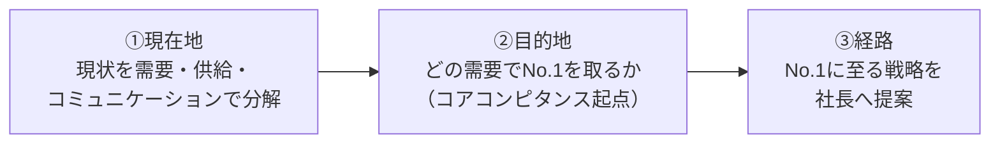

# 第12章　CMOワーク：どの需要でNo.1を取り、そこへどう至るか

第11章までで、私たちはマーケティングの概念と道具を一通り手にした——[需要](GLOSSARY.md#需要)・[供給](GLOSSARY.md#供給)・[取引](GLOSSARY.md#取引)というビジネスの最小構造（[第1章](01-business-demand-supply-trade.md)）、マーケターの[3つの問い](03-three-questions.md)、[鳥の目・虫の目・魚の目](GLOSSARY.md#鳥の目虫の目魚の目)のリサーチ（[第4章](04-research-birds-bugs-fish-eye.md)・[第5章](05-persona-mind-map.md)）、[青い需要](GLOSSARY.md#青い需要)と[狙う需要](GLOSSARY.md#狙う需要)（[第6章](06-blue-demand-target-demand.md)）、[商品コンセプト](GLOSSARY.md#商品コンセプト)（[第7章](07-product-planning-map.md)・[第8章](08-product-concept.md)）、[セールスとオファー](09-sales-and-offer.md)、[脳内情報空間](GLOSSARY.md#脳内情報空間)とコンテンツ（[第10章](10-information-space-content.md)）、そして[LPとコミュニケーションファネル](11-lp-communication-funnel.md)。

これらは、料理でいえば**器具と食材**である。一つひとつの使い方は分かった。本章で問うのは、その先だ——**これらを一人のCMO（Chief Marketing Officer＝最高マーケティング責任者）として、一本の思考フローに組み上げ、事業をゼロから設計し直せるか**。これが「**CMOワーク**」である。CMOとは、中長期で事業の売上を最大化する責任を負い、どの需要でNo.1を取るかという最上流の意思決定を下す役割である。

CMOワークの核心の問いは、ただ一つに収束する。

> **この事業は、どの[需要](GLOSSARY.md#需要)で[No.1](GLOSSARY.md#no1)を取り、そこへどう至るか。**

この一文に答えるための思考フローが、本章のすべてである。それは、現在地を測り（①現状分析）、目的地を一点に定め（②どの需要でNo.1を取るか）、そこへの経路を描く（③No.1に至る戦略）という、3つのマクロステップで進む。

上図のとおり、CMOワークは「**現在地（①）→ 目的地（②）→ 経路（③）**」という時間の矢印で進む。重心は②——「どの需要でNo.1を取るか」という、No.1を取れる一点の選定にある。ここが決まらないまま、③の打ち手（施策・表現）に飛びついてはならない。

本章は、このフローを再現可能な手順として、4ブロックに展開する。

- **(A) 現在地**：[現状を需要・供給・コミュニケーションで分解する](#1-現状を需要供給コミュニケーションで分解する)（1節）。
- **(B) 目的地（No.1を取る一点の選定）**：[CMOの問い＝どの市場でNo.1か](#2-どの市場でno1になるかを考える)（2節）／[網理論で探す](#3-no1を取る市場はコアコンピタンス起点網理論で探す)（3節）／[コアコンピタンスを炙り出す](#4-コアコンピタンスを炙り出す)（4節）／[そのコアが活きる青い需要を選ぶ](#5-そのコアが最も活きる青い需要を選ぶ)（5節）／[絶対選ばれるコンセプト・ポジショニング](#6-絶対選ばれる商品コンセプトポジショニングを作る)（6節）。
- **(C) 経路**：[No.1に至る戦略を社長へ提案する](#7-no1に至るまでのマーケティング戦略を社長へ提案する)（7節）。
- **(D) 実行の規律**：[センターピンにオーバーリソース](#8-センターピンにオーバーリソースを投下する)（8節）／[重要仮説を最速で検証する](#9-重要仮説を最速で検証する)（9節）／[仮説が崩れたら撤退・変更](#10-仮説が崩れたら撤退変更を判断する)（10節）。

本章は、序章から第11章までの全理論が「**一つの意思決定**」として結実する到達点である。そして、ここで出した答えすらも暫定にすぎない——という[終章（第13章）](13-epilogue.md)の「答えを壊し続ける」姿勢へ、そのまま接続する。

---

## 1. 現状を需要・供給・コミュニケーションで分解する

> **要約**：CMOワークの第一歩は、対象事業の現状を「①今どの需要を捉え、②どんな供給（商品コンセプト）を当て、③どうコミュニケーションして取引を成立させているか」の3点で一文に分解することである。これはSWOTや財務整理ではなく、マーケティングの全体構造（需要・供給・コミュニケーション）で現在地を測る作業だ。この共通フレームで現状を切り出さないと、後続の「No.1をどう取るか」を現状からの差分として語れず、思いつきになる。分解したら「もっと良い需要／供給／コミュニケーションはないか」を問う。これがCMO脳のデフォルト動作である。

**原則**
- CMOワークは、必ず**現状分析から始める**。だが、ここでいう現状分析は、SWOTや財務整理ではない。**マーケティングの全体構造＝[需要](GLOSSARY.md#需要)・[供給](GLOSSARY.md#供給)・[コミュニケーション](GLOSSARY.md#コミュニケーション)の3点で、現状を一文に分解する**ことである。
- 分解の問いは3つだ。**①今この事業は、どの[需要](GLOSSARY.md#需要)を捉えているか／②それに、どんな[供給](GLOSSARY.md#供給)（[商品コンセプト](GLOSSARY.md#商品コンセプト)）を当てているか／③どう[コミュニケーション](GLOSSARY.md#コミュニケーション)して[取引](GLOSSARY.md#取引)を成立させているか**。
- 分解したら、すぐに次を問う。「**もっと良い需要／供給／コミュニケーションはないか**」。この問いを常に持つことが、CMO脳のデフォルト動作である。

**根拠（なぜそうなのか）**
- マーケティングとは、需要と供給をつなぐ営みである（[序章](00-prologue.md)）。つなぐ対象（需要）・つなぐもの（供給）・つなぎ方（コミュニケーション）の3点を押さえれば、事業の全体を漏れなく捉えられる。財務やSWOTは「結果」や「要因の棚卸し」であって、需要と供給がどう噛み合っているか——マーケティングが操作する当の構造——を直接は映さない。
- この共通フレームで現状を切り出しておかないと、後続の「No.1をどう取るか」を**現状からの差分**として語れない。現在地が定まらなければ、目的地（どの需要でNo.1か）も経路（どう至るか）も、ただの思いつきになる。地図上に現在地のピンが立って初めて、目的地までのルートが引ける。
- 3点に分解すると、改善の打ち手が自然に3方向に整理される。需要を変える（狙う需要を切り直す）／供給を変える（商品コンセプト・製品を変える）／コミュニケーションを変える（伝え方・媒体を変える）。どこを動かす話なのかが、最初から明確になる。

**使い方（どう適用するか）**
- どんな事業のCMOワークでも、まず「**今この会社は〔どの需要〕に〔どの供給〕を当て、〔どうコミュニケーション〕しているか**」を一文で書き出す。長い分析資料ではなく、まず一文に圧縮する。
- 3点それぞれに「もっと良いものはないか」をぶつける。今より青い需要はないか／今のコアをもっと活かす供給はないか／今より刺さるコミュニケーションはないか。
- 現状分析は、財務・組織・オペレーションの整理に時間を溶かさない。それらは現状を補強する材料であって、CMOワークの主語ではない。主語はあくまで需要・供給・コミュニケーションである。

**適用条件**
- 使う場面：あらゆるCMOワーク・事業改善・新規事業立案の最初。既存事業の改善でも、新規事業のゼロからの設計でも、まず現在地（または「現在の前提」）をこの3点で書く。
- 接続：ここで分解した現状を出発点に、2節以降で「目的地＝どの需要でNo.1を取るか」を定める。現状（現在地）→ No.1市場（目的地）→ 戦略（経路）という本章のフロー全体の起点である。

**誤用と注意**
- **SWOT・財務整理・3C分析を現状分析と取り違えない**。それらは整理の道具であって、需要・供給・コミュニケーションの噛み合わせを直接は映さない。CMOの現状分析は、この3点での一文分解を主とする。
- 現状を細かく分析しすぎて、肝心の「どの需要でNo.1か」に入る前に力尽きない。現状分析は差分を語るための土台であり、ここが目的ではない。

**具体例**
- あるフィットネスクラブをCMOワークの題材にするとき、まず現状を一文に分解する——「**今は『手軽に運動したい若年層』という需要に、『駅近・低価格・24時間』という供給を当て、Web広告と店頭でコミュニケーションしている**」。こう書いた瞬間、その需要が競合過密（[赤い需要](GLOSSARY.md#赤い需要)）であること、供給が他社と横並びであることが差分として見え、「もっと青い需要（例：購入意欲額の高い年配層）はないか」という次の問いが自然に立ち上がる。財務諸表をいくら眺めても、この問いは出てこない。

**関連**
- 用語：[需要](GLOSSARY.md#需要) / [供給](GLOSSARY.md#供給) / [コミュニケーション](GLOSSARY.md#コミュニケーション) / [商品コンセプト](GLOSSARY.md#商品コンセプト)
- 章節：[序章](00-prologue.md)（マーケティング＝需要と供給をつなぐ）/ [第3章](03-three-questions.md)（3つの問い）/ [2節](#2-どの市場でno1になるかを考える)（現状を踏まえ目的地を定める）

---

## 2. どの市場でNo.1になるかを考える

> **要約**：CMOは中長期で売上を増やす役割であり、その核心の問いは「どの[需要](GLOSSARY.md#需要)（市場）で[No.1](GLOSSARY.md#no1)を取るか」である。単に売れる市場ではなく「No.1を取り切れる市場」を、ただ一点に言い切る。複数市場の同時狙い（[多角化](GLOSSARY.md#多角化)）は、リソース有限ゆえ却下する。「なぜここでNo.1を取れるのか」を理由とセットで言えなければ、まだ市場は決まっていない。青い需要を見つけても、そこで勝てる理由がなければNo.1にはなれず、中長期では消耗する。逆に「ここなら必ず選ばれる」理由がある需要を一つ選んで集中すれば、長期で勝ち切れる。CMOの仕事は、この「No.1を取れる一点」を定義することそのものである。

**原則**
- CMO（最高マーケティング責任者）は、中長期で売上を増やす役割である。その核心の問いは、**「どの[需要](GLOSSARY.md#需要)（市場）で[No.1](GLOSSARY.md#no1)を取るか」**——ただ一つだ。
- 選ぶのは「売れる市場」ではなく「**No.1を取り切れる市場**」である。そして、それを**一点に言い切る**。「我々は〔この需要〕でNo.1を取る」と。
- 複数市場を同時に狙う提案（[多角化](GLOSSARY.md#多角化)）は、リソース有限ゆえ却下する。
- 「**なぜここでNo.1を取れるのか**」を理由とセットで言えなければ、まだ市場は決まっていない。

**根拠（なぜそうなのか）**
- [青い需要](GLOSSARY.md#青い需要)（大きく満たされていない需要）を見つけても、そこで**勝てる理由（選ばれる理由）がなければNo.1にはなれない**。No.1でない事業は、相場どおりの競争に巻き込まれ、中長期では消耗する。逆に「ここなら必ず選ばれる」理由がある需要を一つ選んで集中すれば、長期で勝ち切れる。マーケティングの良し悪しは、需要の切り取りとNo.1の取り方でほぼ決まる（[第3章 4節](03-three-questions.md#4-マーケティングの良し悪しは需要の切り取りとno1の取り方でほぼ決まる)）。
- 一点に言い切るべきなのは、**リソースが有限だから**だ。経営者が事業を失敗させる要因は、突き詰めると2つしかない——「慢心」と「[多角化](GLOSSARY.md#多角化)」である。あれもこれもと複数の需要を同時に狙えば、どの需要でもNo.1の集中を作れず、すべてが中途半端になる。No.1は[センターピン](GLOSSARY.md#センターピン)（[8節](#8-センターピンにオーバーリソースを投下する)）への集中からしか生まれない。
- 「No.1を取れる理由」を言えることが市場決定の条件なのは、それが[4つのゲート](GLOSSARY.md#4つのゲート)の **Right to Win（選ばれる理由があり、No.1を取れるか）** そのものだからだ。理由を言えないなら、そのゲートを通過していない。需要だけ見て選んだ市場は、「他社でもできる」位置（[市民プール](GLOSSARY.md#市民プール)）に流れ込む。

**使い方（どう適用するか）**
- 戦略提案は、必ず「**我々は〔この需要〕でNo.1を取る**」と一点に言い切る形で立てる。言い切れないうちは、まだ市場を選べていないと判断する。
- 言い切った需要に、必ず「**なぜここでNo.1を取れるのか**」を添える。理由は次節以降の[コアコンピタンス](GLOSSARY.md#コアコンピタンス)起点（[網理論](GLOSSARY.md#網理論)、[3節](#3-no1を取る市場はコアコンピタンス起点網理論で探す)）で作る。
- 複数の魅力的な需要が見えても、**1つに絞る**。「両方やる」は多角化であり、リソースを割って自滅する。最もコアが活き、最もNo.1を取り切れる一点を選ぶ。
- No.1の判定は、市場全体のシェア1位ではなく、「**切り取った需要の中で第一想起になれるか**」で見る（[No.1](GLOSSARY.md#no1)）。取り切れないなら、需要の広さを絞り直す（[第6章](06-blue-demand-target-demand.md)）。

**適用条件**
- 使う場面：CMOワークの目的地設定。新規事業の市場選定、既存事業の戦う場所の再定義。
- 使わない場面：No.1を取れる理由が言えないまま、市場を「広さ」や「売上規模」だけで選ばない。規模が大きくてもNo.1を取れなければ消耗戦になる。
- 接続：本節は「目的地は何か（どの需要でNo.1）」を定める。その目的地を**どう探すか**の方法が[網理論](#3-no1を取る市場はコアコンピタンス起点網理論で探す)（3節）であり、目的地への**経路**が[7節](#7-no1に至るまでのマーケティング戦略を社長へ提案する)である。

**誤用と注意**
- **「売れそうな市場」とNo.1を取れる市場を混同しない**。売れることと、第一想起で選ばれ続けることは別である。No.1を取れない市場は、たとえ売れても中長期で削られる。
- 複数市場を「保険」で並べない。リソース有限下での多角化は、保険ではなく自滅である。
- 「規模が大きいから」で市場を決めない。大きい市場でNo.1を取れる切り取りを探すのであって、大きさそのものは選定理由にならない。

**関連**
- 用語：[No.1](GLOSSARY.md#no1) / [多角化](GLOSSARY.md#多角化) / [4つのゲート](GLOSSARY.md#4つのゲート) / [青い需要](GLOSSARY.md#青い需要)
- 章節：[第3章 1節](03-three-questions.md#1-どの需要でno1を取るか)（どの需要でNo.1を取るか）/ [第6章](06-blue-demand-target-demand.md)（青い需要・No.1を取れる広さに絞る）/ [3節](#3-no1を取る市場はコアコンピタンス起点網理論で探す)（No.1市場の探し方）/ [8節](#8-センターピンにオーバーリソースを投下する)（一点への集中）

---

## 3. No.1を取る市場は、コアコンピタンス起点（網理論）で探す

> **要約**：「どの需要でNo.1か」を決める出発点は、青い需要の闇雲な探索ではなく、自社の[コアコンピタンス](GLOSSARY.md#コアコンピタンス)（その会社だからできること）に旗を立て、それが最も活きる需要を探すことである——これを[網理論](GLOSSARY.md#網理論)と呼ぶ。コアコンピタンスから出発すると「なぜ我々がそこで選ばれるのか」が必然的に説明でき、No.1の根拠が内在化する。需要だけを見て選ぶと「他社でもできる」位置（市民プール）に流れ込む。ただし順序は『強みありき』ではない。コアに旗を立てたうえで、需要側を起点に「その強みが最も活きる需要」を探す。供給（強み）から「強みがあるからそこに需要がある」と決めつける供給の罠を避けるための探索法である。

**原則**
- 「どの需要で[No.1](GLOSSARY.md#no1)か」を決める出発点は、[青い需要](GLOSSARY.md#青い需要)の闇雲な探索ではない。**自社の[コアコンピタンス](GLOSSARY.md#コアコンピタンス)（その会社だからできること）に旗を立て、それが最も活きる需要を探す**ことである。これを[網理論](GLOSSARY.md#網理論)と呼ぶ。
- コアコンピタンスから出発すると、「**なぜ我々がそこで選ばれるのか**」が必然的に説明できる。No.1の根拠が、需要選定の中に内在化する。
- ただし、これは「強みありきで商品を後付けする」ことではない。コアに旗を立てたうえで、**需要側を起点に**「その強みが最も活きる需要」を探す。供給から「強みがあるからそこに需要があるはずだ」と決めつける**供給の罠**を避けるための探索法である。

**根拠（なぜそうなのか）**
- 需要だけを見て市場を選ぶと、「**他社でもできる**」位置に流れ込むからだ。良い需要は誰の目にも良く見えるため、需要だけを根拠に選ぶと、同じ需要に多くの競合が集まる相場どおりの場所——[市民プール](GLOSSARY.md#市民プール)——に泳ぎに行くことになる。そこではNo.1の理由がない。
- コアコンピタンス起点だと、No.1の根拠が**内在**するからだ。「我々のこの強みが、この需要に最も効く」という構造から市場を選べば、選ばれる理由（Right to Win、[4つのゲート](GLOSSARY.md#4つのゲート)）が自動的に付いてくる。これは2節の「なぜここでNo.1を取れるのかを言えなければ市場は決まっていない」を、探索の段階で満たすための方法である。
- 「網」という比喩が示すのは、**一点に旗を立て、そこから関連需要へ網を広げる**動きだ。旗（コア）を中心に、その強みが届く範囲の需要を次々に並べていく。旗がなければ、需要は無限にあり探索は発散する。旗があれば、探索は「このコアが活きるか」で収束する。

**使い方（どう適用するか）**
- 需要探索の前に、まず**コアコンピタンスに旗を立てる**（炙り出し方は[4節](#4-コアコンピタンスを炙り出す)）。「この会社だからできること」を1つ仮置きする。
- その旗を中心に、**コアが活きる需要を網のように複数並べる**。「このコアは、どんな需要に効くか」を発散させる。1つに早期収束させず、まず候補を広げる。
- 並べた需要を、[青い需要](GLOSSARY.md#青い需要)の条件（競合・人数・[購入意欲額](GLOSSARY.md#購入意欲額)）とNo.1の取りやすさで評価し、絞る（[5節](#5-そのコアが最も活きる青い需要を選ぶ)）。
- 探索の各段で「**これは需要起点か、供給起点か**」を点検する。「強みがあるからここに需要があるはずだ」と供給側の願望で決めつけていないか。需要側で「本当にこの需要は存在し、強いか」を確認する。

**適用条件**
- 使う場面：No.1を取る市場（目的地）を探す段。特にCMOレイヤー（中長期でNo.1を取る役割）で最も効く。
- 使わない場面：コアコンピタンスを特定せずに、青い需要だけを無制限に探さない。それは市民プールへの最短路である。
- 接続：旗を立てるための前提が[コアコンピタンスの炙り出し](#4-コアコンピタンスを炙り出す)（4節）、網を広げた先での選定が[5節](#5-そのコアが最も活きる青い需要を選ぶ)。下位レイヤー（ブランドマネージャー・集客）では、商品コンセプトの作り込みやコミュニケーション制作の比重が上がるが、CMOレイヤーでは網理論が最も効く。

**誤用と注意**
- **「強みありき」で需要を後付けしない**。網理論は供給起点ではない。コアに旗は立てるが、需要が本当に存在し強いかは、必ず需要側で検証する。
- 旗を立てずに青い需要を闇雲に探さない。発散したまま収束せず、選んでも「他社でもできる」位置に着地する。
- コアコンピタンスを「自社の好きなこと・得意なつもり」と混同しない。コアは「その会社だからできる、構造的な競合優位の源泉」である（[4節](#4-コアコンピタンスを炙り出す)）。

**具体例**
- 翻訳テクノロジーに強みを持つ企業が、「我々は翻訳がコアだ」と旗を立てたとする。ここで供給の罠に落ちると、「専門用語にも対応できる高機能翻訳機」を作り、「飲食・小売の現場で売れるはずだ」と需要を後付けしてしまう。だが需要側を起点に検証すると、現場は会話ブックで足りており痛みは小さい。一方、「病院・警察」のように専門用語が必須で誤訳が許されない場面では、痛みが極めて強い。網理論の正しい使い方は、コア（翻訳精度）に旗を立てたうえで、**そのコアが最も活きる需要を需要側から探し当てる**ことである。強みありきで需要を決めつければ、最も痛い場所を見逃す。

**関連**
- 用語：[網理論](GLOSSARY.md#網理論) / [コアコンピタンス](GLOSSARY.md#コアコンピタンス) / [青い需要](GLOSSARY.md#青い需要) / [市民プール](GLOSSARY.md#市民プール)
- 章節：[2節](#2-どの市場でno1になるかを考える)（どの需要でNo.1か）/ [4節](#4-コアコンピタンスを炙り出す)（旗の立て方）/ [5節](#5-そのコアが最も活きる青い需要を選ぶ)（網の中から選ぶ）/ [第6章 5節](06-blue-demand-target-demand.md#5-人で切るな需要で切れ)（人で切るな、需要で切れ）

---

## 4. コアコンピタンスを炙り出す

> **要約**：[コアコンピタンス](GLOSSARY.md#コアコンピタンス)とは、その会社でしかできない、構造的な強み・競合優位性の源泉である。これは「成果から逆算」して炙り出す。「なぜこの会社は現状の成果（または既存顧客の支持）を得ているのか」を問い、観測できる結果を説明できる強みを仮説として立てる。たとえば『高い顧客獲得コストでも採算が合う＝高リピート＝製品自体に強い支持があるはず』のように、成果から原因へ遡る。ここで価値があるのは、事実の列挙（経営コンサル的整理）ではなく『自分で考え抜いた解釈＝仮説』である。仮説を立て、特許・IR・口コミなどのデータを後から付けて検証する。社長は事実の整理では動かず、仮説にデータが付いたときに動く。

**原則**
- [コアコンピタンス](GLOSSARY.md#コアコンピタンス)とは、**その会社でしかできない、構造的な強み・競合優位性の源泉**である。一時的な優位や、誰でも真似できる施策はコアではない。
- コアコンピタンスは、**成果から逆算して炙り出す**。「**なぜこの会社は、現状の成果（または既存顧客の支持）を得ているのか**」を問い、観測できる結果を説明できる強みを**仮説**として立てる。
- ここで価値があるのは、事実の列挙（経営コンサル的な整理）ではなく、**自分で考え抜いた解釈＝仮説**である。仮説を立て、データ（特許・IR・口コミ等）を**後から付けて**検証する。

**根拠（なぜそうなのか）**
- コアを成果から逆算すべきなのは、**強みは「結果」として観測されるが、その「原因」は隠れている**からだ。売上・リピート率・高い利益率といった成果は見えても、それを生んでいる構造的な強みは表に出ていない。だから「この成果が出ているなら、裏にこういう強みがあるはずだ」と、結果から原因へ遡る推論で炙り出す。
- 事実の列挙ではなく仮説に価値があるのは、**事実は誰でも集められるが、解釈は思考した者にしか作れない**からだ。財務やシェアの整理は経営コンサル的な作業であり、それ自体は意思決定を動かさない。「自分でめちゃくちゃ考えた解釈」に、後からデータが付いたとき、初めて「なるほど」と納得が生まれる。社長は事実の整理では動かず、仮説にデータが付いたときに動く（[7節](#7-no1に至るまでのマーケティング戦略を社長へ提案する)）。
- 仮説→データの順が正しいのは、データ→仮説の順だと**既にあるデータの範囲でしか発想できない**からだ。先に大胆な仮説を立てるから、それを検証するために必要なデータを探しにいける。データから始めると、目の前のデータに引きずられ、コアの核心を外す。

**使い方（どう適用するか）**
- まず「**なぜこの会社（商品）は、現状の成果を出せているのか**」を問う。No.1や高リピート、高い利益率など、観測できる成果を起点にする。
- 成果から原因へ遡る推論を回す。例：「**高い顧客獲得コストでも採算が合っている → 相当リピートされているはずだ → 製品自体に強い支持を生む特徴があるはずだ**」。そこから「成分か／サポート体制か／ブランドの歴史か」と、コアの候補を具体化する。
- 立てた仮説に、**データを後から付けて検証する**。特許・IR・口コミ・レビュー・問い合わせ内容などで、仮説が支持されるかを確かめる。
- コアを「**作り変えられないか**」も考える。「このコアをもっとこういう特徴に磨けば、もっと強い需要に効くのでは」と、コアを起点に供給を発展させる（[3節](#3-no1を取る市場はコアコンピタンス起点網理論で探す)の網を広げる）。

**適用条件**
- 使う場面：[網理論](GLOSSARY.md#網理論)で旗を立てる前段。既存事業なら「なぜ今うまくいっているか」、新規事業なら「我々だからできることは何か」を炙り出す。
- 使わない場面：コアを特定しないまま需要探索に進まない（[3節](#3-no1を取る市場はコアコンピタンス起点網理論で探す)）。また、データを集め終えるまで仮説を立てない、という順序にしない。仮説が先、データが後である。
- 接続：炙り出したコアを旗にして需要へ網を広げ（[3節](#3-no1を取る市場はコアコンピタンス起点網理論で探す)）、そのコアが最も活きる需要を選ぶ（[5節](#5-そのコアが最も活きる青い需要を選ぶ)）。コアは[USP](GLOSSARY.md#usp)・[ポジショニング](GLOSSARY.md#ポジショニング)の土台にもなる（[6節](#6-絶対選ばれる商品コンセプトポジショニングを作る)）。

**誤用と注意**
- **事実の整理でコアを出した気にならない**。財務・シェア・沿革の棚卸しは材料であって、コアの仮説ではない。「自分の解釈」を必ず加える。
- データから入らない。手元のデータに引きずられ、当たり障りのないコアに落ちる。先に大胆な仮説を立て、データで検証する。
- 「自社が好き・得意なつもり」をコアと混同しない。コアは「その会社だからできる、構造的で真似されにくい優位」である。真似できるものはコアではない。
- 厳密にはコアコンピタンスの定義は経営者（CEO）の領域だが、実務では役割分担しきれない。CMOは「こういう需要が存在し、このコアを使えばNo.1を取れる、だからこのコアを大事にすべきだ」と**提案する立場**として炙り出す（[7節](#7-no1に至るまでのマーケティング戦略を社長へ提案する)）。

**具体例**
- ある通販化粧品が「広告の顧客獲得コストが高いのに採算が合っている」という成果を出していたとする。ここから成果逆算で仮説を立てる——「**高コストでも合う＝リピートが極めて高い＝製品自体に強い支持がある**」。では、その支持の源泉（コア）は何か。候補は「希少成分の特許」「20万件規模のコールセンターによる手厚いサポート」「長い歴史が生む安心感」「実店舗での肌診断」などだ。これらを仮説として並べ、特許情報・口コミ・問い合わせ内容で検証する。もし真のコアがコールセンターだと分かれば、事業そのものを「他社商品も高コストで売り切るコールセンター代行」へ寄せる、という大胆な選択肢すら見えてくる。これが、事実の列挙では決して出てこない、仮説の価値である。

**関連**
- 用語：[コアコンピタンス](GLOSSARY.md#コアコンピタンス) / [網理論](GLOSSARY.md#網理論) / [USP](GLOSSARY.md#usp) / [ネクストコアコンピタンス](GLOSSARY.md#ネクストコアコンピタンス)
- 章節：[3節](#3-no1を取る市場はコアコンピタンス起点網理論で探す)（コアを旗に網を広げる）/ [5節](#5-そのコアが最も活きる青い需要を選ぶ)（コアが活きる需要を選ぶ）/ [7節](#7-no1に至るまでのマーケティング戦略を社長へ提案する)（仮説で社長に提案する）/ [第4章](04-research-birds-bugs-fish-eye.md)（仮説とリサーチ）

---

## 5. そのコアが最も活きる青い需要を選ぶ

> **要約**：炙り出したコアを旗に網を広げ、並んだ需要候補の中から、コアが最も活きる[青い需要](GLOSSARY.md#青い需要)を一つ選ぶ。選定は二段で行う。鳥の目・魚の目で青さ（競合・人数・購入意欲額・未来も赤くならないか）を見て候補を絞り、虫の目でペルソナの内面を肌感まで把握しきってから確定する。需要は必ず「人・属性・提供形態」ではなく「需要（欲求・痛み・実現したい状態）」で切る。同じ需要文でも、雰囲気・激しさ・シーンの違いで刺さる商品が変わるため、抽象度を上げるのは細部を理解しきった後にする。狙う需要と供給（特徴）は一方向に決め打ちせず、行ったり来たりさせて噛み合う最適点を探す。

**原則**
- 炙り出したコアを旗に網を広げ（[3節](#3-no1を取る市場はコアコンピタンス起点網理論で探す)）、並んだ需要候補の中から、**コアが最も活きる[青い需要](GLOSSARY.md#青い需要)を一つ選ぶ**。この選ばれた一つが[狙う需要](GLOSSARY.md#狙う需要)である。
- 選定は二段で行う。**①鳥の目・魚の目で青さを見て候補を絞り、②虫の目でペルソナ内面を肌感まで把握しきってから確定する**。
- 需要は必ず「**人・属性・提供形態**」ではなく「**[需要](GLOSSARY.md#需要)（欲求・痛み・実現したい状態）**」で切る（[需要ベース](GLOSSARY.md#需要ベース)）。
- 狙う需要と供給（特徴）は一方向に決め打ちせず、**行ったり来たりさせて噛み合う最適点を探す**。

**根拠（なぜそうなのか）**
- 二段で選ぶのは、**俯瞰と深掘りで見えるものが違う**からだ。鳥の目・魚の目（[第4章](04-research-birds-bugs-fish-eye.md)）は、需要の大きさ・競合・[購入意欲額](GLOSSARY.md#購入意欲額)・未来の変化という「青さ」を映す。だがそれだけでは需要が粗く、商品コンセプトが「近所の代替で十分」レベルに埋もれる。虫の目（[第5章](05-persona-mind-map.md)）でペルソナの内面に憑依し、痛みや欲求のニュアンスを肌感まで掴んで初めて、刺さるコンセプトが作れる。実際に聞くと「思っていたのと違う回答」が必ず出る。
- 人ではなく需要で切るべきなのは、**人で切ると皆が同じ発想に収束する**からだ。「この製品ならこういう人に、価格はこれくらい」と人・属性・提供形態で切ると、誰もが同じ標準（市民プール）へ泳ぎに行く。需要（欲しさ・痛み）で切ると、ペルソナの気持ちに沿った非自明な切り口が生まれ、「それなら絶対欲しい」という差が作れる（[第6章 5節](06-blue-demand-target-demand.md#5-人で切るな需要で切れ)）。
- 抽象度を上げるのを後にするのは、**一度抽象に上げると、遠い属性のペルソナへ憑依し直すのが難しい**からだ。同じ「みんなで汗をかきたい」でも、「若い頃を思い出す雰囲気」か「高齢者が穏やかに集まる雰囲気」かで、求められる商品（服・運動強度・場の空気）がまるで変わる。だから先に細部を理解しきり、どこまで尖らせる／あえてふわっとさせるかは、肌感を掴んだ後に判断する。
- 需要と供給を往復させるのは、**ビジネスは特徴を活かすべきもの**だからだ。需要だけ見て選ぶと「他社でもできる」体験になる。コアの特徴を最大限活かす前提で、需要と供給を行き来し、「この特徴をこの需要にぶつければ絶対選ばれる」という噛み合う一点を探す。

**使い方（どう適用するか）**
- 網で並べた需要候補を、まず**鳥の目・魚の目で青さを評価**する。競合の少なさ・人数・購入意欲額（＝市場規模）、そして魚の目で「未来に広がるか／未来も赤くならないか」を見る（[第6章](06-blue-demand-target-demand.md)）。
- 絞った候補に対し、**虫の目で憑依し、内面を肌感まで把握しきる**。「この切り口で提示されたら、この人は欲しくてたまらないか」を基準にする。細部を掴みきってから、狙う需要の抽象度を決める。
- 切ったセグメントを「**これは人で切っているか、需要で切っているか**」で点検する。年齢・職業・「無料/有料」などで切っていたら、需要（欲求・痛み）へ切り直す。
- 需要と供給（コアの特徴）を**往復させる**。「需要はこうか→この特徴が効くか→待てよ、こんな需要もあるな→この特徴も使えるか」と行き来し、噛み合う最適点でコンセプトに落とす（[6節](#6-絶対選ばれる商品コンセプトポジショニングを作る)）。
- 顕在化していない良い需要なら、無理に直球を当てず、一段手前の顕在需要ですくう入り口を用意する（[実績ドリブン](GLOSSARY.md#実績ドリブン)、[7節](#7-no1に至るまでのマーケティング戦略を社長へ提案する)）。

**適用条件**
- 使う場面：網理論で広げた需要候補から、狙う需要を1つ確定する段。
- 使わない場面：鳥の目（俯瞰）を肌感で済ませて虫の目（深掘り）を飛ばさない。逆に、俯瞰で青さを見ないまま、目に入った一点に飛びつかない。
- 接続：選んだ狙う需要に、コアを活かした[商品コンセプト・ポジショニング](#6-絶対選ばれる商品コンセプトポジショニングを作る)（6節）をぶつける。需要の青さの判定基準は[第6章](06-blue-demand-target-demand.md)、憑依の方法は[第5章](05-persona-mind-map.md)。

**誤用と注意**
- **人・属性・提供形態で切らない**。それは市民プールへの入口である。需要（欲求・痛み・実現したい状態）で切る。
- 鳥の目を肌感で済ませて虫の目に直行しない。逆に、虫の目だけで青さ（規模・競合・未来）を確認せずに決めない。
- 供給アイデアに溺れない。「データが溜まって最高だ」「この技術を組み合わせれば作れる」という供給側の魅力は、製品アイデアとしては良くても、需要側で「本当にこの需要が欲しがっているか」を別途検証する（供給の罠、[3節](#3-no1を取る市場はコアコンピタンス起点網理論で探す)）。
- 客観データのある需要だけを選ばない。客観データのある需要は、もう満たされている可能性が高い。膨大な情報収集の末の「データはないが、この需要は大きく青いはずだ」という主観的確信も、張る価値がある。

**具体例**
- 大型施設・大浴場・ラウンジを持つフィットネスクラブをCMOワークの題材にする。コア（大型施設・大浴場）を旗に需要へ網を広げると、若年層（競合過密＝赤）より、年配層（購入意欲額が高く競合不在＝青）が浮かぶ。だが「年配層」は人で切った粗い需要だ。虫の目で憑依すると、「**みんなで軽く汗をかき、その後ラウンジで雑談し、お昼までに帰って家族の食事を用意する**」という生活シーンと、「健康と友達づくりを両立したい」という需要が見えてくる。ここで初めて、大浴場・ラウンジという特徴が需要にぶっ刺さる。「年配層向けジム」では他の選択肢に埋もれるが、この需要で切れば、コアが最も活きるNo.1の一点になる。

**関連**
- 用語：[青い需要](GLOSSARY.md#青い需要) / [狙う需要](GLOSSARY.md#狙う需要) / [需要ベース](GLOSSARY.md#需要ベース) / [購入意欲額](GLOSSARY.md#購入意欲額)
- 章節：[第4章](04-research-birds-bugs-fish-eye.md)（鳥の目・虫の目・魚の目）/ [第5章](05-persona-mind-map.md)（虫の目＝憑依）/ [第6章](06-blue-demand-target-demand.md)（青い需要・人で切るな需要で切れ）/ [6節](#6-絶対選ばれる商品コンセプトポジショニングを作る)（需要に供給をぶつける）

---

## 6. 絶対選ばれる商品コンセプト・ポジショニングを作る

> **要約**：狙う需要を決めたら、コアを活かして「絶対選ばれる」[商品コンセプト](GLOSSARY.md#商品コンセプト)と[ポジショニング](GLOSSARY.md#ポジショニング)を作る。ポジショニングとは、選んだ需要の中で競合と異なる立ち位置を確定し、見込み客の頭の中で「絶対に選ばれる」位置を取ることである。カテゴリ内の正面競争（「良い○○が欲しい」）を避け、戦う需要をずらす／広げて、別ジャンルと戦う位置を取る。コンセプトは文章だけで済ませず、画像＋言葉で世界観ごと表現しきる——表現できないものは戦略にならない。良し悪しは「この特徴をこの需要にぶつければ、みんなこれを選ぶに決まっている（No.1だ）」という確信がコンセプトに現れているかで判定する。最後に[USP](GLOSSARY.md#usp)（取引が成立する瞬間の一言）に置き換えて検算する。

**原則**
- 狙う需要を決めたら、**コアを活かして「絶対選ばれる」[商品コンセプト](GLOSSARY.md#商品コンセプト)と[ポジショニング](GLOSSARY.md#ポジショニング)を作る**。
- [ポジショニング](GLOSSARY.md#ポジショニング)とは、**選んだ需要の中で、競合と異なる自社の立ち位置を確定し、見込み客の頭の中で「絶対に選ばれる」位置を取ること**である。
- カテゴリ内の正面競争（「良い○○が欲しい」）を避け、**戦う需要をずらす／広げて、別ジャンルと戦う位置**を取る。
- コンセプトは文章だけで済ませず、**画像＋言葉で世界観ごと表現しきる**。表現できないものは戦略にならない。
- 良し悪しは、「**この特徴をこの需要にぶつければ、みんなこれを選ぶに決まっている（No.1だ）**」という確信がコンセプトに現れているかで判定する。

**根拠（なぜそうなのか）**
- 戦う需要をずらすべきなのは、**カテゴリ内競争では、製品の優劣で消耗する**からだ。「良い○○が欲しい」という需要に正面から入ると、同カテゴリの全競合と比較される。コンセプトを尖らせて戦う需要を一段広い／別の文脈にずらすと、本来のカテゴリ競合を回避でき、競合のいない位置でNo.1を取れる。
- 表現で勝負が決まるのは、**頭の中の良い解決策も、表現できなければ存在しないのと同じ**だからだ。うまく表現できないと、フィードバックも受けられず、チームも動かせず、戦略として機能しない。逆にうまく表現できると頭が整理され、その表現物そのものがコミュニケーションツール・戦略になる。コンセプトは映画のように世界観ごと作るもので、文字情報だけでは「で、何が良いの？」となり、本当の良さが伝わらない。
- 「みんな選ぶに決まっている」という確信を基準にするのは、それが[No.1](GLOSSARY.md#no1)（第一想起で選ばれる）の主観的な現れだからだ。需要は絶対にあり、かつ「その特徴を活かせば皆これを選ぶ」という確信がコンセプトに宿っていれば、Right to Win（[4つのゲート](GLOSSARY.md#4つのゲート)）を満たしている。確信が持てないなら、需要の切り方かコアの活かし方が甘い。

**使い方（どう適用するか）**
- 狙う需要に、コアの特徴をぶつけて[商品コンセプト](GLOSSARY.md#商品コンセプト)を作る（製品 → 商品コンセプト → 需要、[第8章](08-product-concept.md)）。「誰に・どんな価値か」を一点に絞り込む。
- [ポジショニング](GLOSSARY.md#ポジショニング)で、戦う需要をずらす／広げる。「良い○○が欲しい」というカテゴリ内に留めず、別の上位選択肢と並ぶ位置を取れないかを考える。
- コンセプトを**画像＋言葉で表現しきる**。「この需要を持つ人に10秒でセールスするなら何と言うか」「広告クリエイティブはどうなるか」を実際に作り、自分が「これなら絶対行く」と感じる表現に到達するまで、言葉を書き出し続ける（[第8章](08-product-concept.md)・[第10章](10-information-space-content.md)）。
- できたコンセプトを[USP](GLOSSARY.md#usp)（取引が成立する瞬間の一言）に置き換えて**検算する**。「〔オファー〕でどうですか」と提示したとき、狙う需要を持つ人が「いいな」と思うかを想像する。コアコンピタンスがUSPに織り込まれているほど強い。

**適用条件**
- 使う場面：狙う需要が確定した後、供給（コンセプト・ポジショニング）を作る段。
- 使わない場面：狙う需要が定まらないうちにコンセプト・表現に着手しない（上流が先、[第3章 6節](03-three-questions.md#6-上流は狙う需要商品コンセプトコミュニケーションを決める部分である)）。
- 接続：商品コンセプトの作り方の詳細は[第7章](07-product-planning-map.md)・[第8章](08-product-concept.md)、表現（what/how、世界観）は[第10章](10-information-space-content.md)。ここで作ったコンセプトを、現状からNo.1へ至る戦略として[社長に提案する](#7-no1に至るまでのマーケティング戦略を社長へ提案する)（7節）。

**誤用と注意**
- **カテゴリ内の正面競争に入らない**。「良い○○が欲しい」で戦うと製品力勝負で消耗する。戦う需要をずらす／広げる。
- コンセプトを文章だけで済ませない。画像＋言葉で世界観ごと作る。文字だけだと、本当の良さが伝わらず、戦略として動けない。
- 「なんとなく良さそう」で止めない。「みんな選ぶに決まっている」という確信が出るまで、需要の切り方・コアの活かし方・表現を詰める。確信が出ないのは、まだ上流が甘い合図である。

**具体例**
- 串カツ店をCMOワークの題材にする。「安い居酒屋が欲しい」というカテゴリ内で戦うと、無数の安居酒屋と価格で消耗する。そこで戦う需要をずらす——「**今日は家族で少し贅沢したい。でも高い店は無理**」という需要に入り込み、「寿司・焼き肉・串カツ」という、外食の上位選択肢の一角を取るポジショニングにする。すると「行くと嬉しい（贅沢感）」かつ「安い」という二重の良さが立ち、安居酒屋競争から抜ける。これを画像＋言葉で「家族で囲む串カツの食卓」として世界観ごと表現し、USP（「日本一安い串カツを、家族で。3,000円」）で検算すれば、狙う需要の人が「いいな」と感じるかを確かめられる。

**関連**
- 用語：[ポジショニング](GLOSSARY.md#ポジショニング) / [商品コンセプト](GLOSSARY.md#商品コンセプト) / [USP](GLOSSARY.md#usp) / [No.1](GLOSSARY.md#no1)
- 章節：[第7章](07-product-planning-map.md)（特徴・効果・ベネフィット・証拠）/ [第8章](08-product-concept.md)（商品コンセプト・USP・5条件）/ [第10章](10-information-space-content.md)（表現＝what/how・世界観）/ [5節](#5-そのコアが最も活きる青い需要を選ぶ)（需要と供給の往復）

---

## 7. No.1に至るまでのマーケティング戦略を社長へ提案する

> **要約**：CMOの提案は「どの需要でNo.1か（到達点）」だけでなく、現状からそこへ至る経路までを描く。経路には、コアを活かした商品コンセプト・ポジショニング、コミュニケーション設計（ファネル・媒体・接点）、そして狙う需要が未顕在なら一段手前の顕在需要ですくう入り口と、実績で需要を育てる導線（[実績ドリブン](GLOSSARY.md#実績ドリブン)）が含まれる。提案の相手は社長であり、社長は事実の整理では動かず、自分で考え抜いた解釈＝仮説にデータが付いたときに動く。だから提案は「この需要は青く大きい、我々のコアを使えば絶対選ばれる、だからここでNo.1を取りましょう」という確信の構図で締める。事実の整理で止めない。

**原則**
- CMOの提案は、「**どの需要でNo.1か（到達点）**」だけでなく、**現状からそこへ至る経路まで**を描く。「No.1に至るまで」を必ず含める。
- 経路には、(1) コアを活かした[商品コンセプト・ポジショニング](#6-絶対選ばれる商品コンセプトポジショニングを作る)、(2) [コミュニケーション設計](GLOSSARY.md#コミュニケーションファネル)（ファネル・媒体・接点）、(3) 狙う需要が**未顕在なら**、一段手前の顕在需要ですくう入り口と、実績で需要を育てる導線（[実績ドリブン](GLOSSARY.md#実績ドリブン)）が含まれる。
- 提案の相手は**社長**である。社長は**事実の整理では動かず、自分で考え抜いた解釈＝仮説にデータが付いたときに動く**。
- だから提案は、「**この需要は青く大きい、我々のコアを使えば絶対選ばれる、だからここでNo.1を取りましょう**」という確信の構図で締める。

**根拠（なぜそうなのか）**
- 経路まで描くべきなのは、**到達点だけでは絵に描いた餅**だからだ。「この需要でNo.1だ」と言い当てても、現状からそこへどう移るかがなければ実行できない。特に狙う需要が顕在化していなければ、いきなり直球を当てても刺さらない。一段手前の顕在需要で入り口を作り、実績や有名事例で需要そのものを育てる導線（[実績ドリブン](GLOSSARY.md#実績ドリブン)）が要る。CMOは到達点と経路の両方に責任を持つ。
- 社長が事実で動かないのは、**事実の整理は誰でもでき、意思決定を生まない**からだ。財務やシェアの棚卸しは現状の確認にすぎない。社長を動かすのは、「自分で考え抜いた解釈＝仮説」に、後からデータが付いて「なるほど」となる瞬間である（[4節](#4-コアコンピタンスを炙り出す)）。
- 確信の構図で締めるべきなのは、**提案とは相手の[脳内情報空間](GLOSSARY.md#脳内情報空間)を「やろう」という状態に書き換えるコミュニケーション**だからだ（[第10章](10-information-space-content.md)）。事実を並べるだけでは書き換わらない。需要の青さ・コアの優位・No.1の必然を、確信を持って一本の論理にして初めて、社長は動く。

**使い方（どう適用するか）**
- 提案を、次の順で組む。「**①どの需要でNo.1か（到達点）→ ②コアを活かした絶対選ばれる商品コンセプト → ③そこへ至る初期の入り口（手前の需要・実績作り）→ ④コミュニケーション設計**」。
- 狙う需要が**顕在化しているかを判定**する。未顕在なら、欲求ベースまで一段手前に降りた需要で入り口商品・コンセプトを作り、実績／有名事例で需要を顕在化させる導線（[実績ドリブン](GLOSSARY.md#実績ドリブン)）を必ず添える。
- 「解決策として良いか」と「**本当に求められる形になっているか**」を分けて両方詰める。良い解決策でも、相手の既存の需要・脳内情報空間に合った形になっていなければ刺さらない。
- 提案は、事実の整理で止めず、**確信の言葉で締める**。「社長、この需要は大きく青く、我々のコアコンピタンスを使えば絶対選ばれます。だからここでNo.1を取りましょう」。仮説に、検証したデータを添える。
- もし「予期せぬ需要・予期せぬ理由」で売れていることが分かったら、それを社長に示し、「**まさかこんな需要に売れるとは。でも売れています。この需要は大きく伸び、青いので、全力で取りましょう**」と、リソースを寄せる提案にする。

**適用条件**
- 使う場面：CMOワークの最終アウトプット。社長・経営層への戦略提案、新規事業の意思決定の場。
- 使わない場面：到達点（どの需要でNo.1）だけを提示して、経路（コンセプト・コミュニケーション・入り口・実績導線）を欠いた提案にしない。
- 接続：到達点は[2節](#2-どの市場でno1になるかを考える)〜[6節](#6-絶対選ばれる商品コンセプトポジショニングを作る)で作り、ここで経路と提案にまとめる。提案が承認されたら、実行は[センターピンへのオーバーリソース投下](#8-センターピンにオーバーリソースを投下する)（8節）から始まる。コミュニケーション設計の中身は[第11章](11-lp-communication-funnel.md)。

**誤用と注意**
- **到達点だけの提案にしない**。「この需要でNo.1だ」で止めず、そこへ至る経路（特に未顕在需要の入り口）まで描く。
- 事実の整理で終わらせない。社長は事実では動かない。仮説＋データ＋確信で締める。
- 「解決策の良さ」に満足しない。良い解決策でも、求められる形になっていなければ刺さらない。一段手前の顕在需要に合わせる。

**具体例**
- 「会社に貢献できるマーケターを増やす」という事業を提案するとき、その需要はまだ顕在化していない（誰も「本質的マーケ思考を学びたい」と明確には検索していない）。そこで到達点（その需要でNo.1）はそのままに、経路を描く——一段手前の**顕在需要**である「経営・ビジネスで成功したい」に降りて、「日本発ユニコーンを生む経営者・マーケター輩出の登竜門」という入り口で人を集める。そして有名OBの輩出やVC紹介といった**実績**で「ここに行けば成功できる」という需要を育て、本来狙う需要へ引き上げる（[実績ドリブン](GLOSSARY.md#実績ドリブン)）。社長へは「この登竜門需要は青く大きく、我々の本質的マーケ教育というコアなら絶対選ばれます。実績が積み上がるほど後発は追いつけません。だからここでNo.1を取りましょう」と、確信で締める。

**関連**
- 用語：[実績ドリブン](GLOSSARY.md#実績ドリブン) / [No.1](GLOSSARY.md#no1) / [コミュニケーションファネル](GLOSSARY.md#コミュニケーションファネル) / [コアコンピタンス](GLOSSARY.md#コアコンピタンス)
- 章節：[2節](#2-どの市場でno1になるかを考える)〜[6節](#6-絶対選ばれる商品コンセプトポジショニングを作る)（到達点を作る）/ [第10章](10-information-space-content.md)（提案＝脳内情報空間の書き換え）/ [第11章](11-lp-communication-funnel.md)（コミュニケーション設計）/ [8節](#8-センターピンにオーバーリソースを投下する)（承認後の実行）

---

## 8. センターピンにオーバーリソースを投下する

> **要約**：戦略が決まったら、リソースは分散させず、[センターピン](GLOSSARY.md#センターピン)——それを倒せば全体が連鎖的に決まる最重要の一点——に[オーバーリソース](GLOSSARY.md#オーバーリソース)（明らかに過剰なほどの資源）を集中投下する。経営者が事業を失敗させる要因は、突き詰めると「慢心」と「[多角化](GLOSSARY.md#多角化)」の2つだけだ。リソースは有限であり、あれもこれもに薄く配ると、どこでもNo.1の集中を作れない。多くの事業ではセンターピンは「製品」になる——コアコンピタンス級の製品ができていれば、その後のマーケティング（広げるコスト）は驚くほど楽になる。製品側の実現可能性は「問題解決とイノベーションでなんとかなる」と捉え、需要・コンセプト設計を優先する。

**原則**
- 戦略が決まったら、リソースを分散させず、[センターピン](GLOSSARY.md#センターピン)——**それを倒せば全体が連鎖的に決まる最重要の一点**——に[オーバーリソース](GLOSSARY.md#オーバーリソース)（明らかに過剰なほどの資源）を集中投下する。
- 経営者が事業を失敗させる要因は、突き詰めると**「慢心」と「[多角化](GLOSSARY.md#多角化)」の2つだけ**である。リソースは有限であり、あれもこれもに薄く配ると、どこでも[No.1](GLOSSARY.md#no1)の集中を作れない。
- 多くの事業で、センターピンは「**製品**」になる。コアコンピタンス級の製品ができていれば、その後のマーケティング（広げるコスト）は驚くほど楽になる。
- 製品側の実現可能性は「**問題解決とイノベーションでなんとかなる**」と捉え、需要・コンセプト設計を優先する。

**根拠（なぜそうなのか）**
- 一点集中が効くのは、**[No.1](GLOSSARY.md#no1)が「集中の産物」**だからだ。No.1は、相場どおりの平均的努力からは生まれない。一点に過剰なリソースを注ぎ、そこだけ突出させるから第一想起を取れる。守りを固める組織が失点しないのと同じで、最重要の一点へのオーバー投下が、勝ち切る形を作る。
- 多角化が失敗要因なのは、**有限なリソースを割れば、どの戦線も中途半端になる**からだ。複数の需要を同時に狙えば、どこでもNo.1の集中を作れない。「両方やる」は保険ではなく、すべてを平均以下にする選択である（[2節](#2-どの市場でno1になるかを考える)）。
- センターピンが製品になりやすいのは、**製品がコアコンピタンス級なら、後工程のコストが激減する**からだ。良い製品はリピート・口コミ・紹介を生み、広げるコストを下げる。加えて、消費者は加速度的に賢くなっており、製品のごまかしが効かなくなっている。一方、マーケターは「どんな特徴・コアを持てば需要に刺さるか」が分かる希少な存在であり、その観点で製品を作れることが強い。
- 製品を「なんとかなる」と捉えてよいのは、**製品はイノベーションと問題解決で作れるもの**だからだ。「この需要にこう提供できれば絶対うまくいく、でも製品実現が難しそう」となったとき、需要・コンセプト設計を優先し、製品側は解くべき問題として後から潰す。需要が間違っていれば、どんなに作っても売れない。

**使い方（どう適用するか）**
- 戦略の中から「**それを倒せば全体が連鎖的に決まる一点**」＝センターピンを1つ特定する。製品の質か、特定のコミュニケーション接点か、特定の実績作りか。多くは製品である。
- そこに**オーバーリソースを投下する**。「暇な人が出るくらい」人を割いてでも、その一点に集中する。半端に多方面へ配らない。
- 「いま自分は[多角化](GLOSSARY.md#多角化)していないか」を常に点検する。新しい需要・新しい施策に手を広げたくなったら、それがセンターピンを薄めていないかを問う。
- 製品をセンターピンにするなら、**コアコンピタンス級の製品**を狙う。「この特徴・コアを足せば絶対に求められる」というマーケター視点で製品を磨く。実現が難しい部分は、問題解決として後から潰す前提で、需要・コンセプトを先に固める。

**適用条件**
- 使う場面：戦略承認後の実行フェーズ。リソース配分の意思決定。
- 使わない場面：センターピンを定めずに、複数施策へ均等にリソースを配らない。それは多角化と同じく、どこでもNo.1を作れない。
- 接続：センターピンへ集中する対象は、検証すべき[重要仮説](GLOSSARY.md#重要仮説)（[9節](#9-重要仮説を最速で検証する)）と一致することが多い。最重要の一点を、最速で検証する。

**誤用と注意**
- **多角化に逃げない**。新しい需要・施策に手を広げるのは、たいてい中心から逃げているサインである。センターピンを薄めていないかを問う。
- リソースを「公平に」配らない。公平な配分は、どこも突出させない凡庸を生む。一点に偏らせる。
- 製品の実現可能性を理由に、需要・コンセプト設計を後回しにしない。製品はなんとかなる。需要が間違っていれば、何を作っても売れない。

**具体例**
- ある教育事業が「今年は集客を一切気にせず、カリキュラム（製品）を作ることだけに、明らかに過剰なリソースを投下する」と決めたとする。これは、製品をセンターピンと見定め、そこにオーバーリソースを投下する判断である。サッカーで「点を取られなければ負けない」と守備に組織的に過剰投下するのと同じ発想だ。暇な人が出るくらい人を割くと、製品づくりの中で気づきが増え、コアコンピタンス級の製品ができてくる。良い製品さえできれば、その後の集客（広げるコスト）は驚くほど楽になる。逆に、この時期に集客・新規事業・組織拡大へ手を広げれば（多角化）、製品が中途半端になり、どこでもNo.1を取れない。

**関連**
- 用語：[センターピン](GLOSSARY.md#センターピン) / [オーバーリソース](GLOSSARY.md#オーバーリソース) / [多角化](GLOSSARY.md#多角化) / [No.1](GLOSSARY.md#no1)
- 章節：[2節](#2-どの市場でno1になるかを考える)（一点に言い切る）/ [9節](#9-重要仮説を最速で検証する)（センターピン＝重要仮説の検証対象）/ [第7章](07-product-planning-map.md)（製品と商品）/ [第13章](13-epilogue.md)（手段の目的化を避ける）

---

## 9. 重要仮説を最速で検証する

> **要約**：どの事業にも「これが成り立つから、この事業はうまくいく」という根本的な前提＝[重要仮説](GLOSSARY.md#重要仮説)が必ずある。多くは需要面（ここにこういう需要があるはずだ／こう言えば取引が成立するはずだ）に宿る。立案時に「この事業がうまくいくかの、最も根本的な重要仮説は何か」を特定し、それを最速で検証しにいく。なぜなら、すべての戦略は仮説の上に建っており、土台が崩れれば全体が崩れるからだ。検証は、答えを正当化する情報集め（確証バイアス）ではなく、「本当にそうか」を確かめる方向で行う。本当の答えは思考の外＝市場にあり、最終的には市場でテストするしかない。

**原則**
- どの事業にも、「**これが成り立つから、この事業はうまくいく**」という根本的な前提＝[重要仮説](GLOSSARY.md#重要仮説)が必ずある。多くは**需要面**に宿る（ここにこういう需要があるはずだ／こう言えば取引が成立するはずだ）。
- 立案時に「**この事業がうまくいくかの、最も根本的な重要仮説は何か**」を1つ特定し、それを**最速で検証しにいく**。
- 検証は、答えを正当化する情報集め（**確証バイアス**）ではなく、「**本当にそうか**」を確かめる方向で行う。
- 本当の答えは思考の外＝**市場**にある。最終的には市場でテストするしかない。

**根拠（なぜそうなのか）**
- 重要仮説を先に検証すべきなのは、**すべての戦略が仮説の上に建っている**からだ。狙う需要・商品コンセプト・コミュニケーション設計は、すべて「この需要が存在し、強い」という前提に乗っている。土台の仮説が崩れれば、その上の戦略はすべて崩れる。だから、最も根本の仮説を最初に、最速で確かめる。枝葉から検証しても、土台が崩れれば無駄になる。
- 最速であるべきなのは、**間違った仮説の上に積み上げた時間とリソースは、すべて損失になる**からだ。早く検証すれば、間違っていても傷が浅いうちに方向転換できる。これは[センターピン](GLOSSARY.md#センターピン)（[8節](#8-センターピンにオーバーリソースを投下する)）への集中と表裏一体だ——最重要の一点に集中し、その一点（＝重要仮説）を最速で潰す。
- 確証バイアスを避けるべきなのは、**人は一度出した答えを正当化する情報ばかり集めてしまう**からだ。検証のつもりが「追認」になると、崩れている仮説に気づけない。検証は「これが正しい証拠」ではなく「これが間違っている兆候」を探す方向で回す。これは終章の[暫定解](GLOSSARY.md#暫定解)（出した答えは仮にすぎない）の姿勢である。
- 最後は市場でテストするしかないのは、**頭の中の検討は、どこまで行っても仮説**だからだ。机上でいくら磨いても、買うかどうかを決めるのは市場である。だから、検証は最終的に「小さく市場に当てて反応を見る」へ収束する。

**使い方（どう適用するか）**
- 立案したら、必ず「**この事業の成否を決める、最も根本的な重要仮説は何か**」を一文で書く。多くは「〔この需要〕が、〔この規模・強さ〕で存在する」という需要面の仮説になる。
- その重要仮説を、**最速・最小コストで検証する手段**を設計する。小さなテスト広告、ランディングページ、事前予約、インタビューなど、市場の反応を最短で得られる方法を選ぶ。
- 検証は「**本当にそうか**」を問う方向で行う。仮説を支持する情報だけでなく、否定する兆候を意図的に探す（[暫定解](GLOSSARY.md#暫定解)・[第13章](13-epilogue.md)）。
- 重要仮説は[センターピン](GLOSSARY.md#センターピン)（[8節](#8-センターピンにオーバーリソースを投下する)）と揃えると効率がよい。最重要の一点に集中しつつ、その一点が成り立つかを最速で確かめる。

**適用条件**
- 使う場面：戦略を実行に移す前後。新規事業・大きな方向転換の意思決定時。
- 使わない場面：枝葉の仮説（細部の表現・価格の端数など）から検証を始めない。まず土台（根本の重要仮説）を確かめる。
- 接続：検証の結果、仮説が崩れたときの判断が[10節](#10-仮説が崩れたら撤退変更を判断する)。検証対象は[センターピン](#8-センターピンにオーバーリソースを投下する)（8節）と揃える。検証の姿勢（答えを壊し続ける）は[第13章](13-epilogue.md)。

**誤用と注意**
- **検証を追認にしない**。答えを正当化する情報ばかり集めるのは確証バイアスであり、崩れた仮説を見逃す。「本当にそうか」「間違っている兆候はないか」を探す。
- 枝葉から検証しない。土台の重要仮説が崩れれば、枝葉の検証はすべて無駄になる。
- 頭の中の検討で満足しない。最後は市場でテストする。机上の磨き込みは仮説のままである。

**具体例**
- 「年配層向けに、健康と友達づくりを両立するフィットネス」を立案したとする。この事業の重要仮説は、製品の細部ではなく「**年配層に、〈みんなで汗をかき、その後雑談して帰る〉という需要が、十分な規模と購入意欲額で存在する**」という需要面の前提だ。ここを最速で検証する——小さな体験会を開く、事前ヒアリングをする、テスト広告で反応を見る。もしここで人が集まらなければ、どんなに施設やプログラムを磨いても無駄になる。逆にここが確かめられれば、その上の商品コンセプトもコミュニケーションも自信を持って積める。土台から確かめるとは、こういうことである。

**関連**
- 用語：[重要仮説](GLOSSARY.md#重要仮説) / [暫定解](GLOSSARY.md#暫定解) / [センターピン](GLOSSARY.md#センターピン) / [需要](GLOSSARY.md#需要)
- 章節：[8節](#8-センターピンにオーバーリソースを投下する)（重要仮説＝センターピン）/ [10節](#10-仮説が崩れたら撤退変更を判断する)（仮説が崩れたときの判断）/ [第13章](13-epilogue.md)（暫定解・市場でテスト）/ [第4章](04-research-birds-bugs-fish-eye.md)（仮説とリサーチ）

---

## 10. 仮説が崩れたら、撤退・変更を判断する

> **要約**：[重要仮説](GLOSSARY.md#重要仮説)が満たされないと分かったとき、または「流れ・波動が悪い」と感じたときが、撤退・大幅変更の判断点である。うまくいかなかったものを小手先で少し変えてうまくいくことは、ほとんどない（ピボットでの延命はたいてい成功しない）。経験上、「いける」という感覚は半分ほど当たり、「いけなさそう」という感覚はほぼ外れない。だから違和感は無視せず、撤退・大幅変更の正式なシグナルとして意思決定に組み込む。一度決めたことは、尊重したうえで変えてよい——「決めたから守り続ける」も「なんとなく放置」もせず、敬意をもって明示的に変える。これが、答えを壊し続ける姿勢（終章）の実行面である。

**原則**
- [重要仮説](GLOSSARY.md#重要仮説)が満たされないと分かったとき、または「**流れ・波動が悪い**」と感じたときが、**撤退・大幅変更の判断点**である。
- うまくいかなかったものを**小手先で少し変えてうまくいくことは、ほとんどない**（ピボットでの延命はたいてい成功しない）。
- 経験上、「**いける」という感覚は半分ほど当たり、「いけなさそう」という感覚はほぼ外れない**。だから違和感は無視せず、撤退・大幅変更の正式なシグナルとして意思決定に組み込む。
- 一度決めたことは、**尊重したうえで変えてよい**。「決めたから守り続ける」も「なんとなく放置」もせず、敬意をもって明示的に変える。

**根拠（なぜそうなのか）**
- 仮説の不成立が撤退点なのは、**戦略全体が重要仮説の上に建っている**からだ（[9節](#9-重要仮説を最速で検証する)）。土台が崩れたなら、その上で頑張っても報われない。崩れた土台は、補修ではなく組み直しが要る。
- 小手先の変更が効かないのは、**根本（需要面の仮説）が間違っているとき、表面をいじっても根本は直らない**からだ。うまくいかない事業を少し変えて延命したくなるが、ピボットで成功するのは稀である。直すべきは表現や価格ではなく、土台の需要そのものであることが多い。
- 感覚を組み込むべきなのは、**「いけなさそう」という違和感が、言語化しきれない多数のシグナルの統合**だからだ。膨大な市場観察と経験から来る勘は、しばしばデータより早く異常を捉える。「いける」感覚が半分当たり、「いけなさそう」感覚がほぼ外れないという非対称は、危険の検知において勘が信頼に足ることを示す。だから「なんとなく流れが悪い」を「まあいっか」で放置しない。
- 尊重して変えるべきなのは、**「一度決めたから守る」という思考の癖が、崩れた仮説への固執（＝早く出した仮結論を疑えなくなる状態）を生む**からだ。決めたことを雑に捨てるのでも、惰性で守り続けるのでもなく、「何を捨て、誰に同意を取るか」を丁寧に扱って明示的に変える。これが、決定を尊重しながら適切に変える作法である。

**使い方（どう適用するか）**
- 検証の結果、[重要仮説](GLOSSARY.md#重要仮説)が**満たされない**と分かったら、小手先のピボットで延命せず、**大きく変える／やめる**を判断する。
- 「**流れ・波動が悪い**」という違和感を、正式な判断材料として扱う。「いけなさそう」をデータが揃うまで放置しない。逆に「いける」感覚は半分当たる程度と割り引いて、検証で裏を取る。
- 変えると決めたら、**敬意をもって明示的に変える**。何を捨てるか、誰の同意を取るかを丁寧に扱い、ゼロベースで考え直す。「決めたから守り続ける」も「なんとなく放置」も避ける。
- 出した答えはすべて[暫定解](GLOSSARY.md#暫定解)（[第13章](13-epilogue.md)）と捉える。「これでいい」と思った瞬間ほど、崩れる兆候を探しにいく。

**適用条件**
- 使う場面：[重要仮説の検証](#9-重要仮説を最速で検証する)の後、結果を受けた意思決定。事業の継続・変更・撤退の判断時。
- 使わない場面：根本の重要仮説が成り立っているのに、一時の数字の揺れで撤退しない。撤退点は「土台の仮説の不成立」または「明確な悪い流れ」であり、ノイズではない。
- 接続：本節は[9節](#9-重要仮説を最速で検証する)の検証結果を受ける終点であり、CMOワークのフロー（現在地→目的地→経路→実行→検証→判断）を1周させて、次の周回（壊して作り直す）へ戻す。その姿勢の総論が[終章（第13章）](13-epilogue.md)である。

**誤用と注意**
- **小手先のピボットで延命しない**。根本（需要面の仮説）が崩れているとき、表面の変更では直らない。大きく変えるか、やめる。
- 違和感を「まあいっか」で放置しない。「いけなさそう」はほぼ外れない。早く向き合うほど傷が浅い。
- 「決めたから守る」を価値観にしない。決定は尊重したうえで、敬意をもって変えてよい。固執は崩れた仮説を延命させる。

**具体例**
- 立ち上げた事業の重要仮説が「この需要は十分な規模で存在する」だったとする。テスト広告でも事前ヒアリングでも反応が薄く、加えて「なんとなく、この事業は流れが悪い」という違和感が消えない。ここで多くの人は、価格を下げる・コピーを変えるといった小手先のピボットで延命しようとする。だが、崩れているのは表現ではなく土台（需要そのもの）だ。小手先では直らない。正しい判断は、「この需要では戦わない」と大きく変えるか、やめること。そのとき、これまでの決定や作ってきたものに敬意を払い、「何を残し何を捨てるか」を丁寧に整理してから、ゼロベースで需要の切り直しに戻る。これが、決定を尊重しながら答えを壊し、作り直す——CMOワークを1周させて次の周回へ入る、ということである。

**関連**
- 用語：[重要仮説](GLOSSARY.md#重要仮説) / [暫定解](GLOSSARY.md#暫定解) / [需要](GLOSSARY.md#需要) / [センターピン](GLOSSARY.md#センターピン)
- 章節：[9節](#9-重要仮説を最速で検証する)（重要仮説の検証）/ [第13章](13-epilogue.md)（答えを壊し続ける／暫定解／市場でテスト）/ [1節](#1-現状を需要供給コミュニケーションで分解する)（フローを1周させ、現状分析へ戻る）/ [第6章](06-blue-demand-target-demand.md)（需要の切り直し）
